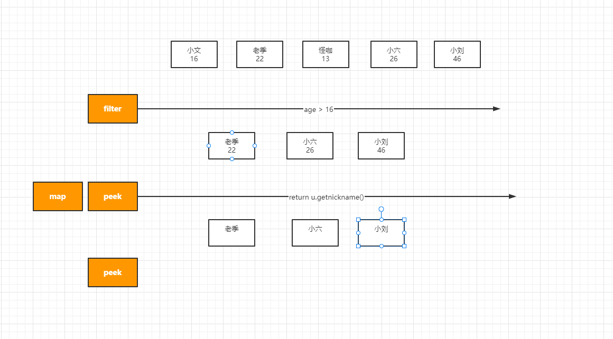

# Stream流的认识和实战


## 01、Stream流概述

概念：==Stream 是Java8 提出的一个新概念==，不是输入输出的 Stream 流，==而是一种用函数式编程方式在集合类上进行复杂操作的工具==。简而言之，是以内部迭代的方式处理集合数据的操作，内部迭代可以将更多的控制权交给集合类。Stream 和 Iterator 的功能类似，只是 Iterator 是以外部迭代的形式处理集合数据的操作。

> Stream 是Java8 的新特性，它是基于Lambda表达式在集合数组等进行一系列的优化和操作的工具集。解决集合中一些像过滤，排序，分组，聚合，改造等一系列的问题。

在Java8以前，对集合的操作需要写出处理的过程，如在集合中筛选出满足条件的数据，需要一 一遍历集合中的每个元素，再把每个元素逐一判断是否满足条件，最后将满足条件的元素保存返回。而Stream 对集合筛选的操作提供了一种更为便捷的操作，只需将实现函数接口的筛选条件作为参数传递进来，Stream会自行操作并将合适的元素同样以Stream 的方式返回，最后进行接收即可。

- 集合和数组在遍历元素的时候十分冗余，受到函数式编程以及流水线思想的启发，我们可以将常见的操作封装成比较简单的方法，比如遍历的时候直接调用一个方法即可，而不用写冗余的循环程序。这就是Stream流对象的由来。
- Stream是一个接口，有两种方式来进行创建流对象。
  一是调用 Stream.接口中的of方法。
  二是调用集合或者数组中的strain方法来获取 Stream.流对象
- Stream对象中常用的方法有：遍历元素，筛选元素，跳过元素，截取元素，计数，把流对象拼接
  对流对象中的数据元素进行转换。


> 问题：我需要查询用户信息，但是我需要把每个用户的信息的密码在返回的时候设置为null。为什么这样做，因为这样安全。
>
> ```java
> List<User> userList = new ArrayList();
> List<User> newList = new ArrayList();
> for(User user : userList){
>     user.setPassword(null);
>     newList.add(user);
> }
> 
> // stream流化
> List<User> newList = userList.stream().peek(u->u.setPassword(null)).collect(Collections.toList());
> 
> ```


## 02、Stream的API


在jdk1.8的java.util.stream.Stream接口，里面定义流的API的方法，jdk集合Collection.java顶级集合，利用默认方法进行了实现，具体的实现是通过：StreamSupport.java实现的。

```java
public interface Stream<T> extends BaseStream<T, Stream<T>> {
 
	Stream<T> filter(Predicate<? super T> predicate);
 
	<R> Stream<R> map(Function<? super T, ? extends R> mapper);
 
	IntStream mapToInt(ToIntFunction<? super T> mapper);
 
	LongStream mapToLong(ToLongFunction<? super T> mapper);
 
	DoubleStream mapToDouble(ToDoubleFunction<? super T> mapper);
 
	<R> Stream<R> flatMap(Function<? super T, ? extends Stream<? extends R>> mapper);
 
	IntStream flatMapToInt(Function<? super T, ? extends IntStream> mapper);
 
	LongStream flatMapToLong(Function<? super T, ? extends LongStream> mapper);
 
	DoubleStream flatMapToDouble(Function<? super T, ? extends DoubleStream> mapper);
 
	Stream<T> distinct();
 
	Stream<T> sorted();
 
	Stream<T> sorted(Comparator<? super T> comparator);
 
	Stream<T> peek(Consumer<? super T> action);
 
	Stream<T> limit(long maxSize);
 
	Stream<T> skip(long n);
 
	void forEach(Consumer<? super T> action);
 
	void forEachOrdered(Consumer<? super T> action);
 
	Object[] toArray();
 
	<A> A[] toArray(IntFunction<A[]> generator);
 
	T reduce(T identity, BinaryOperator<T> accumulator);
 
	Optional<T> reduce(BinaryOperator<T> accumulator);
 
	<U> U reduce(U identity, BiFunction<U, ? super T, U> accumulator, BinaryOperator<U> combiner);
 
	<R> R collect(Supplier<R> supplier, BiConsumer<R, ? super T> accumulator, BiConsumer<R, R> combiner);
 
	<R, A> R collect(Collector<? super T, A, R> collector);
 
	Optional<T> min(Comparator<? super T> comparator);
 
	Optional<T> max(Comparator<? super T> comparator);
 
	long count();
 
	boolean anyMatch(Predicate<? super T> predicate);
 
	boolean allMatch(Predicate<? super T> predicate);
 
	boolean noneMatch(Predicate<? super T> predicate);
 
	Optional<T> findFirst();
 
	Optional<T> findAny();
 
	public static <T> Builder<T> builder() {
		return new Streams.streamBuilderImpl<>();
	}
 
	public static <T> Stream<T> empty() {
		return StreamSupport.stream(Spliterators.<T> emptySpliterator(), false);
	}
 
	public static <T> Stream<T> of(T t) {
		return StreamSupport.stream(new Streams.streamBuilderImpl<>(t), false);
	}
 
	@SafeVarargs
	@SuppressWarnings("varargs") // Creating a Stream from an array is safe
	public static <T> Stream<T> of(T... values) {
		return Arrays.stream(values);
	}
 
	public static <T> Stream<T> iterate(final T seed, final UnaryOperator<T> f) {
		Objects.requireNonNull(f);
		final Iterator<T> iterator = new Iterator<T>() {
			@SuppressWarnings("unchecked")
			T t = (T) Streams.NONE;
 
			@Override
			public boolean hasNext() {
				return true;
			}
 
			@Override
			public T next() {
				return t = (t == Streams.NONE) ? seed : f.apply(t);
			}
		};
		return StreamSupport.stream(
				Spliterators.spliteratorUnknownSize(iterator, Spliterator.ORDERED | Spliterator.IMMUTABLE), false);
	}
 
	public static <T> Stream<T> generate(Supplier<T> s) {
		Objects.requireNonNull(s);
		return StreamSupport.stream(new StreamSpliterators.InfiniteSupplyingSpliterator.OfRef<>(Long.MAX_VALUE, s),
				false);
	}
 
	public static <T> Stream<T> concat(Stream<? extends T> a, Stream<? extends T> b) {
		Objects.requireNonNull(a);
		Objects.requireNonNull(b);
 
		@SuppressWarnings("unchecked")
		Spliterator<T> split = new Streams.ConcatSpliterator.OfRef<>((Spliterator<T>) a.spliterator(),
				(Spliterator<T>) b.spliterator());
		Stream<T> Stream = StreamSupport.stream(split, a.isParallel() || b.isParallel());
		return Stream.onClose(Streams.composedClose(a, b));
	}
 
	public interface Builder<T> extends Consumer<T> {
		@Override
		void accept(T t);
 
		default Builder<T> add(T t) {
			accept(t);
			return this;
		}
 
		Stream<T> build();
 
	}
}
```

通过接口定义，可以看到，抽象方法，有30多个，里面还有一些其他的接口；后续，我会慢慢给大家介绍，每个抽象方法的作用，以及用法

## 03、Stream-流的操作认识

通过接口定义，可以看到，抽象方法，有30多个方法，里面还有一些其他的接口；


## 04、Stream-流的创建


### 作业

stream() 和 parallelStream()区别？

### 准备工作：

```java
  // 1：创建一个集合
  List<User> userList1 = new ArrayList<>();
  userList1.add(new User(1,"小文","123456",16,1,20000d));
  userList1.add(new User(2,"老季","123456",22,1,100000d));
  userList1.add(new User(3,"怪咖","123456",13,1,89557d));
  userList1.add(new User(4,"小六","123456",26,1,78000d));
  userList1.add(new User(5,"小刘","123456",46,1,58000d));
```


前面（[《java8 Stream接口简介》](https://blog.csdn.net/qq_28410283/article/details/80633292)），我们已经对Stream这个接口，做了简单的介绍，下面，我们用几个案例，来看看流的几种创建方式

**1.1 使用Collection下的 stream() 和 parallelStream() 方法**

```java
List<String> list = new ArrayList<>();
Stream<String> Stream = list.stream(); //获取一个顺序流
Stream<String> parallelStream = list.parallelStream(); //获取一个并行流
```

**1.2  使用Stream中的静态方法：of()、iterate()、generate()**

```java
Stream<Integer> Stream = Stream.of(1,2,3,4,5,6);
  
Stream<Integer> Stream2 = Stream.iterate(0, (x) -> x + 2).limit(6);
Stream2.forEach(System.out::println); // 0 2 4 6 8 10
  
Stream<Double> Stream3 = Stream.generate(Math::random).limit(2);
Stream3.forEach(System.out::println);
```


**1.3**使用Arrays 中的 stream() 方法，将数组转成流

```java
Integer[] nums = new Integer[10];
Stream<Integer> Stream = Arrays.stream(nums);
```

**1.4 使用 BufferedReader.lines() 方法，将每行内容转成流**

```java
BufferedReader reader = new BufferedReader(new FileReader("F:\\test_Stream.txt"));
Stream<String> lineStream = reader.lines();
lineStream.forEach(System.out::println);
```

**1.5 使用 Pattern.splitAsStream() 方法，将字符串分隔成流**

```java
Pattern pattern = Pattern.compile(",");
Stream<String> stringStream = pattern.splitAsStream("a,b,c,d");
stringStream.forEach(System.out::println);
```


## 05、Stream 中间操作

```pascal
这是所有Stream中间操作的列表：
过滤()==>filter()
地图()==>map()
限制()==>limit()
跳跃()==>skip()
排序()==>sorted()
窥视()==>peek（）
不同()==>distinct() 
```

在开发中，当一个接口自娱自乐的，自己去new 自己的时候，就引发匿名内部类的创建

内部内部类的好处：把匿名内部类（接口，抽象类）当做方法的参数传递以后，它可以达到一个效果就是可以把方法中的一部分逻辑抽离到匿名内部类的方法中去处理。比如


#### filter

语法：

```java
Stream<T> filter(Predicate<? super T> predicate);
```

写法

```java
userList1.stream().filter(new Predicate<User>() {
    @Override
    public boolean test(User user) {
        System.out.println("11111");
        return false;
    }
});
userList1.stream().filter(u-> {
	return u.getAge() > 16;
});

 userList1.filter(u -> u.getAge() > 16)
```


是过滤，把条件满足的过滤匹配处理，如下

```java
package com.kuangstudy.stream02;

import com.kuangstudy.stream.User;

import java.util.ArrayList;
import java.util.List;
import java.util.function.Consumer;
import java.util.function.Predicate;
import java.util.stream.Collectors;
import java.util.stream.Stream;

public class StreamDemo01 {

    public static void main(String[] args) {
        // 1：创建一个集合
        List<User> userList1 = new ArrayList<>();
        userList1.add(new User(1,"小文","123456",16,1,20000d));
        userList1.add(new User(2,"老季","123456",22,1,100000d));
        userList1.add(new User(3,"怪咖","123456",13,1,89557d));
        userList1.add(new User(4,"小六","123456",26,1,78000d));
        userList1.add(new User(5,"小刘","123456",46,1,58000d));
  
        // 3: 结束操作
        List<User> collect = userList1.stream()
                .filter(u -> u.getAge() > 16) // 把满足条件的筛选出来
                .collect(Collectors.toList());
        for (User user : collect) {
            System.out.println(user);
        }

    }
}

```

结果

```java
User{id=2, username='老季', password='123456', age=23, sex=1, money=100000.0}
User{id=4, username='小六', password='123456', age=27, sex=1, money=78000.0}
User{id=5, username='小刘', password='123456', age=47, sex=1, money=58000.0}
```



#### peek和map

属于：映射 ，它可以改变==集合中==的==对象==的属性值

```
 Stream<T> peek(Consumer<? super T> action);
 <R> Stream<R> map(Function<? super T, ? extends R> mapper);
```


peek操作案例：

把集合中年龄大于16岁的用户的年龄+1岁，如下

```java
List<User> collect = userList1.stream() // 1: stream流化操作
    .filter(u -> u.getAge() > 16) // // 2：中间操作 filter 把满足条件的筛选出来
    .peek(u->u.setAge(u.getAge() + 1))// 3：中间操作 peek 把每个用户的年龄加1岁
    .collect(Collectors.toList());  // 4: 结束操作


for (User user : collect) {
    System.out.println(user);
}
```

map操作案例：

```java
List<User> collect = userList1.stream() // 1: stream流化操作
.filter(u -> u.getAge() > 16) // // 2：中间操作 filter 把满足条件的筛选出来
.map(u -> {
    u.setAge(u.getAge() + 1);
    return u;
})// 3：中间操作 peek 把每个用户的年龄加1岁
.collect(Collectors.toList());  // 4: 结束操作
```

peek和map的区别是什么?

- peek和map区别：peek无返回值，map有返回值
- peek你前面集合流化对象返回的是什么就是什么？map可以把stream返回值进行改变。我可以把集合中的对象改成map在返回。或者我只需要集合中某个一列的值。

```java
package com.kuangstudy.stream02;

import com.kuangstudy.stream.User;

import java.util.ArrayList;
import java.util.HashMap;
import java.util.List;
import java.util.Map;
import java.util.stream.Collectors;

public class StreamDemo02 {

    public static void main(String[] args) {
        // 1：创建一个集合
        List<User> userList1 = new ArrayList<>();
        userList1.add(new User(1, "小文", "123456", 16, 1, 20000d));
        userList1.add(new User(2, "老季", "123456", 22, 1, 100000d));
        userList1.add(new User(3, "怪咖", "123456", 13, 1, 89557d));
        userList1.add(new User(4, "小六", "123456", 26, 1, 78000d));
        userList1.add(new User(5, "小刘", "123456", 46, 1, 58000d));


        // user--nickname
        List<String> nicknames = userList1.stream().map(u -> {
            return u.getUsername();
        }).collect(Collectors.toList());

        for (String nickname : nicknames) {
            System.out.println(nickname);
        }

        // user---map
        List<Map<String, Object>> collect = userList1.stream().map(u -> {
            Map<String, Object> map = new HashMap<>();
            map.put("id", u.getId());
            map.put("username", u.getUsername());
            map.put("sex", u.getSex());
            return map;
        }).collect(Collectors.toList());

        for (Map<String, Object> stringObjectMap : collect) {
            System.out.println(stringObjectMap);
        }


        // user--->uservo
        List<UserVo> collect1 = userList1.stream().map(u -> {
            UserVo userVo = new UserVo();
            userVo.setId(u.getId());
            userVo.setUsername(u.getUsername());
            userVo.setSex(u.getSex() == 1 ? "男" : "女");
            return userVo;
        }).collect(Collectors.toList());

        for (UserVo userVo : collect1) {
            System.out.println(userVo);
        }


    }


}
```


#### sorted

```java
package com.kuangstudy.stream02;

import com.kuangstudy.stream.User;

import java.util.*;
import java.util.stream.Collectors;

public class StreamDemo03 {

    public static void main(String[] args) {
        // 1：创建一个集合
        List<User> userList1 = new ArrayList<>();
        userList1.add(new User(1, "小文", "123456", 16, 1, 20000d));
        userList1.add(new User(2, "老季", "123456", 22, 1, 100000d));
        userList1.add(new User(3, "怪咖", "123456", 13, 1, 89557d));
        userList1.add(new User(4, "小六", "123456", 26, 1, 78000d));
        userList1.add(new User(5, "小刘", "123456", 46, 1, 58000d));


//        List<User> sortUserList = userList1.stream().sorted(new Comparator<User>() {
//            @Override
//            public int compare(User o1, User o2) {
//                return o2.getAge() - o1.getAge();
//            }
//        }).collect(Collectors.toList());

//        List<User> sortUserList = userList1.stream().sorted((User o1, User o2) ->{
//                return o2.getAge() - o1.getAge();
//        }).collect(Collectors.toList());

      
        List<User> sortUserList = userList1.stream().sorted((o1, o2) -> o2.getAge() - o1.getAge()).collect(Collectors.toList());
        for (User user : sortUserList) {
            System.out.println(user);
        }

    }

}
```


#### distanct

去重 原则

- 如果对象，必须满足eqauls是true 
- 如果对象，并且hashcode要相同

```java
package com.kuangstudy.stream;

import java.util.Objects;

public class User {
    // 身份id
    private Integer id;
    // 姓名
    private String username;
    // 密码
    private String password;
    // 芳龄
    private Integer age;
    //  性别 0 女 1 男
    private Integer sex;
    // 身家
    private Double money;

    public User(){

    }

    public User(Integer id, String username, String password, Integer age, Integer sex, Double money) {
        this.id = id;
        this.username = username;
        this.password = password;
        this.age = age;
        this.sex = sex;
        this.money = money;
    }

    public Integer getId() {
        return id;
    }

    public void setId(Integer id) {
        this.id = id;
    }

    public String getUsername() {
        return username;
    }

    public void setUsername(String username) {
        this.username = username;
    }

    public String getPassword() {
        return password;
    }

    public void setPassword(String password) {
        this.password = password;
    }

    public Integer getAge() {
        return age;
    }

    public void setAge(Integer age) {
        this.age = age;
    }

    public Integer getSex() {
        return sex;
    }

    public void setSex(Integer sex) {
        this.sex = sex;
    }

    public Double getMoney() {
        return money;
    }

    public void setMoney(Double money) {
        this.money = money;
    }

    @Override
    public String toString() {
        return "User{" +
                "id=" + id +
                ", username='" + username + '\'' +
                ", password='" + password + '\'' +
                ", age=" + age +
                ", sex=" + sex +
                ", money=" + money +
                '}';
    }

    @Override
    public boolean equals(Object o) {
        if (this == o) return true;
        if (o == null || getClass() != o.getClass()) return false;
        User user = (User) o;
        return Objects.equals(id, user.id) && Objects.equals(username, user.username) && Objects.equals(password, user.password) && Objects.equals(age, user.age) && Objects.equals(sex, user.sex) && Objects.equals(money, user.money);
    }

    @Override
    public int hashCode() {
        return Objects.hash(id, username, password, age, sex, money);
    }
}

```

```java
package com.kuangstudy.stream02;

import com.kuangstudy.stream.User;

import java.util.ArrayList;
import java.util.List;
import java.util.stream.Collectors;

public class StreamDemo04 {

    public static void main(String[] args) {
        // 1：创建一个集合
        List<User> userList1 = new ArrayList<>();
        User user1 =  new User(1, "小文", "123456", 16, 1, 20000d);
        User user2 =  new User(1, "小文", "123456", 16, 1, 20000d);
        userList1.add(user1);
        userList1.add(user2);
        userList1.add(new User(2, "老季", "123456", 22, 1, 100000d));
        userList1.add(new User(3, "怪咖", "123456", 13, 1, 89557d));
        userList1.add(new User(4, "小六", "123456", 26, 1, 78000d));
        userList1.add(new User(5, "小刘", "123456", 46, 1, 58000d));


        System.out.println(user1.equals(user2));

        List<User> userList = userList1.stream().distinct().collect(Collectors.toList());
        for (User user : userList) {
            System.out.println(user);
        }

//        List<Integer> userList1 = new ArrayList<>();
//        userList1.add(1);
//        userList1.add(2);
//        userList1.add(3);
//        userList1.add(1);
//
//        List<Integer> collect = userList1.stream().distinct().collect(Collectors.toList());
//        System.out.println(collect);
    }


}

```


```java
转换()==>flatMap()
叠加()==>reduce()
```


#### skip和limit 实现集合分页

```java
package com.kuangstudy.stream02;

import com.kuangstudy.stream.User;

import java.util.*;
import java.util.stream.Collectors;

public class StreamDemo03 {

    public static void main(String[] args) {
        // 1：创建一个集合
        List<User> userList1 = new ArrayList<>();
        userList1.add(new User(1, "小文", "123456", 16, 1, 20000d));
        userList1.add(new User(2, "老季", "123456", 22, 1, 100000d));
        userList1.add(new User(3, "怪咖", "123456", 13, 1, 89557d));
        userList1.add(new User(4, "小六", "123456", 26, 1, 78000d));
        userList1.add(new User(5, "小刘", "123456", 46, 1, 58000d));


        int pageSize =2;// 每页显示多少条
        int pageno = 1; // 当前页

        List<User> userpage = pageUser(pageNo,pageSize);


    }
    
    public static List<User> pageUser(int pageNo,int pageSize){
          int skip = (pageNo - 1) * pageSize;
          return  userList1.stream().sorted((o1, o2) -> o2.getAge() - o1.getAge())
                .skip(skip) // (pageno-1) * pageSize
                .limit(pageSize) // pageSize
                .collect(Collectors.toList());
    
    }


}

```


## 06、Stream 终止操作

findFirst& findAny

- 两者在stream（串行）的情况下，两者其实都返回的第一个元素
- 如果是parallelStream（并行）情况下findAny就造成随机返回

可以看到findAny()操作，返回的元素是不确定的，对于同一个列表多次调用findAny()有可能会返回不同的值。使用findAny()是为了更高效的性能。如果是数据较少，串行地情况下，一般会返回第一个结果，如果是并行的情况，那就不能确保是第一个。

```java
package com.kuangstudy.stream02;

import com.kuangstudy.stream.User;
import com.sun.org.apache.xerces.internal.dom.RangeExceptionImpl;

import javax.management.RuntimeMBeanException;
import javax.swing.plaf.synth.SynthOptionPaneUI;
import java.util.ArrayList;
import java.util.List;
import java.util.Optional;
import java.util.function.Supplier;
import java.util.stream.Collectors;

public class StreamDemo05 {

    public static void main(String[] args) throws Throwable {
        // 1：创建一个集合
        List<User> userList1 = new ArrayList<>();
        userList1.add(new User(1, "小文", "123456", 16, 1, 20000d));
        userList1.add(new User(2, "老季", "123456", 22, 1, 100000d));
        userList1.add(new User(3, "怪咖", "123456", 13, 1, 89557d));
        userList1.add(new User(4, "小六", "123456", 26, 1, 78000d));
        userList1.add(new User(5, "小刘", "123456", 46, 1, 58000d));


        List<User> userList = userList1.stream().distinct().collect(Collectors.toList());
        long count = userList1.stream().distinct().count();
        System.out.println(count);
        Optional<User> first = userList1.parallelStream().findFirst();
        System.out.println(first.get());
        Optional<User> any = userList1.parallelStream().findAny();
        System.out.println(any.get());

    }


}

```

```java
5
User{id=1, username='小文', password='123456', age=16, sex=1, money=20000.0}
User{id=3, username='怪咖', password='123456', age=13, sex=1, money=89557.0
```


#### 总结

终止操作，一旦调用代表stream操作结束，不能做任何其他的操作了。


## 07、Stream 实战


1：搭建一个springboot搭建一个ssm框架(交给飞哥)

2：创建数据库获取一个表 kss_course_category.java

```java
/*
 Navicat MySQL Data Transfer

 Source Server         : 我本地数据库
 Source Server Type    : MySQL
 Source Server Version : 50734
 Source Host           : localhost:3306
 Source Schema         : ksd-user-cours-db

 Target Server Type    : MySQL
 Target Server Version : 50734
 File Encoding         : 65001

 Date: 19/10/2021 22:43:51
*/

SET NAMES utf8mb4;
SET FOREIGN_KEY_CHECKS = 0;

-- ----------------------------
-- Table structure for kss_course_category
-- ----------------------------
DROP TABLE IF EXISTS `kss_course_category`;
CREATE TABLE `kss_course_category`  (
  `id` int(11) NOT NULL AUTO_INCREMENT COMMENT ' 主键',
  `title` varchar(255) CHARACTER SET utf8mb4 COLLATE utf8mb4_bin NULL DEFAULT NULL COMMENT '分类名称',
  `descrciption` varchar(255) CHARACTER SET utf8mb4 COLLATE utf8mb4_bin NULL DEFAULT NULL COMMENT '分类描述',
  `mark` int(1) NULL DEFAULT NULL COMMENT '是否更新',
  `create_time` datetime(0) NULL DEFAULT NULL COMMENT '创建时间',
  `update_time` datetime(0) NULL DEFAULT NULL COMMENT '更新时间',
  `type` int(1) NULL DEFAULT NULL COMMENT '类型1文件夹 2文件',
  `pid` int(11) NULL DEFAULT NULL COMMENT '父ID',
  `status` int(1) NULL DEFAULT NULL COMMENT '发布状态1发布 0未发布',
  `isexpand` bit(1) NULL DEFAULT NULL COMMENT '0收起 1展开',
  PRIMARY KEY (`id`) USING BTREE
) ENGINE = InnoDB AUTO_INCREMENT = 12 CHARACTER SET = utf8mb4 COLLATE = utf8mb4_bin ROW_FORMAT = Dynamic;

-- ----------------------------
-- Records of kss_course_category
-- ----------------------------
INSERT INTO `kss_course_category` VALUES (1, 'Java', 'Java', 1, '2021-10-18 14:19:05', '2021-10-18 14:19:05', 1, 0, 1, b'1');
INSERT INTO `kss_course_category` VALUES (2, 'Js', 'Js', 1, '2021-10-18 14:19:05', '2021-10-18 14:19:05', 1, 0, 1, b'0');
INSERT INTO `kss_course_category` VALUES (3, 'Go', 'Go', 1, '2021-10-18 14:19:05', '2021-10-18 14:19:05', 1, 0, 1, b'0');
INSERT INTO `kss_course_category` VALUES (4, 'Python', 'Python', 1, '2021-10-18 14:19:05', '2021-10-18 14:19:05', 1, 0, 1, b'0');
INSERT INTO `kss_course_category` VALUES (5, 'Java面向对象', 'Java面向对象', 1, '2021-10-18 14:19:05', '2021-10-18 14:19:05', 1, 1, 1, b'0');
INSERT INTO `kss_course_category` VALUES (6, 'Spring', 'Spring', 1, '2021-10-18 14:19:05', '2021-10-18 14:19:05', 1, 1, 1, b'0');
INSERT INTO `kss_course_category` VALUES (7, 'SpringMvc', 'SpringMvc', 1, '2021-10-18 14:19:05', '2021-10-18 14:19:05', 2, 6, 1, b'0');
INSERT INTO `kss_course_category` VALUES (8, 'SpringBoot', 'SpringBoot', 1, '2021-10-18 14:19:05', '2021-10-18 14:19:05', 2, 6, 1, b'0');
INSERT INTO `kss_course_category` VALUES (9, 'Mybatis', 'Mybatis', 1, '2021-10-18 14:19:05', '2021-10-18 14:19:05', 1, 1, 1, b'0');
INSERT INTO `kss_course_category` VALUES (10, 'MybatisPlus', 'MybatisPlus', 1, '2021-10-18 14:19:05', '2021-10-18 14:19:05', 1, 9, 1, b'0');
INSERT INTO `kss_course_category` VALUES (11, 'nodejs', 'MybatisPlus', 1, '2021-10-18 14:19:05', '2021-10-18 14:19:05', 1, 2, 1, b'0');

SET FOREIGN_KEY_CHECKS = 1;

```

3、通过sql把数据库表中分类全部查询处理

```java
 // 1：查询所有的子节点
List<CourseCategory> allList = this.list();
```

4：开始查询分类第一分类，pid=0

```java
List rootList = allList.stream().filter(c->c.getPid().equals(0)).collect();
```

5：然后循环第一分类查询它下面二分类。

```java
package com.xq.entity;

import com.baomidou.mybatisplus.annotation.*;
import lombok.AllArgsConstructor;
import lombok.Data;
import lombok.NoArgsConstructor;
import lombok.ToString;

import java.util.Date;
import java.util.List;

@Data
@AllArgsConstructor
@NoArgsConstructor
@ToString
@TableName("kss_course_category")
public class CourseCategory implements java.io.Serializable {
    //ID
    @TableId(type = IdType.AUTO)
    private Integer id;
    // 上课标题
    private String title;
    // 分类描述
    private String descrciption;
    // 是否更新
    private Integer mark;
    // 发布状态1发布 0未发布
    private Integer status;
    // 类型1文件夹 2文件
    private Integer type;
    // 父id
    private Integer pid;
    private Boolean isexpand;
    @TableField(exist = false)
    private List<CourseCategory> childrens;
    // 创建时间
    @TableField(fill = FieldFill.INSERT)//在新增的时候填充
    private Date createTime;
    // 更新时间
    @TableField(fill = FieldFill.INSERT_UPDATE)//在新增的时候填充
    private Date updateTime;
}

```

```java
rootList.forEach(root -> {
    List<C> childrens =	allList.stream().filter(c->root.getId().eqauls(c.getPid())).collect();

	root.setChildren(childrens);
});

return rootList;
```


Lambda Optional Exception 注解 / 反射

10月份25号  javaweb --- jsp/servlet -- 2次课   数据库MYSQL （1~2课程） 如何设计数据库表，怎么优化，开发一些技巧，高级查询，分页。（录制视频  找一MYSQL套视频狂神 + MYSQL高级, 联合查询）ssm/springboot 

11月初的时候，开始讲项目架构。springboot项目架构---开始会一个项目


