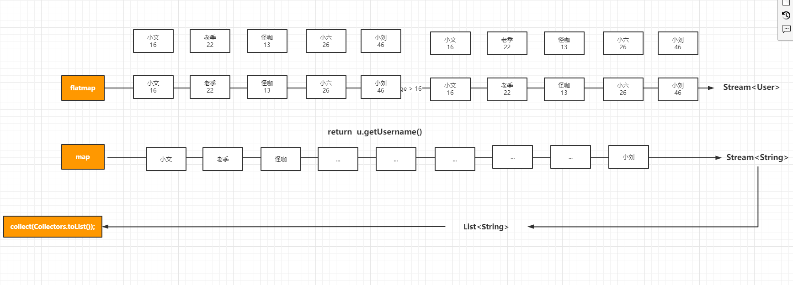

# Stream流中关于FlatMap和Reduce


## map & peek & flatmap

 需求： 把集合中每个用户对象的敏感信息进行赋值null，在进行返回。为什么呢？

因为在开发，我大部分情况下都是使用orm框架：mybatis, hibernate，或者你写SQL写的 select * from 这个时候数据返回过程中可能就会从存在敏感信息，这个时候开发者一定有意识，就是脱敏。比如用户信息的密码因为要过滤才进行返回：

peek解决：

```java
 List<User> userList = userList1.stream().peek(u -> u.setPassword("")).collect(Collectors.toList());
 userList.forEach(System.out::println);
```

map解决

```java
List<User> userList2 = userList1.stream().map(u -> {
    u.setPassword("");
    return u;
}).collect(Collectors.toList());
userList2.forEach(System.out::println);
```


## flatMap的认识

语法：

```java
<R> Stream<R> flatMap(Function<? super T, ? extends Stream<? extends R>> mapper);
<R> Stream<R> map(Function<? super T, ? extends R> mapper);
```

使用：

```java
List<Object> collect = userList1.stream().flatMap(user-> {
    user.setPassword("");
    return Stream.of(user);
}).collect(Collectors.toList());

collect.forEach(System.out::println);
```


## flatmap的妙用

作用：合并、差集、交集、并集等操作非常的有用

```java
package com.kuangstudy.stream03;

import com.kuangstudy.stream.User;

import java.util.ArrayList;
import java.util.List;
import java.util.stream.Collectors;
import java.util.stream.Stream;

public class StreamDemo02 {

    public static void main(String[] args) {

        // 1：创建一个集合
        List<User> userList1 = new ArrayList<>();
        userList1.add(new User(1, "小文", "123456", 16, 1, 20000d));
        userList1.add(new User(2, "老季", "123456", 22, 0, 100000d));
        userList1.add(new User(3, "怪咖", "123456", 13, 1, 89557d));
        userList1.add(new User(4, "小六", "123456", 26, 0, 78000d));
        userList1.add(new User(5, "小刘", "123456", 46, 1, 58000d));

        List<User> userList2 = new ArrayList<>();
        userList2.add(new User(6, "小文1", "123456", 16, 1, 20000d));
        userList2.add(new User(7, "老季2", "123456", 22, 0, 100000d));
        userList2.add(new User(8, "怪咖3", "123456", 13, 1, 89557d));
        userList2.add(new User(9, "小六4", "123456", 26, 0, 78000d));
        userList2.add(new User(10, "小刘5", "123456", 46, 1, 58000d));


        // 合并
        List<User> allUserList = Stream.of(userList1, userList2).flatMap(s -> s.stream()).collect(Collectors.toList());
        allUserList.forEach(System.out::println);

        // 2：合并flatmap + 在映射map
        List<String> allUserList2 = Stream.of(userList1, userList2).flatMap(s -> s.stream()) //Stream<User>
                .map(u -> {
                    return u.getUsername();
                }).collect(Collectors.toList());
        allUserList2.forEach(System.out::println);
    }
}


```

- flatmap的场景一般来说多个集合操作的时候，它的价值就体现出来
- 一般如果单集合操作flatmap其实意义不大。




### 并集&交集&差集

```java
package com.kuangstudy.stream03;

import com.kuangstudy.stream.User;

import java.util.ArrayList;
import java.util.List;
import java.util.function.Predicate;
import java.util.stream.Collectors;
import java.util.stream.Stream;

public class StreamDemo02 {

    public static void main(String[] args) {

        // 1：创建一个集合
        List<User> userList1 = new ArrayList<>();
        userList1.add(new User(1, "小文", "123456", 16, 1, 20000d));
        userList1.add(new User(2, "老季", "123456", 22, 0, 100000d));
        userList1.add(new User(8, "怪咖3", "123456", 13, 1, 89557d));
        userList1.add(new User(3, "怪咖", "123456", 13, 1, 89557d));
        userList1.add(new User(4, "小六", "123456", 26, 0, 78000d));
        userList1.add(new User(5, "小刘", "123456", 46, 1, 58000d));

        List<User> userList2 = new ArrayList<>();
        userList2.add(new User(1, "小文", "123456", 16, 1, 20000d));
        userList2.add(new User(6, "小文1", "123456", 16, 1, 20000d));
        userList2.add(new User(7, "老季2", "123456", 22, 0, 100000d));
        userList2.add(new User(8, "怪咖3", "123456", 13, 1, 89557d));
        userList2.add(new User(9, "小六4", "123456", 26, 0, 78000d));
        userList2.add(new User(10, "小刘5", "123456", 46, 1, 58000d));

        // 合并 -- 并集
        //List<User> allUserList = Stream.of(userList1, userList2).flatMap(s -> s.stream()).collect(Collectors.toList());
        //allUserList.forEach(System.out::println);

        // 合并 -- 交集 -- 共同好友
        System.out.println("-=================================共同好友=====================");
        List<User> allUserList2 = userList1.stream().filter(new Predicate<User>() {
            @Override
            public boolean test(User user) {
                return userList2.contains(user);
            }
        }).collect(Collectors.toList());
        allUserList2.forEach(System.out::println);

        //List<User> allUserList2 = userList1.stream().filter(user -> userList2.contains(user) ).collect(Collectors.toList());
        //List<User> allUserList2 = userList1.stream().filter(userList2::contains).collect(Collectors.toList());
        //List<User> allUserList3 = userList1.stream().filter(StreamDemo02::contains).collect(Collectors.toList());

        System.out.println("-==================================差集=====================");
        // 合并 -- 差集
        List<User> allUserList3 = userList1.stream().filter(user -> !userList2.contains(user) ).collect(Collectors.toList());
        allUserList3.forEach(System.out::println);

        // 2：合并flatmap + 在映射map
//        List<String> allUserList2 = Stream.of(userList1, userList2).flatMap(s -> s.stream()) //Stream<User>
//                .map(u -> {
//                    return u.getUsername();
//                }).collect(Collectors.toList());
//        allUserList2.forEach(System.out::println);
    }


    public static boolean contains(Object o){
        return true;
    }

}


```

数字交集和差集和并集

```java
package com.kuangstudy.stream03;

import com.kuangstudy.stream.User;

import java.util.ArrayList;
import java.util.List;
import java.util.function.Consumer;
import java.util.function.Predicate;
import java.util.stream.Collectors;
import java.util.stream.Stream;

public class StreamDemo03 {

    public static void main(String[] args) {


        List<Integer> list1 = new ArrayList<>();
        list1.add(1);
        list1.add(2);
        list1.add(3);
        list1.add(4);

        List<Integer> list2= new ArrayList<>();
        list2.add(4);
        list2.add(5);
        list2.add(6);
        list2.add(1);


        // 并集
        System.out.println("=============并集========================");
        List<Integer> collect = Stream.of(list1, list2).flatMap(s -> s.stream()).collect(Collectors.toList());
        collect.forEach(System.out::println);

        // 交集
        System.out.println("=============交集========================");
        List<Integer> collect2 =  list1.stream().filter(list2::contains).collect(Collectors.toList());
        collect2.forEach(System.out::println);


        // 差集
        System.out.println("=============差集========================");
        List<Integer> collect3 =  list1.stream().filter(u->!list2.contains(u)).collect(Collectors.toList());
        collect3.forEach(System.out::println);

        List<Integer> collect4 =  list2.stream().filter(u->!list1.contains(u)).collect(Collectors.toList());
        collect4.forEach(System.out::println);

    }


}


```


## reduce

语法

```
  T reduce(T identity, BinaryOperator<T> accumulator);
```

案例

```java
package com.kuangstudy.stream03;

import java.util.ArrayList;
import java.util.List;
import java.util.function.BiFunction;
import java.util.function.BinaryOperator;
import java.util.stream.Collectors;
import java.util.stream.Stream;

public class StreamDemo04 {

    public static void main(String[] args) {


        List<Integer> list1 = new ArrayList<>();
        list1.add(1);
        list1.add(2);
        list1.add(3);
        list1.add(4);

//        int intValue = list1.stream().reduce(1, new BinaryOperator<Integer>() {
//            @Override
//            public Integer apply(Integer integer, Integer integer2) {
//                return integer + integer2;
//            }
//        }).intValue();

        int intValue = list1.stream().reduce(1, (a, b) -> a + b).intValue();
        System.out.println(intValue);


    }
}
```


###  其他的操作maptoInt、maptoDouble、maptoLong

可以用于聚合操作

```java
package com.kuangstudy.stream03;

import java.util.ArrayList;
import java.util.List;
import java.util.function.BinaryOperator;
import java.util.stream.Collectors;

public class StreamDemo05 {

    public static void main(String[] args) {

        List<ShopCart> shopCarts = new ArrayList<>();
        shopCarts.add(new ShopCart(1, "手机1", 1d, 1));//a
        shopCarts.add(new ShopCart(2, "手机2", 2d, 2));//b
        shopCarts.add(new ShopCart(3, "手机3", 3d, 3));

        double doubleValue1 = shopCarts.stream().map(shopcart -> shopcart.getPrice() * shopcart.getNum()).reduce(0d, (a, b) -> a + b).doubleValue();
        double doubleValue2 = shopCarts.stream().mapToDouble(shopcart -> shopcart.getPrice() * shopcart.getNum()).sum();
        double doubleValue3 = shopCarts.stream().mapToDouble(shopcart -> shopcart.getPrice()).average().getAsDouble();
        double doubleValue4 = shopCarts.stream().mapToDouble(shopcart -> shopcart.getPrice()).max().getAsDouble();
        double doubleValue5 = shopCarts.stream().mapToDouble(shopcart -> shopcart.getPrice()).min().getAsDouble();

        System.out.println(doubleValue1);
        System.out.println(doubleValue2);
        System.out.println(doubleValue3);
        System.out.println(doubleValue4);
        System.out.printn(doubleValue5);
    }
}


```

# Stream流中查找和搜索

## 结束操作 anyMatch、noneMatch、allMatch

- anyMatch - anything: 任何，任意  只要有一个为true，就是true,否则就是false
- noneMatch: none :没有，无，没有一个满足条件就是true,否则就是false
- allMatch: all：全部，所有。所有满足条件才是true,否则就是false
- noneMatch 和 allMatch是相对立的

```java
package com.kuangstudy.stream03;

import com.kuangstudy.stream.User;

import java.util.ArrayList;
import java.util.List;
import java.util.OptionalDouble;
import java.util.function.Predicate;

public class StreamDemo06 {

    public static void main(String[] args) {


        List<User> userList1 = new ArrayList<>();
        userList1.add(new User(1, "小文", "123456", 15, 1, 20000d));
        userList1.add(new User(2, "老季", "123456", 15, 0, 100000d));
        userList1.add(new User(8, "怪咖3", "123456", 15, 1, 89557d));
        userList1.add(new User(3, "怪咖", "123456", 15, 1, 89557d));
        userList1.add(new User(4, "小六", "123456", 15, 0, 78000d));
        userList1.add(new User(5, "小刘", "123456", 15, 1, 58000d));


//        User user = userList1.stream().findAny().get();
//        System.out.println(user);

//         anyMatch  只要集合中的某个元素满足条件就是true ,否则就是false
//        boolean anyMatch = userList1.stream().anyMatch(new Predicate<User>() {
//            @Override
//            public boolean test(User user) {
//                return user.getAge() > 16;
//            }
//        });

//      allMatch  和noneMatch是相对立的，必须条件全部满足才是true,否则false
//        boolean noneMatch = userList1.stream().allMatch(new Predicate<User>() {
//            @Override
//            public boolean test(User user) {
//                return user.getAge() > 16;
//            }
//        });
//        System.out.println(noneMatch);


        // noneMatch 相对于allMatch 必须条件全部不满足才是true,否则 false
        boolean noneMatch = userList1.stream().noneMatch(new Predicate<User>() {
            @Override
            public boolean test(User user) {
                return user.getAge() > 16;
            }
        });

        System.out.println(noneMatch);
    }


}


```


