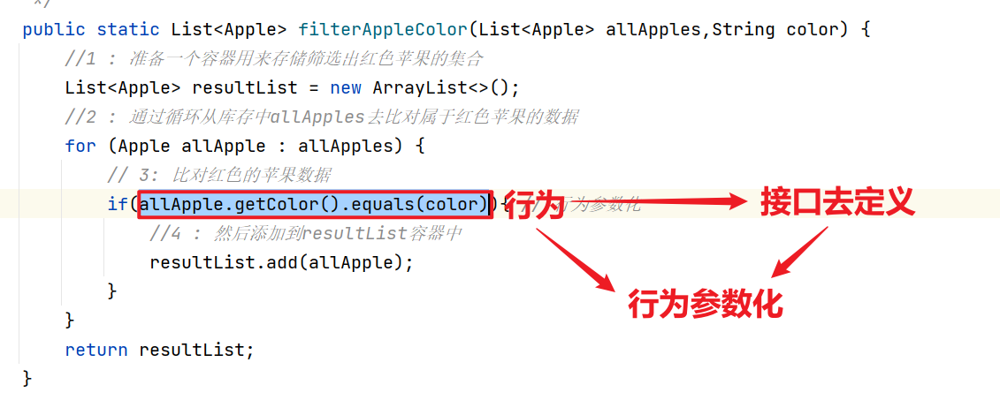
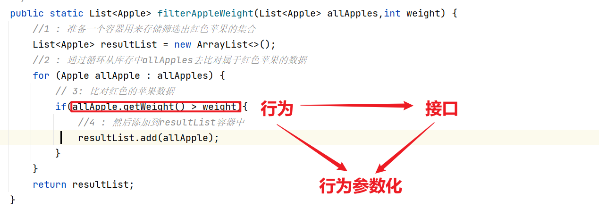

# 01、Java8 Lambda表达式

参考：https://blog.csdn.net/qq_28410283/article/details/80963351


## 01、课程大纲

- 应用需求的不断变化
- 行为参数化
- 匿名类
- Lambda表达式的出现
- 实战案例说明：Lambda表达式


## 应用需求的不断变化 

在软件开发中，众所周知，不断你做什么，怎么优化，用户的需求肯定是会不断的发生变化的，

### 需求1

比如：商家为了卖苹果，为了了解自己商品（苹果）的库存，需要查找库存所有红色的苹果功能。

### 需求2

第二天，商家可能需求就发生了改变了，我还想找出所有重量超过200g的苹果。

### 需求3

又过了几天，商家又需要找出所有即红色，重量超过200g的苹果。那真是太好了呢！


#### 问题

在理想状态下，应该把你的开发的工作量降到最小呢？此外类似的功能还应该很简单，而且易于长期维护如何做呢？


## 02、行为参数化

行为参数化：就是可以帮助你处理频繁变更的需求的一种软件开发模式。

> ==一言蔽之，它意味着拿出一个代码块，先把它准备好确不去执行它。，这个代码块以后可以被你的程序的其它部分调用，这意味着你可以推迟这块代码的执行。==

例如：你可以将==代码块作为参数==传递给==另一个方法==，==稍后再去执行它==。这样这个方法的行为就是基于代码被参数化了。

- 函数（方法）

## 03、应用不断变化的需求代码实现 ==第一次初见==


准备工作

```java
package com.lambda;

import java.util.Objects;

/**
 * @author 飞哥
 * @Title: 学相伴出品
 * @Description: 飞哥B站地址：https://space.bilibili.com/490711252
 * 记得关注和三连哦！
 * @Description: 我们有一个学习网站：https://www.kuangstudy.com
 * @date 2021/10/21 15:30
 */
public class Apple {

    private Integer id;
    private String color;
    private Integer weight;

    public Apple(){

    }

    public Apple(Integer id, String color, Integer weight) {
        this.id = id;
        this.color = color;
        this.weight = weight;
    }

    @Override
    public boolean equals(Object o) {
        if (this == o) return true;
        if (o == null || getClass() != o.getClass()) return false;
        Apple apple = (Apple) o;
        return Objects.equals(id, apple.id) &&
                Objects.equals(color, apple.color) &&
                Objects.equals(weight, apple.weight);
    }

    @Override
    public int hashCode() {
        return Objects.hash(id, color, weight);
    }

    public Integer getId() {
        return id;
    }

    public void setId(Integer id) {
        this.id = id;
    }

    public String getColor() {
        return color;
    }

    public void setColor(String color) {
        this.color = color;
    }

    public Integer getWeight() {
        return weight;
    }

    public void setWeight(Integer weight) {
        this.weight = weight;
    }

    @Override
    public String toString() {
        return "Apple{" +
                "id=" + id +
                ", color='" + color + '\'' +
                ", weight=" + weight +
                '}';
    }
}

```

### 小试牛刀：“筛选红苹果”

解决方案如下：

```java
package com.kuangstudy.lambda.demo01;

import com.kuangstudy.lambda.Apple;

import java.util.ArrayList;
import java.util.List;

public class LambdaDemo01 {

    /**
     * 需求1：商家为了卖苹果，为了了解自己商品（苹果）的库存，
     * 真是的需求：查找库存所有红色的苹果功能。
     * @param allApples
     * @return
     */
    public static List<Apple> filterAppleColor(List<Apple> allApples) {
        //1 : 准备一个容器用来存储筛选出红色苹果的集合
        List<Apple> resultList = new ArrayList<>();
        //2 : 通过循环从库存中allApples去比对属于红色苹果的数据
        for (Apple allApple : allApples) {
            // 3: 比对红色的苹果数据
            if(allApple.getColor().equals("红色")){
                //4 : 然后添加到resultList容器中
                resultList.add(allApple);
            }
        }
        return resultList;
    }


    public static void main(String[] args) {
        // 1、苹果库存
        List<Apple> apples = new ArrayList<>();
        apples.add(new Apple(1, "红色", 200));
        apples.add(new Apple(2, "绿色", 100));
        apples.add(new Apple(3, "红色", 134));
        apples.add(new Apple(4, "浅红色", 400));
        apples.add(new Apple(5, "浅绿色", 220));

        // 2: 查询红色苹果
        List<Apple> appleList = filterAppleColor(apples);
        appleList.forEach(System.out::println);
    }
}

```

结果

```java
Apple{id=1, color='红色', weight=200}
Apple{id=3, color='红色', weight=134}
```

通过上面的2，就是筛选红色苹果的所需的条件，现在商家改变了注意了，他现在还想找到`绿色`，你该怎么做呢？简单的办法就是把代码复制一份这个方法，把方法的名字改成filterGreenApple即可，然后修改if的条件来匹配`绿色`，然后如果商家想要筛选更多颜色：暗红色、黄色、浅绿色等，这样实现起来就非常的臃肿和累赘，怎么解决呢？行为参数化


## 04、再展身手  “把颜色当做参数” ==第二次尝试改造==

一种做法就是给方法增加一个参数，把颜色变成参数，这样就能灵活地使用变化了

```java
package com.kuangstudy.lambda.demo01;

import com.kuangstudy.lambda.Apple;

import java.util.ArrayList;
import java.util.List;

public class LambdaDemo02 {

    /**
     * 需求1：商家为了卖苹果，为了了解自己商品（苹果）的库存，
     * 真是的需求：查找库存所有红色的苹果功能。
     * @param allApples
     * @return
     */
    public static List<Apple> filterAppleColor(List<Apple> allApples,String color) {
        //1 : 准备一个容器用来存储筛选出红色苹果的集合
        List<Apple> resultList = new ArrayList<>();
        //2 : 通过循环从库存中allApples去比对属于红色苹果的数据
        for (Apple allApple : allApples) {
            // 3: 比对红色的苹果数据
            if(allApple.getColor().equals(color)){
                //4 : 然后添加到resultList容器中
                resultList.add(allApple);
            }
        }
        return resultList;
    }


    public static void main(String[] args) {
        // 1、苹果库存
        List<Apple> apples = new ArrayList<>();
        apples.add(new Apple(1, "红色", 200));
        apples.add(new Apple(2, "绿色", 100));
        apples.add(new Apple(3, "红色", 134));
        apples.add(new Apple(4, "浅红色", 400));
        apples.add(new Apple(5, "浅绿色", 220));

        // 2: 查询红色苹果
        List<Apple> appleList = filterAppleColor(apples,"红色");
        List<Apple> appleList2 = filterAppleColor(apples,"绿色");
        List<Apple> appleList3 = filterAppleColor(apples,"浅红色");
        System.out.println("--------------红色------------");
        appleList.forEach(System.out::println);
        System.out.println("--------------绿色------------");
        appleList2.forEach(System.out::println);
        System.out.println("--------------浅红色------------");
        appleList3.forEach(System.out::println);
    }
}

```

通过上面，是不是简单多了，==如果这个时候商家又说：要是能区分重量不一的苹果该多好呀？（os：真想揍死他!!!）==

作为软件工程师的我们，你可能早就提前做了预谋，可能商家要改需求，可能会增加重量的过滤，于是你挥挥洒洒的写下如下可歌可泣的代码：

```java
package com.lambda;

import java.util.ArrayList;
import java.util.List;

/**
 * @author 飞哥
 * @Title: 学相伴出品
 * @Description: 飞哥B站地址：https://space.bilibili.com/490711252
 * 记得关注和三连哦！
 * @Description: 我们有一个学习网站：https://www.kuangstudy.com
 * @date 2021/10/21 15:29
 */
public class LambdaDemo02 {

    /**
     * 过滤某颜色苹果
     *
     * @param appleList
     * @return
     */
    public static List<Apple> filterAppleColor(List<Apple> appleList,String color) {
        List<Apple> resultList = new ArrayList<>();
        for (Apple apple : appleList) {
            if (apple.getColor().equals(color)) {
                resultList.add(apple);
            }
        }
        return resultList;
    }

    /**
     * 过滤重量苹果
     *
     * @param appleList
     * @return
     */
    public static List<Apple> filterAppleWeigth(List<Apple> appleList,Integer weight) {
        List<Apple> resultList = new ArrayList<>();
        for (Apple apple : appleList) {
            if (apple.getWeight().equals(weight)) {
                resultList.add(apple);
            }
        }
        return resultList;
    }

    public static void main(String[] args) {
        // 1、苹果库存
        List<Apple> apples = new ArrayList<>();
        apples.add(new Apple(1, "红色", 200));
        apples.add(new Apple(2, "绿色", 100));
        apples.add(new Apple(3, "红色", 134));
        apples.add(new Apple(4, "浅红色", 400));
        apples.add(new Apple(5, "浅绿色", 220));
        // 2、过滤红色苹果
        List<Apple> resultList1 = filterAppleColor(apples,"红色");
        System.out.println("==============红色==================");
        resultList1.forEach(System.out::println);
        // 3、过滤绿色苹果
        List<Apple> resultList2 = filterAppleColor(apples,"绿色");
        System.out.println("==============绿色==================");
        resultList2.forEach(System.out::println);
        // 4: 过滤重量超过200g的苹果
        List<Apple> weightList = filterAppleWeigth(apples, 200);
        System.out.println("==============重量200g==================");
        weightList.forEach(System.out::println);
    }
}

```

这个时候，你不由的惊呼道，我太牛了，我实现了！！！

你有没有发现，这个代码确实比之前的更加高级了，但是还是没解决根本性的问题，如果这个时候我还筛选更多的属性条件，这个时候是不是令人有点失望，因为你又要不停的重复这个行为和动作。==如果你想要改变筛选遍历方式来提升性能，那就得修改所有方法的实现，而不是改一个。从工程的工作量来看，这代价太大了。==

如果我要一起过滤颜色和重量为条件的苹果，如下：

```java
package com.kuangstudy.lambda.demo01;

import com.kuangstudy.lambda.Apple;

import java.util.ArrayList;
import java.util.List;

public class LambdaDemo03 {


    /**
     * 需求2：第二天，商家可能需求就发生了改变了，我还想找出所有重量超过200g的苹果。
     * 真是的需求：查找库存所有红色的苹果功能。
     * @param allApples
     * @return
     */
    public static List<Apple> filterAppleWeight(List<Apple> allApples,int weight) {
        //1 : 准备一个容器用来存储筛选出红色苹果的集合
        List<Apple> resultList = new ArrayList<>();
        //2 : 通过循环从库存中allApples去比对属于红色苹果的数据
        for (Apple allApple : allApples) {
            // 3: 比对红色的苹果数据
            if(allApple.getWeight() > weight){
                //4 : 然后添加到resultList容器中
                resultList.add(allApple);
            }
        }
        return resultList;
    }


    public static void main(String[] args) {
        // 1、苹果库存
        List<Apple> apples = new ArrayList<>();
        apples.add(new Apple(1, "红色", 200));
        apples.add(new Apple(2, "绿色", 100));
        apples.add(new Apple(3, "红色", 134));
        apples.add(new Apple(4, "浅红色", 400));
        apples.add(new Apple(5, "浅绿色", 220));

        // 2: 查询苹果超过200g的数据
        List<Apple> appleList = filterAppleWeight(apples,200);
        System.out.println("--------------查询苹果超过200g的数据------------");
        appleList.forEach(System.out::println);
    }
}

```


## 05、没有更糟糕的了？ ==第三次尝试改造==

```java
package com.lambda;

import java.util.ArrayList;
import java.util.List;

/**
 * @author 飞哥
 * @Title: 学相伴出品
 * @Description: 飞哥B站地址：https://space.bilibili.com/490711252
 * 记得关注和三连哦！
 * @Description: 我们有一个学习网站：https://www.kuangstudy.com
 * @date 2021/10/21 15:29
 */
public class LambdaDemo04 {

    /**
     * 通过flag判断是通过颜色过滤
     * flag=true 颜色过滤
     * flag=false 重量过滤
     *
     * @param appleList
     * @return
     */
    public static List<Apple> filterAppleColorAndWeigth(List<Apple> appleList,String color,int weight,boolean flag) {
        List<Apple> resultList = new ArrayList<>();
        for (Apple apple : appleList) {
            if ((flag && apple.getColor().equals(color)) || (!flag && apple.getWeight().equals(weight))) {
                resultList.add(apple);
            }
        }
        return resultList;
    }


    public static void main(String[] args) {
        // 1、苹果库存
        List<Apple> apples = new ArrayList<>();
        apples.add(new Apple(1, "红色", 200));
        apples.add(new Apple(2, "绿色", 100));
        apples.add(new Apple(3, "红色", 134));
        apples.add(new Apple(4, "浅红色", 400));
        apples.add(new Apple(5, "浅绿色", 220));
        // 2、过滤红色苹果
        List<Apple> resultList1 = filterAppleColorAndWeigth(apples,"红色",200,true);
        System.out.println("==============红色==================");
        resultList1.forEach(System.out::println);
        // 3、过滤绿色苹果
        List<Apple> resultList2 = filterAppleColorAndWeigth(apples,"绿色",200,false);
        System.out.println("==============绿色==================");
        resultList2.forEach(System.out::println);

    }
}

```


上面的代码，估计不是神仙就是小可爱了吧！！

这代码的阅读性和后续的维护性简直是糟透了

- true / false 是什么意思呢？
- 此外如果要解决更多变化和需求，比如大小，形状，场地，又该怎么办呢？估计会有很多的filterxxxxx方法吧！


## 06、行为参数化 ==第四次尝试改造==

通过前面已经看到，你需要一种比添加很多参数更好的方法来应对变化的需求。让你把代码往更高层次进行重构和封装怎么买做呢？。如下

- 方法的标准建模 





### 什么是标准建模呢？

就是用面向对象的方式：接口化。定义一个接口来对选择进行标准建模如下：

谓词接口：

```java
package com.lambda.demo02;

import com.lambda.demo01.Apple;

/**
 * @author 飞哥
 * @Title: 学相伴出品
 * @Description: 飞哥B站地址：https://space.bilibili.com/490711252
 * 记得关注和三连哦！
 * @Description: 我们有一个学习网站：https://www.kuangstudy.com
 * @date 2021/10/21 15:29
 */
public interface ApplePredicate {
    boolean test(Apple apple);
}

```

采用多实现的方式，代表不同的选择标准如下：

颜色实现：

```java
package com.lambda.demo02;

import com.lambda.demo01.Apple;

/**
 * @author 飞哥
 * @Title: 学相伴出品
 * @Description: 飞哥B站地址：https://space.bilibili.com/490711252
 * 记得关注和三连哦！
 * @Description: 我们有一个学习网站：https://www.kuangstudy.com
 * @date 2021/10/21 15:29
 */
public class ApplePredicateColor implements ApplePredicate {
    public boolean test(Apple apple) {
        return apple.getColor().equals("红色");
    }
}

```

重量实现：

```java
package com.lambda.demo02;

import com.lambda.demo01.Apple;

/**
 * @author 飞哥
 * @Title: 学相伴出品
 * @Description: 飞哥B站地址：https://space.bilibili.com/490711252
 * 记得关注和三连哦！
 * @Description: 我们有一个学习网站：https://www.kuangstudy.com
 * @date 2021/10/21 15:29
 */
public class ApplePredicateWeigth implements ApplePredicate {
    public boolean test(Apple apple) {
        return apple.getWeight() > 200;
    }
}

```

测试

```java
package com.kuangstudy.lambda.demo2;

import com.kuangstudy.lambda.Apple;

import java.util.ArrayList;
import java.util.List;

/**
 * @author 飞哥
 * @Title: 学相伴出品
 * @Description: 飞哥B站地址：https://space.bilibili.com/490711252
 * 记得关注和三连哦！
 * @Description: 我们有一个学习网站：https://www.kuangstudy.com
 * @date 2021/10/21 15:29
 */
public class LambdaDemo01 {

    /**
     * 通过flag判断是通过颜色过滤
     *
     * @param appleList
     * @return
     */
    public static List<Apple> filterAppleColorAndWeigth(List<Apple> appleList,AppPredicate predicate) {
        List<Apple> resultList = new ArrayList<>();
        for (Apple apple : appleList) {
            if (predicate.test(apple)) {
                resultList.add(apple);
            }
        }
        return resultList;
    }


    public static void main(String[] args) {
        // 1、苹果库存
        List<Apple> apples = new ArrayList<>();
        apples.add(new Apple(1, "红色", 200));
        apples.add(new Apple(2, "绿色", 100));
        apples.add(new Apple(3, "红色", 134));
        apples.add(new Apple(4, "浅红色", 400));
        apples.add(new Apple(5, "浅绿色", 220));
        apples.add(new Apple(6, "红色", 210));
        // 2、过滤红色苹果
        List<Apple> resultList1 = filterAppleColorAndWeigth(apples,new AppPredicateColor());
        System.out.println("==============红色==================");
        resultList1.forEach(System.out::println);
        // 3、重量200g的苹果
        List<Apple> resultList2 = filterAppleColorAndWeigth(apples,new AppPredicateWeight());
        System.out.println("==============重量200g的苹果==================");
        resultList2.forEach(System.out::println);
        // 3、重量200g的苹果 并且是红色的
        List<Apple> resultList3= filterAppleColorAndWeigth(apples,new AppPredicateWeightColor());
        System.out.println("==============重量200g的苹果 并且是红色的==================");
        resultList3.forEach(System.out::println);

    }
}

```

通上面的方式，我把相同逻辑业务用接口进行定义方法，然后各种子类去去实现，在调用的过程中去选择和匹配对应的算法。称之为：“策略者模式”

策略者模式其实就是：它让你定义一族算法，把它们封装起来（称之为：策略），然后在运行时选择一个算法，在这里。算法族就是：ApplePredicate，这里的ApplePredicateWeigth、ApplePredicateColor就是它的不同策略。

通过上面，其实我们已经做了意见很酷的事情，我们只需要传递接口的引用对象，就可以达到不同的过滤效果，达到了设计模式的要求，对内修改关闭，对外修改扩展。换句话说：filterXXXX方法的行为被参数化了。也就是行为参数化的过程。


#### 总结

你们以后在开发中，如果调用任何一个方法，如果这个方法中有传递了接口或者抽象类作为参数，说明你这个方法肯定的有一部分逻辑肯定要延迟的外部来执行。我们把这种行为成为：行为参数化。

- jdbtemplate
- stream
- jdk comparator 
- 等等


## 07、行为参数化它的麻烦和啰嗦？

我们知道，人们都不愿意用那些很麻烦的功能和复杂概念。目前，当要把新的行为传递给filterxxx方法的时候，你不得不申明好几个或者若干个ApplePredicate的实现类，这真的很啰嗦和很费时间。怎么拯救它呢？

上面废了这么大的劲儿，能不能做的更好呢？

答案就是：Java的匿名内部类。匿名内部类可以让你==同时申明和实例化一个类（接口，抽象类）==。它可以改善上面的代码。让它变得更加的简洁。但是我们通过下面的学习，匿名内部类确实可以简化，但是也不完全令人满意，因为有更好的方式就是jdk1.8引入的Lamdba表达式。先来了解了解匿名内部类吧。


## 08、匿名内部类 - ==第五次尝试改造==

匿名内部类：可以使你的代码更加简洁，你可以在定义一个类（接口，抽象类）的同时对其进行实例化。它与局部类很相似，不同的是它没有类名，如果某个局部类你只需要用一次，那么你就可以使用匿名内部类（Anonymous classes enable you to make your code more concise. They enable you to declare and instantiate a class at the same time. They are like local classes except that they do not have a name. Use them if you need to use a local class only once.）

>换句话说：匿名内部类是一种允许你==随建随用==创建对象和覆盖行为方法的一种机制。

参考文章：https://www.cnblogs.com/wuhenzhidu/p/anonymous.html

### 01、再次尝试，使用匿名内部类

```java
package com.lambda.demo03;

import com.lambda.demo01.Apple;
import com.lambda.demo02.ApplePredicateColor;
import com.lambda.demo02.ApplePredicateWeigth;

import java.util.ArrayList;
import java.util.List;

/**
 * @author 飞哥
 * @Title: 学相伴出品
 * @Description: 飞哥B站地址：https://space.bilibili.com/490711252
 * 记得关注和三连哦！
 * @Description: 我们有一个学习网站：https://www.kuangstudy.com
 * @date 2021/10/21 15:29
 */
public class ApplePredicateTest {

    /**
     * 行为参数化
     * @param appleList
     * @param predicate 接口
     * @return
     */
    public static List<Apple> filterApple(List<Apple> appleList, ApplePredicate predicate){
        List<Apple> resultList = new ArrayList<>();
        for (Apple apple : appleList) {
            if (predicate.test(apple)) {
                resultList.add(apple);
            }
        }
        return resultList;
    }

    public static void main(String[] args) {
        // 1、苹果库存
        List<Apple> apples = new ArrayList<>();
        apples.add(new Apple(1, "红色", 200));
        apples.add(new Apple(2, "绿色", 100));
        apples.add(new Apple(3, "红色", 134));
        apples.add(new Apple(4, "浅红色", 400));
        apples.add(new Apple(5, "浅绿色", 220));
        // 2、过滤红色苹果
        List<Apple> resultList1 = filterApple(apples, new ApplePredicate() {
            @Override
            public boolean test(Apple apple) {
                return apple.getColor().equals("红色");
            }
        });
        System.out.println("==============红色==================");
        resultList1.forEach(System.out::println);

        // 3、过滤总量超过200g
        List<Apple> resultList2 = filterApple(apples, new ApplePredicate() {
            @Override
            public boolean test(Apple apple) {
                return apple.getWeight() > 200;
            }
        });
        System.out.println("==============重量大于200g==================");
        resultList2.forEach(System.out::println);
    }

}

```

是不是体现出了他的：随建随用的效果呢？太棒了。

### 02、经典的匿名内部类谜题

```java
package com.lambda.demo03;

import com.lambda.demo01.Apple;

import java.util.ArrayList;
import java.util.List;

/**
 * @author 飞哥
 * @Title: 学相伴出品
 * @Description: 飞哥B站地址：https://space.bilibili.com/490711252
 * 记得关注和三连哦！
 * @Description: 我们有一个学习网站：https://www.kuangstudy.com
 * @date 2021/10/21 15:29
 */
public class MeaningOfThis {

   public final int value = 4;
   public void doIt(){
       int value = 6;
       Runnable runnable = new Runnable() {
           public final int value = 5;
           @Override
           public void run() {
               int value = 10;
               System.out.println(this.value);
           }
       };

       runnable.run();
   }

    public static void main(String[] args) {
        MeaningOfThis meaningOfThis = new MeaningOfThis();
        meaningOfThis.doIt();
    }
}

```

答案是：5

### 03、总结

- 但是匿名内部类还是不够好，第一它往往很笨重，因为它占用很多空间。
- 怎么拯救呢？Lambda表达式

### 04、我对匿名内部类的理解?

- 使用匿名内部类：起到保护和安全的作用。

- 匿名内部类：是一种允许你==随建随用==创建对象和覆盖行为方法的一种机制。可以解决在开发中需求不停变化的问题。

  我举个例子：在开发中如果客户提供不同的需求，传统的方式是通过接口扩展子类进行实现，但是需求变化如果太多，我们就定义很多的实现类，这样给后续的维护和扩展都提供了不便，如果业务组合的需求过多，子类也就越多，就越来越不灵活。我们可以利用匿名内部类的的随建随用的机制很好的解决子类过多和需求变化过多的情况，

  广泛应用在比如：jdbctempalte的增删改查中，GUI，Swing事件行为中，以及stream流中比如：filter,map,sorted方法中，以及底层源码都可以看到匿名内部类的身影。

  其实也它就是在定义一个类（接口，抽象类）的同时对其进行实例化。实例化的每一次都会在当前类下生成一个==当前类$count的类==，这个类也就就是匿名类的具体类的实现。如果实例化多次匿名类，count就会进行累加。

  

### 05、什么时候用匿名内部类还是用实现类呢（==重点==）

  - 使用匿名内部类：需求不明确，可以考虑定义接口，不管了直接让调用过程中去确定即可。或者只有一种情况
  - 如果明确，建议一个接口，具体实现类，比如：支付：IPayService的   微信WexinPlayService AlipayService


## 09、Lambda表达式 - ==第六次尝试改造==

我们可以通过Java8里面提供的Lambda表达式进行优化和处理如下：

```java
package com.lambda.demo04;

import com.lambda.demo01.Apple;

import java.util.ArrayList;
import java.util.List;

/**
 * @author 飞哥
 * @Title: 学相伴出品
 * @Description: 飞哥B站地址：https://space.bilibili.com/490711252
 * 记得关注和三连哦！
 * @Description: 我们有一个学习网站：https://www.kuangstudy.com
 * @date 2021/10/21 15:29
 */
public class ApplePredicateTest {

    /**
     * 行为参数化
     * @param appleList
     * @param predicate 接口
     * @return
     */
    public static List<Apple> filterApple(List<Apple> appleList, ApplePredicate predicate){
        List<Apple> resultList = new ArrayList<>();
        for (Apple apple : appleList) {
            if (predicate.test(apple)) {
                resultList.add(apple);
            }
        }
        return resultList;
    }

    public static void main(String[] args) {
        // 1、苹果库存
        List<Apple> apples = new ArrayList<>();
        apples.add(new Apple(1, "红色", 200));
        apples.add(new Apple(2, "绿色", 100));
        apples.add(new Apple(3, "红色", 134));
        apples.add(new Apple(4, "浅红色", 400));
        apples.add(new Apple(5, "浅绿色", 220));
        // 2、过滤红色苹果
        List<Apple> resultList1 = filterApple(apples, apple->apple.getColor().equals("红色"));
        System.out.println("==============红色==================");
        resultList1.forEach(System.out::println);

        // 3、过滤总量超过200g
        List<Apple> resultList2 = filterApple(apples, apple->  apple.getWeight() > 200);
        System.out.println("==============重量大于200g==================");
        resultList2.forEach(System.out::println);
    }

}

```

我们不得不承认看上去比之前干净多了，也很好看，因为看起来更像问题陈述本身，也解决了我们啰嗦的问题，怎么理解呢？Lambda表达式做了什么？


## 10、Lambda表达的List类型抽象化 ==第七次的尝试改造== 

谓词接口

```java
package com.lambda.demo05;

/**
 * @author 飞哥
 * @Title: 学相伴出品
 * @Description: 飞哥B站地址：https://space.bilibili.com/490711252
 * 记得关注和三连哦！
 * @Description: 我们有一个学习网站：https://www.kuangstudy.com
 * @date 2021/10/21 17:28
 */
public interface Predicate<T> {
    boolean test(T t);
}

```

流实现类

```java
package com.lambda.demo05;

import java.util.*;
import java.util.function.*;
import java.util.stream.*;

/**
 * @author 飞哥
 * @Title: 学相伴出品
 * @Description: 飞哥B站地址：https://space.bilibili.com/490711252
 * 记得关注和三连哦！
 * @Description: 我们有一个学习网站：https://www.kuangstudy.com
 * @date 2021/10/21 17:29
 */
public class FilterStream {

    /**
     * 过滤集合
     *
     * @param list
     * @param predicate
     * @param <T>
     * @return
     */
    public static <T> List<T> filter(List<T> list, Predicate<T> predicate) {
        List<T> result = new ArrayList<>();
        for (T t : list) {
            if (predicate.test(t)) {
                result.add(t);
            }
        }
        return result;
    }
}

```

测试

```java
package com.lambda.demo05;

import com.lambda.demo01.Apple;
import com.lambda.demo04.ApplePredicate;

import java.util.ArrayList;
import java.util.List;

/**
 * @author 飞哥
 * @Title: 学相伴出品
 * @Description: 飞哥B站地址：https://space.bilibili.com/490711252
 * 记得关注和三连哦！
 * @Description: 我们有一个学习网站：https://www.kuangstudy.com
 * @date 2021/10/21 15:29
 */
public class ApplePredicateTest {


    public static void main(String[] args) {
        // 1、苹果库存
        List<Apple> apples = new ArrayList<>();
        apples.add(new Apple(1, "红色", 200));
        apples.add(new Apple(2, "绿色", 100));
        apples.add(new Apple(3, "红色", 134));
        apples.add(new Apple(4, "浅红色", 400));
        apples.add(new Apple(5, "浅绿色", 220));

        List<Apple> appleList = FilterStream.filter(apples, apple -> apple.getColor().equals("红色"));
        appleList.forEach(System.out::println);
    }

}

```


## 11、案例分析

你现在已经看到行为参数化是一个很有用的模式，它能够轻松的适应不断变化的需求。这个模式可以把一个行为（一段代码）封装起来。并通过传递和使用创建的行为。将方法行为参数化。在Java API这种大量的存在。如下：

### 用Comparator来排序

对进行进行排序是一个常见的编程任务，在Java8中，List自带一个sort方法。或者你也可以使用Collections.sort来进行排序，如下：

```java
@FunctionalInterface
public interface Comparator<T> {
    int compare(T o1, T o2);
}
```

案例如下：

```java
package com.lambda.demo05;

import com.lambda.demo01.Apple;
import com.lambda.demo04.ApplePredicate;

import java.util.ArrayList;
import java.util.Comparator;
import java.util.List;

/**
 * @author 飞哥
 * @Title: 学相伴出品
 * @Description: 飞哥B站地址：https://space.bilibili.com/490711252
 * 记得关注和三连哦！
 * @Description: 我们有一个学习网站：https://www.kuangstudy.com
 * @date 2021/10/21 15:29
 */
public class ApplePredicateTest02 {


    public static void main(String[] args) {
        // 1、苹果库存
        List<Apple> apples = new ArrayList<>();
        apples.add(new Apple(1, "红色", 200));
        apples.add(new Apple(2, "绿色", 100));
        apples.add(new Apple(3, "红色", 134));
        apples.add(new Apple(4, "浅红色", 400));
        apples.add(new Apple(5, "浅绿色", 220));

        apples.sort((a1,a2)->a1.getWeight().compareTo(a2.getWeight()));
        apples.forEach(System.out::println);

    }

}

```


### Runnable执行代码块

```java
/*
 * Copyright (c) 1994, 2013, Oracle and/or its affiliates. All rights reserved.
 * ORACLE PROPRIETARY/CONFIDENTIAL. Use is subject to license terms.
 *
 *
 *
 *
 *
 *
 *
 *
 *
 *
 *
 *
 *
 *
 *
 *
 *
 *
 *
 *
 */

package java.lang;

/**
 * The <code>Runnable</code> interface should be implemented by any
 * class whose instances are intended to be executed by a thread. The
 * class must define a method of no arguments called <code>run</code>.
 * <p>
 * This interface is designed to provide a common protocol for objects that
 * wish to execute code while they are active. For example,
 * <code>Runnable</code> is implemented by class <code>Thread</code>.
 * Being active simply means that a thread has been started and has not
 * yet been stopped.
 * <p>
 * In addition, <code>Runnable</code> provides the means for a class to be
 * active while not subclassing <code>Thread</code>. A class that implements
 * <code>Runnable</code> can run without subclassing <code>Thread</code>
 * by instantiating a <code>Thread</code> instance and passing itself in
 * as the target.  In most cases, the <code>Runnable</code> interface should
 * be used if you are only planning to override the <code>run()</code>
 * method and no other <code>Thread</code> methods.
 * This is important because classes should not be subclassed
 * unless the programmer intends on modifying or enhancing the fundamental
 * behavior of the class.
 *
 * @author  Arthur van Hoff
 * @see     java.lang.Thread
 * @see     java.util.concurrent.Callable
 * @since   JDK1.0
 */
@FunctionalInterface
public interface Runnable {
    public abstract void run();
}

```

```java
package com.lambda.demo05;

import com.lambda.demo01.Apple;

import java.util.ArrayList;
import java.util.List;

/**
 * @author 飞哥
 * @Title: 学相伴出品
 * @Description: 飞哥B站地址：https://space.bilibili.com/490711252
 * 记得关注和三连哦！
 * @Description: 我们有一个学习网站：https://www.kuangstudy.com
 * @date 2021/10/21 15:29
 */
public class ApplePredicateTest03 {

    public static void main(String[] args) {
        Thread thread = new Thread(()->{
            System.out.println("Hello Thread");
        });

        thread.start();
    }

}

```

### GUI处理

```java
package com.lambda.demo05;

import java.awt.*;
import java.awt.event.ActionEvent;
import java.awt.event.ActionListener;

/**
 * @author 飞哥
 * @Title: 学相伴出品
 * @Description: 飞哥B站地址：https://space.bilibili.com/490711252
 * 记得关注和三连哦！
 * @Description: 我们有一个学习网站：https://www.kuangstudy.com
 * @date 2021/10/21 15:29
 */
public class ApplePredicateTest04 {

    public static void main(String[] args) {
        Button button = new Button("send");
        button.addActionListener(new ActionListener() {
            @Override
            public void actionPerformed(ActionEvent e) {
                System.out.println("Hello Button");
            }
        });

        // 简化
        button.addActionListener(e->{
            System.out.println("Hello Button");
        });
    }

}

```


## 12、总结

- 行为参数化，就是一个方法接受多个不同行为的作为参数，并在内部使用它们。完成不能行为的能力。
- 行为参数化可以让代码更好地使用不断变化的要求，减轻未来的工作量。
- 传递代码，就是讲新行为作为参数传递给方法。但是在JDK8之前实现起来很啰嗦，为接口申明许多只用一次的实现子类而造成啰嗦代码。在JDK1.8之前可以使用匿名内部类来减少。
- JavaApi包含很多可以用不同行为进行参数的方法，包括：排序，多线程和GUI处理等。


