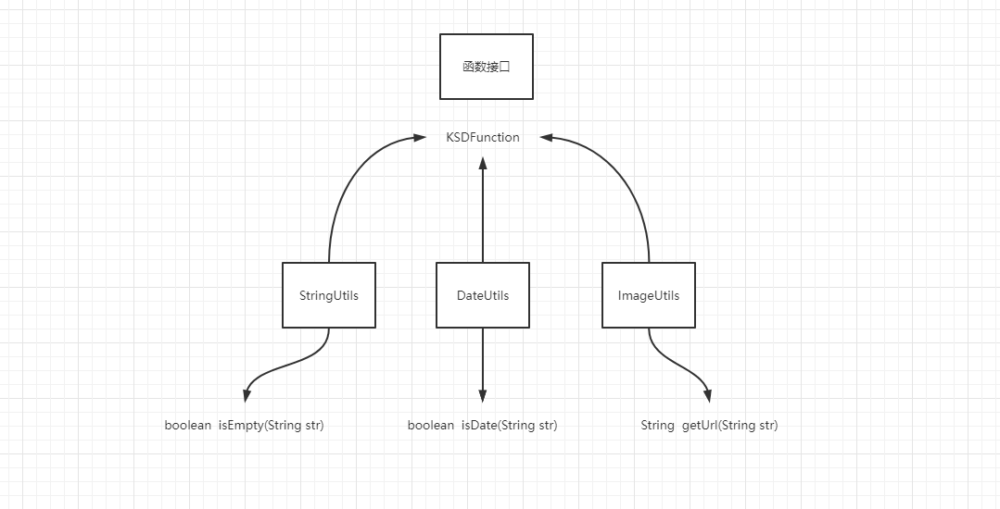

# Lambda表达式


## 01、课程大纲

- Lambda表达式构成

- 在哪里以及如何使用Lambda

- 函数式接口@FunctionalInterface

- 方法引用 & 构造引用(重点)

- Lambada的实战应用和反推

  


## 02、Lambda表达式构成

你已经了解了如何利用行为参数化来传递代码有助于应对不断变化的需求。它允许你定义一个代码块来表示一个行为，然后传递它。你可以决定在某一事件发生时运行该代码快。

但是你也看到，使用匿名内部类来表示不同的行为并不令人满意：代码十分啰嗦，这会影响程序员在实践过程中使用行为参数化的积极性。

然后我们可以通过java8的Lambda表达式，==它可以让你简洁地表设一个行为或代码块的传递==。你可以把Lambda表达式看做匿名功能，它基本上就是没有生命名称的方法，但是和匿名类一样，它可以作为参数传递给一个方法。

Lambda作为jdk1.8的核心重要改变，它可以让代码变得更加的简洁，更加的方便，但是我们对它的好奇和构成也将是我们的第一个认识：

> 一句话：java8的lambda表达式的出现：其实就是去解决行为参数化带来的匿名内部类的书写繁琐和啰嗦的问题。让程序代码或者代码块变得更加的简洁。


### Lambda的认识

 Lambda表达式你可以理解为：简洁地表示课传递的匿名函数的一种方式，它没有名称，但它有参数列表、函数主体、返回类型。可能还有一个可以抛出的异常列表。接下来我们就一一道来它的构成：

- 匿名：是因为它不像普通的方法一样有一个明确的名称，写得少而想得多，
- 函数 ：是因为Lambda函数不像方法哪样属于某个特定的类，但和方法一样，Lambda有参数列表，函数主体，返回类型。还可能有可以抛出的异常列表。（==针对那些有行为参数的方法，有接口的方法==）
- 传递：Lambda表示可以作为参数传递给方法或存储在变量中。
- 简洁：无须像匿名类哪样写很多的模板代码。

> Lambda这个词是从何而来呢？一切计算机运算过程，都可以归约于最简单的模型，比如图灵机，比如Lambda演算。Lambda演算, 出自Alonzo Church三十年代的书The Calculi of Lambda-Conversion。Alonzo设计Lambda演算的初衷，是为了以一种通用的形式化方式来表示复杂的计算过程假设有一群原始人，他们的数学系统里用+号来表示两数相加，却没有×号，那么他们想要表达乘这种运算的时候，只能用..+..+..这种表达式，或者用描述式的“十个加”，一旦他们引入了×号，就相当于有了一种形式化的方法来表达乘运算。尽管现代数学系统里，除了加号和乘号之外，幂、积分、累加等等运算符号不停地被发明出来，但是想用它们组成表达式来表示一段计算机程序的运算过程，还是显得无比繁琐。Lambda演算使用了一套极其简单的符号系统：{λ, ., (, )}以及变量名，就能表示一切图灵可计算的问题的计算过程，因此，它是一种通用的形式化演算。Alonzo证明了Lambda演算无法解决可判定性问题（Entscheidungsproblem），它所能实现的计算复杂度是与图灵机相等的。换句话说，Lambda演算和与图灵机等价。因此，它是图灵完备的。


​               

### Lambda的构成

关注点：==行为参数的方法和返回值的部分==

- 参数
- 箭头
- 主体


不得不承认，代码看起来更加清晰，要是你觉得Lambda看起来还是一头雾水也没关系，我们很快会一点点的解释清楚的。现在整个的程序就是在比较两个苹果的重量所真正需要的代码。看起来就像是只传递了compare方法的主体，很快你就会学到，你深圳还可以进一步简化代码如下：

#### Lambda的三个部分

```java
@FunctionalInterface
public interface AppPredicate {
    boolean test(Apple apple);
}

# 简化：
    
// 1、苹果库存
List<Apple> apples = new ArrayList<>();
apples.add(new Apple(1, "红色", 200));
apples.add(new Apple(2, "绿色", 100));
apples.add(new Apple(3, "红色", 134));
apples.add(new Apple(4, "浅红色", 400));
apples.add(new Apple(5, "浅绿色", 220));
apples.add(new Apple(6, "红色", 210));

// 2、过滤红色苹果
List<Apple> resultList1 = filterAppleColorAndWeigth(apples, new AppPredicate() {
    @Override
    public boolean test(Apple apple) {
        return apple.getColor().equals("红色");
    } //lambda针对方法
});// 匿名内部类：App

filterAppleColorAndWeigth(apples,(Apple apple) -> apple.getWeight() > 200);
filterAppleColorAndWeigth(apples,apple -> apple.getWeight() > 200);
```

- 参数列表 ： 这里它采用Comparator中compare方法的参数，两个apple 
  - 它就是你行为参数化中接口方法的参数列表
- 箭头：箭头 -> 把参数列表与Lambda主体分开
- 返回值 ：Lambda主体：标记两个apple的重量，表达式就是Lambda的返回值了。

#### Lambda中五种有效的Lambda表达式例子

```java
1、(String str) -> {
    return str.length()
}  
2、(Apple apple) -> apple.getWeight() > 150
3、(int x,int y) -> {System.out.println(x+"==="+y)
4、() -> 42;
5、(Apple a1,Apple a2) -> a1.getWeight().compareTo(a2.getWeight());
```

Java语言的设计者选择这样的语法，是因为C#和Scala等语言中的类似功能广泛欢迎，也就是说Lambda的基础语法是：

> (paramters) -> expression
>
> ```
> new 函数式接口(){
>     public void test(paramters){
>        return expression;
>     }
> }
> ```
>
> 或者
>
> (paramters) -> {expression}

#### 下面那些Lambda表达式是符合规则的？

- 1、()->{}

  ```
  filter(new Consumer(){
      public void test(){
         
      }
  })
  ```

  

- 2、(int a,int b)->{}

  ```
  filter(new Consumer(){
      public void test(int a,int b){
         
      }
  })
  ```

  

- 3、() ->  "ok"

  ```
  filter(new KSDSupplier(){
      public String test(){
         return "ok";
      }
  })
  ```

  

- 4、() -> {return "ok";}

- 5、(Integer i) - > return "ok"+i;

- 6、(String str) -> {"ok"}; // 错误

  


## 03、一些正确的方式创建Lambda表达式

| 使用案例         | 例子                                                         |
| ---------------- | ------------------------------------------------------------ |
| 布尔表达式       | （List<String> list） -> list.isEmpty()                      |
| 创建对象         | ()->new Apple()                                              |
| 消费对象         | (Apple a) -> {System.out.println(a.getColor())}              |
| 从一个对象中选取 | (String a) ->s.length()                                      |
| 组合两个值       | (int a,int b) -> a +b                                        |
| 比较两个对象     | (Apple a1,Apple a2) ->a1.getWeight().compareTo(a2.getWeight()) |


## 04、在程序中我们如何使用Lambda表达式

现在你可能在想，在哪里可以使用Lambda表达式呢？

答案是：你只能在在==函数式接口==上使用Lambda表达式。

比如：

```java
List<Apple> appleList =  filter(apples,a->"red".eqauls(a.getColor()));
```

在上面的代码中，你可以把Lambda表达式作为第二参数传递给filter方法，因为它这里需要的是Predicate<T>.而Predicate这是一个函数接口。如果听起来很抽象，不用担心，现在我们来探讨一下函数式接口？

### 程序中如何Lambda表示可以进行代码简化操作呢？

- 行为参数化（方法中传递接口/抽象类）

- 返回值是接口

  ```java
  public Callable callback(){
  	return ()-> "callable";
  }
  ```

## 04、函数式接口@FunctionalInterface

为了参数化filter方法的行为而创建了Predicate<T>接口，而这个接口其实就是：函数式接口

为什么呢？因为Predicate仅仅定义了一个抽象方法。

==在Java1.8之后，如果一个接口只有一个抽象方法。并且这个接口用于方法的参数中。我们称之为函数式接口。==

```java
package com.lambda.demo05;

/**
 * @author 飞哥
 * @Title: 学相伴出品
 * @Description: 飞哥B站地址：https://space.bilibili.com/490711252
 * 记得关注和三连哦！
 * @Description: 我们有一个学习网站：https://www.kuangstudy.com
 * @date 2021/10/21 17:28
 */
public interface Predicate<T> {
    boolean test(T t);
}

```

一言蔽之，函数式接口：==就是定义一个抽象方法的接口。==

那么在Java中哪些是函数接口呢？

```java
@FunctionalInterface
public interface Comparator<T> {
	 int compare(T o1, T o2);
}
```

```java
@FunctionalInterface
public interface Runnable {
	public abstract void run();
}
```

```java
@FunctionalInterface
public interface Callable<V> {
    V call() throws Exception;
}
```

```java
@FunctionalInterface
public interface Function<T, R> {
    R apply(T t);
}
```

```java
@FunctionalInterface
public interface Consumer<T> {
    void accept(T t);
}
```

等等，你会发现这些接口还可以拥有很多的==默认方法==，在一个接口中哪怕有很多的默认方法或者静态方法，但是只要抽象方法只有一个，它就是一个函数式接口


## 05、函数式接口可以用来干什么呢？

```java
public interface Adder{
	int sum(int a,int b);
}

public interface SmartAdder extends Adder{
	int sum(float a,float b);
}

public interface Nothing{

}
```

- 上面只有Adder是函数式接口，
- 而SmartAdder不是函数式接口，因为它定义了两个叫sum的抽象方法，
- Nothing也不是函数式接口，因为它没有声明抽象方法。

用函数式接口可以用来干什么呢？

Lambda表达式允许你直接以内联的形式为函数式接口的抽象方法提供实现，并把整个表达式作为函数式接口的实例（具体来说：是函数式接口一个具体实现的实例），其实你用匿名内部类也可以完成同样的事情。只不过用匿名内部类实现起来比较笨拙，需要提供一个实现，然后再直接内联将它实例化。如下：

```java
# 使用匿名内部类
Runnable runnable = new Runnable() {
    @Override
    public void run() {
    	System.out.println("Hello Runnable");
    }
};

# 使用Lambda表达式
Runnable runnable1 = ()-> System.out.println("Hello Runnable");
```


### 01、函数描述符

函数式接口的抽象方法口：基本上就是Lambda表达式的签名。我们将这种抽象方法叫做函数描述符。

比如：Runnable接口可以看作一个什么也不接受也不返回（void）的函数的签名。因为它只有一个叫作run方法的抽象，这个方法什么也不接受，什么也不返回。

而Lambda表达式只需要关注这个接口的抽象方法部分：

- 返回值
- 逻辑体

然后用其箭头(->)把，返回值和逻辑体连接起来，而从达到简化的目得和操作。其它的部分全部忽略。如下：

```java
# 使用匿名内部类
Runnable runnable = new Runnable() {
    @Override
    public void run() {
    	System.out.println("Hello Runnable");
    }
};

# 使用Lambda表达式
Runnable runnable1 = ()-> System.out.println("Hello Runnable");
```

函数式接口@FunctionalInterface又是怎么回事呢？

>@FunctionalInterface是对函数式接口起到标记的作用。
>
>如果你定义一个接口，如果这个接口不是函数式接口的话，然后你又用@FunctionalInterface去标注，编译器会返回一个提示原因错误，Multiple no-verriding abstract methods found in interface xxxx 表明存在多个抽象方法。
>
>请注意@FunctionalInterface不是必需的。但是对于程序的理解函数式接口而言，使用它是比较好的做法。它就像前面讲的@Override标注表示方法被重写了。
>
>一句话：@FunctionalInterface加与不加，都不影响函数式接口的定义。


## 06、Lambda表达式应用场景

- 行为参数化 stream，线程，排序器，匿名内部类的地方 -- 都在使用函数式接口(还能够简写，或者带来直观的感受)
- 函数式接口可以使用在：方法的引用和构造函数引用（这个东西就真的是装逼代码）
  - ==函数式接口的另外妙用，就用作方法引用和构造引用中，但是我们在建立一个认知，你可以用jdk1.8提供给我们的函数接口。也可以去自定函数式接口去完成的装逼过程。==

## 07：Lambda表达式，方法的引用以及构造器的引用（==重点==）

在Lambda表达式中，使用方法的引用，来传递方法方法的行为参数化；

方法引用让你可以重复使用现有的方法定义，并且像Lambda一样传递它们。在一些情况下比起使用Lambda表达式，它们似乎更易读，感觉也更好。

> 重点理解：一个类的对象的创建和执行方法，全部交由函数式接口去调用和执行。
>
> 工厂设计模式（负责对象创建） + 模板方法模式（把相同行为，变成一个模板）




### 方法的引用的语法，主要有三类

1.指向静态方法的方法引用，例如Integer的parseInt方法 ，可以写成Integer::parseInt

    函数式接口 =  类::静态方法名

2.指向任意类型实例方法的方法引用，例如String的length方法，写成String::length；

    函数式接口 =  类::实例方法名

3.指向现有对象的实例方法的方法引用

    函数式接口 = 对象::实例方法名
### 案例分析

下面，我们用个小案例，来演示方法的引用以及构造器的引用

```java
class Something {
 
    // constructor methods
    Something() {}
 
    Something(String something) {
		System.out.println(something);
    }
 
    // static methods
    static String startsWith(String s) {
        return String.valueOf(s.charAt(0));
    }
    
    // object methods
    String endWith(String s) {
        return String.valueOf(s.charAt(s.length()-1));
    }
    
    void endWith() {}
}
```

如何用 '::' 来访问类Something中的方法呢？先定义一个接口，因为必须要用 functional interface 来接收，否则编译错误（The target type of this expression must be a functional interface）

```java
@FunctionalInterface
interface IConvert<F, T> {
    T convert(F form);
}
```

（@FunctionalInterface 注解要求接口有且只有一个抽象方法，JDK中有许多类用到该注解，比如 Runnable，它只有一个 Run 方法。）

观察接口 IConvert，传参为类型 F，返回类型 T。所以，我们可以这样访问类Something的方法：

访问静态方法

```java
// static methods
IConvert<String, String> convert = Something::startsWith;
String converted = convert.convert("123");
```

访问对象方法

```java
 // object methods
Something something = new Something();
IConvert<String, String> converter = something::endWith;
String converted = converter.convert("Java");
```

访问构造方法

```java
 // constructor methods
IConvert<String, Something> convert = Something::new;
Something something = convert.convert("constructors");
```

### 总结：

我们可以把类Something中的方法static String startsWith(String s){...}、String endWith(String s){...}、Something(String something){...}看作是接口IConvert的实现，因为它们都符合接口定义的那个“模版”，有传参类型F以及返回值类型T。比如构造方法Something(String something)，它传参为String类型，返回值类型为Something。注解@FunctionalInterface保证了接口有且仅有一个抽象方法，所以JDK能准确地匹配到相应方法。


##  08、常见的函数式接口

函数式接口：定义且只定义了一个抽象方法。函数式接口很有用，因为抽象方法的签名可以描述Lambda表达式的签名。函数式接口的抽象方法的签名成为函数描述符。所以为了应用不同的Lambda表达式，JDK内部提供一系列的函数式接口来处理不同的业务，前面的：Comparable、Runnable和Callable接口等。

**Java 8中的常用函数式接口** 


| **函数式接口**      | **函数描述符**   | **原始类型特化**                              |
| ------------------- | ---------------- | --------------------------------------------- |
| *Predicate<T>*      | *T->boolean*     | *IntPredicate,LongPredicate, DoublePredicate* |
| *Consumer<T>*       | *T->void*        | *IntConsumer,LongConsumer, DoubleConsumer*    |
| *Function<T,R>*     | *T->R*           | *IntFunction,*                                |
|                     |                  | *IntToDoubleFunction,*                        |
|                     |                  | *IntToLongFunction,*                          |
|                     |                  | *LongFunction,*                               |
|                     |                  | *LongToDoubleFunction,*                       |
|                     |                  | *LongToIntFunction,*                          |
|                     |                  | *DoubleFunction,*                             |
|                     |                  | *ToIntFunction,*                              |
|                     |                  | *ToDoubleFunction,*                           |
|                     |                  | *ToLongFunction*                              |
| *Supplier<T>*       | *()->T*          | *BooleanSupplier,IntSupplier, LongSupplier,*  |
|                     |                  | *DoubleSupplier*                              |
| *UnaryOperator<T>*  | *T->T*           | *IntUnaryOperator,*                           |
|                     |                  | *LongUnaryOperator,*                          |
|                     |                  | *DoubleUnaryOperator*                         |
| *BinaryOperator<T>* | *(T,T)->T*       | *IntBinaryOperator,*                          |
|                     |                  | *LongBinaryOperator,*                         |
|                     |                  | *DoubleBinaryOperator*                        |
| *BiPredicate<L,R>*  | *(L,R)->boolean* |                                               |
| *BiConsumer<T,U>*   | *(T,U)->void*    | *ObjIntConsumer<T>,*                          |
|                     |                  | *ObjLongConsumer<T>,*                         |
|                     |                  | *ObjDoubleConsumer<T>*                        |
| *BiFunction<T,U,R>* | *(T,U)->R*       | *ToIntBiFunction<T,U>,*                       |
|                     |                  | *ToLongBiFunction<T,U>,*                      |
|                     |                  | *ToDoubleBiFunction<T,U>*                     |

 

补充：

| **使用案例**           | **Lambda 的例子**                                            | **对应的函数式接口**                                         |
| ---------------------- | ------------------------------------------------------------ | ------------------------------------------------------------ |
| 布尔表达式             | *(List list) -> list.isEmpty()*                              | *Predicate<list>*                                            |
| 创建对象               | *() -> new Apple(10)*                                        | *Supplier<Apple>*                                            |
| 消费一个对象           | *(Apple a) -> System.out.println(a.getWeight())*             | *Consumer<Apple>*                                            |
| 从一个对象中 选择/提取 | *(String s) -> s.length()*                                   | *Function<string, integer="">或 ToIntFunction*               |
| 合并两个值             | *(int a, int b) -> a \* b*                                   | *IntBinaryOperator*                                          |
| 比较两个对象           | *(Apple a1, Apple a2) -> a1.getWeight().compareTo(a2.getWeight())* | *Comparator或 BiFunction<apple, apple,="" integer=""> 或 ToIntBiFunction<apple, apple="">* |


## 09、函数式接口的方法引用和构造的引用应用场景

- 工具类
- 辅助类
- 底层源码


