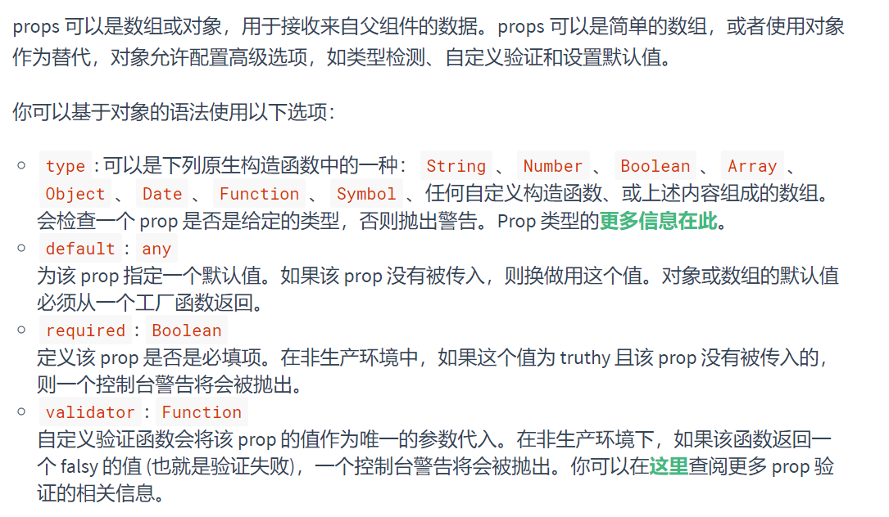

# 01、课程目标

1、了解VUEJS作用及MVVM框架

**2、掌握VUEJS中常用指令**

3、了解VUEJS的生命周期

**<font color=red>4、掌握VUEJS中通过AXIOS完成异步请求</font>**


# 02、前端开发模式发展

先了解一下前端开发模式的发展。

==**静态页面**==

- 最初的网页以HTML为主，是纯静态的网页。网页是只读的，信息流只能从服务的到客户端单向流通。**开发人员也只关心页面的样式和内容**即可。

  

==**异步刷新，操作DOM**==

- 1995年，网景工程师Brendan Eich 花了10天时间设计了JavaScript语言.

  随着JavaScript的诞生，我们可以操作页面的DOM元素及样式，页面有了一些动态的效果，但是依然是以静态为主。

- ajax盛行：

  - 2005年开始，ajax逐渐被前端开发人员所重视，因为不用刷新页面就可以更新页面的数据和渲染效果。
  - 此时的**开发人员不仅仅要编写HTML样式，还要懂ajax与后端交互，然后通过JS操作Dom元素来实现页面动态效果**。比较流行的框架如Jquery就是典型代表。----jquery---ajax---js----jquery全部所有浏览器的兼容性问题。


**==MVVM，关注模型和视图==**

- 2008年，google的Chrome发布，随后就以极快的速度占领市场，超过IE成为浏览器市场的主导者。

- 2009年，Ryan Dahl在谷歌的Chrome V8引擎基础上，打造了基于事件循环的异步IO框架：Node.js。

  - 基于时间循环的异步IO
  - 单线程运行，避免多线程的变量同步问题
  - JS可以编写后台diamante，前后台统一编程语言  angurajs

- node.js的伟大之处不在于让JS迈向了后端开发，而是构建了一个庞大的生态系统。

- 2010年，NPM作为node.js的包管理系统首次发布，开发人员可以遵循Common.js规范来编写Node.js模块，然后发布到NPM上供其他开发人员使用。目前已经是世界最大的包模块管理系统。

- 随后，在node的基础上，涌现出了一大批的前端框架：

   


==**MVVM模式**==

- M：即Model，模型，包括数据和一些基本操作
- V：即View，视图，页面渲染结果
- VM：即View-Model，模型与视图间的双向操作（无需开发人员干涉）---vue

在MVVM之前，开发人员从后端获取需要的数据模型，然后要通过DOM操作Model渲染到View中。而后当用户操作视图，我们还需要通过DOM获取View中的数据，然后同步到Model中。

而MVVM中的VM要做的事情就是把DOM操作完全封装起来，开发人员不用再关心Model和View之间是如何互相影响的：

- ==只要Model发生了改变，View上自然就会表现出来。==
- 当用户修改了View，Model中的数据也会跟着改变。

把开发人员从繁琐的DOM操作中解放出来，把关注点放在如何操作Model上。

 


而今天要学习的，就是一款MVVM模式的框架：Vue

好处：数据和视图分离，便于维护和升级。


**小结**

- 只要Model发生了改变，View上自然就会表现出来。
- 当用户修改了View，Model中的数据也会跟着改变。
- mvvm设计的理念：视图和数据完全分离。


MVVM ：   Model    View       VIew-model


# 03、VueJs的介绍与安装

| 目标                                 |
| ------------------------------------ |
| 什么是vuejs以及如何下载和安装Vuejs。 |


官网：https://cn.vuejs.org/

入门文档：<https://cn.vuejs.org/v2/guide/>


**==3.1 官网概述==**

Vue (读音 /vjuː/，类似于 **view**) 是一套用于构建用户界面的**渐进式框架**。与其它大型框架不同的是，Vue 被设计为可以自底向上逐层应用。==Vue 的核心库只关注视图层==，不仅易于上手，还便于与第三方库或既有项目整合。另一方面，当与[现代化的工具链](https://cn.vuejs.org/v2/guide/single-file-components.html)以及各种[支持类库](https://github.com/vuejs/awesome-vue#libraries--plugins)结合使用时，Vue 也完全能够为复杂的单页应用提供驱动。js库--

前端框架三巨头：Vue.js、React.js、AngularJS，vue.js以其轻量易用著称，vue.js和React.js发展速度最快。


作者：https://gitee.com/gitee-stars/14?from=osc-gj


**尤雨溪**，Vue.js 创作者，Vue Technology创始人，致力于Vue的研究开发。vue3.x / vue2.x


**==3.2 搭建vuejs环境==**

创建一个新的工程；选择静态web类型工程：


**3.2.1. 下载安装**

下载地址：https://github.com/vuejs/vue

可以下载2.6.10版本https://github.com/vuejs/vue/archive/v2.6.10.zip 或`资料`文件夹中也已下载

下载解压，在`dist`可得到vue.js文件。


**3.2.2. 使用CDN**

或者也可以直接使用公共的CDN（内容分发网络）服务：

```html
<!-- 开发环境版本，包含了用帮助的命令行警告 -->
<script src="https://cdn.jsdelivr.net/npm/vue/dist/vue.js"></script>
```

或者：

```html
<!-- 生产环境版本，优化了尺寸和速度 -->
<script src="https://cdn.jsdelivr.net/npm/vue"></script>
```

**3.2.3. npm安装(推荐)**

```properties
npm install vue
```

| 小结                                              |
| ------------------------------------------------- |
| 安装vuejs的命令是什么？    npm install vue --save |


# 04、VueJs的快速入门

| 目标                                                         |
| ------------------------------------------------------------ |
| 掌握和了解vue的定义语法和注意事情，完成双向数据绑定的操作演示。 |

**步骤** 


> **1. HTML模板**

 

> **2. vue渲染**

`双击运行：vuepro/demo01.html`

```html
<!doctype html>
<html lang="en">
<head>
    <meta charset="UTF-8">
    <meta name="viewport"
          content="width=device-width, user-scalable=no, initial-scale=1.0, maximum-scale=1.0, minimum-scale=1.0">
    <meta http-equiv="X-UA-Compatible" content="ie=edge">
    <title>04、VueJs的快速入门</title>
</head>
<body>

    <div id="app">
        <!--初始化位置 告诉vuejs从这里开始解析和渲染-->
        <div  class="app">
            <h1>{{title}}</h1>
            <p>我的名字叫：{{username}}，年龄：{{age}}岁，地址：{{address}}</p>
        </div>

        <div  class="app">
            <h1>{{title}}</h1>
            <p>我的名字叫：{{username}}，年龄：{{age}}岁，地址：{{address}}</p>
        </div>
    </div>
    <!--1: 导入vuejs --- 态度问题-->
    <script src="js/vue.min.js"></script>
    <script>
        // 三步曲
        // 1: 导入vuejs --- 态度问题
        // 2: 初始化vuejs
        // el : 告诉vuejs从哪里开始进行渲染。但是范围不能在body上。
        // 渲染：就指把data中和div替换
        // 3: el可以class吗？是可以但是不推荐 如果你一定用只会渲染第一个。
        // 那为什么不直接用id呢？
        var vue = new Vue({
            el:"#app",
            //data就数据，未来所有数据都在这里定义
            data:{
                title:"太棒了,66666",
                username:"127帅哥儿",
                address:"广州天河",
                age:21
            }
        });
    </script>
</body>
</html>
```

- 首先通过 new Vue()来创建Vue实例
- 然后构造函数接收一个对象，对象中有一些属性：
  - el：是element的缩写，通过id选中要渲染的页面元素，本例中是一个div
  - data：数据，数据是一个对象，里面有很多属性，都可以渲染到视图中
    - name：这里指定了一个name属性
- 页面中通过{{message}}的方式，来渲染刚刚定义的message属性。

打开页面查看效果：

 

运行结果如下：


| 小结                                                   |
| ------------------------------------------------------ |
| MVVM在入门代码里怎么体现的，哪里是M，哪里是V，哪里是VM |

>Model : vue实例的data
>
>View: 视图，div标签el管理那个部分
>
>VM:  vue本身。
>
>**==注意：==**vue的职责：把数据如何渲染到指定el范围进行数据的替换。(去DOM化)
>
>1：el范围 不能定义在body上
>
>2：el的名字一定id，不要class
>
>3：所有出现在el范围的那些key必须在data中先定义。


# 05、VueJs的插入值表达式

| 目标                   |
| ---------------------- |
| 掌握插入值表达式的使用 |

插入值表达式：  {{插入值表达式写在这里}}

> ​	类比学习：类似于jsp中的el表达式

**作用**

将data中的数据获取和展位，支持四则运算和三目运算符。

**核心代码**

`双击运行：vuepro/demo02.html`

```html
<!doctype html>
<html lang="en">
<head>
    <meta charset="UTF-8">
    <meta name="viewport"
          content="width=device-width, user-scalable=no, initial-scale=1.0, maximum-scale=1.0, minimum-scale=1.0">
    <meta http-equiv="X-UA-Compatible" content="ie=edge">
    <title>05、VueJs的插入值表达式</title>
</head>
<body>

    <div id="app">
        <h1>{{title}}</h1>
        <p>{{price + num}}</p>
        <p>{{price - num}}</p>
        <p>{{price * num}}</p>
        <p>{{price / num}}</p>
        <p>{{price % num}}</p>
        <p>{{mal<!-- <p>{{    if(male==1){return "男" }else{ return "女"; }     }}</p>-->e==1?"男":"女"}}</p>
    </div>

    <script src="js/vue.min.js"></script>
    <script>

        // {{ }} 插值表达式。也mustcache 胡子表达式
        // 它一种类似于jsp中${}表达式的玩意。
        // 它是去获取数据的一种占位符，仅此而已。
        var vue = new Vue({
            el:"#app",
            data:{
               title:"127班所有学生非常6666",
               price:11.23,
               num:11,
               male:0 // 1 男 0 女
            }
        })

    </script>

</body>
</html>
```

**效果如下：**


| 小结                                                       |
| ---------------------------------------------------------- |
| 插入值表达式可以使用if判断吗？可以定义变量吗？答案是：不能 |


# 06、VueJs指令：v-on：click

| 目标                |
| ------------------- |
| 掌握vuejs的点击事件 |


**核心代码**

`双击：demo03.html`

```html
<!doctype html>
<html lang="en">
<head>
    <meta charset="UTF-8">
    <meta name="viewport"
          content="width=device-width, user-scalable=no, initial-scale=1.0, maximum-scale=1.0, minimum-scale=1.0">
    <meta http-equiv="X-UA-Compatible" content="ie=edge">
    <title>VueJs指令：v-on：click</title>
</head>
<body>

<div id="app">
    <h1>{{title}}</h1>

    <button v-on:click="clickme()">点我</button>
    <button @click="clickme()">@点我</button>
</div>

<script src="js/vue.min.js"></script>
<script>

    var vue = new Vue({
        el:"#app",
        data:{
            title:"VueJs指令：格式: v-on：事件类型"
        },
        //一系列事件定义的位置，这个固定名字。
        methods:{
           clickme:function(){
               alert("点我了,触发我了...")
               // 更新数据
               //this.title = "Vuejs是一个坏蛋。。。"
               this.title = "";
           }
        }
    });

    // 思考问题：事件的作用？
    // 1：获取页面数据
    // 2：更新数据

</script>
</body>
</html>
```

| 小结                                   |
| -------------------------------------- |
| v-on:click  可以简写成什么？    @click |

注意事项：

1：v-on:事件类型(click,mouseenter) ="事件名". 

事件名必须定义在methods中。以key:value的方式存在

2：v-on在vuejs有简写。`@事件类型=“事件名”`


# 07、VueJs指令：v-on：keydown

| 目标             |
| ---------------- |
| 掌握键盘按下事件 |

  

  


**核心代码**

`双击：demo05.html`

```html
<!doctype html>
<html lang="en">
<head>
    <meta charset="UTF-8">
    <meta name="viewport"
          content="width=device-width, user-scalable=no, initial-scale=1.0, maximum-scale=1.0, minimum-scale=1.0">
    <meta http-equiv="X-UA-Compatible" content="ie=edge">
    <title>VueJs指令：v-on：click</title>
</head>
<body>

<div id="app">
    <textarea name="" cols="30" rows="10" maxlength="140" id="content" @keyup="inputcontent" @keydown="inputcontent">
    </textarea>
    <span>你可以输入{{size}}字</span>
</div>

<script src="js/vue.min.js"></script>
<script>
    var vue = new Vue({
        el:"#app",
        data:{
            content:"",
            size:140,
        },
        methods:{
            inputcontent:function(){
                // 1: 获取每次用户输入的值
                var cnt = document.getElementById("content").value;
                // 2: 用140减去用户输入内容的长度就得到还可以输入的字数。
                this.size = 140 -  cnt.length;
            }
        }
    })

</script>
</body>
</html>
```


| 小结                                         |
| -------------------------------------------- |
| 获取键盘码使用的是event的那个方法？  keyCode |


# 08、VueJs指令：v-on：mouseover

| 目标             |
| ---------------- |
| 掌握鼠标悬停事件 |


**核心代码**

```html
<!doctype html>
<html lang="en">
<head>
    <meta charset="UTF-8">
    <meta name="viewport"
          content="width=device-width, user-scalable=no, initial-scale=1.0, maximum-scale=1.0, minimum-scale=1.0">
    <meta http-equiv="X-UA-Compatible" content="ie=edge">
    <title>VueJs指令：v-on：mouseenter</title>
    <style>
        #divbox{transition: 1s;}
    </style>
</head>
<body>

<div id="app">
    <div id="divbox" @mouseenter="enter" @mouseleave="outer">我是以div,鼠标移动进来会可以效果哦</div>
</div>

<script src="js/vue.min.js"></script>
<script>
    var vue = new Vue({
        el:"#app",
        data:{
        },
        methods:{
            enter:function(){
                console.log(1);
                document.getElementById("divbox").style.background = "red";
                document.getElementById("divbox").style.color = "#fff";
                document.getElementById("divbox").style.fontSize = "24px";
            },
            outer:function(){
                console.log(2);
                document.getElementById("divbox").style.background = "green";
                document.getElementById("divbox").style.color = "#fff";
                document.getElementById("divbox").style.fontSize = "14px";
            }
        }
    })

</script>
</body>
</html>
```

鼠标进入的效果：mouseenter


鼠标离场的效果：mouseleave


# 09、VueJs指令：v-on：事件修饰符

| 目标                               |
| ---------------------------------- |
| 掌握事件指令v-on事件操作符应用场景 |

**概述**

在事件处理程序中调***用 `event.preventDefault()` 或 `event.stopPropagation()` 是非常常见的需求。尽管我们可以在方法中轻松实现这点，但更好的方式是：方法只有纯粹的数据逻辑，而不是去处理 DOM 事件细节。

为了解决这个问题，Vue.js 为 `v-on` 提供了**事件修饰符**。之前提过，修饰符是由点开头的指令后缀来表示的。

- `.stop` ：阻止事件冒泡
- `.prevent`：阻止默认事件发生
- `.capture`：使用事件捕获模式
- `.self`：只有元素自身触发事件才执行。（冒泡或捕获的都不执行）
- `.once`：只执行一次


**核心代码**

`.prevent`：阻止默认事件发生

`双击：demo06.html`

```html
<!doctype html>
<html lang="en">
<head>
    <meta charset="UTF-8">
    <meta name="viewport"
          content="width=device-width, user-scalable=no, initial-scale=1.0, maximum-scale=1.0, minimum-scale=1.0">
    <meta http-equiv="X-UA-Compatible" content="ie=edge">
    <title>Document</title>
</head>
<body>

    <div id="app">
        <form action="index.jsp" method="get">
            <p>用户：<input type="text"></p>
            <p>密码：<input type="password"></p>
            <input type="submit" @click.prevent="login" value="提交">
            <button @click.prevent="login">提交2</button>
            <a href="http://www.baidu.com" @click.prevent="tologin">点我去百度</a>
        </form>
    </div>

<script src="js/vue.min.js"></script>
<script>
    // 1 : 实例化vue
    var vue = new Vue({
        // 2 : 指定渲染的范围
        el:"#app",
        // 3 :数据定义的位置也就是Model
        data:{

        },
        // 4: 事件定义的位置,@事件类型="事件名"
        methods:{
            login:function(){
                alert(1);
            },
            tologin:function(){
                alert("点我了...")
            }
        }
    })
</script>
</body>
</html>
```


真实案例解决a连接锚点置定问题：

`双击：demo07.html`

```html
<!doctype html>
<html lang="en">
<head>
    <meta charset="UTF-8">
    <meta name="viewport"
          content="width=device-width, user-scalable=no, initial-scale=1.0, maximum-scale=1.0, minimum-scale=1.0">
    <meta http-equiv="X-UA-Compatible" content="ie=edge">
    <title>Document</title>
</head>
<body>

    <div id="app">
        <p>sdfsdf</p>
        <p>sdfsdf</p>
        <p>sdfsdf</p>
        <p>sdfsdf</p>
        <p>sdfsdf</p>
        <p>sdfsdf</p>
        <p>sdfsdf</p>
        <p>sdfsdf</p>
        <p>sdfsdf</p>
        <p>sdfsdf</p>
        <p>sdfsdf</p>
        <p>sdfsdf</p>
        <p>sdfsdf</p>
        <p>sdfsdf</p>
        <p>sdfsdf</p>
        <p>sdfsdf</p>
        <p>sdfsdf</p>
        <p>sdfsdf</p>
        <p>sdfsdf</p>
        <p>sdfsdf</p>
        <p>sdfsdf</p>
        <p>sdfsdf</p>
        <p>sdfsdf</p>
        <p>sdfsdf</p>
        <p>sdfsdf</p>
        <p>sdfsdf</p>
        <p>sdfsdf</p>
        <p>sdfsdf</p>
        <p>sdfsdf</p>
        <p>sdfsdf</p>
        <p>sdfsdf</p>
        <p>sdfsdf</p>
        <p>sdfsdf</p>
        <p>sdfsdf</p>
        <p>sdfsdf</p>
        <p>sdfsdf</p>
        <p>sdfsdf</p>
        <p>sdfsdf</p>
        <p>sdfsdf</p>
        <p>sdfsdf</p>
        <p>sdfsdf</p>
        <p>sdfsdf</p>
        <p>sdfsdf</p>
        <p>sdfsdf</p>
        <p>sdfsdf</p>
        <p>sdfsdf</p>
        <p>sdfsdf</p>
        <p>sdfsdf</p>
        <p>sdfsdf</p>
        <p>sdfsdf</p>
        <p>sdfsdf</p>
        <p>sdfsdf</p>
        <p>sdfsdf</p>
        <p>sdfsdf</p>
        <p>sdfsdf</p>
        <p>sdfsdf</p>
        <p>sdfsdf</p>
        <p>sdfsdf</p>
        <p>sdfsdf</p>

        <a href="#" @click.prevent="loadmore">加载更多</a>
        <a href="javascript:void(0);" @click="loadmore">加载更多</a>
    </div>

<script src="js/vue.min.js"></script>
<script>
    // 1 : 实例化vue
    var vue = new Vue({
        // 2 : 指定渲染的范围
        el:"#app",
        // 3 :数据定义的位置也就是Model
        data:{

        },
        // 4: 事件定义的位置,@事件类型="事件名"
        methods:{

            loadmore:function(){
                alert("加载点我了....");
            }

        }
    })
</script>
</body>
</html
```

| 小结                               |
| ---------------------------------- |
| 事件修饰符的作用是什么？  简化开发 |


# 10、VueJs指令：v-on：按键修饰符

| 目标                 |
| -------------------- |
| 掌握v-on的按键修饰符 |

**语法**

```html
Vue 允许为 v-on 在监听键盘事件时添加按键修饰符

全部的按键别名：
	
​	.enter(enter键)
​	.tab (Tab键)
​	.delete (捕获 "删除" 和 "退格" 键)
​	.esc （退出键）
​	.space（空格键）
​	.up (向上)
​	.down(向下)
​	.left(向左)
​	.right(向右)


​	.ctrl
​	.alt
​	.shift
​	.meta

注意：在 Mac 系统键盘上，meta 对应 command 键 (⌘)。在 Windows 系统键盘 meta 对应 Windows 徽标键 (⊞)。在 Sun 操作系统键盘上，meta 对应实心宝石键 (◆)。在其他特定键盘上，尤其在 MIT 和 Lisp 机器的键盘、以及其后继产品，比如 Knight 键盘、space-cadet 键盘，meta 被标记为“META”。在 Symbolics 键盘上，meta 被标记为“META”或者“Meta”。

```

非上面的键码参考ascii码表：

  

**核心代码**

`双击：demo08.html`

```html
<!doctype html>
<html lang="en">
<head>
    <meta charset="UTF-8">
    <meta name="viewport"
          content="width=device-width, user-scalable=no, initial-scale=1.0, maximum-scale=1.0, minimum-scale=1.0">
    <meta http-equiv="X-UA-Compatible" content="ie=edge">
    <title>Document</title>
</head>
<body>

<div id="app">
    <form action="index.jsp" method="get">
        <p>用户：<input type="text"></p>
        <p>密码：<input type="password" placeholder="请输入enter提交" @keydown.enter="tologin"></p>
        <p>密码：<input type="password" placeholder="请输入enter提交" @keydown.13="tologin"></p>
        <p>密码：<input type="password" placeholder="请输入ctrl+enter提交" @keydown.ctrl.enter="tologin"></p>
       <!-- <input type="submit" @click.stop.prevent="tologin" value="提交">-->
    </form>
</div>

<script src="js/vue.min.js"></script>
<script>
    // 1 : 实例化vue
    var vue = new Vue({
        // 2 : 指定渲染的范围
        el:"#app",
        // 3 :数据定义的位置也就是Model
        data:{

        },
        // 4: 事件定义的位置,@事件类型="事件名"
        methods:{
            tologin:function(){
                alert("我去提交登录表单了....")
            }
        }
    })
</script>
</body>
</html>
```


学习过程中也可以多看看文档：  [https://cn.vuejs.org/v2/guide/events.html#%E6%8C%89%E9%94%AE%E4%BF%AE%E9%A5%B0%E7%AC%A6](https://cn.vuejs.org/v2/guide/events.html#按键修饰符)

| 小结                                                         |
| ------------------------------------------------------------ |
| 按键修饰符有哪些？请说出三个    enter    space  tab   delete |

> **遗留问题：关于button和submit冲突，查看课件后续的解决视频**


# 11、VueJs指令：v-text与v-html

| 目标                       |
| -------------------------- |
| 掌握文本输出与样式渲染输出 |

<strong style="color:red">提示：v-text不支持标签解析，v-html支持标签解析</strong>

**核心代码**

`双击demo09.html:`

```html
<!doctype html>
<html lang="en">
<head>
    <meta charset="UTF-8">
    <meta name="viewport"
          content="width=device-width, user-scalable=no, initial-scale=1.0, maximum-scale=1.0, minimum-scale=1.0">
    <meta http-equiv="X-UA-Compatible" content="ie=edge">
    <title>Document</title>
</head>
<body>

<div id="app">
    <h1>{{content}}</h1>
    <hr/>
    <h1 v-text="content"></h1>
    <h1 v-html="content"></h1>
    <hr/>
    <h1>{{price + num}}</h1>
    <h1>{{price - num}}</h1>
    <h1>{{price * num}}</h1>
    <h1>{{price / num}}</h1>
    <h1>{{price % num}}</h1>
    <hr/>
    <h1 v-text="price + num"></h1>
    <h1 v-text="price - num"></h1>
    <h1 v-text="price * num"></h1>
    <h1 v-text="price / num"></h1>
    <h1 v-text="price % num"></h1>
</div>

<script src="js/vue.min.js"></script>
<script>
    // 1 : 实例化vue v-text v-html指令
    var vue = new Vue({

        // 2 : 指定渲染的范围
        el:"#app",

        // 3 :数据定义的位置也就是Model
        data:{
            content:"<strong style='color:green'>我太帅了，被自己迷倒了....</strong>",
            price:11.2,
            num:11
        },
        // 4: 事件定义的位置,@事件类型="事件名"
        methods:{

        }
    });
</script>
</body>
</html>
```


| 小结                                                      |
| --------------------------------------------------------- |
| 这样写是否正确？ `<div v-text="message"></div> `   不正确 |


# 12、VueJs指令：v-bind

| 目标                     |
| ------------------------ |
| 掌握绑定html标签的属性值 |

<strong>==插值语法：{{}}   是不能直接使用在属性上，需要借助v-bind指令来解决此问题！==</strong>

**核心代码**

```html
<!doctype html>
<html lang="en">
<head>
    <meta charset="UTF-8">
    <meta name="viewport"
          content="width=device-width, user-scalable=no, initial-scale=1.0, maximum-scale=1.0, minimum-scale=1.0">
    <meta http-equiv="X-UA-Compatible" content="ie=edge">
    <title>Document</title>
</head>
<body>

<div id="app">
    <div v-bind:title="content">{{content}}</div>
    <!--可以简化成-->
    <div :title="content">{{content}}</div>
</div>

<script src="js/vue.min.js"></script>
<script>
    // 1 : 实例化vue
    var vue = new Vue({
        // 2 : 指定渲染的范围
        el:"#app",
        // 3 :数据定义的位置也就是Model
        data:{
            content:"我太帅了,太迷人了..."
        },
        // 4: 事件定义的位置,@事件类型="事件名"
        methods:{

        }
    })
</script>
</body>
</html>
```


| 小结                              |
| --------------------------------- |
| v-bind:   可以简写成什么？      : |


# 13、VueJs指令：v-model

| 目标              |
| ----------------- |
| 掌握model的值绑定 |

**核心代码**

`双击：demo11.html`

```html
<!doctype html>
<html lang="en">
<head>
    <meta charset="UTF-8">
    <meta name="viewport"
          content="width=device-width, user-scalable=no, initial-scale=1.0, maximum-scale=1.0, minimum-scale=1.0">
    <meta http-equiv="X-UA-Compatible" content="ie=edge">
    <title>v-model指令</title>
</head>
<body>

<div id="app">
    <form action="index.jsp" method="get">
        <p>用户：<input type="text" v-model="username"></p>
        <p>密码：<input type="password" v-model="password"></p>
        <input type="submit" @click.prevent="login" value="提交">
        <p>你输入的值是：{{username}} == {{password}}</p>
    </form>
</div>


<script src="js/vue.min.js"></script>
<script>
    // 1 : 实例化vue
    // v-model: 它含义：双向数据绑定，改变视图会改变数据，改变数据会改变视图。
    var vue = new Vue({
        // 2 : 指定渲染的范围
        el:"#app",
        // 3 :数据定义的位置也就是Model
        data:{
            username:"",
            password:""
        },
        // 4: 事件定义的位置,@事件类型="事件名"
        methods:{
            login:function(){
                var username = this.username;
                var password = this.password;
                console.log("用户输入的账号和密码是：",username,password);
            }
        }
    })
</script>
</body>
</html>
```


如果参数过多建议使用对象包裹：

`双击demo12.html`

```html
<!doctype html>
<html lang="en">
<head>
    <meta charset="UTF-8">
    <meta name="viewport"
          content="width=device-width, user-scalable=no, initial-scale=1.0, maximum-scale=1.0, minimum-scale=1.0">
    <meta http-equiv="X-UA-Compatible" content="ie=edge">
    <title>v-model指令</title>
</head>
<body>

<div id="app">
    <form action="index.jsp" method="get">
        <p>用户：<input type="text" v-model="user.username"></p>
        <p>密码：<input type="password" v-model="user.password"></p>
        <input type="submit" @click.prevent="login" value="提交">
        <p>你输入的值是：{{user.username}} == {{user.password}}</p>
    </form>
</div>


<script src="js/vue.min.js"></script>
<script>
    // 1 : 实例化vue
    // v-model: 它含义：双向数据绑定，改变视图会改变数据，改变数据会改变视图。
    var vue = new Vue({
        // 2 : 指定渲染的范围
        el:"#app",
        // 3 :数据定义的位置也就是Model
        data:{
            //js对象可以动态扩展属性
            user:{}
        },
        // 4: 事件定义的位置,@事件类型="事件名"
        methods:{
            login:function(){
                var username = this.user.username;
                var password = this.user.password;
                console.log("用户输入的账号和密码是：",username,password);
            }
        }
    })
</script>
</body>
</html>
```


| 小结                                               |
| -------------------------------------------------- |
| v-model与v-bind的区别是什么？ bind绑定的标签的属性 |
| v-model绑定的是什么？  Model                       |
| 如果参数多个用什么方式处理：对象                   |


# 14、VueJs指令：v-for

| 目标             |
| ---------------- |
| 掌握迭代数组     |
| 掌握迭代对象     |
| 掌握迭代对象数组 |

**核心代码**

`双击：demo13.html`

```html
<!doctype html>
<html lang="en">
<head>
    <meta charset="UTF-8">
    <meta name="viewport"
          content="width=device-width, user-scalable=no, initial-scale=1.0, maximum-scale=1.0, minimum-scale=1.0">
    <meta http-equiv="X-UA-Compatible" content="ie=edge">
    <title>v-model指令</title>
</head>
<body>

<div id="app">
    <h1>普通数据类型</h1>
    <h1>{{title}}</h1>
    <h1>{{num}}</h1>
    <h1>{{flag}}</h1>
    <hr>


    <h1>对象取值</h1>
    <p>{{user.id}}</p>
    <p>{{user.name}}</p>
    <p>{{user.age}}</p>
    <hr>


    <h1>数组</h1>
    <p>{{users[0]}}</p>
    <p>{{users[1]}}</p>
    <p>{{users[2]}}</p>

    <h1>v-for循环---数组对象</h1>
    <div v-for="(user,index) in users">
        <p>{{index + 1}}：{{user.id}} == {{user.name}}==={{user.age}}</p>
    </div>
    <hr/>

    <hr>
    <h1>v-for循环---数组</h1>
    <div v-for="(f,index) in friends">
        {{f}}
    </div>

    <hr>
    <h1>v-for循环---对象</h1>
    <div v-for="(key,value) in user">
        {{value}}==={{value}}
    </div>
</div>


<script src="js/vue.min.js"></script>
<script>
    // 1 : 实例化vue
    // v-model: 它含义：双向数据绑定，改变视图会改变数据，改变数据会改变视图。
    var vue = new Vue({
        // 2 : 指定渲染的范围
        el:"#app",
        // 3 :数据定义的位置也就是Model
        data:{
           title:"我太帅了",
           num:10,
           flag:true,
            
           // 数组
           friends:["张三","李四","wangwu"],

           // 对象
           user:{
               id:1,
               name:"张三",
               age:34
           },

           // 对象数组
           users:[
               {
                   id:1,
                   name:"张三1",
                   age:31
               },
               {
                   id:2,
                   name:"张三2",
                   age:32
               },
               {
                   id:3,
                   name:"张三3",
                   age:33
               }
           ]
        },
        // 4: 事件定义的位置,@事件类型="事件名"
        methods:{

        }
    })
</script>
</body>
</html>
```


==细节：==

 

| 小结                                                         |
| ------------------------------------------------------------ |
| <div v-for="(a,b) in arr">     这个迭代数组中，a和b   那个代表数组的索引？ b |


# 15、VueJs指令：v-if与v-show

| 目标                         |
| ---------------------------- |
| 掌握如何隐藏一个页面中的元素 |


**核心代码**

`双击demo14.html`  件指令：v-if  /   v-else-if   /   v-else

```html
<!doctype html>
<html lang="en">
<head>
    <meta charset="UTF-8">
    <meta name="viewport"
          content="width=device-width, user-scalable=no, initial-scale=1.0, maximum-scale=1.0, minimum-scale=1.0">
    <meta http-equiv="X-UA-Compatible" content="ie=edge">
    <title>v-model指令</title>
</head>
<body>

<div id="app">
    <h1>用户编号：{{user.id}}</h1>
    <h1>用户名字：{{user.name}}</h1>
    <h1>用户性别：</h1>
    <h1 v-if="user.male==0">女</h1>
    <h1 v-if="user.male==1">男</h1>
    <h1 v-if="user.male==2">保密</h1>
    <hr>
    <h1 v-if="user.male==0">女</h1>
    <h1 v-else-if="user.male==1">男</h1>
    <h1 v-else-if="user.male==3">男</h1>
    <h1 v-else>保密</h1>
    <hr>
</div>


<script src="js/vue.min.js"></script>
<script>
    // 1 : 实例化vue
    // v-model: 它含义：双向数据绑定，改变视图会改变数据，改变数据会改变视图。
    var vue = new Vue({
        // 2 : 指定渲染的范围
        el:"#app",
        // 3 :数据定义的位置也就是Model
        data:{
          user:{
              id:1,
              name:"张三",
              male:2 // 1 男 0 女 2 保密
          }
        },
        // 4: 事件定义的位置,@事件类型="事件名"
        methods:{

        }
    })
</script>
</body>
</html>
```

`v-if和v-show的区别`

`双击demo16.html`

```html
<!doctype html>
<html lang="en">
<head>
    <meta charset="UTF-8">
    <meta name="viewport"
          content="width=device-width, user-scalable=no, initial-scale=1.0, maximum-scale=1.0, minimum-scale=1.0">
    <meta http-equiv="X-UA-Compatible" content="ie=edge">
    <title>v-model指令</title>
</head>
<body>

<div id="app">
    <div v-if="flag">v-if我显示了</div>
    <div v-show="flag">v-show我显示了</div>
    <button @click="changeFlag">点击改变flag</button>
</div>


<script src="js/vue.min.js"></script>
<script>
    // 1 : 实例化vue
    // v-model: 它含义：双向数据绑定，改变视图会改变数据，改变数据会改变视图。
    var vue = new Vue({
        // 2 : 指定渲染的范围
        el:"#app",
        // 3 :数据定义的位置也就是Model
        data:{
          flag:true
        },
        // 4: 事件定义的位置,@事件类型="事件名"
        methods:{
            changeFlag:function(){
                // 设定开关
                this.flag = !this.flag;
               /* if(this.flag){
                    this.flag = false
                }else{
                    this.flag = true;
                }*/
            }
        }
    })
</script>
</body>
</html>
```


| 小结                                                         |
| ------------------------------------------------------------ |
| v-if           是   根据值是否渲染页面元素          还是    根据值切换元素的display css属性?   是否渲染页面元素 |
| v-show    是   根据值是否渲染页面元素          还是    根据值切换元素的display css属性?切换元素的display css |


# 16、VueJs指令总结

| 目标            |
| --------------- |
| 掌握常用vue指令 |

获取值得方式是：{{}}  插值表达式，支持四则运算。

1：===文本指令：v-html / v-text 和插值表达式，名字也必须定义在data中。==

2：事件指令：v-on:click="事件名"，缩写：@click="事件名"，注：事件名定义在：methods中

3：属性指令：v-bind:属性名="data的key" 缩写 : 属性名="data的key" .注意动静拼接的问题 

4：控制指令：v-model="data的key"，用于获取form控制元素的值。如果的多余3个建议使用对象去定义和获取

5： 循环指令：v-for ="(obj,index) inf data中定义数组的名字" 。

6：条件指令：v-if / v-else-if /v-else 注意中间不能出现标签，否则会出现断层。

7：显示指令：v-show 控制元素的隐藏和显示。（鼠标事件 + v-show /v-if选项卡）


| 小结                     |
| ------------------------ |
|  |


# 17、VueJs的生命周期


| 目标                |
| ------------------- |
| 了解vuejs的生命周期 |

掌握它的生命周期是为了用它的生命周期的方法：一共8个，两两一组

    这些方法不用我们触发，都是由vue自己触发的方法，知道这些方法的调用时机就可以了

创建时期：beforeCreate    **created**

挂载时期：beforeMount    **mounted**

更新时期：beforeUpdate   updated

死亡时期：beforeDestory   destoryed

**方法和时期的作用**

你可以在这些方法中，去变更data的数据，vuejs会把你修改的数据进行渲染。

==图解：==

```
图片的url： 
https://cn.vuejs.org/v2/guide/instance.html#%E7%94%9F%E5%91%BD%E5%91%A8%E6%9C%9F%E5%9B%BE%E7%A4%BA
```


**核心代码**

```html
<!DOCTYPE html>
<html>
<head>
    <meta charset="utf-8" />
    <title>生命周期</title>
    <script src="js/vue.min.js"></script>
</head>
<body>
<div id="app">
    {{message}}
    <button @click="changeupdate">更新数据</button>
</div>

<script>
    var vm = new Vue({
        el : "#app",
        data : {
            message : 'hello world',
            users:[]
        },
        methods:{
            changeupdate:function(){
                this.message = "4";
            }
        },
        beforeCreate : function() {
            console.log(this);
            showData('创建vue实例前', this);
        },

        created : function() {
            // 在这个阶段可以修改
            this.message = "1.";
            showData('创建vue实例后', this);
        },

        // 替换和编译阶段
        beforeMount : function() {
            this.message="2";
            showData('挂载到dom前', this);
        },

        mounted : function() {
            // 这里有一个问题?
            this.message = "3";
            showData('挂载到dom后', this);
        },


        beforeUpdate : function() {
            showData('数据变化更新前', this);
        },

        updated : function() {
            showData('数据变化更新后', this);
        },

        beforeDestroy : function() {
            showData('vue实例销毁前', this);
        },

        destroyed : function() {
            showData('vue实例销毁后', this);
        }
    });
    function realDom() {
        console.log('真实dom结构：' + document.getElementById('app').innerHTML);
    }
    function showData(process, obj) {
        console.log(process);
        console.log('data 数据：' + obj.message)
        console.log('挂载的对象：')
        console.log(obj.$el)
        realDom();
        console.log('------------------')
        console.log('------------------')
    }
    // 忘记注释
    vm.message = "good...";
    vm.$destroy();
</script>
</body>
</html>

```

| 小结                                |
| ----------------------------------- |
| vuejs的生命周期钩子有几个？分别是？ |

  

为什么要学习生命周期：

1：是因为开放的过程，有一些逻辑的数据初始化需要在页面加载完毕的时候就去执行。那么必须要知道那个地方执行即可：

```properties
created
mounted
一般在开放中我们都会使用这个两个方法去初始化和改变数据，然后给手续进行渲染和替换。不是beforeMounte不行，是因为mounted更适合。
```


# 18、Vuejs计算属性：computed


**使用vuejs计算属性完成**

在插值表达式中使用js表达式是非常方便的，而且也经常被用到。


```html
<!DOCTYPE html>
<html lang="en">
<head>
    <meta charset="UTF-8">
    <title>vuejs测试</title>
</head>
<body>
<div id="app">
    <h2>
        当前时间是：{{birth}}
    </h2>
</div>
<script src="node_modules/vue/dist/vue.js"></script>
<script>
    var app = new Vue({
        el:"#app",//el即element，要渲染的页面元素
        data: {
            birthday:1429032123201
        },
        computed: {
            // 1：计算属性 可以当做属性直接使用。不需要定义切记
            birth() {
                // 2:获取当前时间
                const date = new Date(this.birthday);
                // 3: 日期格式化日志，返回进行回显页面
                return dateFormat("yyyy-MM-dd HH:mm:ss",date);
            }
        },
        // 生命周期函数
        created() {
            // 4：每隔1秒执行一次时间获取
            setInterval(()=>{
                this.birthday = new Date().getTime();
            },1000);
        }
    });


    // 日期格式化函数
    function dateFormat(fmt, date) {
        let ret;
        const opt = {
            "y+": date.getFullYear().toString(),        // 年
            "m+": (date.getMonth() + 1).toString(),     // 月
            "d+": date.getDate().toString(),            // 日
            "H+": date.getHours().toString(),           // 时
            "M+": date.getMinutes().toString(),         // 分
            "s+": date.getSeconds().toString()          // 秒
            // 有其他格式化字符需求可以继续添加，必须转化成字符串
        };
        for (let k in opt) {
            ret = new RegExp("(" + k + ")").exec(fmt);
            if (ret) {
                fmt = fmt.replace(ret[1], (ret[1].length == 1) ? (opt[k]) : (opt[k].padStart(ret[1].length, "0")))
            };
        };
        return fmt;
    }
</script>
</body>
</html>
```

> 计算属性本质就是方法，但是一定要返回数据。然后页面渲染时，可以把这个方法当成一个变量来使用。

> 效果：

 

==注意：computed 是在beforeMount和Mounted直接调用，执行updated也会调用computed。==


# 19、Vuejs监控属性：watch

**监控**

watch可以让我们监控一个值的变化。从而做出相应的反应。

> 示例：

```html
<!DOCTYPE html>
<html lang="en">
<head>
    <meta charset="UTF-8">
    <title>vuejs测试</title>
</head>
<body>
<div id="app">
    <input v-model="message">
</div>
<script src="node_modules/vue/dist/vue.js"></script>
<script>
    var app = new Vue({
        el:"#app",//el即element，要渲染的页面元素
        data: {
            message:"hello vue"
        },
        watch:{
            message(newValue, oldValue){
                console.log("新值：" + newValue + "；旧值：" + oldValue);
            }
        }
    });
</script>

</body>
</html>

```

> 效果：

 

 

**深度监控**

如果监控的是一个对象，需要进行深度监控，才能监控到对象中属性的变化，例如：

```html
<!DOCTYPE html>
<html lang="en">
<head>
    <meta charset="UTF-8">
    <title>vuejs测试</title>
</head>
<body>
<div id="app">
   {{message}}
   {{this.coptions}}
     <button @click="changeBg">点我改变背景颜色</button>
</div>
<script src="node_modules/vue/dist/vue.js"></script>
<script>
    var app = new Vue({
        el:"#app",//el即element，要渲染的页面元素
        data: {
            message:"hello vue",
            coptions:{background:111111,size:12}
        },
        watch:{

            message(newValue, oldValue){
                console.log("新值：" + newValue + "；旧值：" + oldValue);
            },

            coptions: {
                //开启深度监控，可以监控到对象属性值的变化
                deep: true,
                //监控的处理方法
                handler(obj){
                    console.log("name = " + obj.background + ", age=" + obj.size);
                    document.body.style.background = "#"+obj.background;
                }
            }
            
        },
        methods:{
            changeBg(){
                this.message = "hi vue";
                this.coptions.background++;
            }
        }

    });
</script>

</body>
</html>
```

变化：

- 以前定义监控时，person是一个函数，现在改成了对象，并且要指定两个属性：
  - deep:代表深度监控，不仅监控person变化，也监控person中属性变化
  - handler：就是以前的监控处理函数

效果：


**==小结：==**

watch顾名思义，用于监听数据变化，其中可以监听的数据来源有三部分：props、data、computed内的数据；watch提供两个参数（newValue，oldValue），第一个参数是新值，第二个参数保存旧值；

computed用于处理复杂的逻辑运算，主要和methods储存方法来进行区分；methods储存方法，，computed储存需要处理的数据值；methods每次都会调用，computed有缓存机制，只有改变时才执行，性能更佳；

1. computed 属性的结果会被缓存，除非依赖的响应式属性变化才会重新计算。==主要当作属性来使用；==
2. methods 方法表示一个具体的操作，主要书写业务逻辑；
3. watch 一个对象，键是需要观察的表达式，值是对应回调函数。主要用来监听某些特定数据的变化，从而进行某些具体的业务逻辑操作；可以看作是 computed 和 methods 的结合体；


# 20、VueJs的异步请求：axios介绍

| 目标                         |
| ---------------------------- |
| 掌握和学习异步处理组件axios. |


**概述**

Vuejs 并没有直接处理ajax的组件，但可以使用axios或vue-resource组件实现对异步请求的操作。

> vue-resource

vue-resource是Vue.js的插件提供了使用XMLHttpRequest或JSONP进行Web请求和处理响应的服务。 当vue更新
到2.0之后，作者就宣告不再对vue-resource更新，而是推荐axios。

vue-resource的github: https://github.com/pagekit/vue-resource

> axios简介

Axios 是一个基于 promise 的 HTTP 库，可以用在浏览器和 node.js 中进行异步调用

axios的github:https://github.com/axios/axios

```shell
# 如果使用npm则可以如下安装
npm install axios
```

或者也可以直接使用公共的CDN（内容分发网络）服务：

```html
<!-- 开发环境版本，包含了用帮助的命令行警告 -->
<script src="https://unpkg.com/axios/dist/axios.min.js"></script>
```

> 方法说明

axios可以使用的方法有：

```
axios({
	url: '',
	method: 'get'
})

```

- axios(config) 
- ==axios.get(url[, config]).==
- axios.delete(url[, config])
- axios.head(url[, config])
- ==axios.post(url[, data[, config]])==
- axios.put(url[, data[, config]])
- axios.patch(url[, data[, config]])


**config请求配置**

这些是创建请求时可以用的配置选项。只有 `url` 是必需的。如果没有指定 `method`，请求将默认使用 `get` 方法。

```json
{
  // `url` 是用于请求的服务器 URL
  url: '/user',

  // `method` 是创建请求时使用的方法
  method: 'get', // 默认是 get

  // `baseURL` 将自动加在 `url` 前面，除非 `url` 是一个绝对 URL。
  // 它可以通过设置一个 `baseURL` 便于为 axios 实例的方法传递相对 URL
  baseURL: 'https://some-domain.com/api/',

  // `transformRequest` 允许在向服务器发送前，修改请求数据
  // 只能用在 'PUT', 'POST' 和 'PATCH' 这几个请求方法
  // 后面数组中的函数必须返回一个字符串，或 ArrayBuffer，或 Stream
  transformRequest: [function (data) {
    // 对 data 进行任意转换处理

    return data;
  }],

  // `transformResponse` 在传递给 then/catch 前，允许修改响应数据
  transformResponse: [function (data) {
    // 对 data 进行任意转换处理

    return data;
  }],

  // `headers` 是即将被发送的自定义请求头
  headers: {
      'X-Requested-With': 'XMLHttpRequest',
      'Content-Type': 'application/json'
  },

  // `params` 是即将与请求一起发送的 URL 参数
  // 必须是一个无格式对象(plain object)或 URLSearchParams 对象
  params: {
    ID: 12345
  },

  // `data` 是作为请求主体被发送的数据
  // 只适用于这些请求方法 'PUT', 'POST', 和 'PATCH'
  // 在没有设置 `transformRequest` 时，必须是以下类型之一：
  // - string, plain object, ArrayBuffer, ArrayBufferView, URLSearchParams
  // - 浏览器专属：FormData, File, Blob
  // - Node 专属： Stream
  data: {
    firstName: 'Fred'
  },

  // `timeout` 指定请求超时的毫秒数(0 表示无超时时间)
  // 如果请求话费了超过 `timeout` 的时间，请求将被中断
  timeout: 1000,

  // `withCredentials` 表示跨域请求时是否需要使用凭证
  withCredentials: false, // 默认的

  // `responseType` 表示服务器响应的数据类型，可以是 'arraybuffer', 'blob', 'document', 'json', 'text', 'stream'
  responseType: 'json', // 默认的

  // `maxContentLength` 定义允许的响应内容的最大尺寸
  maxContentLength: 2000,

  // `validateStatus` 定义对于给定的HTTP 响应状态码是 resolve 或 reject  promise 。如果 `validateStatus` 返回 `true` (或者设置为 `null` 或 `undefined`)，promise 将被 resolve; 否则，promise 将被 rejecte
  validateStatus: function (status) {
    return status >= 200 && status < 300; // 默认的
  },

  // `maxRedirects` 定义在 node.js 中 follow 的最大重定向数目
  // 如果设置为0，将不会 follow 任何重定向
  maxRedirects: 5 // 默认的

}

```

**响应结构**

```json
{
  // `data` 由服务器提供的响应
  data: {},

  // `status` 来自服务器响应的 HTTP 状态码
  status: 200,

  // `statusText` 来自服务器响应的 HTTP 状态信息
  statusText: 'OK',

  // `headers` 服务器响应的头
  headers: {},

  // `config` 是为请求提供的配置信息
  config: {}
}

```


**步骤：**

1）在页面引入js库：axios

```html
<script src="https://unpkg.com/axios/dist/axios.min.js"></script>
```

2）get请求参数处理：

```js
axios.get('/user?ID=12345')
  .then(function (response) {
    // handle success
    console.log(response);
  })


axios.get('/user',{params:{ID:12345}})
  .then(function (response) {
    // handle success
    console.log(response);
  })


```

4）post请求参数处理

```js
axios.post('/user',{ID:12345,name:'小飞飞'})
  .then(function (response) {
    // handle success
    console.log(response);
  })
```

**==注意：后台的mvc方法中如果是pojo或者map必须增加@RequestBody==**

```java
/**
 * 新增用户方法
 * @return
*/
@PostMapping("/api/user/save")
public User saveuser(@RequestBody  User user){
    return userService.saveUser(user);
}

```

| 小结                                  |
| ------------------------------------- |
| 要进行axios异步请求，第一步要怎么做？ |
| axios中的get请求怎么带参数？          |
| axios中的post请求怎么带参数？         |


# 21、案例：后台代码

| 目标                                 |
| ------------------------------------ |
| 了解进行异步请求中后台代码有哪些接口 |

**核心代码**

```html
这个代码就是我们在上springboot课程时做的案例
```

**SQL脚本**：

```sql
/*
Navicat MySQL Data Transfer

Source Server         : localhost
Source Server Version : 60011
Source Host           : localhost:3306
Source Database       : user-center-db

Target Server Type    : MYSQL
Target Server Version : 60011
File Encoding         : 65001

Date: 2020-03-19 18:18:31
*/

SET FOREIGN_KEY_CHECKS=0;

-- ----------------------------
-- Table structure for tb_user
-- ----------------------------
DROP TABLE IF EXISTS `tb_user`;
CREATE TABLE `tb_user` (
  `id` bigint(20) NOT NULL AUTO_INCREMENT,
  `user_name` varchar(100) DEFAULT NULL COMMENT '用户名',
  `password` varchar(100) DEFAULT NULL COMMENT '密码',
  `name` varchar(100) DEFAULT NULL COMMENT '姓名',
  `age` int(10) DEFAULT NULL COMMENT '年龄',
  `sex` tinyint(1) DEFAULT NULL COMMENT '性别，1男性，2女性',
  `birthday` date DEFAULT NULL COMMENT '出生日期',
  `note` varchar(255) DEFAULT NULL COMMENT '备注',
  `create_time` timestamp NOT NULL DEFAULT CURRENT_TIMESTAMP COMMENT '创建时间',
  `updated` datetime DEFAULT NULL COMMENT '更新时间',
  PRIMARY KEY (`id`),
  UNIQUE KEY `username` (`user_name`)
) ENGINE=InnoDB AUTO_INCREMENT=3242342349823784981 DEFAULT CHARSET=utf8;

-- ----------------------------
-- Records of tb_user
-- ----------------------------
INSERT INTO `tb_user` VALUES ('2', 'lisi', '123456', '李四', '21', '2', '1995-01-01', '李四同学在学Java', '2014-09-19 16:56:04', '2014-09-19 16:56:04');
INSERT INTO `tb_user` VALUES ('3', 'wangwu', '123456', '王五', '22', '2', '1994-01-01', '王五同学在学php', '2014-09-19 16:56:04', '2014-09-19 16:56:04');
INSERT INTO `tb_user` VALUES ('4', 'zhangliu', '123456', '张六', '20', '1', '1996-09-01', '张六同学在学Java', '2014-09-19 16:56:04', '2014-09-19 16:56:04');
INSERT INTO `tb_user` VALUES ('5', 'lina', '123456', '李娜', '28', '1', '1988-01-01', '李娜同学在学Java', '2014-09-19 16:56:04', '2014-09-19 16:56:04');
INSERT INTO `tb_user` VALUES ('6', 'lilei', '123456', '李雷', '23', '1', '1993-08-08', '李雷同学在学Java', '2014-09-20 11:41:15', '2014-09-20 11:41:15');
INSERT INTO `tb_user` VALUES ('7', 'hanmeimei', '123456', '韩梅梅', '24', '2', '1992-08-08', '韩梅梅同学在php', '2014-09-20 11:41:15', '2014-09-20 11:41:15');
INSERT INTO `tb_user` VALUES ('8', 'wangbeed', '123456', 'wangbeed', '21', '2', '2008-07-08', 'icoding变成', '2014-09-20 11:41:15', '2014-09-20 11:41:15');
INSERT INTO `tb_user` VALUES ('9', 'hanma', '123456', '韩马上贷', '18', '2', '2012-08-08', '高端品牌', '2014-09-20 11:41:15', '2014-09-20 11:41:15');
INSERT INTO `tb_user` VALUES ('16', '徐老师222', '12342256', 'xu22la2os', null, null, null, null, '2020-03-18 20:25:19', null);
INSERT INTO `tb_user` VALUES ('18', '徐老师222222222222222222', '12342256', 'xu22l22222222222a2os', null, null, null, null, '2020-03-18 20:40:26', null);
INSERT INTO `tb_user` VALUES ('3242342349823784975', '1', '2', null, null, '1', null, '3', '2020-03-19 16:24:39', null);
INSERT INTO `tb_user` VALUES ('3242342349823784977', '1222', '222', null, null, '1', null, '22222', '2020-03-19 16:26:03', null);
INSERT INTO `tb_user` VALUES ('3242342349823784978', '234234', '32342', null, null, null, null, '23423423423', '2020-03-19 16:26:11', null);
INSERT INTO `tb_user` VALUES ('3242342349823784979', '11111', '11111111111111111', null, null, '0', null, '1111111111111111111111', '2020-03-19 16:26:55', null);
INSERT INTO `tb_user` VALUES ('3242342349823784980', '22222222222', '2222222222222222222222', null, null, '0', null, '222222222222', '2020-03-19 16:27:06', null);

```

| 小结                                                         |
| ------------------------------------------------------------ |
| 查询用户列表的接口是？http://localhost:8080/api/user/findusers |
| 保存用户？  http://localhost:8080/api/user/save              |
| 更新用户的接口是？ http://localhost:8080/api/user/update     |

整体项目结构


# 22、案例：用户列表功能【重点掌握】

| 目标                 |
| -------------------- |
| 掌握axios中的get请求 |


**核心代码**

`newindex.html`

```html
<tr v-for="(user,index) in users">
    <td>{{user.id}}</td>
    <td>{{user.userName}}</td>
    <td>{{user.name}}</td>
    <td>{{user.password}}</td>
    <td>
        <span v-if="user.sex==1">男</span>
        <span v-if="user.sex==0">女</span>
        <span v-if="user.sex==2">保密</span>
    </td>
    <td>{{user.createTime}}</td>
    <td>操作</td>
</tr>
```


book.js

```javascript
<!--第一步骤；导入vuejs和axios 请注意，不颠倒顺序-->
    <script src="js/vue.min.js"></script>
    <script src="js/axios.min.js"></script>
    <script>

        // 第二步骤：初始化vue实例
        var vue = new Vue({
            el:"#app",

            data:{
                title:"用户列表",
                // 用来装载用户数据的容器
                users:[] // 多条
            },

            // vue初始化方法
            created:function(){

                // 查询用户列表
                this.load();

            },

            methods:{
                // 查询用户列表
                load:function(){
                    // 查询用户列表 this指向的是谁？this就近指向。
                    // 相对
                    //var that = this;
                   axios.get("http://localhost:8080/api/user/findusers").then(res=>{
                        if(res.status==200) {
                            console.log(res);
                            this.users = res.data;
                        }
                    });
                }
            }
        })
    </script>
```


| 小结                                                         |
| ------------------------------------------------------------ |
| 获取用户列表的axios的get请求 的回调函数中，可以直接使用this关键字给Vue中的data对象赋值吗？ ==不能，因为会造成this指向出错，使用箭头函数或者外部定义在调用即可== |


# 23、案例：用户信息保存【重点掌握】

| 目标                                  |
| ------------------------------------- |
| 掌握axios中的post请求怎么携带请求参数 |

**核心代码**

`add.html`

```javascript

<!--第一步骤；导入vuejs和axios 请注意，不颠倒顺序-->
<script src="js/vue.min.js"></script>
<script src="js/axios.min.js"></script>

<script>
    var vue = new Vue({
       el:"#app",
       data:{
           //用装载表单的v-model数据
           user:{}
       },
       methods:{
          saveUser:function(){
              // 获取用户的数据
              var user = this.user;
              // 保存
              axios.post("http://localhost:8080/api/user/save",user).then(res=>{
                  if(res.status==200) {
                      // 清空form表单
                      this.user = {};
                      setInterval(()=>{
                          window.location.href = "userindex";
                      },1000);
                  }
              })
          }
       }

    });
</script>
```

| 小结                                                         |
| ------------------------------------------------------------ |
| axios中get请求携带请求参数方式一：  直接把参数放到url中      |
| axios中get请求携带请求参数方式二：  把参数放到get方法第二个参数，params对象中 |

注意后台一定要加：`@RequestBody`

```java
/**

 * 新增用户方法
 * @return
   */
   @PostMapping("/api/user/save")
   public User saveuser(@RequestBody  User user){
    return userService.saveUser(user);
   }
```


#  25：Vue高级编程 -组件


### 25.1、Vue：定义组件

------

#### 组件介绍


在大型应用开发的时候，页面可以划分成很多部分。往往不同的页面，也会有相同的部分。例如可能会有相同的头部导航。但是如果每个页面都独自开发，这无疑增加了开发的成本。所以会把页面的不同部分拆分成独立的组件，然后在不同页面就可以共享这些组件，避免重复开发。 

> Vue组件的作用: 复用

通常一个应用会以一棵嵌套的组件树的形式来组织:

  

+ 例如，你可能会有页头、侧边栏、内容区等组件，每个组件又包含了其它的像导航链接、博文之类的组件。 

+ 为了能在模板中使用，这些组件必须先注册以便 Vue 能够识别。这里有两种组件的注册类型：**全局注册**和**局部注册**。 

  

#### 25.2：定义组件

定义组件语法:

```js
<!doctype html>
<html lang="en">
<head>
    <meta charset="UTF-8">
    <meta name="viewport"
          content="width=device-width, user-scalable=no, initial-scale=1.0, maximum-scale=1.0, minimum-scale=1.0">
    <meta http-equiv="X-UA-Compatible" content="ie=edge">
    <title>Document</title>
</head>
<body>

<div id="app">
    <mybutton></mybutton>
    <mybutton></mybutton>
    <mybutton></mybutton>
    <mybutton></mybutton>
</div>

<script src="js/vue.min.js"></script>
<script>


    // 自定义组件
    const buttonCompoment= {
        // 这里是组件的模板
        template:"<button>{{name}}</button>",
        // 它的数据是一个函数 + return {}。
        data(){
            return {
                name:"按钮1"
            }
        },
        // 生命周期钩子
        created(){
          console.log("组件加载完毕执行此处...")
        },
        // 组件属性
        props : {
        },
        // 计算属性
        computed : {
        },
        // 方法
        methods : {
        },
        // 监控属性
        watch : {
        }
    }

    // 1 : 实例化vue
    var vue = new Vue({
        // 2 : 指定渲染的范围
        el:"#app",
        // 3 :数据定义的位置也就是Model
        data:{

        },
        // 4: 事件定义的位置,@事件类型="事件名"
        methods:{

        }
    })
</script>
</body>
</html>
```

**小结**

+ 组件中的data是一个json对象?

不是，必须是一个函数。这个是和父组件的区别


### 25.2：Vue：注册组件

------

#### 全局注册

+ 全局注册的组件，可以用在所有的 Vue 实例 (`new Vue`) 中。 

+ 语法:

  ```js
  # 第一种方式
  Vue.component('组件名称', { /* ... */ })
  
  # 第二种方式
  Vue.component('组件名称', 组件对象);
  ```

+ 定义组件名:

  `双击:compoment02.html`

  ```html
  <!doctype html>
  <html lang="en">
  <head>
      <meta charset="UTF-8">
      <meta name="viewport"
            content="width=device-width, user-scalable=no, initial-scale=1.0, maximum-scale=1.0, minimum-scale=1.0">
      <meta http-equiv="X-UA-Compatible" content="ie=edge">
      <title>Document</title>
  </head>
  <body>
  
  <div id="app">
      {{title}}
      <mybutton></mybutton>
      <mybutton></mybutton>
  </div>
  
  <script src="js/vue.min.js"></script>
  <script>
  
  
      // 自定义组件
      const buttonCompoment= {
          template:"<button>{{name}}</button>",
          // 它的数据是一个函数 + return {}。
          data(){
              return {
                  name:"按钮1"
              }
          },
          // 生命周期钩子
          created(){
              console.log("组件加载完毕执行此处...")
          },
          // 组件属性 自定义属性
          props : {
  
          },
          // 计算属性
          computed : {
          },
          // 方法
          methods : {
          },
          // 监控属性
          watch : {
          }
      }
  
      // 全局注册
      Vue.component("mybutton",buttonCompoment);
  
  
      // 1 : 实例化vue
      var vue = new Vue({
          // 2 : 指定渲染的范围
          el:"#app",
          // 3 :数据定义的位置也就是Model
          data:{
              title:"我是一个按钮"
          },
          // 4: 事件定义的位置,@事件类型="事件名"
          methods:{
  
          } 
      })
  </script>
  </body>
  </html>
  ```

  **小结**

    ```js
  // 全局注册
  Vue.component("mybutton",buttonCompoment);
    ```

  


#### 局部注册 

+ **==局部注册的组件，只能在当前的Vue实例中可以使用。==**

+ 语法:

  ```js
  // 局部注册组件(只有当前vue实例可以用)
  components : {
      "mybutton" : MyButton
  }
  ```

+ 使用自定义组件:

  `compoment02.html`

  ```html
  <!doctype html>
  <html lang="en">
  <head>
      <meta charset="UTF-8">
      <meta name="viewport"
            content="width=device-width, user-scalable=no, initial-scale=1.0, maximum-scale=1.0, minimum-scale=1.0">
      <meta http-equiv="X-UA-Compatible" content="ie=edge">
      <title>Document</title>
  </head>
  <body>
  
  <div id="app">
      {{title}}
      <mybutton></mybutton>
      <mybutton></mybutton>
  </div>
  
  <script src="js/vue.min.js"></script>
  <script>
  
  
      // 自定义组件
      const buttonCompoment= {
          template:"<button>{{name}}</button>",
          // 它的数据是一个函数 + return {}。
          data(){
              return {
                  name:"按钮1"
              }
          },
          // 生命周期钩子
          created(){
              console.log("组件加载完毕执行此处...")
          },
          // 组件属性 自定义属性
          props : {
  
          },
          // 计算属性
          computed : {
          },
          // 方法
          methods : {
          },
          // 监控属性
          watch : {
          }
      }
  
      // 全局注册
      //Vue.component("mybutton",buttonCompoment);
  
  
      // 1 : 实例化vue
      var vue = new Vue({
          // 2 : 指定渲染的范围
          el:"#app",
          // 3 :数据定义的位置也就是Model
          data:{
              title:"我是一个按钮"
          },
          // 4: 事件定义的位置,@事件类型="事件名"
          methods:{
  
          },
  
          //局部注册
          components:{
              "mybutton":buttonCompoment
          }
      })
  </script>
  </body>
  </html>
  ```

**小结**

+ 全局注册组件与局部注册组件的区别?

  ```properties
  全局可以提供给所有页面使用，局部只能给当前页面使用。
  ```

+ 全局注册组件语法？

  ```properties
  // 全局注册
  Vue.component("mybutton",buttonCompoment);
  ```


### 25.3、Vue：组件通信 - 父向子通信 - props

<hr>

+ 通过 Prop 向子组件传递数据 

+ 语法:

  ```js
  // 定义组件: 组件属性(定义父组件需要传递过来的属性)
  props : {
      // Prop属性名 : {type : "数据类型", required : 是否必须}
      title : {type : String, required : true}, 
      color : {type : String, required : false}
  }
  
  // 使用组件
  <组件名称 title="" color=""></组件名称>
  ```

   

  示例：`compoment033.html`

  ```html
  <!doctype html>
  <html lang="en">
  <head>
      <meta charset="UTF-8">
      <meta name="viewport"
            content="width=device-width, user-scalable=no, initial-scale=1.0, maximum-scale=1.0, minimum-scale=1.0">
      <meta http-equiv="X-UA-Compatible" content="ie=edge">
      <title>Document</title>
  </head>
  <body>
  
  <div id="app">
      <mybutton v-bind:message="title"></mybutton>
      <mybutton v-bind:message="title"></mybutton>
  </div>
  
  <script src="js/vue.min.js"></script>
  <script>
  
  
      // 子调用父的函数----调用函数
      const buttonCompoment= {
          template:"<button>{{message}}</button>",
          // 它的数据是一个函数 + return {}。
          data(){
              return {
                  name:"按钮1"
              }
          },
          // 生命周期钩子
          created(){
              console.log("组件加载完毕执行此处...")
          },
          // 组件属性 自定义属性
          props : {
              "message":{type:String}
          },
          // 计算属性
          computed : {
          },
          // 方法
          methods : {
  
          },
          // 监控属性
        watch : {
          }
    }
  
    // 全局注册
      Vue.component("mybutton",buttonCompoment);
  
  
      // 1 : 实例化vue
      var vue = new Vue({
          // 2 : 指定渲染的范围
          el:"#app",
          // 3 :数据定义的位置也就是Model
          data:{
              title:"我是的父按钮"
          },
          // 4: 事件定义的位置,@事件类型="事件名"
          methods:{
  
          }
      })
  </script>
  </body>
  </html>
  ```
  
  **小结**
  
  + 父组件如何与子组件通信？
  
    ```txt
    props
    ```


### 25.4、Vue：组件通信 - 子向父通信 - $emit

+ 通过Vue实例$emit方法，触发当前实例上的事件方式向父组件传递数据

+ 语法:

   

+ `compoment03.html`

  ```html
  <!doctype html>
  <html lang="en">
  <head>
      <meta charset="UTF-8">
      <meta name="viewport"
            content="width=device-width, user-scalable=no, initial-scale=1.0, maximum-scale=1.0, minimum-scale=1.0">
      <meta http-equiv="X-UA-Compatible" content="ie=edge">
      <title>Document</title>
  </head>
  <body>
  
  <div id="app">
      <mybutton  @btnclick="calcNum"></mybutton>
      <mybutton @btnclick="calcNum"></mybutton>
  </div>
  
  <script src="js/vue.min.js"></script>
  <script>
  
  
      // 子调用父的函数----调用函数
      const buttonCompoment= {
          template:"<button @click='clickme'>{{name}}</button>",
          // 它的数据是一个函数 + return {}。
          data(){
              return {
                  name:"点击调用父元素方法"
              }
          },
          // 生命周期钩子
          created(){
              console.log("组件加载完毕执行此处...")
          },
          // 组件属性 自定义属性
          props : {
  
          },
          // 计算属性
          computed : {
          },
          // 方法
          methods : {
              clickme(){
                  //这里是自定义事件，参数1是事件名称，参数2是参数
                  this.$emit("btnclick",{});
              }
          },
          // 监控属性
          watch : {
        }
      }
  
      // 全局注册
    Vue.component("mybutton",buttonCompoment);
  
  
      // 1 : 实例化vue
      var vue = new Vue({
          // 2 : 指定渲染的范围
          el:"#app",
          // 3 :数据定义的位置也就是Model
          data:{
              title:"我是的标题"
          },
          // 4: 事件定义的位置,@事件类型="事件名"
          methods:{
              calcNum(){
                  alert("你调用父函数...")
              }
          }
      })
  </script>
  </body>
  </html>
  ```
  
    
  
  **小结**
  
  + 子组件如果向父组件通信?
  
    ```txt
    $emit
    ```


### 25.5 Vue：组件通信 - 父子之间通信 - $parent 和 $refs

**==使用$parent完成子调用父组件的方法和属性==**

`compoment04.html`

```html
<!doctype html>
<html lang="en">
<head>
    <meta charset="UTF-8">
    <meta name="viewport"
          content="width=device-width, user-scalable=no, initial-scale=1.0, maximum-scale=1.0, minimum-scale=1.0">
    <meta http-equiv="X-UA-Compatible" content="ie=edge">
    <title>Document</title>
</head>
<body>

<div id="app">
    {{title}}
    <mybutton v-bind:message="title"></mybutton>
</div>

<script src="js/vue.min.js"></script>
<script>


    // 子调用父的函数----调用函数
    const buttonCompoment= {
        template:"<button @click='childrenClick'>{{message}}</button>",
        // 它的数据是一个函数 + return {}。
        data(){
            return {
                name:"按钮1"
            }
        },
        // 生命周期钩子
        created(){
          console.log("组件加载完毕执行此处...")
        },
        // 组件属性 自定义属性
        props : {
            "message":{type:String}
        },
        // 计算属性
        computed : {
        },
        // 方法
        methods : {
            childrenClick(){
                // 调用父属性
                this.$parent.title = "子改变父亲的标题了哦!!";
                // 调用父函数
                this.$parent.calnum();
            }
        },
        // 监控属性
        watch : {
        }
    }

    // 全局注册
    Vue.component("mybutton",buttonCompoment);

    // 1 : 实例化vue
    var vue = new Vue({
        // 2 : 指定渲染的范围
        el:"#app",
        // 3 :数据定义的位置也就是Model
        data:{
           title:"我是的标题"
        },
        // 4: 事件定义的位置,@事件类型="事件名"
        methods:{
            calnum(){
                alert("我调用父亲的函数");
            }
        }
    })
</script>
</body>
</html>
```


**小结**

子调用父元素属性和方法是什么?

$parent


**==使用$children完成父组件调用子组件的方法和属性==**

`compoment05.html`

```html
<!doctype html>
<html lang="en">
<head>
    <meta charset="UTF-8">
    <meta name="viewport"
          content="width=device-width, user-scalable=no, initial-scale=1.0, maximum-scale=1.0, minimum-scale=1.0">
    <meta http-equiv="X-UA-Compatible" content="ie=edge">
    <title>Document</title>
</head>
<body>

<div id="app">
    {{title}}
    <mybutton v-bind:message="title"></mybutton>
    <mybutton v-bind:message="title"></mybutton>
    <mybutton v-bind:message="title"></mybutton>
    <button @click="parentClick">父亲调用子的函数和属性</button>
</div>

<script src="js/vue.min.js"></script>
<script>


    // 子调用父的函数----调用函数
    const buttonCompoment= {
        template:"<button @click='childrenClick'>{{message}}</button>",
        // 它的数据是一个函数 + return {}。
        data(){
            return {
                name:"按钮1"
            }
        },
        // 生命周期钩子
        created(){
          console.log("组件加载完毕执行此处...")
        },
        // 组件属性 自定义属性
        props : {
            "message":{type:String}
        },
        // 计算属性
        computed : {
        },
        // 方法
        methods : {
            childrenClick(){
                // 调用父属性
                this.$parent.title = "子改变父亲的标题了哦!!";
                // 调用父函数
                this.$parent.calnum();
            },
            sum(){
                alert("我是子函数哦....")
            }
        },
        // 监控属性
        watch : {
        }
    }

    // 全局注册
    Vue.component("mybutton",buttonCompoment);

    // 1 : 实例化vue
    var vue = new Vue({
        // 2 : 指定渲染的范围
        el:"#app",
        // 3 :数据定义的位置也就是Model
        data:{
           title:"我是的标题"
        },
        // 4: 事件定义的位置,@事件类型="事件名"
        methods:{
            calnum(){
                alert("我调用父亲的函数");
            },
            parentClick(){
                // 父调用子
                this.$children[0].sum();
                var name = this.$children[0].name;
                alert(name);
            }
        }
    })
</script>
</body>
</html>
```

**小结**

1:父调用子使用什么调用属性和方法：

$childrean.

2：为什么是$children是数组，因为：子元素有多个。

用索引有一个弊端就是，页面复杂度高，删除或者调整都可以造成索引紊乱。所以推荐用这么的做法，具名$refs。但是如果就一两个用索引可以非常方便的。


**==使用$refs完成父组件调用子组件的方法和属性==**

`compoment06.html`

```html
<!doctype html>
<html lang="en">
<head>
    <meta charset="UTF-8">
    <meta name="viewport"
          content="width=device-width, user-scalable=no, initial-scale=1.0, maximum-scale=1.0, minimum-scale=1.0">
    <meta http-equiv="X-UA-Compatible" content="ie=edge">
    <title>Document</title>
</head>
<body>

<div id="app">
    {{title}}
    <mybutton v-bind:message="title" ref="jiangbtn"></mybutton>
    <mybutton v-bind:message="title" ref="weibtn"></mybutton>
    <mybutton v-bind:message="title" ref="libtn"></mybutton>
    <button @click="parentClick">父亲调用子的函数和属性</button>
</div>

<script src="js/vue.min.js"></script>
<script>


    // 子调用父的函数----调用函数
    const buttonCompoment= {
        template:"<button @click='childrenClick'>{{message}}</button>",
        // 它的数据是一个函数 + return {}。
        data(){
            return {
                name:"按钮1"
            }
        },
        // 生命周期钩子
        created(){
          console.log("组件加载完毕执行此处...")
        },
        // 组件属性 自定义属性
        props : {
            "message":{type:String}
        },
        // 计算属性
        computed : {
        },
        // 方法
        methods : {
            childrenClick(){
                // 调用父属性
                this.$parent.title = "子改变父亲的标题了哦!!";
                // 调用父函数
                this.$parent.calnum();
            },
            sum(){
                alert("我是子函数哦....")
            }
        },
        // 监控属性
        watch : {
        }
    }

    // 全局注册
    Vue.component("mybutton",buttonCompoment);

    // 1 : 实例化vue
    var vue = new Vue({
        // 2 : 指定渲染的范围
        el:"#app",
        // 3 :数据定义的位置也就是Model
        data:{
           title:"我是的标题"
        },
        // 4: 事件定义的位置,@事件类型="事件名"
        methods:{
            calnum(){
                alert("我调用父亲的函数");
            },
            parentClick(){
                // 父调用子
                //this.$children[0].sum();
                ///var name = this.$children[0].name;

                // $refs具名的选择
                this.$refs.jiangbtn.sum();
                var name =  this.$refs.jiangbtn.name;
                alert(name);
                // 以此类推
                //this.$refs.weibtn.sum();
                //this.$refs.weibtn.name;
            }
        }
    })
</script>
</body>
</html>
```


在开发中推荐用这种做法解决$emit的复杂度。


# 25、课程总结


 


