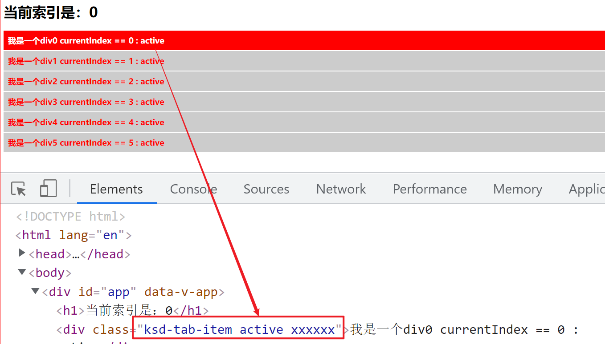

# v-bind处理样式 Class 与 Style 绑定

## 分析

```html
<div class="divclass" style="color:red;font-size:18px;">我是一个div</div>
```

- class	是样式列表属性
- style    是行内样式属性


## Vue的思考

- vue 对class和style都做特殊处理。
- 解决动静拼接过程中，空格问题，和逻辑处理的问题。

## 根据v-bind的动静拼接实现选中效果

```html
<!doctype html>
<html lang="en">
<head>
    <meta charset="UTF-8">
    <meta name="viewport"
          content="width=device-width, user-scalable=no, initial-scale=1.0, maximum-scale=1.0, minimum-scale=1.0">
    <meta http-equiv="X-UA-Compatible" content="ie=edge">
    <title>11、 v-bind处理样式 Class 与 Style 绑定</title>
    <style>
        .ksd-tab-item{color:red;font-size:18px;font-weight: 700;background:#ccc;padding:10px;margin: 2px 0}
        .ksd-tab-item.active{background: #ff0000;color:#fff;}
        .ksd-tab-item:hover{background:#000;color:#fff;}

    </style>
</head>
<body>

    <div id="app">
        <h1>当前索引是：{{currentIndex}}</h1>
        <div :class="'ksd-tab-item ' + (currentIndex == 0 ?'active' : '')  " @click="clickme(0)">我是一个div0 currentIndex == 0 : active</div>
        <div :class="'ksd-tab-item ' + (currentIndex == 1 ?'active' : '')" @click="clickme(1)">我是一个div1 currentIndex == 1 : active</div>
        <div :class="'ksd-tab-item ' + (currentIndex == 2 ?'active' : '')" @click="clickme(2)">我是一个div2 currentIndex == 2 : active</div>
        <div :class="'ksd-tab-item ' + (currentIndex == 3 ?'active' : '')" @click="clickme(3)">我是一个div3 currentIndex == 3 : active</div>
        <div :class="'ksd-tab-item ' + (currentIndex == 4 ?'active' : '')" @click="clickme(4)">我是一个div4 currentIndex == 4 : active</div>
        <div :class="'ksd-tab-item ' + (currentIndex == 5 ?'active' : '')" @click="clickme(5)">我是一个div5 currentIndex == 5 : active</div>
    </div>

    <script src="js/vue.global.js"></script>
    <script>
        var vue = Vue.createApp({
            data(){
                return {
                    currentIndex:0,
                    itemclass:"active"
                }
            },
            methods:{
                clickme(index){
                    this.currentIndex = index;
                }
            }
        }).mount("#app");

    </script>


</body>
</html>
```


## vue 对class和style都做特殊处理。

> 提示：无论是数组的方式还是对象的方式，都在解决动静class和style拼接的问题。

### 数组的方式

```html
<!doctype html>
<html lang="en">
<head>
    <meta charset="UTF-8">
    <meta name="viewport"
          content="width=device-width, user-scalable=no, initial-scale=1.0, maximum-scale=1.0, minimum-scale=1.0">
    <meta http-equiv="X-UA-Compatible" content="ie=edge">
    <title>11、 v-bind处理样式 Class 与 Style 绑定</title>
    <style>
        .ksd-tab-item{color:red;font-size:18px;font-weight: 700;background:#ccc;padding:10px;margin: 2px 0}
        .ksd-tab-item.active{background: #ff0000;color:#fff;}
        .ksd-tab-item:hover{background:#000;color:#fff;}

    </style>
</head>
<body>

    <div id="app">
        <h1>当前索引是：{{currentIndex}}</h1>
        <div class="ksd-tab-item" :class="[currentIndex == 0 ?'active' : '',itemclass]" @click="clickme(0)">我是一个div0 currentIndex == 0 : active</div>
        <div class="ksd-tab-item" :class="[currentIndex == 1 ?'active' : '']" @click="clickme(1)">我是一个div1 currentIndex == 1 : active</div>
        <div class="ksd-tab-item" :class="[currentIndex == 2 ?'active' : '']" @click="clickme(2)">我是一个div2 currentIndex == 2 : active</div>
        <div class="ksd-tab-item" :class="[currentIndex == 3 ?'active' : '']" @click="clickme(3)">我是一个div3 currentIndex == 3 : active</div>
        <div class="ksd-tab-item" :class="[currentIndex == 4 ?'active' : '']" @click="clickme(4)">我是一个div4 currentIndex == 4 : active</div>
        <div class="ksd-tab-item" :class="[currentIndex == 5 ?'active' : '']" @click="clickme(5)">我是一个div5 currentIndex == 5 : active</div>
    </div>

    <script src="js/vue.global.js"></script>
    <script>
        var vue = Vue.createApp({
            data(){
                return {
                    currentIndex:0,
                    itemclass:"xxxxxx"
                }
            },
            methods:{
                clickme(index){
                    this.currentIndex = index;
                }
            }
        }).mount("#app");

    </script>


</body>
</html>
```




### 对象的方式

```html
<!doctype html>
<html lang="en">
<head>
    <meta charset="UTF-8">
    <meta name="viewport"
          content="width=device-width, user-scalable=no, initial-scale=1.0, maximum-scale=1.0, minimum-scale=1.0">
    <meta http-equiv="X-UA-Compatible" content="ie=edge">
    <title>11、 v-bind处理样式 Class 与 Style 绑定</title>
    <style>
        .ksd-tab-item{color:red;font-size:18px;font-weight: 700;background:#ccc;padding:10px;margin: 2px 0}
        .ksd-tab-item.active{background: #ff0000;color:#fff;}
        .ksd-tab-item:hover{background:#000;color:#fff;}

    </style>
</head>
<body>

    <div id="app">
        <h1>当前索引是：{{currentIndex}}</h1>
        <div class="ksd-tab-item" :class="{'active':currentIndex == 0,'xxxxxx':xxxflag}" @click="clickme(0)">我是一个div0 currentIndex == 0 : active</div>
        <div class="ksd-tab-item" :class="{'active':currentIndex == 1,'xxxxxx':xxxflag}" @click="clickme(1)">我是一个div1 currentIndex == 1 : active</div>
        <div class="ksd-tab-item" :class="{'active':currentIndex == 2,'xxxxxx':xxxflag}" @click="clickme(2)">我是一个div2 currentIndex == 2 : active</div>
        <div class="ksd-tab-item" :class="{'active':currentIndex == 3,'xxxxxx':xxxflag}" @click="clickme(3)">我是一个div3 currentIndex == 3 : active</div>
        <div class="ksd-tab-item" :class="{'active':currentIndex == 4,'xxxxxx':xxxflag}" @click="clickme(4)">我是一个div4 currentIndex == 4 : active</div>
        <div class="ksd-tab-item" :class="{'active':currentIndex == 5,'xxxxxx':xxxflag}" @click="clickme(5)">我是一个div5 currentIndex == 5 : active</div>
    </div>

    <script src="js/vue.global.js"></script>
    <script>
        var vue = Vue.createApp({
            data(){
                return {
                    currentIndex:0,
                    xxxflag:true
                }
            },
            methods:{
                clickme(index){
                    this.currentIndex = index;
                }
            }
        }).mount("#app");

    </script>


</body>
</html>
```

### 总结

- 千万不要纠结，到底用哪个，爱用哪个用哪个
- 建议大家先用熟一种，然后在学习另外一种。推荐：数组方式


