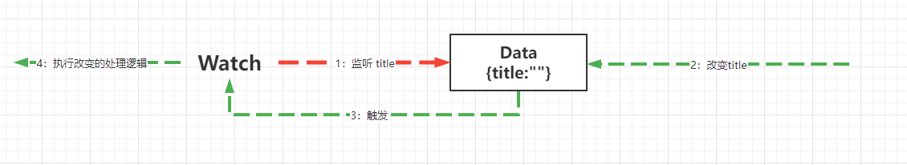
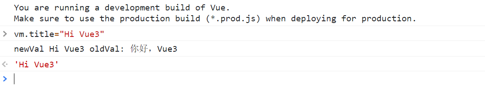
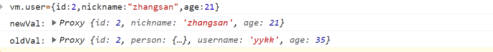
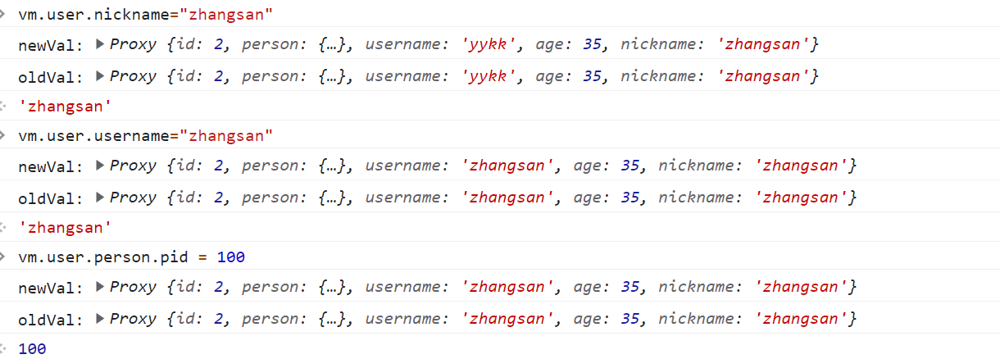

# Vue的监听器Wacth

watch用于侦听data的数据。
当data数据发生变化时，执行函数。这个函数会传入两个参数，分别是newVal和oldVal。
watch属性可以是字符串、函数、对象、数组
拥有deep（对象深度监听），immediate（vue初始化完毕立即出发。默认是不会，）两属性


## Vue的实例Demo

```html
<!doctype html>
<html lang="en">
<head>
    <meta charset="UTF-8">
    <meta name="viewport"
          content="width=device-width, user-scalable=no, initial-scale=1.0, maximum-scale=1.0, minimum-scale=1.0">
    <meta http-equiv="X-UA-Compatible" content="ie=edge">
    <title>Vue的监听器Wacth</title>
</head>
<body>

    <div id="app">
        <h1>{{title}}</h1>
    </div>

    <script src="js/vue.global.js"></script>

    <script>
        var vm = Vue.createApp({
            data(){
                return {
                    title:"你好，Vue3"
                }
            }
        }).mount("#app");
    </script>

</body>
</html>
```


## watch用于侦听data的数据。



当data数据发生变化时，执行函数。这个函数会传入两个参数，分别是newVal和oldVal。

- newVal：改变以后的值
- oldVal：改变之前的值

```js
 var vm = Vue.createApp({
        data() {
            return {
                title: "你好，Vue3"
            }
        },
        watch: {
            title(newVal, oldVal) {
                console.log("newVal", newVal, "oldVal:", oldVal)
            }
        }
    }).mount("#app");
```




## deep

deep：深度的含义。

### 为什么会有deep这种东西存在

- 在vue的data数据结构中，不仅仅只有字符串，数字，日期等，还有：对象，数组。函数等

- 默认情况下：vue并没有对对象改变数据的监听进行处理。==只对自身覆盖会进行监听==

- 

  

- 但是，直接对象改变属性并不会监听。因为vue默认是关闭改变属性的监听。为什么呢？考虑到性能的问题。因为对象改变属性是非常频繁的操作。而且深度是不可控，如果你要去监听。自己手动开启这对象的深度监听：deep：true

###  deep如果编写和监听呢？

```html
<!doctype html>
<html lang="en">
<head>
    <meta charset="UTF-8">
    <meta name="viewport"
          content="width=device-width, user-scalable=no, initial-scale=1.0, maximum-scale=1.0, minimum-scale=1.0">
    <meta http-equiv="X-UA-Compatible" content="ie=edge">
    <title>Vue的监听器Wacth</title>
</head>
<body>

<div id="app">
    <h1>{{title}}</h1>
    <h1>{{user.id}}==={{user.username}}==={{user.age}}</h1>
    <h3>{{user.person.pid}}</h3>
</div>

<script src="js/vue.global.js"></script>

<script>
    var vm = Vue.createApp({
        data() {
            return {
                title: "Hello",
                user: {
                    id: 1,
                    person: {pid: 1},
                    username: "yykk",
                    age: 35
                }
            }
        },
        watch: {
            title: function (newv, oldv) {
                console.log("newv:", newv)
                console.log("oldv:", oldv)
            },
            user: {
                handler: function (newVal, oldVal) {
                    console.log("newVal:", newVal)
                    console.log("oldVal:", oldVal)
                },
                deep: true
            },

        }
    }).mount("#app");
</script>

</body>
</html>
```

从测试得出结论：不论对象层级多深都会监听。比如：vm.user.id、vm.user.person.pid =100，如下：



 

## immediate

- immediate= false (默认值) 请注意：watch默认情况下，不会立即去加载监听的对象的处理函数。它一定要改变data的值才会触发。
- immediate=true,只要vue一加载完毕马上就要触发一次。（默认一定加载一次）。

```html
<!doctype html>
<html lang="en">
<head>
    <meta charset="UTF-8">
    <meta name="viewport"
          content="width=device-width, user-scalable=no, initial-scale=1.0, maximum-scale=1.0, minimum-scale=1.0">
    <meta http-equiv="X-UA-Compatible" content="ie=edge">
    <title>Vue的监听器Wacth</title>
</head>
<body>

<div id="app">
    <h1>{{title}}</h1>
    <h1>{{user.id}}==={{user.username}}==={{user.age}}</h1>
    <h3>{{user.person.pid}}</h3>
</div>

<script src="js/vue.global.js"></script>

<script>
    var vm = Vue.createApp({
        data() {
            return {
                title: "Hello",
                user: {
                    id: 1,
                    person: {pid: 1},
                    username: "yykk",
                    age: 35
                }
            }
        },
        created(){
          console.log(111111111111111)
        },
        watch: {
            title: function (newv, oldv) {
                console.log("newv:", newv)
                console.log("oldv:", oldv)
            },
            user: {
                handler: function (newVal, oldVal) {
                    console.log("newVal:", newVal)
                    console.log("oldVal:", oldVal)
                },
                deep: true,
                immediate:false // 默认不会立即加载一定改变才会触发和执行 ，如果你想立即加载，请修改为true
            },

        }
    }).mount("#app");
</script>

</body>
</html>
```


## watch有什么用处呢？

查看视频，登录案例


