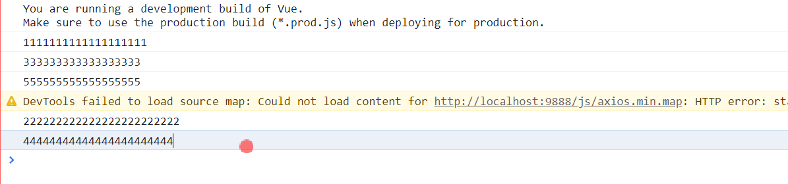

#  关于ajax异步的问题


## js代码

```js
function loadCollect1(){
	console.log("11111111")
}

function loadCollect2(){
	console.log("2222222")
}

function created(){
   loadCollect1();
   loadCollect2();
}

created();
```

- 默认情况下，js也是一种串行执行。

## Java中执行代码的顺序是什么？

```java
public static void loadCollect1(){
	System.out.println("11111111")
}

public static void loadCollect2(){
	System.out.println("2222222")
}

public static void created(){
   loadCollect1();
   loadCollect2();
}


created();
```

- java程序默认的执行规则是：自上而下运行。也就是一种串行执行。
- 除非，你用多线程去执行，那么就并行执行，如下：

```java
 public static void created(){
    new Thread(()->{ loadCollect1();}).start();
    new Thread(()->{ loadCollect2();}).start();
}
```


##  ajax异步执行顺序的问题

ajax一种异步非阻塞的一种并行执行方式。

```JS
 // 生命周期
 created() {
     this.loadCollect1();
     this.loadCollect2();
 },

methods: {
    loadCollect1(){
        axios.get("/api/collect/load").then(res=>{
         console.log("1111111");
        })
    },

    loadCollect2(){
        axios.get("/api/collect/load").then(res=>{
            console.log("222222");
        })
    }
}
```

问：上面this.loadCollect1()和this.loadCollect2(); 其实都属于异步请求执行：它们的执行顺序是什么？

### 如何证明呢？

```js
// 生命周期
    created() {
        // 1: 执行收藏夹数据的初始化
        console.log("1111111111111111111")
        this.loadCollect1();
        console.log("333333333333333333")
        this.loadCollect2();
        console.log("555555555555555555")
    },

    methods: {

        loadCollect1(){
            axios.get("/api/collect/load").then(res=>{
                console.log("222222222222222222222222");
            })
        },

        loadCollect2(){
            axios.get("/api/collect/load").then(res=>{
                console.log("44444444444444444444444");
            })
        },
}
```

- 如果上面执行的顺序是：1,2,3,4,5说明是串行执行，但是很遗憾的告诉，ajax异步非阻塞的方式。所以输出的结果并不是1,2,3,4,5而是如下：



- 通过上面分析得出结论，异步请求是一种并行执行，不会阻塞代码。这样告诉程序开发人员，在开发中不要再闹如下的笑话：

```js
 created() {
        // 1: 执行收藏夹数据的初始化
        this.loadCollect1();
        console.log(this.pageNo);//这里是拿不到 loadCollect1();的pageNo
        console.log(this.total); //这里是拿不到 loadCollect1();的total
        this.loadCollect2();
    },

    methods: {

        loadCollect1(){
            axios.get("/api/collect/load").then(res=>{
                this.pageNo = res.data.pageNo;
                this.total = res.data.total;
            })
        },

        loadCollect2(){
            axios.get("/api/collect/load").then(res=>{
                console.log("44444444444444444444444");
            })
        },
   }
```

上面的的代码

```js
console.log(this.pageNo);//这里是拿不到 loadCollect1();的pageNo
console.log(this.total); //这里是拿不到 loadCollect1();的total
```

是获取不到的，因为就ajax是异步非阻塞的方式。


## 如何解决和获取这个内容和值呢？

### 第一种解决方案：直接在方法中的回调去获取

```js

loadCollect1(){
    axios.get("/api/collect/load").then(res=>{
        console.log("222222222222222222222222");
        this.pageNo = res.data.pageNo;
        this.total = res.data.total;
        // 如果你执行loadCollect1行为以后，就一定要在这里去编写 nodejs
        this.saveLog(this.pageNo,this.pageSize);
    })
},

saveLog(pno,psize){
   console.log(pno,psize)
},

```

分析，上面代码存在什么问题

- 耦合度很高
- 存在代码污染

### 第二种解决方案：用函数（行为）入参，回调函数

- 行为入参，就是解决函数的隔离，和行为执行延续的问题
- 这样可以节耦合度和代码污染的问题。

```java
created() {
        this.loadCollect1(res =>{
            this.saveLog(res.pageNo,res.pageSize);
        });
    
        this.loadCollect2();
    },

    methods: {

        loadCollect1(callbackFn){
            axios.get("/api/collect/load").then(res=>{
                this.pageNo = res.data.pageNo;
                this.total = res.data.total;
                // 如果你执行loadCollect1行为以后，就一定要在这里去编写 nodejs
                if(callbackFn) {
                    callbackFn(res);
                }
            })
        },

        saveLog(pno,psize){
            console.log(pno,psize)
        }

```


### 第三种解决方案：async + await 

- await promise; +async

```js
	// 生命周期
   async created() {
        try {
            console.log(1111);
            var res1 = await this.loadCollect1();
            console.log(22222,res1);
            this.saveLog(res1.pageNo, res1.pageSize);
            console.log(33333);
            var res2 = await this.loadCollect2();
            console.log(44444,res2);
        }catch (e) {
                
        }
    },
        

    methods: {

        loadCollect1(callbackFn) {
            return axios.get("/api/collect/load");
        },

        saveLog(pno, psize) {
            console.log(pno, psize)
        },

        loadCollect2() {
            return axios.get("/api/collect/load");
        }
  }
```

Nodejs

```js
consts fs = required("fs")

function readFile(){
	fs.readFile("d:/a.txt",{},(err,res)=>{
		if(err)throw err;
		console.log(res);
	})
	
	fs.readFile("d:/b.txt",{},(err,res)=>{
		if(err)throw err;
		console.log(res);
	})
}


function readFile(file){
   return new Promise((resolve,reject)=>{
    	fs.readFile(file,{},(err,res)=>{
            if(err)reject(err);
            resolve(res);
        })   
   }) 
}

async function hebingfile(){
    var acontent = await readFile("d:/a.txt");
	var bcontent = await readFile("d:/b.txt");
    console.log(acontent,bcontent)
}
```


