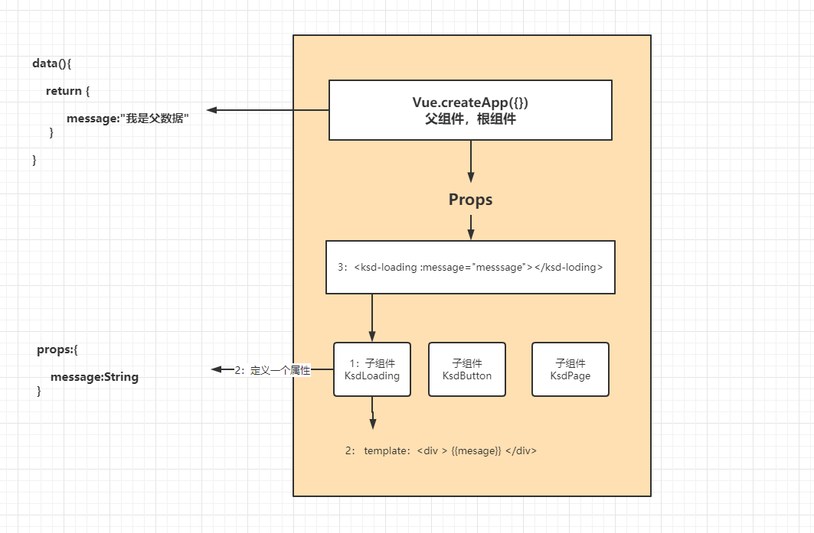

# 关于父子组件之间的通讯-自定义事件$emit


## 01、分析 -- 父传递数据给子

在前面的学习其实已经明白可以通过props（自定义属性）机制，可以达到父组件向子组件传递数据目的。



- 上面的message一定要用v-bind属性，否则就是是一个文本


##  02、为什么要出现$emit这个玩意？

分析下面代码

```js
<!doctype html>
<html lang="`en`">
<head>
    <meta charset="UTF-8">
    <meta name="viewport"
          content="width=device-width, user-scalable=no, initial-scale=1.0, maximum-scale=1.0, minimum-scale=1.0">
    <meta http-equiv="X-UA-Compatible" content="ie=edge">
    <title>B-Vue组件的-关于父子组件的通讯的问题$emit.html</title>
    <link rel="stylesheet" href="css/ksdui.css">
    <style>
        .loadingbox{text-align: center}
    </style>
</head>
<body>
    <div id="app">
        <ksd-load-more></ksd-load-more>
    </div>

    <script src="js/vue.global.js"></script>
    <script>
        // 1: 创建一个vue实例 ---------- 父组件
        var app = Vue.createApp({
            data(){
                return {
                }
            }
        });

        // 3: 注册组件 ------------------------子组件
        app.component("KsdLoadMore",{
            template:`<div><button @click="loadMore">加载更多</button></div>`,
            methods:{
                loadMore(){
                    console.log("加载用户")
                    axios.post("/api/user/load").then(res=>{
                        
                    })
                }
            }
        });

        // 2: 挂载节点
        app.mount("#app");
    </script>

</body>
</html>
```

### 分析

- 问题1：定义组件的目的是复用。但是你发现上面的组件代码，其实就为用户页面服务，其实是没有意义，如果我课程列表，文章列表页面也需要这个组件，这个组件就不能使用在这些页面中，失去组件的复用性。

- 问题2：子组件有自己数据模型，父组件也有自己数据模型，上面假设在loadMore是成立的。那问题是什么：我们在查询用户信息。你是不是要子组件中数据查询出来赋值给父组件的数据。如果你不赋值有没有解决方案呢？

  - 就是把页面中所有的，视图控制交给组件如下：

    ```js
    // 3: 注册组件 ------------------------子组件
            app.component("KsdLoadMore",{
                template:`<div> <p v-for="(user,index) in user" :key="user.id">
                  <span></span>
                </p><button @click="loadMore">加载更多</button></div>`,
                data(){
                    return {
                        users:[]
                    }
                },
                methods:{
                    loadMore(){
                        console.log("加载用户")
                        axios.post("/api/user/load").then(res=>{
                        	this.usres = res.data.data;
                        })
                    }
                }
            });
    ```


### 总结

分析：在实际开发中，组件起到辅助和通用的作用，其实很多时候，我们还要通过子组件行为把数据上报给父组件，通过触发子组件的行为，去改变父组件的数据模型，从而达到子向父元素传递数据的目的。通过$emit的自定义事件的方式来完成。


## 03、如何理解$emit呢？

> 从父组件传递一个行为给子组件，去通过 $emit去触发和调用。

理解：它其实就是一种行为入参的一种机制，其实就是回调函数，也称之为行为入参。

作用：可以得到通过子组件触发行为给==把子组件的数据传递给父组件==和==触发父事件==。


## 04、通过$parent获取父元素的作用域

### 直接通过this.$parent 获取父组件的引用

```html
<!doctype html>
<html lang="`en`">
<head>
    <meta charset="UTF-8">
    <meta name="viewport"
          content="width=device-width, user-scalable=no, initial-scale=1.0, maximum-scale=1.0, minimum-scale=1.0">
    <meta http-equiv="X-UA-Compatible" content="ie=edge">
    <title>B-Vue组件的-关于父子组件的通讯的问题$emit.html</title>
    <link rel="stylesheet" href="css/ksdui.css">
    <style>
        .loadingbox{text-align: center}
    </style>
</head>
<body>
    <div id="app">
        <p v-for="(user,index) in parentUsers" :key="user.id">
            <span>{{user}}</span>
        </p>
        <ksd-load-more @="loadMoreUsers"></ksd-load-more>
    </div>

    <script src="js/vue.global.js"></script>
    <script>
        // 1: 创建一个vue实例 ---------- 父组件
        var app = Vue.createApp({
            data(){
                return {
                    parentUsers:[]
                }
            },
            methods:{
                loadMoreUsers(users){
                    this.parentUsers = users;
                }
            }
        });

        // 3: 注册组件 ------------------------子组件
        app.component("KsdLoadMore",{
            template:`<div><button @click="loadMore">加载更多</button></div>`,
            methods:{
                loadMore(){
                    //直接通过$parent调用父组件的属性
                    //this.$parent.parentUsers = [{id:1,name:"lisi"}]
                    //直接通过$parent调用父组件的行为函数
                    this.$parent.loadMoreUsers([{id:1,name:"lisi"}])
                }
            }
        });

        // 2: 挂载节点
        app.mount("#app");
    </script>

</body>
</html>
```

- 上面通过 $parent的方式是可以获取到父组件的行为，但是未来会出现组件的嵌套的时候，很多时候$paren产生误解和歧义。
- 上面代码通过 $parent的方式，代码属于一种耦合的写法。


## 05、$emit的解决方案

- 就是解决$parent耦合的问题

### 如何认识和理解呢？

- 其实它就是把父元素的行为当做属性传递进行。其实就是一种行为入参

### $emit格式

```js
this.$emit("自定义事件名",参数1,参数2,参数3,参数......参数N);
## 建议如果多个参数传递对象或者数据
this.$emit("自定义事件名",{key:value,....});
```

- 上面的参数是给，执行父组件的行为的传递的.

### $emit定义的三部曲

- 1、定义一个父元素的事件行为
- 2、然后用一个自定义事件的名字去接收，在组件上进行接收和处理
- 3、然后在子组件中通过$emit("自定事件的名字",参数);去触发父组件的行为

```html
<!doctype html>
<html lang="`en`">
<head>
    <meta charset="UTF-8">
    <meta name="viewport"
          content="width=device-width, user-scalable=no, initial-scale=1.0, maximum-scale=1.0, minimum-scale=1.0">
    <meta http-equiv="X-UA-Compatible" content="ie=edge">
    <title>B-Vue组件的-关于父子组件的通讯的问题$emit.html</title>
    <link rel="stylesheet" href="css/ksdui.css">
    <style>
        .loadingbox{text-align: center}
    </style>
</head>
<body>
    <div id="app">
        <p v-for="(user,index) in parentUsers" :key="user.id">
            <span>{{user}}</span>
        </p>
        <ksd-load-more @loadmore="loadMoreUsers"></ksd-load-more>
    </div>

    <script src="js/vue.global.js"></script>
    <script>
        // 1: 创建一个vue实例 ---------- 父组件
        var app = Vue.createApp({
            data(){
                return {
                    parentUsers:[]
                }
            },
            methods:{
                loadMoreUsers(users){
                    this.parentUsers = users;
                }
            }
        });

        // 3: 注册组件 ------------------------子组件
        app.component("KsdLoadMore",{
            template:`<div><button @click="loadMore">加载更多</button></div>`,
            methods:{
                loadMore(){
                    this.$emit("loadmore",[{id:1,name:"lisi"}]);
                }
            }
        });

        // 2: 挂载节点
        app.mount("#app");
    </script>

</body>
</html>
```

- 为什么要自定义事件名呢？因为如果不自定义事件名的话，会和html自身提供的事件名出现冲突。防止和默认一些事件名出现撞车，比如：click .dblclick,mousedown等。

## 06、总结

- 父想子传递数据是用-props
- 子向父传递数据是用行为：$emit(自定义名字,参数....)


