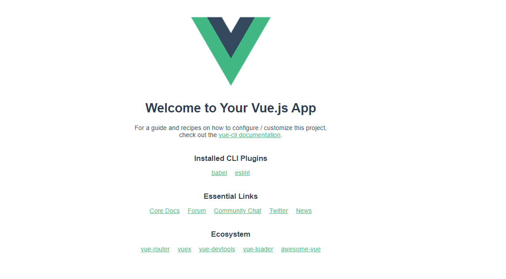

# 组件封装

## 组件特点

- 复用性


## 组件

-  按钮组件
- 分页组件
- comobox组件
- loading组件
- 表格组件  + 表格树(递归) + 插槽


## 组件的三部曲

- 实例vue
- 注册组件
  - 遵循驼峰命名。使用用-的方式
- 使用组件


##  组件封装应用脚手架

官网网址：https://cli.vuejs.org/zh/guide/installation.html

### Node 版本要求

Vue CLI 4.x 需要 [Node.js](https://nodejs.org/) v8.9 或更高版本 (推荐 v10 以上)。你可以使用 [n](https://github.com/tj/n)，[nvm](https://github.com/creationix/nvm) 或 [nvm-windows](https://github.com/coreybutler/nvm-windows) 在同一台电脑中管理多个 Node 版本。

因为npm是国外的镜像，下载依赖比较慢，它就类同java中maven。怎么解决慢的问题呢？你可以考虑安装淘宝镜像cnpm如下：

cnpm官网：https://npmmirror.com/

```html
$ npm install -g cnpm --registry=https://registry.npmmirror.com
```

### 01、安装vue-cli

```js
npm install -g @vue/cli
# OR
yarn global add @vue/cli
# OR
cnpm install -g @vue/cli
```

上面其实就和我们安装jdk一个意思。必须安装vue-cli脚手架的依赖库，才可以去进行开发和运行前端vue项目。

### 02、查看vue版本

```js
vue -version
```

### 03、更新你电脑的vue-cli

```js
npm update -g @vue/cli
```


## 05、创建一个 vue项目

官网：https://cli.vuejs.org/zh/guide/creating-a-project.html

###05-01、vue create

```vue
vue create hello-world
```

###05-01、使用图形化界面(推荐)

```vue
vue ui
```




##06、定义组件的部署

组件理解：其实组件本应该是页面本身的一部分，然后我们只不过通过一种封装的思想进行抽离变成通用的逻辑。

### 06-01、定义组件

在vue-cli项目中的components定义KsdLoading.vue组件，如下：

```html
<template>
   <div class="loadingbox">
        <div v-if="loadType==2">{{loadText[2]}}</div>
        <div v-if="loadType==1">{{loadText[1]}}</div>
        <div v-if="loadType==0">{{loadText[0]}}</div>
        <div v-if="loadType==0">
        <div class="spinner2" :style='{"background":bgclor}' v-if="ctype==2"></div>
        <div class="spinner"  v-if="ctype==1">
            <div class="spinner-container container1">
            <div class="circle1" :style='{"background":bgclor}'></div>
            <div class="circle2" :style='{"background":bgclor}'></div>
            <div class="circle3" :style='{"background":bgclor}'></div>
            <div class="circle4" :style='{"background":bgclor}'></div>
            </div>
            <div class="spinner-container container2">
            <div class="circle1" :style='{"background":bgclor}'></div>
            <div class="circle2" :style='{"background":bgclor}'></div>
            <div class="circle3" :style='{"background":bgclor}'></div>
            <div class="circle4" :style='{"background":bgclor}'></div>
            </div>
            <div class="spinner-container container3">
            <div class="circle1" :style='{"background":bgclor}'></div>
            <div class="circle2" :style='{"background":bgclor}'></div>
            <div class="circle3" :style='{"background":bgclor}'></div>
            <div class="circle4" :style='{"background":bgclor}'></div>
            </div>
        </div>
        </div>
    </div>
</template>

<script>
export default {
  name: 'KsdLoading',
  props:{
        ctype:{
            type:Number,
            default:1
        },
        bgclor:{
            type:String,
            default:"#171915"
        },
        loadType:{
            type:Number,
            default:0
        },
        loadText:{
            type:Array,
            default(){
                return ["数据加载中...","数据加载完毕...","亲，我是有底线的..."]
            }
        }
    }
}
</script>


<style scoped>
/*loadig*/
.spinner {
    margin: 20px auto;
    width: 20px;
    height: 20px;
    position: relative;
}

.container1 > div, .container2 > div, .container3 > div {
    width: 6px;
    height: 6px;
    background-color: #333;

    border-radius: 100%;
    position: absolute;
    -webkit-animation: bouncedelay 1.2s infinite ease-in-out;
    animation: bouncedelay 1.2s infinite ease-in-out;
    -webkit-animation-fill-mode: both;
    animation-fill-mode: both;
}

.spinner .spinner-container {
    position: absolute;
    width: 100%;
    height: 100%;
}

.container2 {
    -webkit-transform: rotateZ(45deg);
    transform: rotateZ(45deg);
}

.container3 {
    -webkit-transform: rotateZ(90deg);
    transform: rotateZ(90deg);
}

.circle1 { top: 0; left: 0; }
.circle2 { top: 0; right: 0; }
.circle3 { right: 0; bottom: 0; }
.circle4 { left: 0; bottom: 0; }

.container2 .circle1 {
    -webkit-animation-delay: -1.1s;
    animation-delay: -1.1s;
}

.container3 .circle1 {
    -webkit-animation-delay: -1.0s;
    animation-delay: -1.0s;
}

.container1 .circle2 {
    -webkit-animation-delay: -0.9s;
    animation-delay: -0.9s;
}

.container2 .circle2 {
    -webkit-animation-delay: -0.8s;
    animation-delay: -0.8s;
}

.container3 .circle2 {
    -webkit-animation-delay: -0.7s;
    animation-delay: -0.7s;
}

.container1 .circle3 {
    -webkit-animation-delay: -0.6s;
    animation-delay: -0.6s;
}

.container2 .circle3 {
    -webkit-animation-delay: -0.5s;
    animation-delay: -0.5s;
}

.container3 .circle3 {
    -webkit-animation-delay: -0.4s;
    animation-delay: -0.4s;
}

.container1 .circle4 {
    -webkit-animation-delay: -0.3s;
    animation-delay: -0.3s;
}

.container2 .circle4 {
    -webkit-animation-delay: -0.2s;
    animation-delay: -0.2s;
}

.container3 .circle4 {
    -webkit-animation-delay: -0.1s;
    animation-delay: -0.1s;
}

@-webkit-keyframes bouncedelay {
    0%, 80%, 100% { -webkit-transform: scale(0.0) }
    40% { -webkit-transform: scale(1.0) }
}

@keyframes bouncedelay {
    0%, 80%, 100% {
        transform: scale(0.0);
        -webkit-transform: scale(0.0);
    } 40% {
          transform: scale(1.0);
          -webkit-transform: scale(1.0);
      }
}


.spinner2 {
    width: 24px;
    height: 24px;
    background-color: #67CF22;
    margin: 20px auto;
    -webkit-animation: rotateplane 1.2s infinite ease-in-out;
    animation: rotateplane 1.2s infinite ease-in-out;
}

@-webkit-keyframes rotateplane {
    0% { -webkit-transform: perspective(120px) }
    50% { -webkit-transform: perspective(120px) rotateY(180deg) }
    100% { -webkit-transform: perspective(120px) rotateY(180deg)  rotateX(180deg) }
}

@keyframes rotateplane {
    0% {
        transform: perspective(120px) rotateX(0deg) rotateY(0deg);
        -webkit-transform: perspective(120px) rotateX(0deg) rotateY(0deg)
    } 50% {
          transform: perspective(120px) rotateX(-180.1deg) rotateY(0deg);
          -webkit-transform: perspective(120px) rotateX(-180.1deg) rotateY(0deg)
      } 100% {
            transform: perspective(120px) rotateX(-180deg) rotateY(-179.9deg);
            -webkit-transform: perspective(120px) rotateX(-180deg) rotateY(-179.9deg);
        }
}

</style>
```

### 06-02、组件的导入

比如在页面 Aboute.vue或者UserList.vue需要组件的话，进行依赖导入即可，如下：


js部分

```js
import KsdLoading from '@/components/KsdLoading.vue'
export default {
  name: 'UserList',
  // page module 组件
  components: {
    KsdLoading
  }
}
```

- 导入 import KsdLoading from '@/components/KsdLoading.vue'
- 注册  `components: {
      KsdLoading
    }`

页面部分

```html
<template>
  <div class="userlist">
    <h1>我是用户列表</h1>
    <p v-for="(user) in users" :key="user.id">
        <span>{{user.id}}===={{user.name}}</span>
    </p>

    <ksd-loading/>   
  </div>
</template>
```


## 07、导入通用的css

在项目中的App.vue页面中进行导入即可

```html
<template>
  <div id="nav">
    <router-link to="/">Home</router-link> |
    <router-link to="/about">About</router-link> | 
    <router-link to="/userlist">用户列表</router-link>
  </div>
  <router-view/>
</template>

<style>
@import url('/css/ksdui.css');
/*其他csss*/
</style>
```


