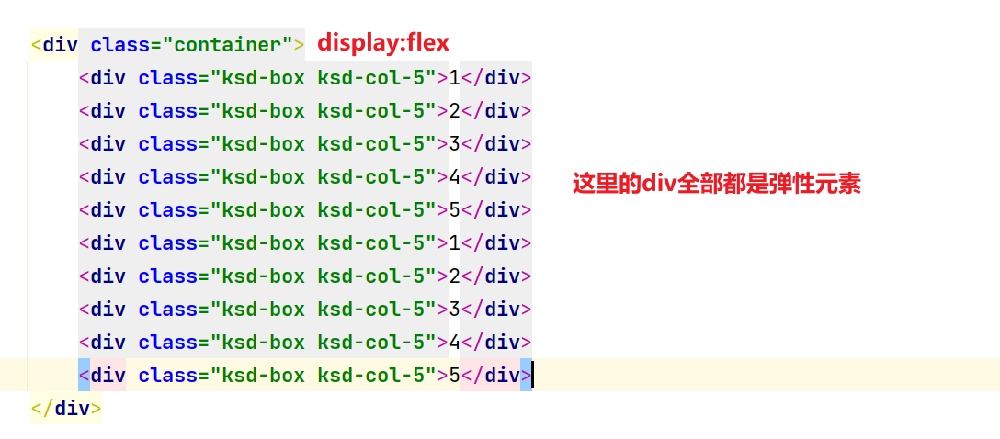

# 谈谈前端的布局Layout


## 分析

不论你学习bootstrap，layui还是elementui它们第个组件都是：布局


## 布局 

- 浮动布局 + 间距(margin)
- 定位布局 
- 弹性布局
- 栅栏布局 & 网格布局(Grid)


## 布局概念 -  可视区域


实现原理css如下：

html部分

```html
  <div class="container"></div>
```

css部分

固定宽度写法：

```css
.container{
    width: 1200px;
    margin: 0 auto;
}
```

随着浏览器像素（宽度和高度）的变化，它是不会发生任何概念，如果像素小于<1200的时候，会出滚动条。

弹性宽度写法：

```css
.container{
    max-width: 1200px;
    margin: 0 auto;
}
```

随着浏览器像素（宽度和高度）的变化，它是不会发生任何概念，如果像素小于<1200的时候，元素就自动按照百分比来进行计算了 width:100%

百分比写法：（不推荐）

```
.container{
    width: 90%;
    margin: 0 auto;
}
```

- 为什么不用，网站的图片宽度和高度是固定，250 10k * 4 = 1200 

  - 如果你当前电脑的分比率是4540  * 90% = 4000px  ==1000 * 4 100kb

- 场景：

- ```html
  <div class="box" style="width:960px;"> 
  	<div class="box2" style="width:100%"></div>	
  </div>
  ```


## 像素

- 有人的电脑看网站看很舒服
- 但是一旦到我们笔记本，低分率的电脑，感觉好大一个

其实是一样大，视觉误差，误差来源就因为旁边的留白和像素的颗粒大小的原因造成。高分辨率的每格子的像素是非常小，所以你看小去就觉得网站字体，图片都很小。反之。

比如当前分比率是：2540 * 1080

800  1200  800

比如当前分比率是：1920 * 1080

350 1200  350

比如当前分比率是：1376 *  768

120 1200  120


## 标签

- 块级元素  (布局 div + section+content+header+footer+articel)  == display:block
- 行内块级元素 （不适合布局 input img） == display:inline-block 
- 行内元素 （不适合布局）(span,a,i,code,pre) == display:inline

## 布局的样式

display: block|flex|table|grid|inline-block|inline

- 默认块级元素就是：block ，不需要指定
  - 独占文档流
  - 受到宽度和高度的影响
  - 会收到padding和margin的影响
- 默认行内块级元素是：inline
  - 一般行内标签它是用修饰文字图片，它不会独占文档流，随波逐流
  - 会收到padding和margin-left/right的
  - 它不收到宽度和高度的影响，内容多宽多高，块级元素就多宽多高，如果你去指定宽度高度，将会被忽略，除非你升级。
- inline-block (布局决定不会用它)
  - 告诉未来如果你想快速把一个块级元素降级，受到宽度和高度的影响。
  - 或者未来你想把一个行内元素进行升级，受到宽度和高度影响。
  - 会收到padding和margin-left/right的影响
  - 在实际开发中，一般专业前端是不会用它。以为你这个存在间隙

## 边距

- 外边距 margin (布局) 
  - 元素与元素直接，两个至少两个以上间隙 `<div></div> <div></div>`
- 内边距 padding
  - 元素本身的内部的间距，`<div>`
- 不论是内部边距还是外布局，==都会影响布局，宽度和高度都会计算在内==。

### 边距的写法

方向：上-->右---下---左

```css
# 单个写
padding-top:10px
padding-right:10px
padding-bottom:10px
padding-left:10px
# 如果值不相同
padding:10px 1px 41px 2px;
# 如果值相同
padding:10px;  
# 上下相同，左右相同
padding:10px 20px;  ---- top/bottom:10px;  left/right:20px;
# 上下不同，左右相同
padding: 10px 20px 1px; top:10px   left/right:20px;  bottom:1px
```

margin同理。


# 布局-浮动案例

## 01、破坏文档流

- 因为div布局标签，是块级元素，是独占一行，而display:inline-block 是有间隙的。是不可能用它布局。
- float 浮动 
  - float的作用，其实就是去破坏div的文档流。div本身的文档流去去除。让div达到随波逐流。

## 02、案例如下

```html
<!doctype html>
<html lang="en">
<head>
    <meta charset="UTF-8">
    <meta name="viewport"
          content="width=device-width, user-scalable=no, initial-scale=1.0, maximum-scale=1.0, minimum-scale=1.0">
    <meta http-equiv="X-UA-Compatible" content="ie=edge">
    <title>01、布局核心概念-可视区域.html</title>

    <style>
        .container{
            width: 1200px;
            margin: 20px auto;
            background:red;
            overflow: hidden;
        }


        .ksd-box{background: #000;color:#fff;}

        .ksd-col-5{width: 230px;float:left;margin-right: 10px;}
        .ksd-col-4{width: 300px;float:left}
        .ksd-col-3{width: 400px;float:left}
        .ksd-col-2{width: 600px;float:left}
        .ksd-col-1{width: 1000px;float:left}

        /*240+240+240+240+240 == 1200px*/
        /*// 间隙版*/
        /*(230 + 10)+(230 + 10)+(230 + 10)+(230 + 10)+(230 + 10) = 1200px*/
    </style>

</head>
<body>

    <div class="container">
        <div class="ksd-box ksd-col-5">1</div>
        <div class="ksd-box ksd-col-5">2</div>
        <div class="ksd-box ksd-col-5">3</div>
        <div class="ksd-box ksd-col-5">4</div>
        <div class="ksd-box ksd-col-5">5</div>
    </div>

    <div class="container">
        <div class="ksd-box ksd-col-4">1</div>
        <div class="ksd-box ksd-col-4">2</div>
        <div class="ksd-box ksd-col-4">3</div>
        <div class="ksd-box ksd-col-4">4</div>
    </div>

    <div class="container">
        <div class="ksd-box ksd-col-3">1</div>
        <div class="ksd-box ksd-col-3">2</div>
        <div class="ksd-box ksd-col-3">3</div>
    </div>

</body>
</html>
```

- 概念均分，切蛋糕均分，但是会存在一个最后一个元素的间隙问题

```css
240+240+240+240+240 == 1200px
/*// 间隙版*/
(230 + 10)+(230 + 10)+(230 + 10)+(230 + 10)+(230 + 10) = 1200px
```

上面的不论一行放多少个，只要加了间隙，最后一个或者第一个都有多余的间隙问题。怎么办？


### 第一种解决方案：定义额外样式控制（很古老的做法，这个必须要结合程序）

```
  .ksd-col-5.nm{margin-right: 0px;}
```

```html
<div class="container">
        <div class="ksd-box ksd-col-5">1</div>
        <div class="ksd-box ksd-col-5">2</div>
        <div class="ksd-box ksd-col-5">3</div>
        <div class="ksd-box ksd-col-5">4</div>
        <div class="ksd-box nm ksd-col-5">5</div>
        <div class="ksd-box ksd-col-5">1</div>
        <div class="ksd-box ksd-col-5">2</div>
        <div class="ksd-box ksd-col-5">3</div>
        <div class="ksd-box ksd-col-5">4</div>
        <div class="ksd-box nm ksd-col-5">5</div>
    </div>
```

上面的代码。每逢5增加一个特别样式，但是这个东西必须要结合后端开发者一起配合使用。

### 第二种解决方案：用css3提供nth-child(5n)

```
.ksd-col-5:nth-child(5n){margin-right: 0px;}
```

```html
<div class="container">
        <div class="ksd-box ksd-col-5">1</div>
        <div class="ksd-box ksd-col-5">2</div>
        <div class="ksd-box ksd-col-5">3</div>
        <div class="ksd-box ksd-col-5">4</div>
        <div class="ksd-box ksd-col-5">5</div>
        <div class="ksd-box ksd-col-5">1</div>
        <div class="ksd-box ksd-col-5">2</div>
        <div class="ksd-box ksd-col-5">3</div>
        <div class="ksd-box ksd-col-5">4</div>
        <div class="ksd-box ksd-col-5">5</div>
    </div>
```

其实就相当于下面的含义：

```
/*// 间隙版*/
【(230 + 10)+(230 + 10)+(230 + 10)+(230 + 10)+(230)】 + 10(空白的没填内容) = 1200px 
```

上面其实实际只有只有1190像素，多余了10像素。

```
【(232 + 10)+(232 + 10)+(232 + 10)+(232 + 10)+(232)】  = 1200px 
```


### 第三种方案：flex

上面两种方案，都存在一个通病，就需要格外的去增加css或者增加控制。这个非常麻烦的事情。所以弹性布局应运而生。

#### 你一定要知道的flex布局的注意事项

- ==弹性元素，只会受到第一级父级的display:flex的影响==




