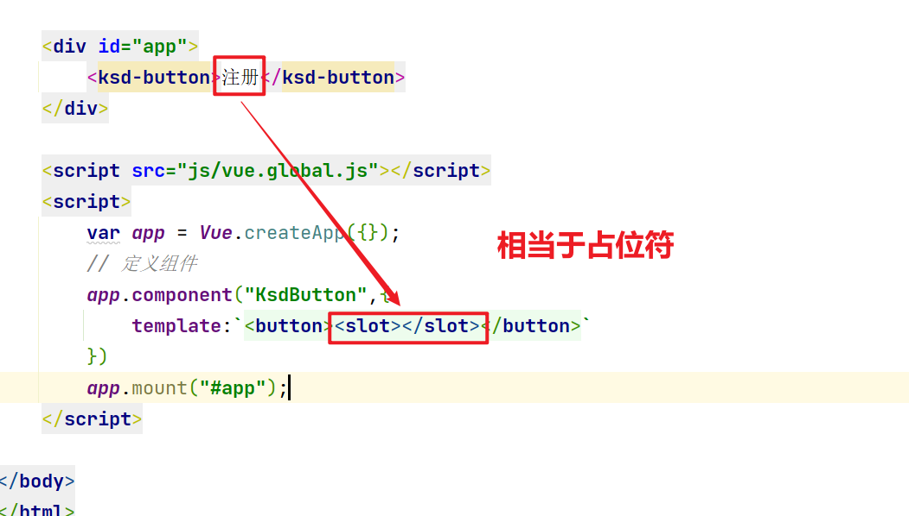
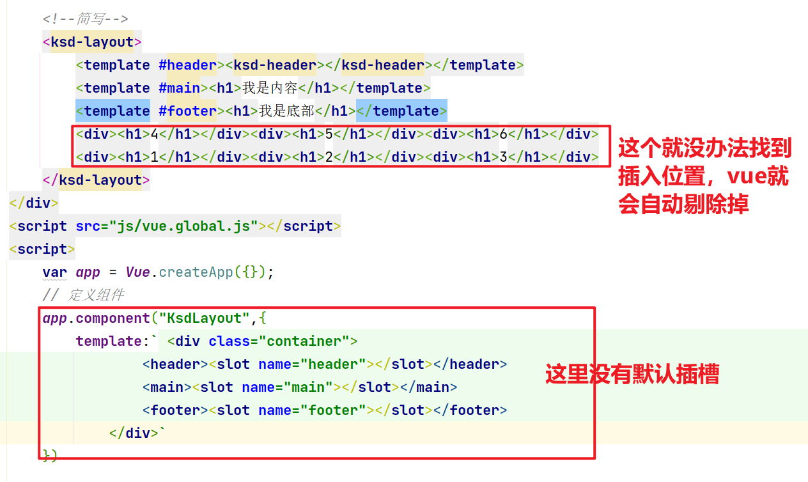

# 关于组件中的插槽的探索


## 官方说明

https://cn.vuejs.org/v2/guide/components-slots.html

Vue 实现了一套内容分发的 API，这套 API 的设计灵感源自 [Web Components 规范草案](https://github.com/w3c/webcomponents/blob/gh-pages/proposals/Slots-Proposal.md)，将 `<slot>` 元素作为承载分发内容的出口。

如何<slot>理解：占位符，把组件与组件直接的内容，插入到组件中的<slot>位置。

## 02、默认插槽 - 实现步骤

1、创建一个vue实例

2、定义一个组件

3、使用slot标签进行占位

4、使用组件定义<slot>内容。

如下：

```java
<!doctype html>
<html lang="en">
<head>
    <meta charset="UTF-8">
    <meta name="viewport"
          content="width=device-width, user-scalable=no, initial-scale=1.0, maximum-scale=1.0, minimum-scale=1.0">
    <meta http-equiv="X-UA-Compatible" content="ie=edge">
    <title>C、Vue组件的中关于插槽的使用和学习-01.html</title>
</head>
<body>

    <div id="app">
        <ksd-button>注册</ksd-button>
        <ksd-button>登录</ksd-button>
        <ksd-button><span style="font-weight: bold">保存</span></ksd-button>
    </div>

    <script src="js/vue.global.js"></script>
    <script>
        var app = Vue.createApp({});
        // 定义组件
        app.component("KsdButton",{
            template:`<button><slot></slot></button>`
        })
        app.mount("#app");
    </script>

</body>
</html>
```



### 小结：

- 通过上面你要明白一个道理，未来在看到一些组件的调用的时候，如果在组件直接可以增加内容，那么说明内部就是通过 slot来完成的

```xml
<el-row>
  <el-col :span="24"><div class="grid-content bg-purple-dark"></div></el-col>
</el-row>
```


- 好处就是：可以让用户去自定义自己的需要内容。进行占位。
- 在定义的时候，是可以增加标签，组件也会生效和渲染。


## 03、具名插槽 - 实现步骤

典型的场景：布局组件

### 03-01、布局div

```html
<div id="app">
    <div class="container">
        <header></header>
        <main>内容</main>
        <footer>底部</footer>
    </div>
</div>
```

何谓布局：其实就是网站整体的骨架，就好比你建设房子一样，先要规划和你格局和空间大小。只有把布局弄好了，你可以可以装修（css）, 放内容（文件，图片）。布局毛坯房。

### 03-02、具名插槽的使用

必须结合`v-slot:插槽的名称` 来指定把组件中的template的内容，根据插槽的名称去自动查找和匹配对应slot=name的位置，进行替换和渲染，如下：

```html
<!doctype html>
<html lang="en">
<head>
    <meta charset="UTF-8">
    <meta name="viewport"
          content="width=device-width, user-scalable=no, initial-scale=1.0, maximum-scale=1.0, minimum-scale=1.0">
    <meta http-equiv="X-UA-Compatible" content="ie=edge">
    <title>C、Vue组件的中关于插槽的使用和学习-02.html</title>
    <style>
        *{margin: 0;padding: 0}
        .container{max-width:1200px;margin: 0 auto;color: #fff;text-align: center;}
        header{height: 50px;background: #000;}
        main{height: 150px;background: red;}
        footer{height: 50px;background: green;}
        .container *{margin: 10px}
    </style>
</head>
<body>
    <div id="app">
        <ksd-layout>
            <template v-slot:header><h1>我是头部</h1></template>
            <template v-slot:main><h1>我是内容</h1></template>
            <template v-slot:footer><h1>我是底部</h1></template>
        </ksd-layout>
    </div>
    <script src="js/vue.global.js"></script>
    <script>
        var app = Vue.createApp({});
        // 定义组件
        app.component("KsdLayout",{
            template:` <div class="container">
                    <header><slot name="header"></slot></header>
                    <main><slot name="main"></slot></main>
                    <footer><slot name="footer"></slot></footer>
                </div>`
        })
        app.mount("#app");
    </script>

</body>
</html>
```


## 03、认识template

template是vue提供的一个虚拟标签，这个标签不会进行渲染，它只是起到一个临时使用和隔离块的一个作用。

- 插槽的模板的隔离

- v-for和vi-if的同时使用的问题

  ```html
  <template v-for="">
      <div v-if="">
  
      </div>
  </template>
  
  
  <div v-for="" >
      <template v-if="">
      	
      </template>
  </div>
  
  ```

- 表格树，tree

  > 注意：表格的tr是不允许嵌套。就错乱表格

  ```html
  <tbody>
  	<tempalte v-for="root in rootCategories">
          <tr>
              <td></td>
          </tr>
          <tempalte v-for="child in root.childrenList">
          	 <tr>
                   <td></td>
              </tr>
          </template>
      </template>
  </tbody>
  ```

  


## 04、具名插槽的使用简写

可以把`v-slot:插槽名称`用`#插槽名字`来替代，如下：

```html
<!doctype html>
<html lang="en">
<head>
    <meta charset="UTF-8">
    <meta name="viewport"
          content="width=device-width, user-scalable=no, initial-scale=1.0, maximum-scale=1.0, minimum-scale=1.0">
    <meta http-equiv="X-UA-Compatible" content="ie=edge">
    <title>C、Vue组件的中关于插槽的使用和学习-02.html</title>
    <style>
        *{margin: 0;padding: 0}
        .container{max-width:1200px;margin: 0 auto;color: #fff;text-align: center;}
        header{height: 50px;background: #000;}
        main{height: 150px;background: red;}
        footer{height: 50px;background: green;}
        .container *{margin: 10px}
    </style>
</head>
<body>
    <div id="app">
        <ksd-layout>
            <template v-slot:header><ksd-header></ksd-header></template>
            <template v-slot:main><h1>我是内容</h1></template>
            <template v-slot:footer><h1>我是底部</h1></template>
        </ksd-layout>

        <!--简写-->
        <ksd-layout>
            <template #header><ksd-header></ksd-header></template>
            <template #main><h1>我是内容</h1></template>
            <template #footer><h1>我是底部</h1></template>
        </ksd-layout>
    </div>
    <script src="js/vue.global.js"></script>
    <script>
        var app = Vue.createApp({});
        // 定义组件
        app.component("KsdLayout",{
            template:` <div class="container">
                    <header><slot name="header"></slot></header>
                    <main><slot name="main"></slot></main>
                    <footer><slot name="footer"></slot></footer>
                </div>`
        })

        app.component("KsdHeader",{
            template:` <header><div>我是头部</div></header>`
        })

        app.mount("#app");
    </script>

</body>
</html>
```

回顾一下vue组件中能够简写指令：

- 事件指令：v-on:事件名="事件名"===@事件名="事件名" 比如：v-on:click ="事件名"---->@click="事件名"
- 属性指令：v-bind:属性="属性值"===:属性="属性值" 比如：v-bind:title="属性值"---->:title="属性值
- 插槽指令：v-slot:插槽名称=#插槽名字 比如：v-slot:header---->#header


## 05、默认插槽和具名插槽结合使用

在开发中，往往有些时候我们会用具名插槽，然后如果具名插槽意外的元素，会自动全部收集归纳到默认插槽中。如下：

```html
<!doctype html>
<html lang="en">
<head>
    <meta charset="UTF-8">
    <meta name="viewport"
          content="width=device-width, user-scalable=no, initial-scale=1.0, maximum-scale=1.0, minimum-scale=1.0">
    <meta http-equiv="X-UA-Compatible" content="ie=edge">
    <title>C、Vue组件的中关于插槽的使用和学习-默认插槽-default-03.html</title>
    <style>
        *{margin: 0;padding: 0}
        .container{max-width:1200px;margin: 0 auto;color: #fff;text-align: center;}
        header{height: 50px;background: #000;}
        main{height: 150px;background: red;}
        footer{height: 50px;background: green;}
        .container *{margin: 10px}
    </style>
</head>
<body>
    <div id="app">
        <ksd-layout>
            <template v-slot:header><ksd-header></ksd-header></template>
            <template v-slot:main><h1>我是内容</h1></template>
            <template v-slot:footer><h1>我是底部</h1></template>
            <template v-slot:default><h1>我是默认的</h1></template>
        </ksd-layout>

        <!--简写-->
        <ksd-layout>
            <template #header><ksd-header></ksd-header></template>
            <template #main><h1>我是内容</h1></template>
            <template #footer><h1>我是底部</h1></template>
            <template #default>
                <div><h1>4</h1></div><div><h1>5</h1></div><div><h1>6</h1></div>
                <div><h1>1</h1></div><div><h1>2</h1></div><div><h1>3</h1></div>
            </template>
        </ksd-layout>
    </div>
    <script src="js/vue.global.js"></script>
    <script>
        var app = Vue.createApp({});
        // 定义组件
        app.component("KsdLayout",{
            template:` <div class="container">
                    <header><slot name="header"></slot></header>
                    <main><slot name="main"></slot></main>
                    <footer><slot name="footer"></slot></footer>
                    <footer><slot></slot></footer>
                </div>`
        })

        app.component("KsdHeader",{
            template:` <header><div>我是头部</div></header>`
        })

        app.mount("#app");
    </script>

</body>
</html>
```

如果在组件中，没有定义默认插槽，那么在组件定义过程那些没有被具名包裹的元素，全部都会被vue抛弃掉。如下：

```html
<!doctype html>
<html lang="en">
<head>
    <meta charset="UTF-8">
    <meta name="viewport"
          content="width=device-width, user-scalable=no, initial-scale=1.0, maximum-scale=1.0, minimum-scale=1.0">
    <meta http-equiv="X-UA-Compatible" content="ie=edge">
    <title>C、Vue组件的中关于插槽的使用和学习-默认插槽-default-03.html</title>
    <style>
        *{margin: 0;padding: 0}
        .container{max-width:1200px;margin: 0 auto;color: #fff;text-align: center;}
        header{height: 50px;background: #000;}
        main{height: 150px;background: red;}
        footer{height: 50px;background: green;}
        .container *{margin: 10px}
    </style>
</head>
<body>
    <div id="app">
        <ksd-layout>
            <template v-slot:header><ksd-header></ksd-header></template>
            <template v-slot:main><h1>我是内容</h1></template>
            <template v-slot:footer><h1>我是底部</h1></template>
            <template v-slot:default><h1>我是默认的</h1></template>
        </ksd-layout>

        <!--简写-->
        <ksd-layout>
            <template #header><ksd-header></ksd-header></template>
            <template #main><h1>我是内容</h1></template>
            <template #footer><h1>我是底部</h1></template>
            <div><h1>4</h1></div><div><h1>5</h1></div><div><h1>6</h1></div>
            <div><h1>1</h1></div><div><h1>2</h1></div><div><h1>3</h1></div>
        </ksd-layout>
    </div>
    <script src="js/vue.global.js"></script>
    <script>
        var app = Vue.createApp({});
        // 定义组件
        app.component("KsdLayout",{
            template:` <div class="container">
                    <header><slot name="header"></slot></header>
                    <main><slot name="main"></slot></main>
                    <footer><slot name="footer"></slot></footer>
                </div>`
        })

        app.component("KsdHeader",{
            template:` <header><div>我是头部</div></header>`
        })

        app.mount("#app");
    </script>

</body>
</html>
```




## 06、插槽作用域

插槽作用域是指：如何把组件中==自己的data中的数据==，返回给组件的调用者进行使用。

> 一句话：就如何把子作用域中的data如果暴露出来给的组件的调用者去使用

```html
<!doctype html>
<html lang="en">
<head>
    <meta charset="UTF-8">
    <meta name="viewport"
          content="width=device-width, user-scalable=no, initial-scale=1.0, maximum-scale=1.0, minimum-scale=1.0">
    <meta http-equiv="X-UA-Compatible" content="ie=edge">
    <title>C、Vue组件的中关于插槽的使用和学习-01.html</title>
</head>
<body>

<div id="app">

    <ksd-button #header="slotProps">{{slotProps.btns.logintext}}</ksd-button>
    <ksd-button #header="slotProps">{{slotProps.btns.regtext}}</ksd-button>
    <ksd-button v-slot:header="{btns:lt}">{{lt.logintext}}</ksd-button>
    <ksd-button v-slot:header="{btns:btnobj}">{{btnobj.regtext}}</ksd-button>
    <ksd-button v-slot:header="{btns:lt}">{{lt.logintext}}</ksd-button>
    <ksd-button v-slot:header="{btns:btnobj}">{{btnobj.regtext}}</ksd-button>
    <ksd-button v-slot:header><span style="font-weight: bold">保存</span></ksd-button>
</div>
<script src="js/vue.global.js"></script>
<script>

    var app = Vue.createApp({
        data() {
            return {

            }
        }
    });

    // 定义组件
    app.component("KsdButton", {
        template: `<button><slot name="header" v-bind:btns="buttons"></slot></button>`,
        data(){
            return {
               buttons:{
                   logintext: "登录",
                   regtext: "注册",
               }
            }
        }
    })
    app.mount("#app");
</script>

</body>
</html>
```

- 在组件定义的时候使用 `:v-bind:作用域的名字（任意取） = "子组件的data数据（建议用对象）"`
- 使用的时候就用：v-slot:default="作用域的名字" ,然后取其值。如果不明白要学会像飞哥一样，先打印。
- 打印看到结果在去使用，不要猜和凭感觉。


