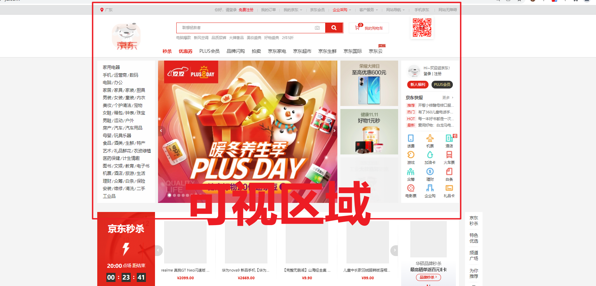
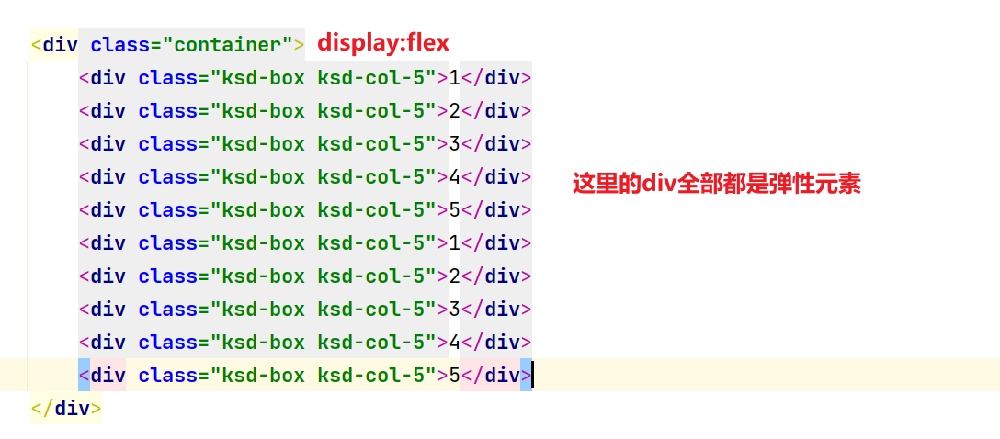
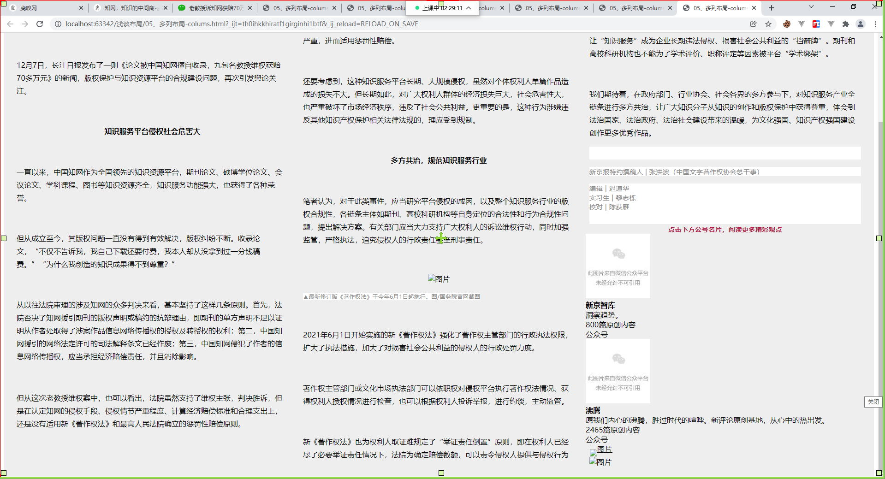

# 谈谈前端的布局Layout


## 分析

不论你学习bootstrap，layui还是elementui它们第个组件都是：布局


## 布局 

- 浮动布局 + 间距(margin)
- 定位布局 
- 弹性布局
- 栅栏布局 & 网格布局(Grid)


## 布局概念 -  可视区域



实现原理css如下：

html部分

```html
  <div class="container"></div>
```

css部分

固定宽度写法：

```css
.container{
    width: 1200px;
    margin: 0 auto;
}
```

随着浏览器像素（宽度和高度）的变化，它是不会发生任何概念，如果像素小于<1200的时候，会出滚动条。

弹性宽度写法：

```css
.container{
    max-width: 1200px;
    margin: 0 auto;
}
```

随着浏览器像素（宽度和高度）的变化，它是不会发生任何概念，如果像素小于<1200的时候，元素就自动按照百分比来进行计算了 width:100%

百分比写法：（不推荐）

```
.container{
    width: 90%;
    margin: 0 auto;
}
```

- 为什么不用，网站的图片宽度和高度是固定，250 10k * 4 = 1200 

  - 如果你当前电脑的分比率是4540  * 90% = 4000px  ==1000 * 4 100kb

- 场景：

- ```html
  <div class="box" style="width:960px;"> 
  	<div class="box2" style="width:100%"></div>	
  </div>
  ```


## 像素

- 有人的电脑看网站看很舒服
- 但是一旦到我们笔记本，低分率的电脑，感觉好大一个

其实是一样大，视觉误差，误差来源就因为旁边的留白和像素的颗粒大小的原因造成。高分辨率的每格子的像素是非常小，所以你看小去就觉得网站字体，图片都很小。反之。

比如当前分比率是：2540 * 1080

800  1200  800

比如当前分比率是：1920 * 1080

350 1200  350

比如当前分比率是：1376 *  768

120 1200  120


## 标签

- 块级元素  (布局 div + section+content+header+footer+articel)  == display:block
- 行内块级元素 （不适合布局 input img） == display:inline-block 
- 行内元素 （不适合布局）(span,a,i,code,pre) == display:inline

## 布局的样式

display: block|flex|table|grid|inline-block|inline

- 默认块级元素就是：block ，不需要指定
  - 独占文档流
  - 受到宽度和高度的影响
  - 会收到padding和margin的影响
- 默认行内块级元素是：inline
  - 一般行内标签它是用修饰文字图片，它不会独占文档流，随波逐流
  - 会收到padding和margin-left/right的
  - 它不收到宽度和高度的影响，内容多宽多高，块级元素就多宽多高，如果你去指定宽度高度，将会被忽略，除非你升级。
- inline-block (布局决定不会用它)
  - 告诉未来如果你想快速把一个块级元素降级，受到宽度和高度的影响。
  - 或者未来你想把一个行内元素进行升级，受到宽度和高度影响。
  - 会收到padding和margin-left/right的影响
  - 在实际开发中，一般专业前端是不会用它。以为你这个存在间隙

## 边距

- 外边距 margin (布局) 
  - 元素与元素直接，两个至少两个以上间隙 `<div></div> <div></div>`
- 内边距 padding
  - 元素本身的内部的间距，`<div>`
- 不论是内部边距还是外布局，==都会影响布局，宽度和高度都会计算在内==。

### 边距的写法

方向：上-->右---下---左

```css
# 单个写
padding-top:10px
padding-right:10px
padding-bottom:10px
padding-left:10px
# 如果值不相同
padding:10px 1px 41px 2px;
# 如果值相同
padding:10px;  
# 上下相同，左右相同
padding:10px 20px;  ---- top/bottom:10px;  left/right:20px;
# 上下不同，左右相同
padding: 10px 20px 1px; top:10px   left/right:20px;  bottom:1px
```

margin同理。


# 布局-浮动案例

## 01、破坏文档流

- 因为div布局标签，是块级元素，是独占一行，而display:inline-block 是有间隙的。是不可能用它布局。
- float 浮动 
  - float的作用，其实就是去破坏div的文档流。div本身的文档流去去除。让div达到随波逐流。

## 02、案例如下

```html
<!doctype html>
<html lang="en">
<head>
    <meta charset="UTF-8">
    <meta name="viewport"
          content="width=device-width, user-scalable=no, initial-scale=1.0, maximum-scale=1.0, minimum-scale=1.0">
    <meta http-equiv="X-UA-Compatible" content="ie=edge">
    <title>01、布局核心概念-可视区域.html</title>

    <style>
        .container{
            width: 1200px;
            margin: 20px auto;
            background:red;
            overflow: hidden;
        }


        .ksd-box{background: #000;color:#fff;}

        .ksd-col-5{width: 230px;float:left;margin-right: 10px;}
        .ksd-col-4{width: 300px;float:left}
        .ksd-col-3{width: 400px;float:left}
        .ksd-col-2{width: 600px;float:left}
        .ksd-col-1{width: 1000px;float:left}

        /*240+240+240+240+240 == 1200px*/
        /*// 间隙版*/
        /*(230 + 10)+(230 + 10)+(230 + 10)+(230 + 10)+(230 + 10) = 1200px*/
    </style>

</head>
<body>

    <div class="container">
        <div class="ksd-box ksd-col-5">1</div>
        <div class="ksd-box ksd-col-5">2</div>
        <div class="ksd-box ksd-col-5">3</div>
        <div class="ksd-box ksd-col-5">4</div>
        <div class="ksd-box ksd-col-5">5</div>
    </div>

    <div class="container">
        <div class="ksd-box ksd-col-4">1</div>
        <div class="ksd-box ksd-col-4">2</div>
        <div class="ksd-box ksd-col-4">3</div>
        <div class="ksd-box ksd-col-4">4</div>
    </div>

    <div class="container">
        <div class="ksd-box ksd-col-3">1</div>
        <div class="ksd-box ksd-col-3">2</div>
        <div class="ksd-box ksd-col-3">3</div>
    </div>

</body>
</html>
```

- 概念均分，切蛋糕均分，但是会存在一个最后一个元素的间隙问题

```css
240+240+240+240+240 == 1200px
/*// 间隙版*/
(230 + 10)+(230 + 10)+(230 + 10)+(230 + 10)+(230 + 10) = 1200px
```

上面的不论一行放多少个，只要加了间隙，最后一个或者第一个都有多余的间隙问题。怎么办？


### 第一种解决方案：定义额外样式控制（很古老的做法，这个必须要结合程序）

```
  .ksd-col-5.nm{margin-right: 0px;}
```

```html
<div class="container">
        <div class="ksd-box ksd-col-5">1</div>
        <div class="ksd-box ksd-col-5">2</div>
        <div class="ksd-box ksd-col-5">3</div>
        <div class="ksd-box ksd-col-5">4</div>
        <div class="ksd-box nm ksd-col-5">5</div>
        <div class="ksd-box ksd-col-5">1</div>
        <div class="ksd-box ksd-col-5">2</div>
        <div class="ksd-box ksd-col-5">3</div>
        <div class="ksd-box ksd-col-5">4</div>
        <div class="ksd-box nm ksd-col-5">5</div>
    </div>
```

上面的代码。每逢5增加一个特别样式，但是这个东西必须要结合后端开发者一起配合使用。

### 第二种解决方案：用css3提供nth-child(5n)

```
.ksd-col-5:nth-child(5n){margin-right: 0px;}
```

```html
<div class="container">
        <div class="ksd-box ksd-col-5">1</div>
        <div class="ksd-box ksd-col-5">2</div>
        <div class="ksd-box ksd-col-5">3</div>
        <div class="ksd-box ksd-col-5">4</div>
        <div class="ksd-box ksd-col-5">5</div>
        <div class="ksd-box ksd-col-5">1</div>
        <div class="ksd-box ksd-col-5">2</div>
        <div class="ksd-box ksd-col-5">3</div>
        <div class="ksd-box ksd-col-5">4</div>
        <div class="ksd-box ksd-col-5">5</div>
    </div>
```

其实就相当于下面的含义：

```
/*// 间隙版*/
【(230 + 10)+(230 + 10)+(230 + 10)+(230 + 10)+(230)】 + 10(空白的没填内容) = 1200px 
```

上面其实实际只有只有1190像素，多余了10像素。

```
【(232 + 10)+(232 + 10)+(232 + 10)+(232 + 10)+(232)】  = 1200px 
```


### 第三种方案：flex

上面两种方案，都存在一个通病，就需要格外的去增加css或者增加控制。这个非常麻烦的事情。所以弹性布局应运而生。

#### 你一定要知道的flex布局的注意事项

- ==弹性元素，只会受到第一级父级的display:flex的影响==




## 多列布局

它是一种控制文本多列展示的一种机制，是css3版本以后才有的。

### 语法

```css
colums: <colums-width> | <colums-count>
```

### 具体实现

```html
<!doctype html>
<html lang="en">
<head>
    <meta charset="UTF-8">
    <meta name="viewport"
          content="width=device-width, user-scalable=no, initial-scale=1.0, maximum-scale=1.0, minimum-scale=1.0">
    <meta http-equiv="X-UA-Compatible" content="ie=edge">
    <title>05、多列布局-colums.html</title>
    <style>
        .rich_media_content{padding: 20px;background: #eee;
            columns:600px 10;
        }
    </style>

</head>
<body>

<div class="rich_media_content " id="js_content" style="visibility: visible;">
    <p style="outline: 0px;max-width: 100%;font-family: -apple-system, BlinkMacSystemFont, &quot;Helvetica Neue&quot;, &quot;PingFang SC&quot;, &quot;Hiragino Sans GB&quot;, &quot;Microsoft YaHei UI&quot;, &quot;Microsoft YaHei&quot;, Arial, sans-serif;letter-spacing: 0.544px;white-space: normal;background-color: rgb(255, 255, 255);text-align: left;margin-left: 8px;margin-right: 8px;line-height: normal;box-sizing: border-box !important;overflow-wrap: break-word !important;"><span style="outline: 0px;max-width: 100%;color: rgb(136, 136, 136);font-size: 12px;letter-spacing: 0.544px;text-align: left;box-sizing: border-box !important;overflow-wrap: break-word !important;">▲中南财经政法大学退休教授赵德馨</span><span style="outline: 0px;max-width: 100%;color: rgb(136, 136, 136);font-size: 12px;letter-spacing: 0.544px;text-align: left;box-sizing: border-box !important;overflow-wrap: break-word !important;">对中国知网擅自收录他的100多篇论文打起了官司且全部胜诉。图</span><span style="outline: 0px;max-width: 100%;color: rgb(136, 136, 136);font-size: 12px;letter-spacing: 0.544px;text-align: left;box-sizing: border-box !important;overflow-wrap: break-word !important;">/中国裁判文书网截图</span></p><section style="margin-right: 8px;margin-left: 8px;white-space: normal;outline: 0px;max-width: 100%;font-family: -apple-system, BlinkMacSystemFont, &quot;Helvetica Neue&quot;, &quot;PingFang SC&quot;, &quot;Hiragino Sans GB&quot;, &quot;Microsoft YaHei UI&quot;, &quot;Microsoft YaHei&quot;, Arial, sans-serif;letter-spacing: 0.544px;background-color: rgb(255, 255, 255);text-align: center;line-height: 1.75em;box-sizing: border-box !important;overflow-wrap: break-word !important;"><br></section><section style="margin-right: 8px;margin-left: 8px;white-space: normal;outline: 0px;max-width: 100%;font-family: -apple-system, BlinkMacSystemFont, &quot;Helvetica Neue&quot;, &quot;PingFang SC&quot;, &quot;Hiragino Sans GB&quot;, &quot;Microsoft YaHei UI&quot;, &quot;Microsoft YaHei&quot;, Arial, sans-serif;letter-spacing: 0.544px;background-color: rgb(255, 255, 255);text-align: center;line-height: 1.75em;box-sizing: border-box !important;overflow-wrap: break-word !important;"><strong style="outline: 0px;max-width: 100%;box-sizing: border-box !important;overflow-wrap: break-word !important;"><span style="outline: 0px;max-width: 100%;font-size: 16px;letter-spacing: 0.544px;box-sizing: border-box !important;overflow-wrap: break-word !important;">文 |</span></strong><strong style="outline: 0px;max-width: 100%;box-sizing: border-box !important;overflow-wrap: break-word !important;"><span style="outline: 0px;max-width: 100%;font-size: 16px;letter-spacing: 0.544px;box-sizing: border-box !important;overflow-wrap: break-word !important;">&nbsp;张洪波</span></strong><strong style="outline: 0px;max-width: 100%;box-sizing: border-box !important;overflow-wrap: break-word !important;"><span style="outline: 0px;max-width: 100%;font-size: 16px;letter-spacing: 0.544px;box-sizing: border-box !important;overflow-wrap: break-word !important;"></span></strong></section><section style="white-space: normal;">&nbsp;</section><p style="line-height: 1.75em;margin-left: 8px;margin-right: 8px;"><span style="font-size: 16px;">89岁退休老教授，100多篇论文被中国知网擅自收录，维权获赔70余万元。</span></p><p style="line-height: 1.75em;margin-left: 8px;margin-right: 8px;"><span style="font-size: 16px;">&nbsp;</span></p><p style="line-height: 1.75em;margin-left: 8px;margin-right: 8px;"><span style="font-size: 16px;">12月7日，长江日报发布了一则《论文被中国知网擅自收录，九旬名教授维权获赔70多万元》的新闻，版权保护与知识资源平台的合规建设问题，再次引发舆论关注。</span></p><p style="line-height: 1.75em;margin-left: 8px;margin-right: 8px;"><span style="font-size: 16px;">&nbsp;</span></p><p style="line-height: 1.75em;margin-left: 8px;margin-right: 8px;text-align: center;"><strong><span style="font-size: 16px;">知识服务平台侵权社会危害大</span></strong></p><p style="line-height: 1.75em;margin-left: 8px;margin-right: 8px;"><span style="font-size: 16px;">&nbsp;</span></p><p style="line-height: 1.75em;margin-left: 8px;margin-right: 8px;"><span style="font-size: 16px;">一直以来，中国知网作为全国领先的知识资源平台，期刊论文、硕博学位论文、会议论文、学科课程、图书等知识资源齐全，知识服务功能强大，也获得了各种荣誉。</span></p><p style="line-height: 1.75em;margin-left: 8px;margin-right: 8px;"><span style="font-size: 16px;">&nbsp;</span></p><p style="line-height: 1.75em;margin-left: 8px;margin-right: 8px;"><span style="font-size: 16px;">但从成立至今，其版权问题一直没有得到有效解决，版权纠纷不断。收录论文，“不仅不告诉我，我自己下载还要付费，我本人却从没拿到过一分钱稿费。”“为什么我创造的知识成果得不到尊重？”</span></p><p style="line-height: 1.75em;margin-left: 8px;margin-right: 8px;"><span style="font-size: 16px;">&nbsp;</span></p><p style="line-height: 1.75em;margin-left: 8px;margin-right: 8px;"><span style="font-size: 16px;">从以往法院审理的涉及知网的众多判决来看，基本坚持了这样几条原则。首先，法院否决了知网援引期刊的版权声明或稿约的抗辩理由，即期刊的单方声明不足以证明从作者处取得了涉案作品信息网络传播权的授权及转授权的权利；第二，中国知网援引的网络法定许可的司法解释条文已经作废；第三，中国知网侵犯了作者的信息网络传播权，应当承担经济赔偿责任，并且消除影响。</span></p><p style="line-height: 1.75em;margin-left: 8px;margin-right: 8px;"><span style="font-size: 16px;">&nbsp;</span><span style="background-color: rgb(255, 255, 255);color: rgb(136, 136, 136);font-family: -apple-system, BlinkMacSystemFont, &quot;Helvetica Neue&quot;, &quot;PingFang SC&quot;, &quot;Hiragino Sans GB&quot;, &quot;Microsoft YaHei UI&quot;, &quot;Microsoft YaHei&quot;, Arial, sans-serif;font-size: 12px;letter-spacing: 0.544px;text-align: left;"></span></p><p style="line-height: 1.75em;margin-left: 8px;margin-right: 8px;"><span style="font-size: 16px;">但从这次老教授维权案中，也可以看出，法院虽然支持了维权主张，判决胜诉，但是在认定知网的侵权手段、侵权情节严重程度、计算经济赔偿标准和合理支出上，还是没有适用新《著作权法》和最高人民法院确立的惩罚性赔偿原则。</span></p><p style="line-height: 1.75em;margin-left: 8px;margin-right: 8px;"><span style="font-size: 16px;">&nbsp;</span></p><p style="line-height: 1.75em;margin-left: 8px;margin-right: 8px;"><span style="font-size: 16px;">判赔标准过低，律师费等合理支出也因为是“批量”诉讼维权，而被归入“批发”类型，进而没有全额支持原告诉求。</span></p><p style="line-height: 1.75em;margin-left: 8px;margin-right: 8px;"><span style="font-size: 16px;">&nbsp;</span></p><p style="line-height: 1.75em;margin-left: 8px;margin-right: 8px;"><span style="font-size: 16px;">事实上，在这起案件中，作为被告的中国知网，具有明显的法定的侵权故意和严重情节。且权利人多次交涉后，被告仍继续实施侵权行为，从侵权手段、次数，侵权行为的持续时间、地域范围、规模、后果、侵权获利情况考虑，应认定为侵权情节严重，进而适用惩罚性赔偿。</span></p><p style="line-height: 1.75em;margin-left: 8px;margin-right: 8px;"><span style="font-size: 16px;">&nbsp;</span></p><p style="line-height: 1.75em;margin-left: 8px;margin-right: 8px;"><span style="font-size: 16px;">还要考虑到，这种知识服务平台长期、大规模侵权，虽然对个体权利人单篇作品造成的损失不大。但长期如此，对广大权利人群体的经济损失巨大，社会危害性大，也严重破坏了市场经济秩序，违反了社会公共利益。更重要的是，这种行为涉嫌违反其他知识产权保护相关法律法规的，理应受到规制。</span></p><p style="line-height: 1.75em;margin-left: 8px;margin-right: 8px;"><span style="font-size: 16px;">&nbsp;</span></p><p style="line-height: 1.75em;margin-left: 8px;margin-right: 8px;text-align: center;"><strong><span style="font-size: 16px;">多方共治，规范知识服务行业</span></strong><span style="font-size: 16px;"></span></p><p style="line-height: 1.75em;margin-left: 8px;margin-right: 8px;"><span style="font-size: 16px;">&nbsp;</span></p><p style="line-height: 1.75em;margin-left: 8px;margin-right: 8px;"><span style="font-size: 16px;">笔者认为，对于此类事件，应当研究平台侵权的成因，以及整个知识服务行业的版权合规性，各链条主体如期刊、高校科研机构等自身定位的合法性和行为合规性问题，提出解决方案。有关部门应当大力支持广大权利人的诉讼维权行动，同时加强监管，严格执法，追究侵权人的行政责任甚至刑事责任。</span></p><p style="line-height: 1.75em;margin-left: 8px;margin-right: 8px;"><span style="font-size: 16px;">&nbsp;</span></p><p style="text-align: center;margin-left: 8px;margin-right: 8px;line-height: normal;"></p><p style="margin-left: 8px;margin-right: 8px;line-height: normal;"><span style="font-size: 16px;"></span><span style="color: rgb(136, 136, 136);font-family: -apple-system, BlinkMacSystemFont, &quot;Helvetica Neue&quot;, &quot;PingFang SC&quot;, &quot;Hiragino Sans GB&quot;, &quot;Microsoft YaHei UI&quot;, &quot;Microsoft YaHei&quot;, Arial, sans-serif;font-size: 12px;letter-spacing: 0.544px;text-align: left;background-color: rgb(255, 255, 255);">▲最新修订版《著作权法》于今年6月1日起施行。图</span><span style="color: rgb(136, 136, 136);font-family: -apple-system, BlinkMacSystemFont, &quot;Helvetica Neue&quot;, &quot;PingFang SC&quot;, &quot;Hiragino Sans GB&quot;, &quot;Microsoft YaHei UI&quot;, &quot;Microsoft YaHei&quot;, Arial, sans-serif;font-size: 12px;letter-spacing: 0.544px;text-align: left;background-color: rgb(255, 255, 255);">/国务院官网截图</span></p><p style="line-height: 1.75em;margin-left: 8px;margin-right: 8px;"><span style="font-size: 16px;"><br></span></p><p style="line-height: 1.75em;margin-left: 8px;margin-right: 8px;"><span style="font-size: 16px;">2021年6月1日开始实施的新《著作权法》强化了著作权主管部门的行政执法权限，扩大了执法措施，加大了对损害社会公共利益的侵权人的行政处罚力度。</span></p><p style="line-height: 1.75em;margin-left: 8px;margin-right: 8px;"><span style="font-size: 16px;">&nbsp;</span></p><p style="line-height: 1.75em;margin-left: 8px;margin-right: 8px;"><span style="font-size: 16px;">著作权主管部门或文化市场执法部门可以依职权对侵权平台执行著作权法情况、获得权利人授权情况进行检查，也可以根据权利人投诉举报，进行约谈，主动监管。</span></p><p style="line-height: 1.75em;margin-left: 8px;margin-right: 8px;"><span style="font-size: 16px;">&nbsp;</span></p><p style="line-height: 1.75em;margin-left: 8px;margin-right: 8px;"><span style="font-size: 16px;">新《著作权法》也为权利人取证难规定了“举证责任倒置”原则，即在权利人已经尽了必要举证责任情况下，法院为确定赔偿数额，可以责令侵权人提供与侵权行为相关的账簿、资料等；侵权人不提供，或者提供虚假的账簿、资料等的，法院可以参考权利人的主张和提供的证据确定赔偿数额。</span></p><p style="line-height: 1.75em;margin-left: 8px;margin-right: 8px;"><span style="font-size: 16px;">&nbsp;</span></p><p style="line-height: 1.75em;margin-left: 8px;margin-right: 8px;"><span style="font-size: 16px;">有关行业协会也应当加强行业自律，可以根据权利人投诉，对会员平台进行批评教育，要求完善内部管理制度，严格执行国家政策法律，履行社会责任，纠正侵权违法行为，甚至开除会籍。同时也可以向监管执法部门反映，要求进行查处。不能让“知识服务”成为企业长期违法侵权、损害社会公共利益的“挡箭牌”。期刊和高校科研机构也不能为了学术评价、职称评定等因素被平台“学术绑架”。</span></p><p style="line-height: 1.75em;margin-left: 8px;margin-right: 8px;"><span style="font-size: 16px;">&nbsp;</span></p><p style="line-height: 1.75em;margin-left: 8px;margin-right: 8px;"><span style="font-size: 16px;">我们期待着，在政府部门、行业协会、社会各界的多方参与下，对知识服务产业全链条进行多方共治，让广大知识分子从知识的创作和版权保护中获得尊重，体会到法治国家、法治政府、法治社会建设带来的温暖，为文化强国、知识产权强国建设创作更多优秀作品。</span></p><section style="margin-right: 8px;margin-left: 8px;outline: 0px;max-width: 100%;font-family: -apple-system, BlinkMacSystemFont, &quot;Helvetica Neue&quot;, &quot;PingFang SC&quot;, &quot;Hiragino Sans GB&quot;, &quot;Microsoft YaHei UI&quot;, &quot;Microsoft YaHei&quot;, Arial, sans-serif;letter-spacing: 0.544px;white-space: normal;background-color: rgb(255, 255, 255);line-height: 1.75em;box-sizing: border-box !important;overflow-wrap: break-word !important;"><br></section><p style="margin-right: 8px;margin-left: 8px;outline: 0px;max-width: 100%;font-family: -apple-system, BlinkMacSystemFont, &quot;Helvetica Neue&quot;, &quot;PingFang SC&quot;, &quot;Hiragino Sans GB&quot;, &quot;Microsoft YaHei UI&quot;, &quot;Microsoft YaHei&quot;, Arial, sans-serif;letter-spacing: 0.544px;white-space: normal;background-color: rgb(255, 255, 255);line-height: normal;box-sizing: border-box !important;overflow-wrap: break-word !important;"><span style="outline: 0px;max-width: 100%;color: rgb(136, 136, 136);font-size: 14px;letter-spacing: 0.544px;box-sizing: border-box !important;overflow-wrap: break-word !important;">新京报特约撰稿人&nbsp;|&nbsp;张洪波</span><span style="outline: 0px;max-width: 100%;color: rgb(136, 136, 136);font-size: 14px;letter-spacing: 0.544px;box-sizing: border-box !important;overflow-wrap: break-word !important;">（中国文字著作权协会总干事）</span></p><section style="margin-right: 8px;margin-left: 8px;white-space: normal;outline: 0px;max-width: 100%;font-family: -apple-system, BlinkMacSystemFont, &quot;Helvetica Neue&quot;, &quot;PingFang SC&quot;, &quot;Hiragino Sans GB&quot;, &quot;Microsoft YaHei UI&quot;, &quot;Microsoft YaHei&quot;, Arial, sans-serif;letter-spacing: 0.544px;background-color: rgb(255, 255, 255);line-height: normal;box-sizing: border-box !important;overflow-wrap: break-word !important;"><span style="outline: 0px;max-width: 100%;color: rgb(136, 136, 136);font-size: 14px;box-sizing: border-box !important;overflow-wrap: break-word !important;">编辑<span style="letter-spacing: 0.544px;">&nbsp;|&nbsp;</span>迟道华</span></section><section style="margin-right: 8px;margin-left: 8px;white-space: normal;outline: 0px;max-width: 100%;font-family: -apple-system, BlinkMacSystemFont, &quot;Helvetica Neue&quot;, &quot;PingFang SC&quot;, &quot;Hiragino Sans GB&quot;, &quot;Microsoft YaHei UI&quot;, &quot;Microsoft YaHei&quot;, Arial, sans-serif;letter-spacing: 0.544px;background-color: rgb(255, 255, 255);line-height: normal;box-sizing: border-box !important;overflow-wrap: break-word !important;"><span style="outline: 0px;max-width: 100%;color: rgb(136, 136, 136);font-size: 14px;box-sizing: border-box !important;overflow-wrap: break-word !important;">实习生<span style="color: rgb(136, 136, 136);font-family: -apple-system, BlinkMacSystemFont, &quot;Helvetica Neue&quot;, &quot;PingFang SC&quot;, &quot;Hiragino Sans GB&quot;, &quot;Microsoft YaHei UI&quot;, &quot;Microsoft YaHei&quot;, Arial, sans-serif;letter-spacing: 0.544px;background-color: rgb(255, 255, 255);">&nbsp;|&nbsp;黎志栋</span></span></section><section style="margin-right: 8px;margin-left: 8px;outline: 0px;max-width: 100%;font-family: -apple-system, BlinkMacSystemFont, &quot;Helvetica Neue&quot;, &quot;PingFang SC&quot;, &quot;Hiragino Sans GB&quot;, &quot;Microsoft YaHei UI&quot;, &quot;Microsoft YaHei&quot;, Arial, sans-serif;letter-spacing: 0.544px;white-space: normal;background-color: rgb(255, 255, 255);line-height: normal;box-sizing: border-box !important;overflow-wrap: break-word !important;"><span style="outline: 0px;max-width: 100%;color: rgb(136, 136, 136);font-size: 14px;box-sizing: border-box !important;overflow-wrap: break-word !important;">校对 | 陈荻雁</span></section><section style="margin-right: 8px;margin-left: 8px;outline: 0px;max-width: 100%;font-family: -apple-system, BlinkMacSystemFont, &quot;Helvetica Neue&quot;, &quot;PingFang SC&quot;, &quot;Hiragino Sans GB&quot;, &quot;Microsoft YaHei UI&quot;, &quot;Microsoft YaHei&quot;, Arial, sans-serif;letter-spacing: 0.544px;white-space: normal;background-color: rgb(255, 255, 255);line-height: 1.75em;box-sizing: border-box !important;overflow-wrap: break-word !important;"><br></section><section style="margin-right: 8px;margin-left: 8px;outline: 0px;max-width: 100%;letter-spacing: 0.544px;text-align: center;box-sizing: border-box !important;overflow-wrap: break-word !important;"><strong style="outline: 0px;max-width: 100%;color: rgb(171, 25, 66);letter-spacing: 0.544px;box-sizing: border-box !important;overflow-wrap: break-word !important;"><span style="outline: 0px;max-width: 100%;font-size: 14px;box-sizing: border-box !important;overflow-wrap: break-word !important;">点击下方公号名片，阅读更多精彩观点</span></strong></section><section class=""><mpprofile class="js_uneditable" data-pluginname="mpprofile" data-id="MzU1NzczMDQwOQ==" data-headimg="http://mmbiz.qpic.cn/sz_mmbiz_png/KHXy1duLjWDLIRkCa33XT9RwzB7DxqfX1TKvcdN5icia3Sdu3UicsxVTdHQr183KrQ2SaTsUuAHkLtdPlYEY12ByA/0?wx_fmt=png" data-nickname="新京智库" data-alias="xjb-futurecity" data-signature="洞察趋势。" data-from="0" wah-hotarea="click"> <!-- profile卡片 --> <div class="appmsg_card_context wx_profile_card js_wx_profile_card js_wx_tap_highlight wx_tap_card" data-id="MzU1NzczMDQwOQ==" data-isban="0" data-index="0" role="link" aria-labelledby="js_wx_profile_nickname js_a11y_comma js_wx_profile_signature js_a11y_comma js_profile_desc js_a11y_comma js_wx_profile_logo">   <div class="wx_profile_card_bd" aria-hidden="true">     <div class="wx_profile weui-flex">       <div class="wx_profile_hd">                                  </div>       <div class="wx_profile_bd weui-flex weui-flex__item">         <div class="weui-flex__item">           <strong class="wx_profile_nickname" id="js_wx_profile_nickname">                                新京智库                           </strong>           <div class="wx_profile_desc" id="js_wx_profile_signature">洞察趋势。</div>           <div class="wx_profile_tips" id="js_profile_desc">             <span class="wx_profile_tips_meta" id="js_profile_article">800篇原创内容</span>             <!-- <span class="wx_profile_tips_meta" id="js_profile_friends"></span> -->           </div>         </div>         <i class="weui-icon-arrow"></i>       </div>     </div>   </div>   <div class="wx_profile_card_ft" aria-hidden="true" id="js_wx_profile_logo">公众号</div> </div> </mpprofile></section><section class=""><mpprofile class="js_uneditable" data-pluginname="mpprofile" data-id="MjM5MTg1NzY4Ng==" data-headimg="http://mmbiz.qpic.cn/mmbiz_png/jn4kJ1yqtHV6PutYZTibUNYMgDEhtNOWThn7HHw0xPCNNiaAibva7EedibzmVHibfcZstDnnNYbqib1kUZIwAnhSpraQ/0?wx_fmt=png" data-nickname="沸腾" data-alias="xjb-feiteng" data-signature="愿我们内心的沸腾，胜过时代的喧哗。新评论原创基地，从心中的热出发。" data-from="0" wah-hotarea="click"> <!-- profile卡片 --> <div class="appmsg_card_context wx_profile_card js_wx_profile_card js_wx_tap_highlight wx_tap_card" data-id="MjM5MTg1NzY4Ng==" data-isban="0" data-index="1" role="link" aria-labelledby="js_wx_profile_nickname js_a11y_comma js_wx_profile_signature js_a11y_comma js_profile_desc js_a11y_comma js_wx_profile_logo">   <div class="wx_profile_card_bd" aria-hidden="true">     <div class="wx_profile weui-flex">       <div class="wx_profile_hd">                                  </div>       <div class="wx_profile_bd weui-flex weui-flex__item">         <div class="weui-flex__item">           <strong class="wx_profile_nickname" id="js_wx_profile_nickname">                                沸腾                           </strong>           <div class="wx_profile_desc" id="js_wx_profile_signature">愿我们内心的沸腾，胜过时代的喧哗。新评论原创基地，从心中的热出发。</div>           <div class="wx_profile_tips" id="js_profile_desc">             <span class="wx_profile_tips_meta" id="js_profile_article">2465篇原创内容</span>             <!-- <span class="wx_profile_tips_meta" id="js_profile_friends"></span> -->           </div>         </div>         <i class="weui-icon-arrow"></i>       </div>     </div>   </div>   <div class="wx_profile_card_ft" aria-hidden="true" id="js_wx_profile_logo">公众号</div> </div> </mpprofile></section><section style="margin-right: 8px;margin-left: 8px;outline: 0px;max-width: 100%;letter-spacing: 0.544px;box-sizing: border-box !important;overflow-wrap: break-word !important;"><a href="http://xjbapp.bjnews.com.cn/?qdid=9e" target="_blank" data-linktype="1" data-darkmode-bgcolor-16084568641881="rgb(25, 25, 25)" data-darkmode-original-bgcolor-16084568641881="rgb(255, 255, 255)" wah-hotarea="click" style="outline: 0px;color: var(--weui-LINK);-webkit-tap-highlight-color: rgba(0, 0, 0, 0);cursor: pointer;max-width: 100%;letter-spacing: 0.54px;box-sizing: border-box !important;overflow-wrap: break-word !important;"><span class="js_jump_icon h5_image_link" data-positionback="static" style="outline: 0px;max-width: 100%;line-height: 0;vertical-align: bottom;user-select: none;box-sizing: border-box !important;overflow-wrap: break-word !important;"></span></a></section><section style="margin-right: 8px;margin-left: 8px;outline: currentcolor none 0px;max-width: 100%;letter-spacing: 0.544px;box-sizing: border-box !important;overflow-wrap: break-word !important;"></section>
</div>


</body>
</html>
```

效果如下：




