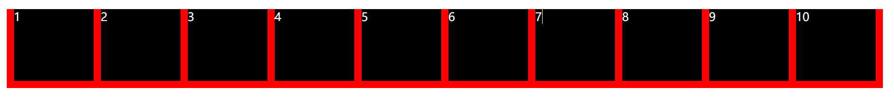
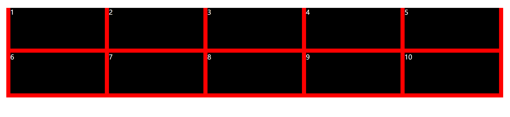
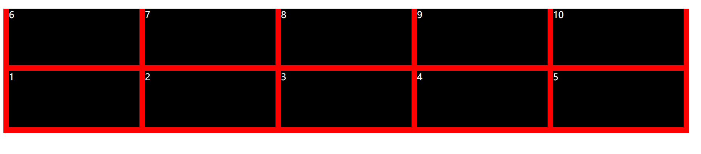
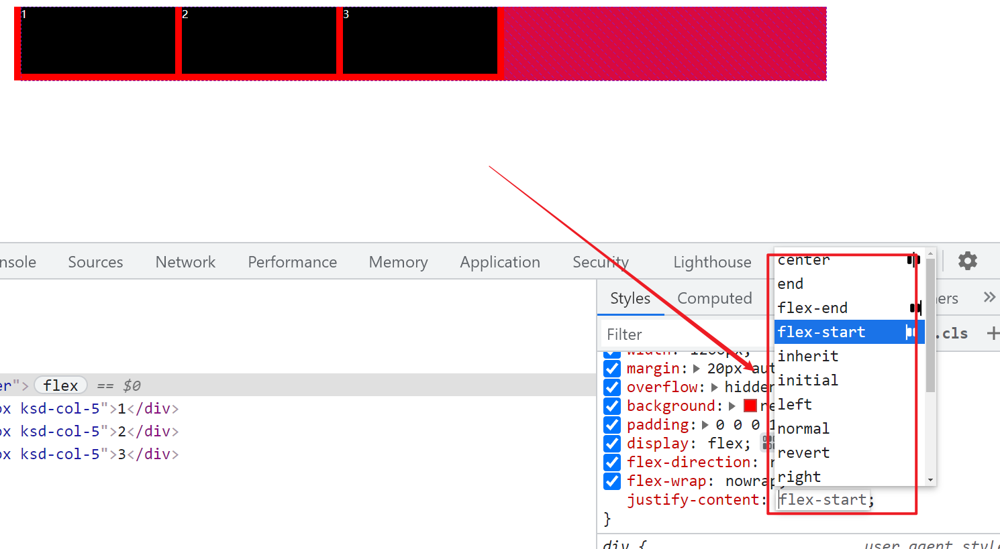
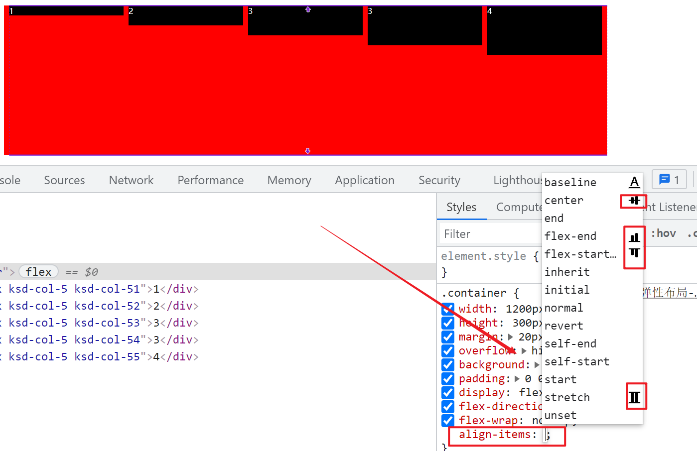

# Flex 布局

float布局和postition布局，都存在一个通病，就需要格外的去增加css或者增加控制。这个非常麻烦的事情。所以弹性布局应运而生。

推荐：https://zhuanlan.zhihu.com/p/25303493

#### 你一定要知道的flex布局的注意事项

==弹性元素，只会受到第一级父级的display:flex的影响==


## Flex 基本概念：


在 flex 容器中默认存在两条轴，[水平主轴](https://www.zhihu.com/search?q=水平主轴&search_source=Entity&hybrid_search_source=Entity&hybrid_search_extra={"sourceType"%3A"article"%2C"sourceId"%3A25303493})(main axis) 和垂直的交叉轴(cross axis)，这是默认的设置，当然你可以通过修改使垂直方向变为主轴，水平方向变为交叉轴，这个我们后面再说。

在容器中的每个单元块被称之为 flex item，每个项目占据的主轴空间为 (main size), 占据的交叉轴的空间为 (cross size)。

这里需要强调，不能先入为主认为宽度就是 main size，高度就是 cross size，这个还要取决于你主轴的方向，如果你垂直方向是主轴，那么项目的高度就是 main size。

main size和corrs size是什么意思呢：其实就两个方向的元素，比如水平main axis的方向为例，里面的弹性元素会自动平均水平宽度。如果是corss axis方向，那么所以的元素都以垂直方式进行排列，默认情况下，默认和垂直的高度一直。

## Flex 容器：

首先，

- 实现 flex 布局需要先指定一个容器，
- 任何一个容器都可以被指定为 flex 布局，
- 这样容器内部的元素就可以使用 flex 来进行布局。

```css
.container {
    display: flex | inline-flex;       //可以有两种取值
}
```

分别生成一个块状或行内的 flex 容器盒子。简单说来，如果你使用块元素如 div，你就可以使用 flex，而如果你使用[行内元素](https://www.zhihu.com/search?q=行内元素&search_source=Entity&hybrid_search_source=Entity&hybrid_search_extra={"sourceType"%3A"article"%2C"sourceId"%3A25303493})，你可以使用 inline-flex。

==**需要注意的是：当时设置 flex 布局之后，子元素的 float、clear、[vertical-align](https://www.zhihu.com/search?q=vertical-align&search_source=Entity&hybrid_search_source=Entity&hybrid_search_extra={"sourceType"%3A"article"%2C"sourceId"%3A25303493}) 的属性将会失效。==**


## 02、水平方向

### 01、在父元素上增加display:flex

默认情况下，弹性元素只会在第一级父类控制才会有意义，如果弹性元素的总宽度没有超过外层盒子的宽度的时候，不会去均分，如果超过盒子的宽度的时候如果你flex-wrap是nowrap的话，是不会换行。

### **02、 flex-direction: 决定主轴的方向(即项目的排列方向)**

```css
.container {
    flex-direction: row | row-reverse |column|column-reverse
}
```

默认情况下方向是：row

### 03、flex-wrap （**决定容器内项目是否可换行**）


默认情况下，项目都排在主轴线上，使用 flex-wrap 可实现项目的换行。

```
 .container{
 width: 1200px;
 margin: 20px auto;
 overflow: hidden;
 background: red;
 padding:0 0 0 10px;
 display: flex;
 flex-direction: row;
 flex-wrap: nowrap;
 }
 .ksd-box{background: #000;color:#fff;height: 100px;margin-bottom: 10px;}
 .ksd-col-5{width: 230px;margin-right: 10px;}
```


默认值：nowrap 不换行，即当主轴尺寸固定时，当空间不足时，项目尺寸会随之调整而并不会挤到下一行。



wrap：项目主轴总尺寸超出容器时换行，第一行在上方，会先把每个弹性元素的宽度占位以后然后在进行排列后面的弹性元素，如果一行宽度不够（一行占满了），就自动换行

   

wrap-reverse



### 04、just-content

当容器的flex-wrap它的值是：wrap的时候或者nowrap里面的子元素宽度<容器的宽度的时候(父级)，just-content才会有意义。

```css
.container {
    justify-content: flex-start | flex-end | center | space-between | space-around;
}
```

一句话：通过浏览器的工具，去设置justify-content是的值，如果那个值是你需要的你就复制过来即可。不要死记硬背，没有意义。




## 03、垂直方向

### 01、在父元素上增加display:flex

默认情况下，弹性元素只会在第一级父类控制才会有意义，如果弹性元素的总宽度没有超过外层盒子的宽度的时候，不会去均分，如果超过盒子的宽度的时候如果你flex-wrap是nowrap的话，是不会换行。

### **02、 flex-direction: 决定主轴的方向(即项目的排列方向)**

```css
.container {
    flex-direction: row | row-reverse | column|column-reverse
}
```

默认情况下方向是：row

### 03、flex-wrap （**决定容器内项目是否可换行**）


默认情况下，项目都排在主轴线上，使用 flex-wrap 可实现项目的换行。

```css
 .container{
 width: 1200px;
 margin: 20px auto;
 overflow: hidden;
 background: red;
 padding:0 0 0 10px;
 display: flex;
 flex-direction: row;
 flex-wrap: nowrap;
 }
 .ksd-box{background: #000;color:#fff;height: 100px;margin-bottom: 10px;}
 .ksd-col-5{width: 230px;margin-right: 10px;}
```


默认值：nowrap 不换行，即当主轴尺寸固定时，当空间不足时，项目尺寸会随之调整而并不会挤到下一行。


wrap：项目主轴总尺寸超出容器时换行，第一行在上方，会先把每个弹性元素的宽度占位以后然后在进行排列后面的弹性元素，如果一行宽度不够（一行占满了），就自动换行

   

wrap-reverse


### 04、align-items

当容器的flex-wrap它的值是：wrap的时候或者nowrap里面的子元素宽度<容器的宽度的时候(父级)，just-content才会有意义。

```css
.container {
    align-items: flex-start | flex-end | center | stretch;
}
```

一句话：通过浏览器的工具，去设置align-items是的值，如果那个值是你需要的你就复制过来即可。不要死记硬背，没有意义。




