# SpringBoot 探秘到实战开发

## 官方文档

https://docs.spring.io/spring-boot/docs/2.5.8-SNAPSHOT/reference/htmlsingle/#getting-started

## 01、SpringBoot的概述

Spring Boot 是由 Pivotal 团队提供的全新框架。可以轻松创建独立的、生产级的基于 Spring 的应用程序。可用于快速开发扩展性强、微小项目、业界称之为：“微框架”。毋庸置疑SpringBoot的诞生不仅给传统的企业级项目与系统架构带来了全面改进以及升级的可能。同时也给Java程序员带来诸多益处。是Java开发的一大利器。

从最根本上来讲，Spring Boot 就是一些库的集合，它能够被任意项目的构建系统所使用。它使用 “习惯优于配置” （项目中存在大量的配置，此外还内置一个习惯性的配置）的理念让你的项目快速运行起来。用大佬的话来理解，就是 spring boot 其实不是什么新的框架，它默认配置了很多框架的使用方式，就像 maven 整合了所有的 jar 包，spring boot 整合了所有的框架，总结一下及几点：

> springboot其实从真正意义上来说，不能称之为框架，它是基于spring的应用程序的脚手架（造好的轮子）。可用于快速开发扩展性强、微小项目。比如：摒弃了传统的开发模式大量xml配置的问题，依赖外部容器问题，以及依赖jar包的问题。说白了：就把程序员的开发工作从每天日常的开发中繁复问题全部解放，变得非常的和易用，让程序员更多的时间关注到业务，而不应该每天在做配置和大量的启动工作。所以这也就是说为什么springboot不是一个框架。

底层依赖：spring

### 特点

#### 01、能够快速创建独立的构建 Spring 应用程序

#### 02、直接嵌入Tomcat、Jetty或Undertow（无需部署WAR文件）

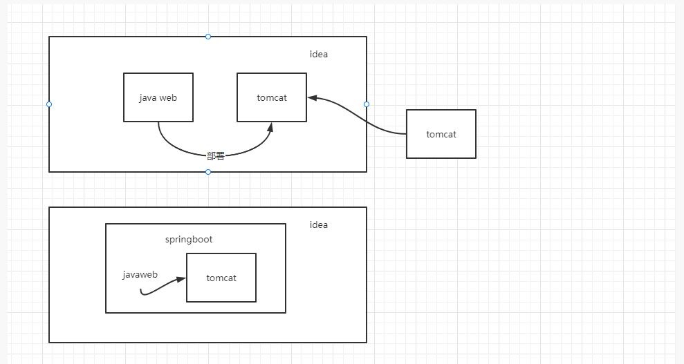

#### 03、提供自以为是的“starter”依赖项以简化您的构建配置

  **依赖jar的完整的开发历程是：**

  - 从jsp/servlet - ssh 这个时代依赖第三jar是通过：
  	- 1、手动 + 官网下载 
	- 2、下载好放入 /webroot/WEB-INF/lib  
	- 3、 很多框架的包相互依赖，每个jar官网都不一样

    **缺点：**官网太多，网速太慢，包的依赖版本必须要匹配，非常耗时。
    **优点：**版本是自己去查找，比较清晰，不需要额外在下载了。

  - ssh--ssm : 出现jar的依赖管理工具: ant  -- > maven 
    - ant 使用非常的复杂，一般可配置太啰嗦
    - maven 其实就是简单ant的版本，取代ant的繁复的配置和构建的问题。 maven不仅仅只是为了解决jar的依赖问题，还解决项目依赖和构建问题，以及jar仓库管理问题。
    - gradle ：服务anroid应用程序开发的包管理，但是有企业用，用并没有maven那么多。

   ** 缺点：**你需要额外学习maven, 学习成本变高， 它一定依赖网络
   ** 好处：**不需要自己手动下载jar依赖，构建的问题。
   ** 没有解决：jar依赖的版本问题，比如如果你开发ssm项目，maven的pom.xml文件中就必须把spring的七大核心包都要进行依赖， spring.jar ---- fastjson.xml，文件上传：spring-web.jar common-fileuploader.jar,common-file.jar**

  - springboot提供了 starter机制：默认装配配置类的问题 和 jar依赖的问题。
    - spring-boot-starter-web.jar
      - tomcat
      - log
      - spring-web spring-webmvc
      - json

     你需要额外学习maven, 学习成本变高， 它一定依赖网络
    
	**好处：**就程序员不需要在去关注，这个jar依赖另外一个jar包的问题，全部自动进行依赖匹配。如果没有这个机制，比如未来要依赖 mybatis-plus-boot-starter，你可以就自己去手动的依赖下面的包：

    - mybatis-version
    - mybatis-plus-version
    - spring-jdbc--version
    - myabtis-spring-version

#### 04、集成了大量常用的第三方库的配置， Spring Boot 应用为这些第三方库提供了几乎可以零配置的开箱即用的能力。
#### 05、零配置。无冗余代码生成和XML 强制配置，遵循“约定大于配置” 。
#### 06、 Spring Boot 不是Spring 的替代者，Spring 框架是通过 IOC 机制来管理 Bean 的。Spring Boot 依赖 Spring 框架来管理对象的依赖。Spring Boot 并不是Spring 的精简版本，而是为使用 Spring 做好各种产品级准备。

#### 07、提供一系列大型项目通用的非功能特性（例如嵌入式服务器、安全性、指标、健康检查和外部化配置）提供生产就绪功能，例如指标、运行状况检查和外部化配置--Actual。

### 总结

用来简化新 Spring 应用的初始搭建以及开发过程。它依赖spring，只不过是spring应用程序开发的一种简化。或者你可以这样理解，springboot是spring框架的一个产品。


## 02、Spring Boot 在应用中的角色

### 概述

Spring Boot 是基于 Spring Framework 来构建的，Spring Framework 是一种 J2EE 的框架（什么是 J2EE？）
Spring Boot 是一种快速构建 Spring 应用脚手架。
Spring Cloud 是构建 Spring Boot 分布式环境，也就是常说的云应用

### 总结

Spring Boot 中流砥柱，承上启下。如果你不学习springBoot后面的springcloud你将无法开发。

### 理解

> vue ---框架  vue-cli 脚手架 - 产品若依、antd 你们公司的产品
> spring--框架  springboot脚手架 --- 个人资讯系统，旅游项目


## 03、SpringBoot系统环境要求（重点）

### 进入企业对环境理解的重要性

未来如果你进入到企业，你开发的

- 01、一定先把代码下载下来，
- 02、确定你项目的技术架构
- 03、运行你的项目。但是在运行之前，最好一定尽早的问，公司是否有产品的项目白皮书（说明书），如果没有，一定问如果遇到问题，我可以咨询哪位。
- 04、运行这个项目，现在公司的一个基础环境是什么样子的呢？
- 05、然后在去运行项目。

### SpringBoot的环境要求

（1）JDK 环境==必须==是 1.8 或者==jdk11==版本及以上
（2）后面要使用到 Maven 管理工具 3.5+ 及以上版本 建议是：3.6 不要用最新。
（3）内置了Tomcat9.x/Servlet4.x
（4）开发工具建议使用 IDEA，也可以 MyEclipse，为了实现一站式服务。

>  官方提供的eclipse工具：https://spring.io/tools (热加载 改的类自动重启)

### Maven 安装与环境变量配置

#### **（1）Maven 安装：**

在官网下载：http://maven.apache.org/download.cgi

历史版本下载：https://archive.apache.org/dist/maven/maven-3/

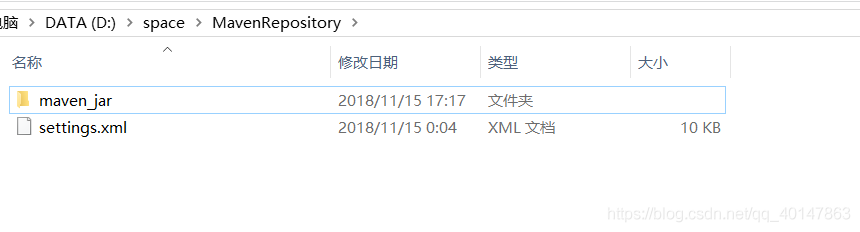

#### **（2）Maven 配置环境变量：**

解压到一个路径，然后配置环境变量：

- 新建变量名：MAVEN_HOME 变量值：D:\server\apache-maven-3.6.0（这是我的 MAVEN 路径）
- 编辑变量名：Path 在最前面加上：%MAVEN_HOME%\bin

#### **（3）检查是否配置成功：**

在命令行输入：

```cmd
mvn -V
```

然后会一大堆东西：

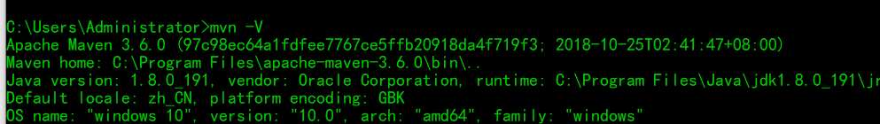

#### **（4）配置 maven 仓库：**

1.打开 maven 文件夹下的 config 文件夹下的 settings.xml；
2.找到 localRepository 标签，此时是被注释掉的，我们解除注释，然后配置一个路径，例如：D:/space/MavenRepository/maven_jar，这样以后 MAVEN 管理下载的jar 包都会在这个路径下。
【注意】：注意结点的位置，先找到注释掉的部分，贴在下面

```xml
<localRepository>D:\space\MavenRepository\maven_jar</localRepository>
```

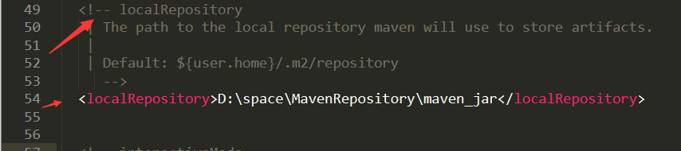

3.配置远程仓库，找到 mirrors 标签

```xml
<!--远程仓库-->
<mirror>
　　<id>aliyun</id>
　　<name>aliyun Maven</name>
　　<mirrorOf>*</mirrorOf>
   <url>http://maven.aliyun.com/nexus/content/groups/public/</url>
</mirror>
```


4.当然我们需要先建这样一个目录结构，然后还要把settings.xml 复制一份到 D:/space/MavenRepository 下


#### **（5）在 idea 配置 maven**

点击【File】>【Settings】>搜索【Maven】，按截图配置安装目录和选择刚刚 settings 配置文件；

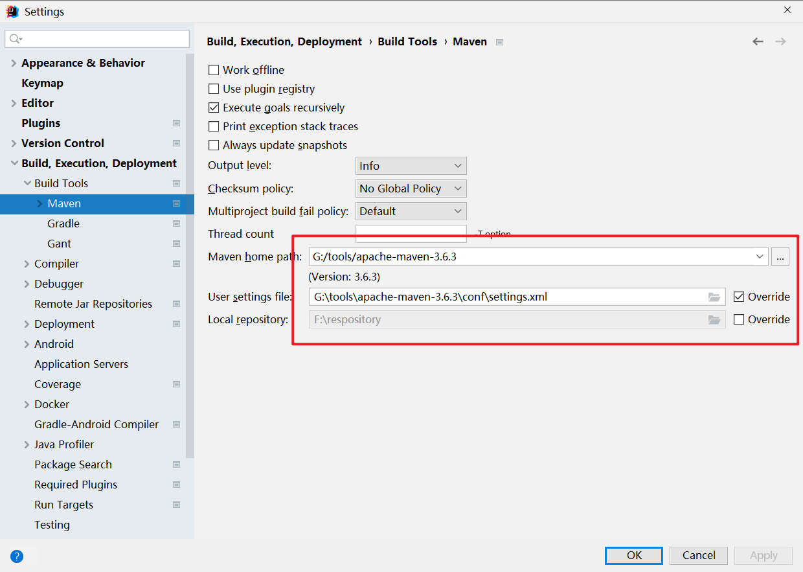

选择完settings之后，本地仓库自动改成settings文件中配置的；点击apply，再点击ok即配置完成。


#### 给未来的新工程提供配置

#### 概述

上面的配置只限于当前工程，如果未来你新建的工程要想只配置一次，然后后续不在配置你就必须配置如下：

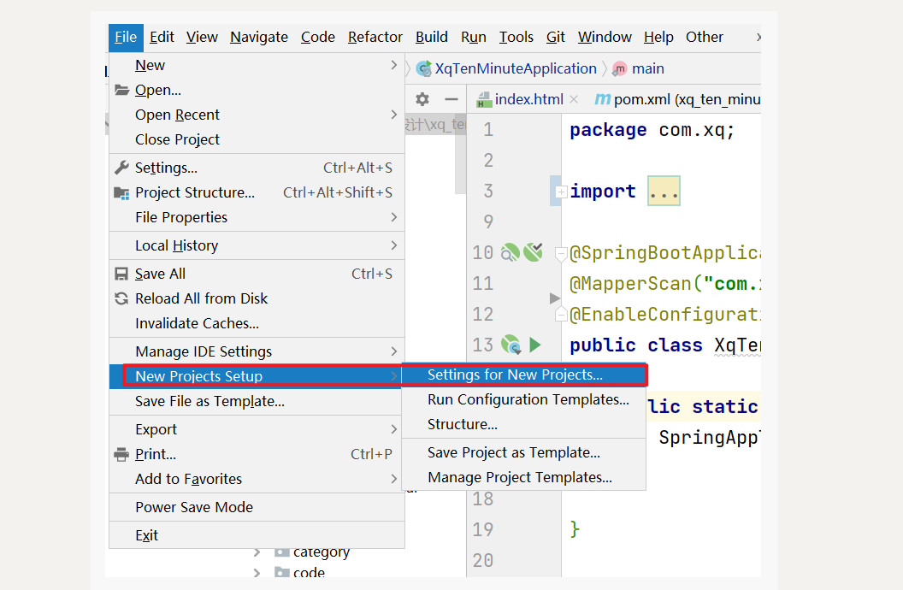

我给未来新建的maven工程，提供一劳永逸的配置。如下：

**maven配置**

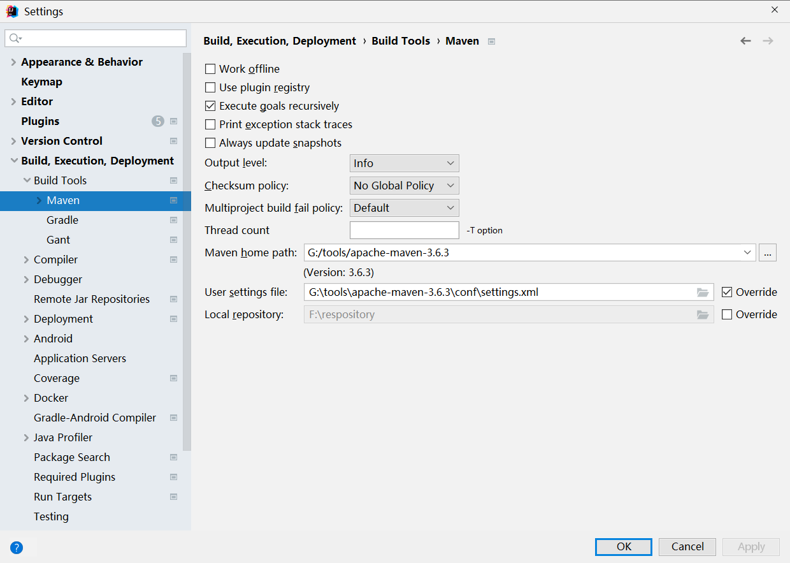

**自动编译**：

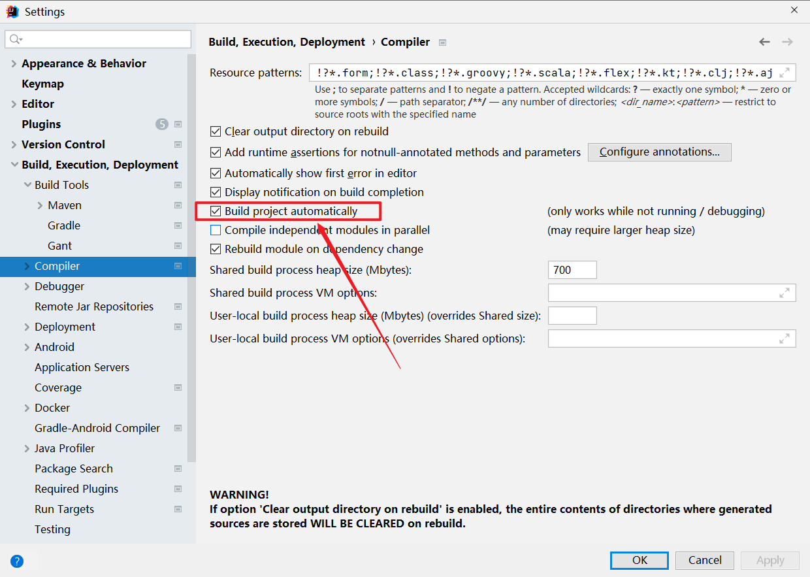

**修改默认编码**

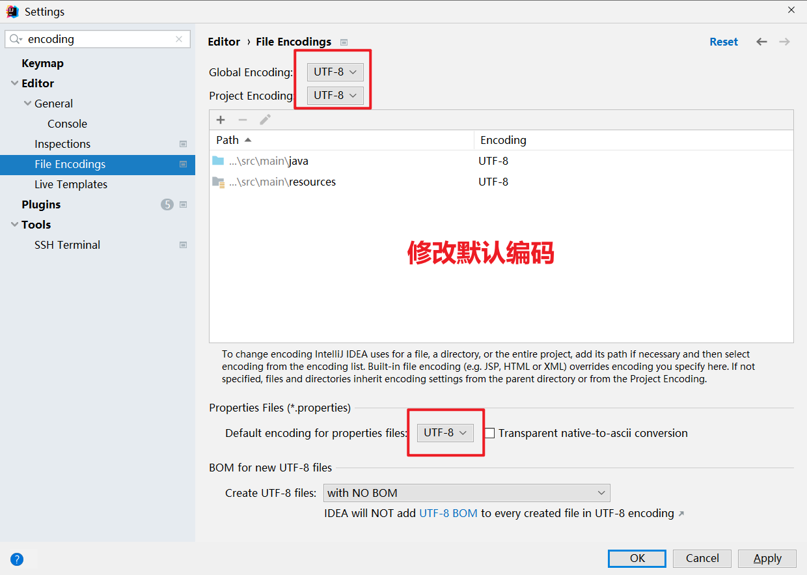


## 04、使用 Idea 快速搭建 Spring Boot

### 官网构建器

快速构建器：https://start.spring.io/

快速入门指南：https://spring.io/quickstart

### **第一步：新建 Spring Initializr 项目：**

（1）选择 Spring Initializr

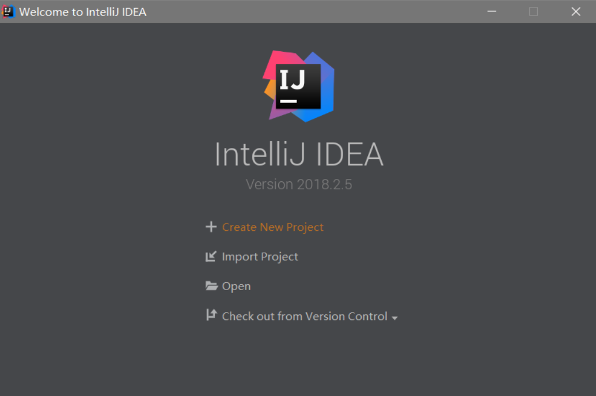

（2）选择 SDK，点击【new】这里就是使用 JAVA SDK 要求版本 1.8+，选择你默认安装在 C:\Program Files\Java\jdk1.8.0_191 目录：然后选择默认的 url （不用管）点击【Next】：

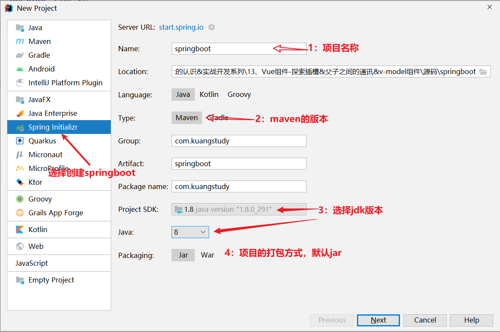

（3）先勾选上 Web 依赖：

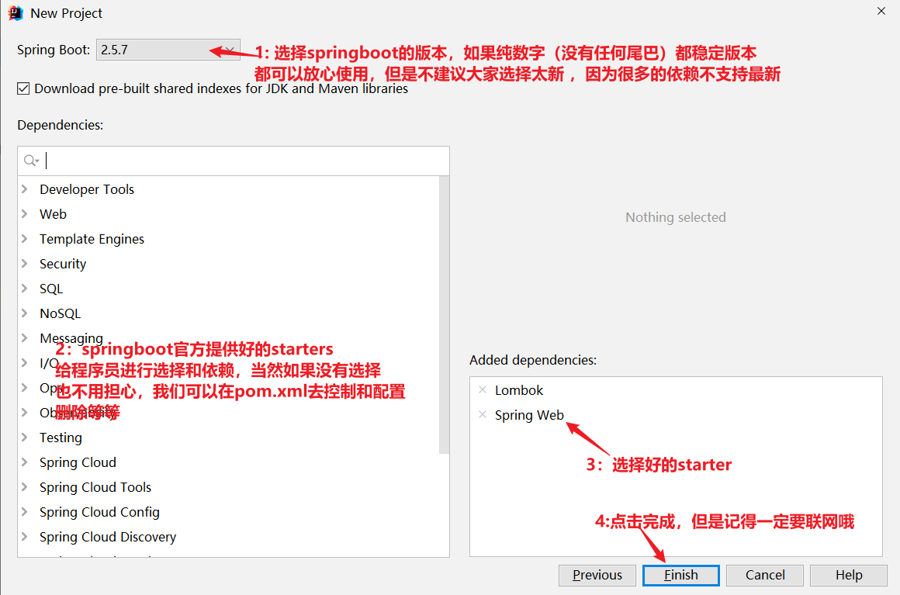


（4）如果是第一次配置 Spring Boot 的话可能需要等待一会儿 IDEA 下载相应的 依赖包，默认创建好的项目结构如下：

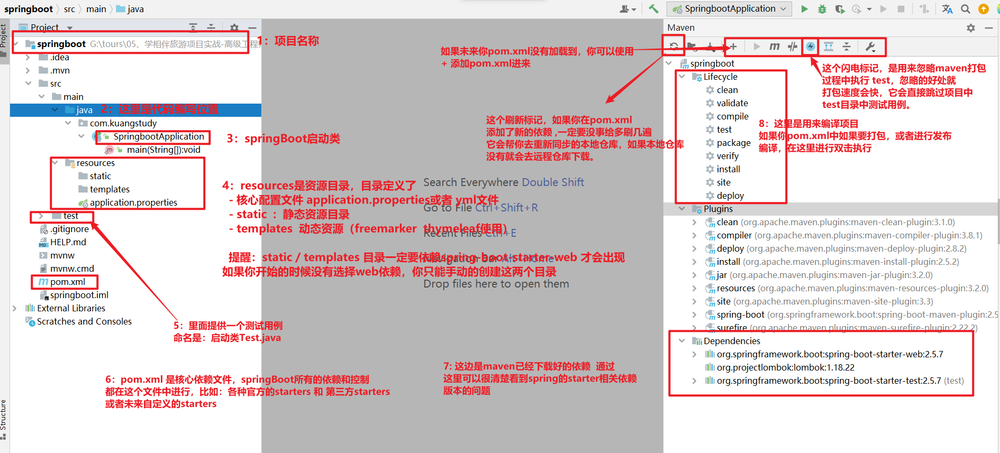

(5)  关于静态资源修改不重启的问题。如下

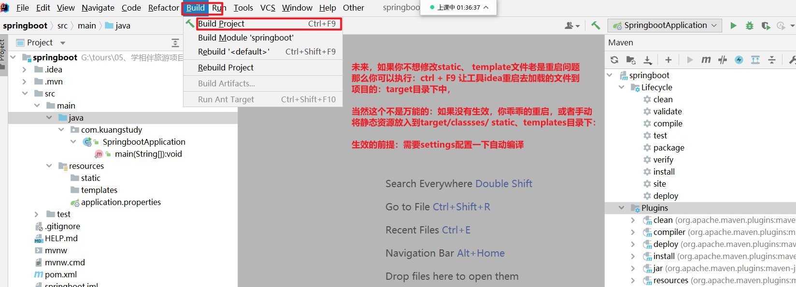

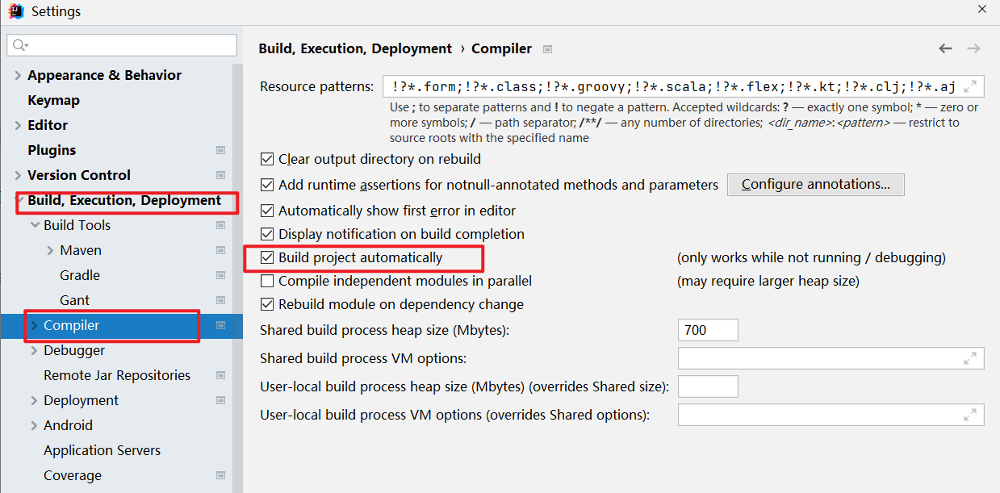

>  提醒：上面的自动加载，不包括修改类，添加方法，添加属性是不会有效的。 其实有一个自动热加载的工具jrebel 建议不去玩，因为收费的。而且手动启动不会浪费很多时间，所以不要去研究。

项目结构还是看上去挺清爽的，少了很多配置文件，我们来了解一下默认生成的有什么：

- SpringbootApplication： 一个带有 main() 方法的类，用于启动应用程序
- SpringbootApplicationTests：一个空的 Junit 测试了，它加载了一个使用 Spring Boot 字典配置功能的 Spring 应用程序上下文
- application.properties：一个空的 properties 文件，可以根据需要添加配置属性
- pom.xml： Maven 构建说明文件


### **第二步：HelloController**

在 【main/java/com.kuangstudy.web】包下新建一个【HelloController】：

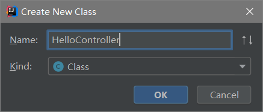

```java
package com.kuangstudy.web;

import org.springframework.web.bind.annotation.GetMapping;
import org.springframework.web.bind.annotation.RestController;

/**
 * Description:
 * Author: yykk Administrator
 * Version: 1.0
 * Create Date Time: 2021/12/11 21:25.
 * Update Date Time:
 *
 * @see
 */
@RestController
public class HelloWorld {

    @GetMapping("/hello")
    public String hello(){
        return "Hello Springboot!!!";
    }
}

```

### **第三步：利用 IDEA 启动 Spring Boot**

（1）我们回到 SpringbootApplication 这个类中，然后右键点击运行：

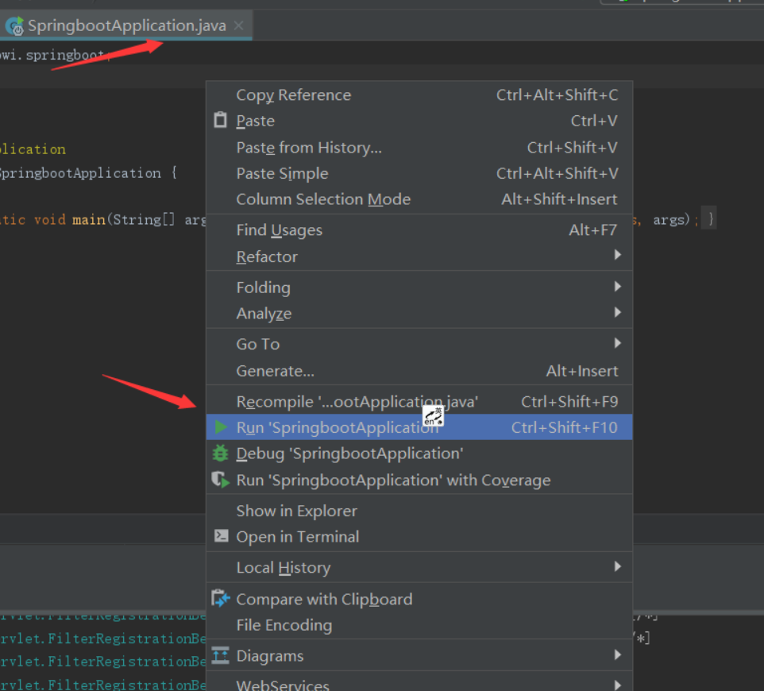

（2）会提示 Maven 导包，点击 import

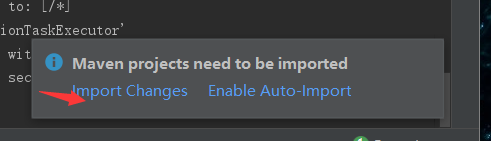

（3）注意：我们之所以在上面的项目中没有手动的去配置 Tomcat 服务器，是因为 Spring Boot 内置了 Tomcat
等待一会儿就会看到下方的成功运行的提示信息：

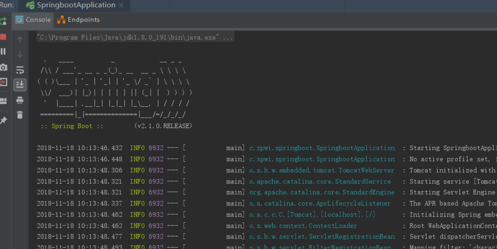

（4）此时，可以看到我们的 Tomcat 运行在 8080 端口，我们来访问下面地址试一下：

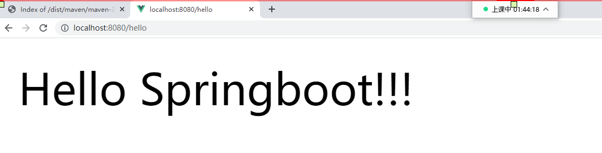


## 05、Spring Boot 项目文件介绍

### 一、解析 pom.xml 文件

（1）让我们来看看默认生成的 pom.xml 文件中到底有些什么：

```xml
<?xml version="1.0" encoding="UTF-8"?>
<project xmlns="http://maven.apache.org/POM/4.0.0" xmlns:xsi="http://www.w3.org/2001/XMLSchema-instance"
         xsi:schemaLocation="http://maven.apache.org/POM/4.0.0 https://maven.apache.org/xsd/maven-4.0.0.xsd">
    <modelVersion>4.0.0</modelVersion>
    <!--springboot版本的控制-->
    <parent>
        <groupId>org.springframework.boot</groupId>
        <artifactId>spring-boot-starter-parent</artifactId>
        <version>2.5.7</version> <!--如果未来你要升级springboot修改此处的版本就可以了-->
        <relativePath/>
    </parent>
    <!--项目的maven的坐标骨架，把当前项目生成在本地仓库的目录-->
    <groupId>com.kuangstudy</groupId>
    <artifactId>springboot</artifactId>
    <version>0.0.1-SNAPSHOT</version>
    <name>springboot</name>
    <description>springboot</description>

    <!--maven属性配置，一般用来做version控制居多-->
    <properties>
        <java.version>1.8</java.version>
    </properties>

    <!--项目依赖-->
    <dependencies>
        <!--springboot的web的starter-->
        <dependency>
            <groupId>org.springframework.boot</groupId>
            <artifactId>spring-boot-starter-web</artifactId>
        </dependency>

        <!--lombok-->
        <dependency>
            <groupId>org.projectlombok</groupId>
            <artifactId>lombok</artifactId>
            <optional>true</optional>
        </dependency>

        <!--springboot的test的starter-->
        <dependency>
            <groupId>org.springframework.boot</groupId>
            <artifactId>spring-boot-starter-test</artifactId>
            <scope>test</scope>
        </dependency>

    </dependencies>

    <build>
        <!--springboto的插件，用来打包和构建使用-->
        <plugins>
            <plugin>
                <groupId>org.springframework.boot</groupId>
                <artifactId>spring-boot-maven-plugin</artifactId>
                <configuration>
                    <excludes>
                        <exclude>
                            <groupId>org.projectlombok</groupId>
                            <artifactId>lombok</artifactId>
                        </exclude>
                    </excludes>
                </configuration>
            </plugin>
        </plugins>
    </build>

</project>
```

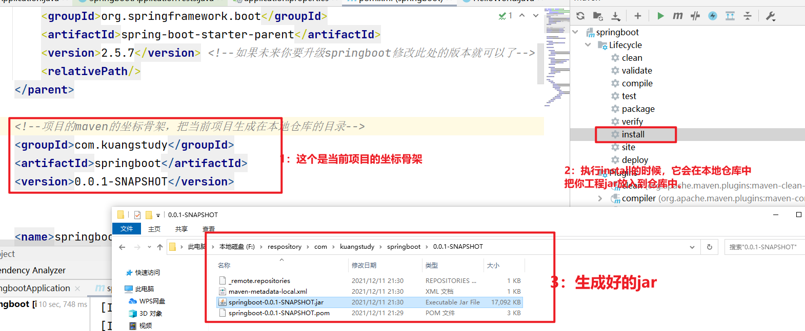


（2）我们可以看到一个比较陌生一些的标签 ，这个标签是在配置 Spring Boot 的父级依赖：

```xml
<parent>
    <groupId>org.springframework.boot</groupId>
    <artifactId>spring-boot-starter-parent</artifactId>
    <version>2.5.8</version>
    <relativePath/>
</parent>
```

有了这个，当前的项目才是 Spring Boot 项目，spring-boot-starter-parent 是一个特殊的 starter ，它用来提供相关的 Maven 默认依赖，使用它之后，常用的包依赖就可以省去 version 标签。

下面的版本为什么不加version号：

```xml
<!--springboot的web的starter-->
<dependency>
    <groupId>org.springframework.boot</groupId>
    <artifactId>spring-boot-starter-web</artifactId>
</dependency>
```

因为：spring-boot-starter-parent 是一个父工程，spring-boot-starter-web和spring-boot-starter-test等都是子工程，而子工程的版本都已经由父工程已经管理起来了。所以在项目开发中我们就不需要指定版本号。那到底parent工程管理了多少呢？点击进去查看一下呗：其实马上要讲的 starter。

```xml
<activemq.version>5.16.3</activemq.version>
    <antlr2.version>2.7.7</antlr2.version>
    <appengine-sdk.version>1.9.91</appengine-sdk.version>
    <artemis.version>2.17.0</artemis.version>
    <aspectj.version>1.9.7</aspectj.version>
    <assertj.version>3.19.0</assertj.version>
    <atomikos.version>4.0.6</atomikos.version>
    <awaitility.version>4.0.3</awaitility.version>
    <build-helper-maven-plugin.version>3.2.0</build-helper-maven-plugin.version>
    <byte-buddy.version>1.10.22</byte-buddy.version>
    <caffeine.version>2.9.2</caffeine.version>
    <cassandra-driver.version>4.11.3</cassandra-driver.version>
    <classmate.version>1.5.1</classmate.version>
    <commons-codec.version>1.15</commons-codec.version>
    <commons-dbcp2.version>2.8.0</commons-dbcp2.version>
    <commons-lang3.version>3.12.0</commons-lang3.version>
    <commons-pool.version>1.6</commons-pool.version>
    <commons-pool2.version>2.9.0</commons-pool2.version>
    <couchbase-client.version>3.1.7</couchbase-client.version>
    <db2-jdbc.version>11.5.6.0</db2-jdbc.version>
    <dependency-management-plugin.version>1.0.11.RELEASE</dependency-management-plugin.version>
    <derby.version>10.14.2.0</derby.version>
    <dropwizard-metrics.version>4.1.25</dropwizard-metrics.version>
    <ehcache.version>2.10.9.2</ehcache.version>
    <ehcache3.version>3.9.5</ehcache3.version>
    <elasticsearch.version>7.12.1</elasticsearch.version>
    <embedded-mongo.version>3.0.0</embedded-mongo.version>
    <flyway.version>7.7.3</flyway.version>
    <freemarker.version>2.3.31</freemarker.version>
    <git-commit-id-plugin.version>4.0.5</git-commit-id-plugin.version>
    <glassfish-el.version>3.0.3</glassfish-el.version>
    <glassfish-jaxb.version>2.3.5</glassfish-jaxb.version>
    <groovy.version>3.0.8</groovy.version>
    <gson.version>2.8.7</gson.version>
    <h2.version>1.4.200</h2.version>
    <hamcrest.version>2.2</hamcrest.version>
    <hazelcast.version>4.1.5</hazelcast.version>
    <hazelcast-hibernate5.version>2.2.1</hazelcast-hibernate5.version>
    <hibernate.version>5.4.32.Final</hibernate.version>
    <hibernate-validator.version>6.2.0.Final</hibernate-validator.version>
    <hikaricp.version>4.0.3</hikaricp.version>
    <hsqldb.version>2.5.2</hsqldb.version>
    <htmlunit.version>2.49.1</htmlunit.version>
    <httpasyncclient.version>4.1.4</httpasyncclient.version>
    <httpclient.version>4.5.13</httpclient.version>
    <httpclient5.version>5.0.4</httpclient5.version>
    <httpcore.version>4.4.14</httpcore.version>
    <httpcore5.version>5.1.1</httpcore5.version>
    <infinispan.version>12.1.7.Final</infinispan.version>
    <influxdb-java.version>2.21</influxdb-java.version>
    <jackson-bom.version>2.12.4</jackson-bom.version>
    <jakarta-activation.version>1.2.2</jakarta-activation.version>
    <jakarta-annotation.version>1.3.5</jakarta-annotation.version>
    <jakarta-jms.version>2.0.3</jakarta-jms.version>
    <jakarta-json.version>1.1.6</jakarta-json.version>
    <jakarta-json-bind.version>1.0.2</jakarta-json-bind.version>
    <jakarta-mail.version>1.6.7</jakarta-mail.version>
    <jakarta-persistence.version>2.2.3</jakarta-persistence.version>
    <jakarta-servlet.version>4.0.4</jakarta-servlet.version>
    <jakarta-servlet-jsp-jstl.version>1.2.7</jakarta-servlet-jsp-jstl.version>
    <jakarta-transaction.version>1.3.3</jakarta-transaction.version>
    <jakarta-validation.version>2.0.2</jakarta-validation.version>
    <jakarta-websocket.version>1.1.2</jakarta-websocket.version>
    <jakarta-ws-rs.version>2.1.6</jakarta-ws-rs.version>
    <jakarta-xml-bind.version>2.3.3</jakarta-xml-bind.version>
    <jakarta-xml-soap.version>1.4.2</jakarta-xml-soap.version>
    <jakarta-xml-ws.version>2.3.3</jakarta-xml-ws.version>
    <janino.version>3.1.6</janino.version>
    <javax-activation.version>1.2.0</javax-activation.version>
    <javax-annotation.version>1.3.2</javax-annotation.version>
    <javax-cache.version>1.1.1</javax-cache.version>
    <javax-jaxb.version>2.3.1</javax-jaxb.version>
    <javax-jaxws.version>2.3.1</javax-jaxws.version>
    <javax-jms.version>2.0.1</javax-jms.version>
    <javax-json.version>1.1.4</javax-json.version>
    <javax-jsonb.version>1.0</javax-jsonb.version>
    <javax-mail.version>1.6.2</javax-mail.version>
    <javax-money.version>1.1</javax-money.version>
    <javax-persistence.version>2.2</javax-persistence.version>
    <javax-transaction.version>1.3</javax-transaction.version>
    <javax-validation.version>2.0.1.Final</javax-validation.version>
    <javax-websocket.version>1.1</javax-websocket.version>
    <jaxen.version>1.2.0</jaxen.version>
    <jaybird.version>4.0.3.java8</jaybird.version>
    <jboss-logging.version>3.4.2.Final</jboss-logging.version>
    <jboss-transaction-spi.version>7.6.1.Final</jboss-transaction-spi.version>
    <jdom2.version>2.0.6</jdom2.version>
    <jedis.version>3.6.3</jedis.version>
    <jersey.version>2.33</jersey.version>
    <jetty-el.version>9.0.48</jetty-el.version>
    <jetty-jsp.version>2.2.0.v201112011158</jetty-jsp.version>
    <jetty-reactive-httpclient.version>1.1.10</jetty-reactive-httpclient.version>
    <jetty.version>9.4.43.v20210629</jetty.version>
    <jmustache.version>1.15</jmustache.version>
    <johnzon.version>1.2.14</johnzon.version>
    <jolokia.version>1.6.2</jolokia.version>
    <jooq.version>3.14.13</jooq.version>
    <json-path.version>2.5.0</json-path.version>
    <json-smart.version>2.4.7</json-smart.version>
    <jsonassert.version>1.5.0</jsonassert.version>
    <jstl.version>1.2</jstl.version>
    <jtds.version>1.3.1</jtds.version>
    <junit.version>4.13.2</junit.version>
    <junit-jupiter.version>5.7.2</junit-jupiter.version>
    <kafka.version>2.7.1</kafka.version>
    <kotlin.version>1.5.21</kotlin.version>
    <kotlin-coroutines.version>1.5.1</kotlin-coroutines.version>
    <lettuce.version>6.1.4.RELEASE</lettuce.version>
    <liquibase.version>4.3.5</liquibase.version>
    <log4j2.version>2.14.1</log4j2.version>
    <logback.version>1.2.5</logback.version>
    <lombok.version>1.18.20</lombok.version>
    <mariadb.version>2.7.4</mariadb.version>
    <maven-antrun-plugin.version>1.8</maven-antrun-plugin.version>
    <maven-assembly-plugin.version>3.3.0</maven-assembly-plugin.version>
    <maven-clean-plugin.version>3.1.0</maven-clean-plugin.version>
    <maven-compiler-plugin.version>3.8.1</maven-compiler-plugin.version>
    <maven-dependency-plugin.version>3.1.2</maven-dependency-plugin.version>
    <maven-deploy-plugin.version>2.8.2</maven-deploy-plugin.version>
    <maven-enforcer-plugin.version>3.0.0</maven-enforcer-plugin.version>
    <maven-failsafe-plugin.version>2.22.2</maven-failsafe-plugin.version>
    <maven-help-plugin.version>3.2.0</maven-help-plugin.version>
    <maven-install-plugin.version>2.5.2</maven-install-plugin.version>
    <maven-invoker-plugin.version>3.2.2</maven-invoker-plugin.version>
    <maven-jar-plugin.version>3.2.0</maven-jar-plugin.version>
    <maven-javadoc-plugin.version>3.2.0</maven-javadoc-plugin.version>
    <maven-resources-plugin.version>3.2.0</maven-resources-plugin.version>
    <maven-shade-plugin.version>3.2.4</maven-shade-plugin.version>
    <maven-source-plugin.version>3.2.1</maven-source-plugin.version>
    <maven-surefire-plugin.version>2.22.2</maven-surefire-plugin.version>
    <maven-war-plugin.version>3.3.1</maven-war-plugin.version>
    <micrometer.version>1.7.3</micrometer.version>
    <mimepull.version>1.9.15</mimepull.version>
    <mockito.version>3.9.0</mockito.version>
    <mongodb.version>4.2.3</mongodb.version>
    <mssql-jdbc.version>9.2.1.jre8</mssql-jdbc.version>
    <mysql.version>8.0.26</mysql.version>
    <nekohtml.version>1.9.22</nekohtml.version>
    <neo4j-java-driver.version>4.2.7</neo4j-java-driver.version>
    <netty.version>4.1.67.Final</netty.version>
    <netty-tcnative.version>2.0.40.Final</netty-tcnative.version>
    <oauth2-oidc-sdk.version>9.9.1</oauth2-oidc-sdk.version>
    <nimbus-jose-jwt.version>9.10.1</nimbus-jose-jwt.version>
    <ojdbc.version>19.3.0.0</ojdbc.version>
    <okhttp3.version>3.14.9</okhttp3.version>
    <oracle-database.version>21.1.0.0</oracle-database.version>
    <pooled-jms.version>1.2.2</pooled-jms.version>
    <postgresql.version>42.2.23</postgresql.version>
    <prometheus-pushgateway.version>0.10.0</prometheus-pushgateway.version>
    <quartz.version>2.3.2</quartz.version>
    <querydsl.version>4.4.0</querydsl.version>
    <r2dbc-bom.version>Arabba-SR10</r2dbc-bom.version>
    <rabbit-amqp-client.version>5.12.0</rabbit-amqp-client.version>
    <reactive-streams.version>1.0.3</reactive-streams.version>
    <reactor-bom.version>2020.0.10</reactor-bom.version>
    <rest-assured.version>4.3.3</rest-assured.version>
    <rsocket.version>1.1.1</rsocket.version>
    <rxjava.version>1.3.8</rxjava.version>
    <rxjava-adapter.version>1.2.1</rxjava-adapter.version>
    <rxjava2.version>2.2.21</rxjava2.version>
    <saaj-impl.version>1.5.3</saaj-impl.version>
    <selenium.version>3.141.59</selenium.version>
    <selenium-htmlunit.version>2.49.1</selenium-htmlunit.version>
    <sendgrid.version>4.7.4</sendgrid.version>
    <servlet-api.version>4.0.1</servlet-api.version>
    <slf4j.version>1.7.32</slf4j.version>
    <snakeyaml.version>1.28</snakeyaml.version>
    <solr.version>8.8.2</solr.version>
    <spring-amqp.version>2.3.10</spring-amqp.version>
    <spring-batch.version>4.3.3</spring-batch.version>
    <spring-data-bom.version>2021.0.4</spring-data-bom.version>
    <spring-framework.version>5.3.9</spring-framework.version>
    <spring-hateoas.version>1.3.3</spring-hateoas.version>
    <spring-integration.version>5.5.3</spring-integration.version>
    <spring-kafka.version>2.7.6</spring-kafka.version>
    <spring-ldap.version>2.3.4.RELEASE</spring-ldap.version>
    <spring-restdocs.version>2.0.5.RELEASE</spring-restdocs.version>
    <spring-retry.version>1.3.1</spring-retry.version>
    <spring-security.version>5.5.2</spring-security.version>
    <spring-session-bom.version>2021.0.2</spring-session-bom.version>
    <spring-ws.version>3.1.1</spring-ws.version>
    <sqlite-jdbc.version>3.34.0</sqlite-jdbc.version>
    <sun-mail.version>1.6.7</sun-mail.version>
    <thymeleaf.version>3.0.12.RELEASE</thymeleaf.version>
    <thymeleaf-extras-data-attribute.version>2.0.1</thymeleaf-extras-data-attribute.version>
    <thymeleaf-extras-java8time.version>3.0.4.RELEASE</thymeleaf-extras-java8time.version>
    <thymeleaf-extras-springsecurity.version>3.0.4.RELEASE</thymeleaf-extras-springsecurity.version>
    <thymeleaf-layout-dialect.version>2.5.3</thymeleaf-layout-dialect.version>
    <tomcat.version>9.0.52</tomcat.version>
    <unboundid-ldapsdk.version>4.0.14</unboundid-ldapsdk.version>
    <undertow.version>2.2.10.Final</undertow.version>
    <versions-maven-plugin.version>2.8.1</versions-maven-plugin.version>
    <webjars-hal-browser.version>3325375</webjars-hal-browser.version>
    <webjars-locator-core.version>0.46</webjars-locator-core.version>
    <wsdl4j.version>1.6.3</wsdl4j.version>
```

那什么情况下的依赖需要去指定版本号呢？

- 不想用这个版本号的时候

- 第三方开发的starter就必须指定版本号。

  ```xml
  <dependency>
      <groupId>com.baomidou</groupId>
      <artifactId>mybatis-plus-boot-starter</artifactId>
      <version>3.4.2</version>
  </dependency>
  ```

- 上面没有提供的就必须指定版本号

  - 首先我不加版本号，看能不能下载，如果能拿忽略
  - 如果不加下载不下例子啊，我就就指定版本号。

- 可能版本出来冲突，也可能会指定版本号。

关于具体 Spring Boot 提供了哪些 jar 包的依赖，我们可spring-boot-starter-web以查看本地 Maven 仓库下：\repository\org\springframework\boot\spring-boot-dependencies\2.5.7RELEASE\spring-boot-dependencies-2.5.7.RELEASE.pom 文件来查看，挺长的…

### 二、应用入口类 SpringbootApplication&核心注解

官网：https://docs.spring.io/spring-boot/docs/2.5.8-SNAPSHOT/reference/htmlsingle/#getting-started.installing

许多 Spring Boot 开发人员喜欢他们的应用程序使用自动配置、组件扫描并能够在他们的“应用程序类”上定义额外的配置。`@SpringBootApplication`可以使用单个注释来启用这三个功能，即：

```
@SpringBootConfiguration
@EnableAutoConfiguration
@ComponentScan
```

- `@EnableAutoConfiguration`: 启用[Spring Boot 的自动配置机制](https://docs.spring.io/spring-boot/docs/2.5.8-SNAPSHOT/reference/htmlsingle/#using.auto-configuration) 其实告诉为什么项目里能够自动把各种starter依赖进来以后就能够使用和生效。就是这个注解来完成。

- `@ComponentScan`:`@Component`在应用程序所在的包上启用扫描（查看[最佳实践](https://docs.spring.io/spring-boot/docs/2.5.8-SNAPSHOT/reference/htmlsingle/#using.structuring-your-code)）在传统的spring开发中，我们如果要进行包的扫描，就必须去在配置文件xml指定。如下：

  ```xml
  <component-scan base-package="com.xxx.service"></component-scan>
  <component-scan base-package="com.xxx.dao"></component-scan>
  <component-scan base-package="com.xxx.web"></component-scan>
  ```

  上面的方式是传统的加载bean到springioc容器的方式，目的是告诉spring容器在启动的时候会去扫描上面的三个目录，然后找到这个包下所有的类，并且加了@Service ，@Conpoment、@Controller、@Repository等，会加入ioc容器，其它不会加载。

  > springboot的默认加载机制：是以当前启动的类包作为component-scan默认扫描的包。

- `@SpringBootConfiguration`: 启用在上下文中注册额外的 bean 或导入额外的配置类。Spring 标准的替代方案`@Configuration`，可帮助您在集成测试中[检测配置](https://docs.spring.io/spring-boot/docs/2.5.8-SNAPSHOT/reference/htmlsingle/#features.testing.spring-boot-applications.detecting-configuration)。

```java
@SpringBootApplication // same as @SpringBootConfiguration @EnableAutoConfiguration  @ComponentScan
public class MyApplication {

    public static void main(String[] args) {
        SpringApplication.run(MyApplication.class, args);
    }

}
```

- 配置类必须加注解@Configuration  或者@SpringBootConfiguration
- 和@ComponentScan 的作用是一样的。


### 总结

springboot核心注解：@SpringBootApplication ，它是由

- @ComponentScan
- @SpringConguration
- @EnableAutoConfiguration 

三个注解的复合。三个注解的作用：都是把项目中bean，第三容器的bean，把官方提供starter的配置类的bean加载springioc容器的作用：

- @ComponentScan：是把你项目中，自己编写的那些bean加载ioc容器中，比如：UserService,UserMapper.UserConntroller

- @EnableAutoConfiguration ：是把官方提供starter里面，内置的配置类的bean加载ioc容器冲

  - 内部提供的配置类：xxxxAutoConfiguration 比如：
  - RedisAutoConfiguration 这些都配置类

- @SpringConfiguration：+@Bean （避免重复造轮子）

  - 如果你对官方的starter提供的配置不满意，你可以考虑用这个放去覆盖内部的配置。

  - 或者未来你要自己去扩展starter机制，就必须自己去定义配置类。（自定义starter）

    - 方便扩展，可以便于后续去开发的依赖公共模板
    - 或者未来你想自定义starter你就可以用配置类完成。

  - 传统的方式的扩展，通过xml去配置，配置类就是xml的替代。

  - @SpringConfiguration+@Bean 更深层次含义：就说官方没提供的你自己去扩展把。

  - ==@Bean必须要配置配置,或者@Component组件或者其子组件都有用。否则无意义。==但是还推荐：配置注解

最后：无论上面那种方式，其目的都是把项目中，其他人写好的，或官方的提供的bean记载到ioc容器中。


### 三、SpringBoot的全局配置文件

查看官网地址：https://docs.spring.io/spring-boot/docs/2.5.8-SNAPSHOT/reference/htmlsingle/#application-properties

Spring Boot 使用一个全局的配置文件 application.properties 或 application.yml，放置在【src/main/resources】目录或者类路径的 /config 下。Spring Boot 不仅支持常规的 properties 配置文件，还支持 yaml 语言的配置文件。yaml 是以数据为中心的语言，在配置数据的时候具有面向对象的特征。Spring Boot 的全局配置文件的作用是对一些默认配置的配置值进行修改。

#### 写法：

```yaml
server:
  port: 8081
```

上方的`：value`  的时候，一定至少要有一个空格。

修改 properties 配置文件实例：

（1）打开 resources 下的 application.yml

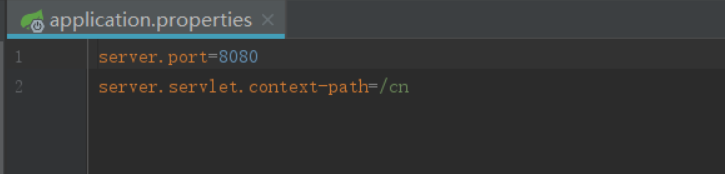

（2）在这里我们可以设置访问的端口，将 Tomcat 默认端口设置为 8080 （默认的不修改） ，并将默认的访问路径从 “/” 修改为 “/cn” 时，再访问 http://localhost:8080/ 是什么都没有的，此时要访问 hello 是要使用 http://localhost:8080/cn/hello

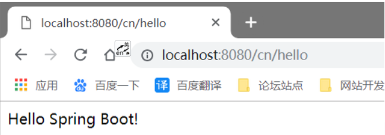


（3）**使用 yml 文件作为配置文件**，我们直接把 .properties 后缀的文件删掉，使用 .yml 文件来进行简单的配置

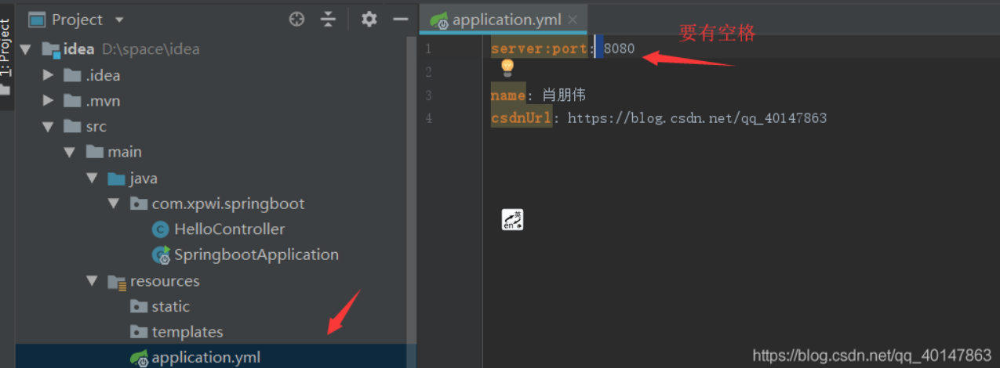

（4）在然后使用在我们的 HelloController.java 类中使用 @Value 来获取配置属性，代码（请看注释）：

```java
package com.xpwi.springboot;

import org.springframework.beans.factory.annotation.Value;
import org.springframework.web.bind.annotation.RequestMapping;
import org.springframework.web.bind.annotation.RestController;

/**
 * 测试控制器
 *
 * @author: @肖朋伟CSDN
 * @create: 2018-11-18
 */
@RestController
public class HelloController {

    // 获取.yml 文件中值
    @Value("${name}")
    private String name;

    // 获取 age
    @Value("${csdnUrl}")
    private String csdnUrl;

    //路径映射，对应浏览器访问的地址，访问该路径则执行下面函数
    @RequestMapping("/hello")
    public String hello() {
        return name + " CSDN 博客："+ csdnUrl;
    }
}

```

（5）重启 Spring Boot ，输入地址：http://localhost:8080/hello 能看到正确的结果：


#### 总结

大家可能会有疑虑，springboot不是说没有xml配置文件吗？那application.yml是什么东西？

传统的所谓spring的xml文件是指，用初始化bean的文件，而application.yml它仅仅只是一个属性配置文件。因为官方提供了很多的starter（我官方提供很多的配置类），但是这个配置的信息我是不可能写死的，所以我提供配置属性类，让你进行扩展和覆盖。所以这个application.yml是一个全局属性配置文件，在这里配置的信息是覆盖starter中提供配置的类的信息。

```java
RedisAutoConfiguration.java + RedisProerpties.java
```

RedisProerpties.java : 属性配置类。它的配置就是application.yml去配置信息，

***如果没有这个机制。你思考这个问题吗？我们指定连接redis需要指定ip和端口，和密码?  假设你提供的ip：152.150.47.5  port:6378  pwd:154545 .。思考我如何把这ip、端口、 密码等让RedisAutoConfiguration.java去知晓。你不可能说去改源码重新编译。如果是这样的话，我还不自己去写一个RedisConfiguration.java。所以官方已经想的很清楚了。每个配置类如果未来需要动态配置和修改里面的参数，就必须提供属性配置类：xxxProperties. 而我们在application.yml配置的属性都是给xxxProperties.java类的属性进行赋值。原理就是：**

- 第一步：读取你项目的applicaiton.yml文件内容到内存中

- 第二步：然后通过前缀 spring.redis ，找到你的类xxxProperties。 

  ```java
  @ConfigurationProperties(prefix="spring.redis")
  public class RedisProperties(){
  	private String ip;
  }
  ```

  ```yaml
  spring:
     redis:
  	  ip: 127.0.0.1
  ```

  

- 第三步：通过反射把对应配置文件的值，映射到xxxProperties的属性中去

#### 总结

application.yml会把这个文件称之为：全职属性配置文件


### 【注意】：此时如果你第一次使用 idea 出现中文乱码，解决办法：

- 然后在修改idea的encoding统一成：UTF-8
- 如果遇到yml文件保存，先把里面中文全部剔除
- 如果实在不行，把文件删除，重新创建，然后复制和粘贴。

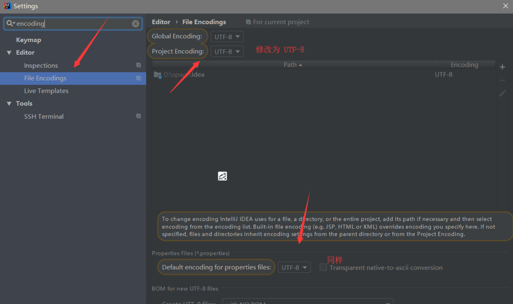


## 06、什么是Starters

Starters 是一组方便的依赖描述符，您可以将它们包含在您的应用程序中。您可以获得所需的所有 Spring 和相关技术的一站式服务，而无需搜索示例代码和复制粘贴加载的依赖项描述符。例如，如果您想开始使用 Spring 和 JPA 进行数据库访问，请`spring-boot-starter-data-jpa`在您的项目中包含依赖项。

### starters作用

- 解决第三个的依赖问题（一堆配置类，可以帮助我们解决很多初始化配置类的问题，我们可以做拿来主义者，不需要造轮子）
- 解决依赖版本的问题。就程序员不需要在去关注每个jar依赖另外一个jar包的问题，全部自动进行依赖管理version的统一升降的问题。

starters 包含许多依赖项，您需要这些依赖项来快速启动和运行项目，并使用一组一致的、受支持的托管传递依赖项。

```properties
 starters有什么
 
所有官方首发都遵循类似的命名模式；spring-boot-starter-*，其中*是特定类型的应用程序。此命名结构旨在在您需要查找入门时提供帮助。许多 IDE 中的 Maven 集成允许您按名称搜索依赖项。例如，安装适当的 Eclipse 或 Spring Tools 插件后，您可以ctrl-space在 POM 编辑器中按并键入“spring-boot-starter”以获得完整列表。

正如“创建您自己的启动器”部分所述，第三方启动器不应以 开头spring-boot，因为它是为官方 Spring Boot 工件保留的。相反，第三方启动器通常以项目名称开头。例如，名为的第三方启动项目thirdpartyproject通常命名为thirdpartyproject-spring-boot-starter。
```

### starters命名规范

- 官方的：spring-boot-starter-*   ，在依赖的时候不需要指定版本号

- 第三个的或者自定义的：xxx-boot-starter，这个在开发的时候必须要指定版本号。比如；

  ```xml
  mybatis-plus-boot-starter
  ```

  

### 官方提供的starters

以下应用启动器由 Spring Boot`org.springframework.boot`组下提供：

| Name                                          | 描述                                                         |
| :-------------------------------------------- | :----------------------------------------------------------- |
| `spring-boot-starter`                         | 核心启动器，包括自动配置支持、日志记录和 YAML                |
| `spring-boot-starter-activemq`                | 使用 Apache ActiveMQ 的 JMS 消息传递入门                     |
| `spring-boot-starter-amqp`                    | 使用 Spring AMQP 和 Rabbit MQ 的入门者                       |
| `spring-boot-starter-aop`                     | 使用 Spring AOP 和 AspectJ 进行面向方面编程的入门            |
| `spring-boot-starter-artemis`                 | 使用 Apache Artemis 的 JMS 消息传递入门                      |
| `spring-boot-starter-batch`                   | 使用 Spring Batch 的启动器                                   |
| `spring-boot-starter-cache`                   | 使用 Spring Framework 的缓存支持的 Starter                   |
| `spring-boot-starter-data-cassandra`          | 使用 Cassandra 分布式数据库和 Spring Data Cassandra 的 Starter |
| `spring-boot-starter-data-cassandra-reactive` | Starter 使用 Cassandra 分布式数据库和 Spring Data Cassandra Reactive |
| `spring-boot-starter-data-couchbase`          | 使用 Couchbase 面向文档的数据库和 Spring Data Couchbase 的入门者 |
| `spring-boot-starter-data-couchbase-reactive` | 使用 Couchbase 面向文档的数据库和 Spring Data Couchbase Reactive 的启动器 |
| `spring-boot-starter-data-elasticsearch`      | 使用 Elasticsearch 搜索和分析引擎以及 Spring Data Elasticsearch 的入门者 |
| `spring-boot-starter-data-jdbc`               | 使用 Spring Data JDBC 的入门者                               |
| `spring-boot-starter-data-jpa`                | 将 Spring Data JPA 与 Hibernate 结合使用的入门者             |
| `spring-boot-starter-data-ldap`               | 使用 Spring Data LDAP 的初学者                               |
| `spring-boot-starter-data-mongodb`            | 使用 MongoDB 面向文档的数据库和 Spring Data MongoDB 的入门者 |
| `spring-boot-starter-data-mongodb-reactive`   | Starter 使用 MongoDB 面向文档的数据库和 Spring Data MongoDB Reactive |
| `spring-boot-starter-data-neo4j`              | 使用 Neo4j 图形数据库和 Spring Data Neo4j 的入门者           |
| `spring-boot-starter-data-r2dbc`              | 使用 Spring Data R2DBC 的启动器                              |
| `spring-boot-starter-data-redis`              | 将 Redis 键值数据存储与 Spring Data Redis 和 Lettuce 客户端一起使用的入门者 |
| `spring-boot-starter-data-redis-reactive`     | 将 Redis 键值数据存储与 Spring Data Redis 反应式和 Lettuce 客户端一起使用的启动器 |
| `spring-boot-starter-data-rest`               | 使用 Spring Data REST 在 REST 上公开 Spring Data 存储库的启动器 |
| `spring-boot-starter-freemarker`              | 使用 FreeMarker 视图构建 MVC Web 应用程序的初学者            |
| `spring-boot-starter-groovy-templates`        | 使用 Groovy 模板视图构建 MVC Web 应用程序的入门者            |
| `spring-boot-starter-hateoas`                 | 使用 Spring MVC 和 Spring HATEOAS 构建基于超媒体的 RESTful Web 应用程序的启动器 |
| `spring-boot-starter-integration`             | 使用 Spring Integration 的入门者                             |
| `spring-boot-starter-jdbc`                    | 将 JDBC 与 HikariCP 连接池一起使用的 Starter                 |
| `spring-boot-starter-jersey`                  | 使用 JAX-RS 和 Jersey 构建 RESTful Web 应用程序的初学者。替代方案[`spring-boot-starter-web`](https://docs.spring.io/spring-boot/docs/2.5.8-SNAPSHOT/reference/htmlsingle/#spring-boot-starter-web) |
| `spring-boot-starter-jooq`                    | 使用 jOOQ 访问 SQL 数据库的入门者。[`spring-boot-starter-data-jpa`](https://docs.spring.io/spring-boot/docs/2.5.8-SNAPSHOT/reference/htmlsingle/#spring-boot-starter-data-jpa)或的替代品[`spring-boot-starter-jdbc`](https://docs.spring.io/spring-boot/docs/2.5.8-SNAPSHOT/reference/htmlsingle/#spring-boot-starter-jdbc) |
| `spring-boot-starter-json`                    | 读写json的Starter                                            |
| `spring-boot-starter-jta-atomikos`            | 使用 Atomikos 的 JTA 事务入门                                |
| `spring-boot-starter-mail`                    | 使用 Java Mail 的 Starter 和 Spring Framework 的电子邮件发送支持 |
| `spring-boot-starter-mustache`                | 使用 Mustache 视图构建 Web 应用程序的初学者                  |
| `spring-boot-starter-oauth2-client`           | 使用 Spring Security 的 OAuth2/OpenID Connect 客户端功能的入门者 |
| `spring-boot-starter-oauth2-resource-server`  | 使用 Spring Security 的 OAuth2 资源服务器功能的入门者        |
| `spring-boot-starter-quartz`                  | 使用 Quartz 调度器的启动器                                   |
| `spring-boot-starter-rsocket`                 | 用于构建 RSocket 客户端和服务器的 Starter                    |
| `spring-boot-starter-security`                | 使用 Spring Security 的入门者                                |
| `spring-boot-starter-test`                    | Starter 用于使用包括 JUnit Jupiter、Hamcrest 和 Mockito 在内的库测试 Spring Boot 应用程序 |
| `spring-boot-starter-thymeleaf`               | 使用 Thymeleaf 视图构建 MVC Web 应用程序的初学者             |
| `spring-boot-starter-validation`              | 将 Java Bean 验证与 Hibernate Validator 结合使用的入门工具   |
| `spring-boot-starter-web`                     | 使用 Spring MVC 构建 Web（包括 RESTful）应用程序的入门者。使用 Tomcat 作为默认的嵌入式容器 |
| `spring-boot-starter-web-services`            | 使用 Spring Web 服务的入门者                                 |
| `spring-boot-starter-webflux`                 | 使用 Spring Framework 的 Reactive Web 支持构建 WebFlux 应用程序的 Starter |
| `spring-boot-starter-websocket`               | 使用 Spring Framework 的 WebSocket 支持构建 WebSocket 应用程序的启动器 |

除了应用程序启动器之外，以下启动器还可用于添加*[生产就绪](https://docs.spring.io/spring-boot/docs/2.5.8-SNAPSHOT/reference/htmlsingle/#actuator)*功能：

| Name                           | 描述                                                         |
| :----------------------------- | :----------------------------------------------------------- |
| `spring-boot-starter-actuator` | 使用 Spring Boot 的 Actuator 的启动器，它提供了生产就绪的特性来帮助你监控和管理你的应用程序 |

最后，Spring Boot 还包括以下启动器，如果您想排除或交换特定的技术方面，可以使用它们：

| Name                                | 描述                                                         |
| :---------------------------------- | :----------------------------------------------------------- |
| `spring-boot-starter-jetty`         | 使用 Jetty 作为嵌入式 servlet 容器的启动器。替代方案[`spring-boot-starter-tomcat`](https://docs.spring.io/spring-boot/docs/2.5.8-SNAPSHOT/reference/htmlsingle/#spring-boot-starter-tomcat) |
| `spring-boot-starter-log4j2`        | 使用 Log4j2 进行日志记录的启动器。替代方案[`spring-boot-starter-logging`](https://docs.spring.io/spring-boot/docs/2.5.8-SNAPSHOT/reference/htmlsingle/#spring-boot-starter-logging) |
| `spring-boot-starter-logging`       | 使用 Logback 进行日志记录的启动器。默认日志记录启动器        |
| `spring-boot-starter-reactor-netty` | 使用 Reactor Netty 作为嵌入式响应式 HTTP 服务器的启动器。    |
| `spring-boot-starter-tomcat`        | 使用 Tomcat 作为嵌入式 servlet 容器的启动器。使用的默认 servlet 容器启动器[`spring-boot-starter-web`](https://docs.spring.io/spring-boot/docs/2.5.8-SNAPSHOT/reference/htmlsingle/#spring-boot-starter-web) |
| `spring-boot-starter-undertow`      | 使用 Undertow 作为嵌入式 servlet 容器的启动器。替代方案[`spring-boot-starter-tomcat`](https://docs.spring.io/spring-boot/docs/2.5.8-SNAPSHOT/reference/htmlsingle/#spring-boot-starter-tomcat) |

要了解如何交换技术方面，请参阅有关[交换 Web 服务器](https://docs.spring.io/spring-boot/docs/2.5.8-SNAPSHOT/reference/htmlsingle/#howto.webserver.use-another)和[日志系统的操作](https://docs.spring.io/spring-boot/docs/2.5.8-SNAPSHOT/reference/htmlsingle/#howto.logging.log4j)说明文档。


## 07、SpringBoot项目最佳实践

Spring Boot 不需要任何特定的代码布局即可工作。但是，有一些最佳实践会有所帮助。

官方：https://docs.spring.io/spring-boot/docs/2.5.8-SNAPSHOT/reference/htmlsingle/#using.structuring-your-code.locating-the-main-class

#### 7.1.1. 使用“默认”包

当一个类不包含`package`声明时，它被认为是在“默认包”中。通常不建议不适用“默认包”。这可能会导致使用了Spring启动应用程序的特殊问题`@ComponentScan`，`@ConfigurationPropertiesScan`，`@EntityScan`，或`@SpringBootApplication`注解，因为从每一个package每一个类被读取

```properties
我们建议您遵循 Java 推荐的包命名约定的方式：（例如，com.example.project）。
```

我们通常建议您将主应用程序类放在其他类之上的根包中。该[`@SpringBootApplication`注解](https://docs.spring.io/spring-boot/docs/2.5.8-SNAPSHOT/reference/htmlsingle/#using.using-the-springbootapplication-annotation)往往放在你的主类，它隐含地定义为某些项目一基地“搜索包”。例如，如果您正在编写 JPA 应用程序，`@SpringBootApplication`则使用带注释的类的包来搜索`@Entity`项目。使用根包还允许组件扫描仅应用于您的项目。

以下清单显示了一个典型的布局：

```properties
com 
 +- 示例
     +- myapplication 
         +- MyApplication.java 
         | 
         +- 客户 customer
         | +- Customer.java 
         | +- CustomerController.java 
         | +- CustomerService.java 
         | +- CustomerRepository.java 
         | 
         +- 订单 order
             +- Order.java 
             +- OrderController.java 
             +- OrderService.java 
             +- OrderRepository.java
```

该`MyApplication.java`文件将声明该`main`方法以及基本的`@SpringBootApplication`，如下所示：

```java
@SpringBootApplication
public class MyApplication {

    public static void main(String[] args) {
        SpringApplication.run(MyApplication.class, args);
    }

}
```


## 08、SpringBoot定制Banner

定制官网如下：http://www.patorjk.com/software/taag/#p=display&f=Graffiti&t=Type%20Something%20

今天看到springboot可以自定义启动时的banner，然后自己试了一下，这里弄的是一个佛祖头像，步骤很简单，首先在resources目录下，新建一个banner.txt文件。然后把下面的内容给复制进去：

```txt

//                          _ooOoo_                               //
//                         o8888888o                              //
//                         88" . "88                              //
//                         (| ^_^ |)                              //
//                         O\  =  /O                              //
//                      ____/`---'\____                           //
//                    .'  \\|     |//  `.                         //
//                   /  \\|||  :  |||//  \                        //
//                  /  _||||| -:- |||||-  \                       //
//                  |   | \\\  -  /// |   |                       //
//                  | \_|  ''\---/''  |   |                       //
//                  \  .-\__  `-`  ___/-. /                       //
//                ___`. .'  /--.--\  `. . ___                     //
//              ."" '<  `.___\_<|>_/___.'  >'"".                  //
//            | | :  `- \`.;`\ _ /`;.`/ - ` : | |                 //
//            \  \ `-.   \_ __\ /__ _/   .-` /  /                 //
//      ========`-.____`-.___\_____/___.-`____.-'========         //
//                           `=---='                              //
//      ^^^^^^^^^^^^^^^^^^^^^^^^^^^^^^^^^^^^^^^^^^^^^^^^^^        //
//             佛祖保佑          永无BUG         永不修改                	  //


```

可以通过配置进行关闭：

```properties
spring.main.banner-mode = off | console 
```

- off 是关闭
- console 是打开


## 09、SpringBoot 关闭某个特定的配置

使用@EnableAutoConfiguration注解可以让SpringBoot根据当前应用项目所依赖的jar自动配置项目的相关配置，如下：

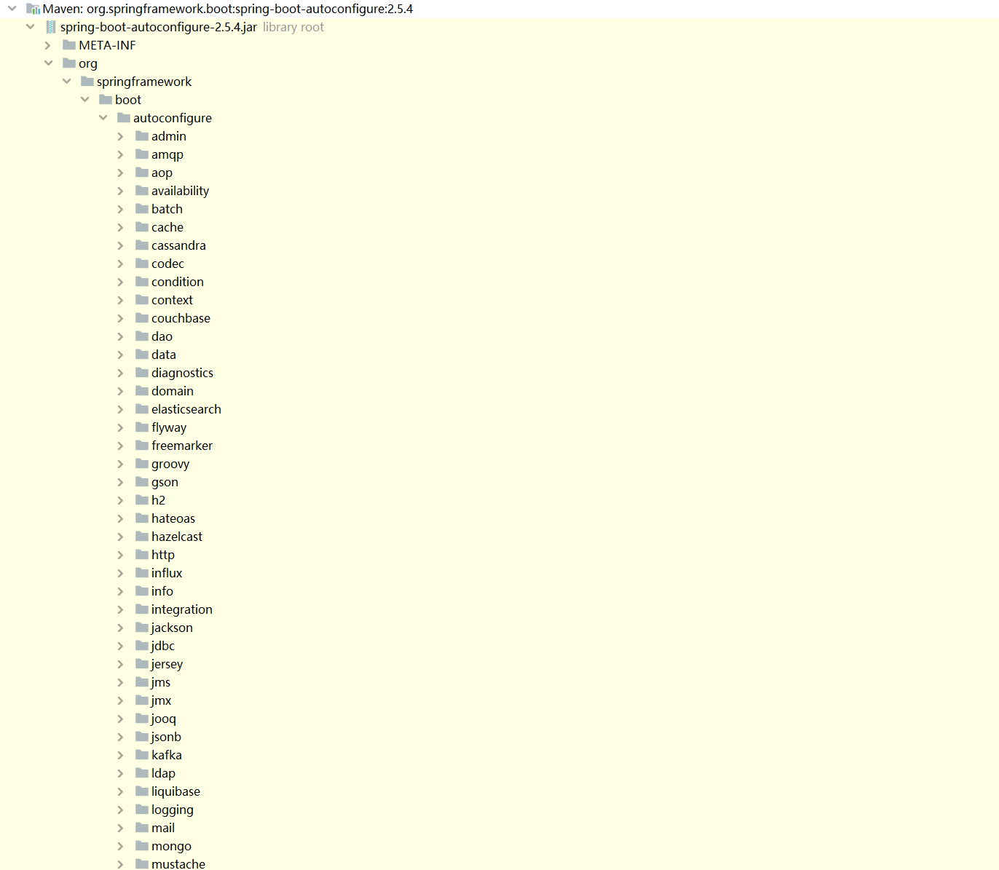

如果开发者不需要SpingBoot的某一项，该如何实现呢？可以在@SpringBootApplication注解上进行关闭特定的自动配置，比如关闭：数据源


### 用途

如果未来你看到springboot中自己提供starter 提供几十个上百个配置类，如果有一些看着不爽，我想自己去写，怎么办呢？

- 你可以覆盖它
- 你可以先排除它，然后自己写。

### 举例子

面试题：如果在springBoot项目中，我们如何把官方提供好的配置类，排除掉？比如：

```xml
<dependency>
    <groupId>com.baomidou</groupId>
    <artifactId>mybatis-plus-boot-starter</artifactId>
    <version>3.4.2</version>
</dependency>
```

上面的依赖是mybatis依赖，默认情况myabtis的依赖，是一定要初始化一个数据源

```xml
<bean id="dataSource" class="druid|c3p0"></bean>
<bean id="sqlSessionFactory" class="SqlSessionFactoryBean">
	<propertity name="dataSource" ref="dataSource"/>
 </bean>
```

这也就为什么，如果项目直接依赖了mybatis, 直接启动就报错原因：

```properties

Description:

Failed to configure a DataSource: 'url' attribute is not specified and no embedded datasource could be configured.

Reason: Failed to determine a suitable driver class


Action:

Consider the following:
	If you want an embedded database (H2, HSQL or Derby), please put it on the classpath.
	If you have database settings to be loaded from a particular profile you may need to activate it (no profiles are currently active).

```

解决方案：排除数据源依赖：

```java
@SpringBootApplication(exclude = {DataSourceAutoConfiguration.class})
```

> 提示：但是关闭数据源不推荐，既然你在开发中引入了mybatis为什么又不配置数据源呢？除非你自己去定义数据源。你可以这样做，否则不建议

### 总结

- 在开发，如果你依赖一个starter，你肯定是要去使用配置信息。如果你不使用就不要去依赖。
- @SpringBootApplication(exclude = {DataSourceAutoConfiguration.class}) 去排除掉，但是不建议。
- 如果你一旦用了@SpringBootApplication(exclude = {DataSourceAutoConfiguration.class})就说明你肯定要覆盖，或者你想要重写它。你就选择剔除。
- exclude  真正作用就是：看着不官方提供不爽，我想自己造轮子。


## 09、读取配置文件（重点）

SpringBoot分别提供3中方式读取项目的application.properties配置文件的内容。这个方式分别为：Environment类、@Value注解以及@ConfigurationProperties注解。

> 你必须要知道的事情：下面提供的三种方式，都可以拿到配置文件的信息，不要纠结那种方式好与坏。你爱用中方式就用那种方式。只要能解决问题就可以了。

### 09-01、Environment

Environment是用来读取应用程序运行时的环境变量的类，可以通过key-value的方式读取application.properties和系统环境变量，命令行输入参数，系统属性等，具体如下：

在application.yml文件定义如下：

```
# 属性配置类的
server:
  port: 8082

spring:
  main:
    banner-mode: console

# 自定义
alipay:
  pay:
    appid: 123456
    notify: http://www.xxx.com

```

定义读取的类如下：

```java
package com.kuangstudy.web.properties;

import org.springframework.beans.factory.annotation.Autowired;
import org.springframework.core.env.Environment;
import org.springframework.web.bind.annotation.GetMapping;
import org.springframework.web.bind.annotation.RestController;

import java.util.HashMap;
import java.util.Map;
import java.util.Properties;
import java.util.Set;

/**
 * Description:
 * Author: yykk Administrator
 * Version: 1.0
 * Create Date Time: 2021/12/11 21:25.
 * Update Date Time:
 *
 * @see
 */
@RestController
public class ReadPropertiesEnvironment {

    @Autowired
    private Environment environment;


    @GetMapping("/read/file")
    public Map<String,Object> readInfo(){
        Map<String,Object> map = new HashMap<>();
        map.put("port",environment.getProperty("server.port"));
        map.put("appid",environment.getProperty("alipay.pay.appid"));
        map.put("notify",environment.getProperty("alipay.pay.notify"));
        map.put("javaversion",environment.getProperty("java.version"));
        map.put("javahome",environment.getProperty("JAVA_HOME"));
        map.put("mavenhome",environment.getProperty("MAVEN_HOME")); 
        return  map;
    }

    public static void main(String[] args) {
        Properties properties = System.getProperties();
        Set<String> strings = properties.stringPropertyNames();
        for (String string : strings) {
            System.out.println(string+"===>"+properties.get(string));
        }

    }

}

```

在浏览器访问

http://localhost:8082/read/file

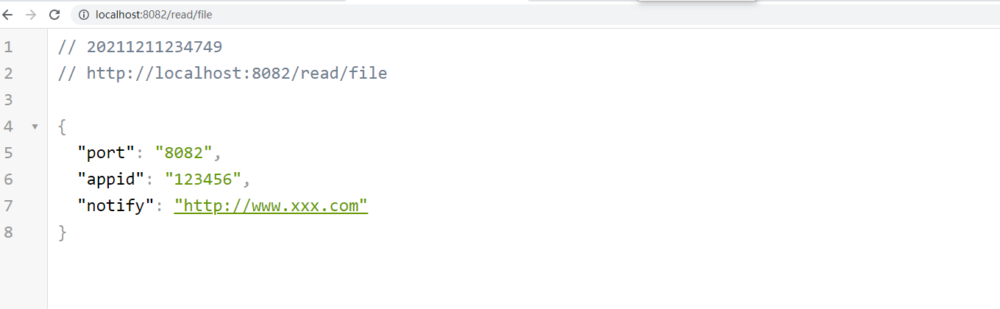


### 09-02、@Value

使用@Value注解读取配置文件内容，具体如下：

```java
package com.kuangstudy.web.properties;

import org.springframework.beans.factory.annotation.Autowired;
import org.springframework.beans.factory.annotation.Value;
import org.springframework.core.env.Environment;
import org.springframework.web.bind.annotation.GetMapping;
import org.springframework.web.bind.annotation.RestController;

import java.util.HashMap;
import java.util.Map;
import java.util.Properties;
import java.util.Set;

/**
 * Description:
 * Author: yykk Administrator
 * Version: 1.0
 * Create Date Time: 2021/12/11 21:25.
 * Update Date Time:
 *
 * @see
 */
@RestController
public class ReadPropertiesValue {

    @Value("${server.port}")
    private Integer port;
    @Value("${alipay.pay.appid}")
    private String appid;
    @Value("${alipay.pay.notify}")
    private String notify;
    @Value("${java.version}")
    private String javaVersion;
    @Value("${JAVA_HOME}")
    private String javaHome;
    @Value("${MAVEN_HOME}")
    private String mavenHome;


    @GetMapping("/read/value")
    public Map<String, Object> readInfo() {
        Map<String, Object> map = new HashMap<>();
        map.put("port", port);
        map.put("appid", appid);
        map.put("notify", notify);
        map.put("javaversion", javaVersion);
        map.put("javahome", javaHome);
        map.put("mavenhome", mavenHome);
        return map;
    }

}
```

浏览器如下：

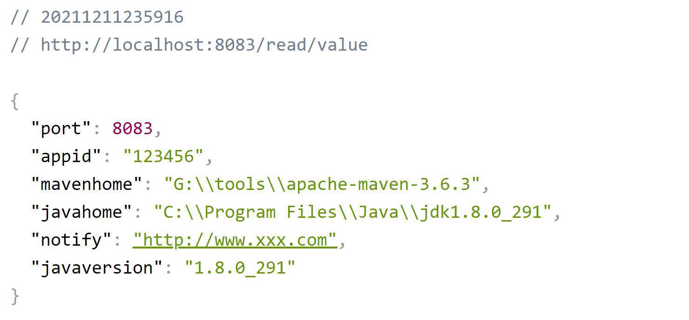

结论：其实@Value底层就是Environment.java


### 09-03、@ConfigurationProperties （属性配置类的底层原理）

使用@ConfigurationProperties首先建立配置文件与对象的映射关系，然后在控制器方法中使用@Autowired注解将对象注入。具体如下：


### 09-04、@PropertySource（不推荐）

开发者希望读取项目的其他配置文件，而不是全局配置文件中的application.properties，该如何实现呢？可以使用@PropertySource注解找到项目的其他的配置文件。

方式：@PropertySource + @Value

具体如下：


## 10、日志配置

Spring Boot 将[Commons Logging](https://commons.apache.org/logging)用于所有内部日志记录，但保持底层日志实现处于打开状态。为[Java Util Logging](https://docs.oracle.com/javase/8/docs/api/java/util/logging/package-summary.html)、[Log4J2](https://logging.apache.org/log4j/2.x/)和[Logback](https://logback.qos.ch/)提供了默认配置。在每种情况下，记录器都预先配置为使用控制台输出，也可以使用可选的文件输出。

==默认情况下，如果您使用“Starters”，则使用 Logback 进行日志记录==。还包括适当的 Logback 路由，以确保使用 Java Util Logging、Commons Logging、Log4J 或 SLF4J 的依赖库都能正常工作。

#### 日志格式

Spring Boot 的默认日志输出类似于以下示例：

```
2019-03-05 10:57:51.112 INFO 45469 --- [main] org.apache.catalina.core.StandardEngine：启动 Servlet 引擎：Apache Tomcat/7.0.52 
2019-03-05 10:57:51.25469FO --- [ost-startStop-1] oaccC[Tomcat].[localhost].[/] : 初始化 Spring 嵌入式 WebApplicationContext 
2019-03-05 10:57:51.253 INFO 45469 --- [ost-startStop-1] osweb .context.ContextLoader : Root WebApplicationContext: 初始化在 1358 ms 
2019-03-05 10:57:51.698 INFO 45469 --- [ost-startStop-1] osbceServletRegistrationBean : 将 servlet: 'dispatcherServlet' 映射到 [/] 
301 -05 10:57:51.702 INFO 45469 --- [ost-startStop-1] osbcembedded.FilterRegistrationBean：映射过滤器：'hiddenHttpMethodFilter'到：[/*]
```

输出以下项目：

- 日期和时间：毫秒精度且易于排序。
- 日志级别：`ERROR`，`WARN`，`INFO`，`DEBUG`，或`TRACE`。
- 进程标识。
- 一个`---`分离器来区分实际日志消息的开始。
- 线程名称：括在方括号中（可能会被截断以用于控制台输出）。
- 记录器名称：这通常是源类名称（通常缩写）。
- 日志消息。

**Logback** 没有`FATAL`级别。它被映射到`ERROR`.


\#### 添加日志依赖

```xml
<dependency>
    <groupId>org.springframework.boot</groupId>
    <artifactId>spring-boot-starter-logging</artifactId>
</dependency>
```

但是呢，实际开发中我们不需要直接添加该依赖。
你会发现spring-boot-starter其中包含了 spring-boot-starter-logging，该依赖内容就是 Spring Boot 默认的日志框架 logback。工程中有用到了Thymeleaf，而Thymeleaf依赖包含了spring-boot-starter，最终我只要引入Thymeleaf即可。

#### 控制台输出

日志级别从低到高分为：

```xml
TRACE < DEBUG < INFO < WARN < ERROR < FATAL。
```

如果设置为 `WARN` ，则低于 `WARN` 的信息都不会输出。
`Spring Boot`中默认配置`ERROR`、`WARN`和`INFO`级别的日志输出到控制台。
您还可以通过启动您的应用程序 `--debug` 标志来启用“调试”模式（开发的时候推荐开启）,以下两种方式皆可：

#### 控制台输出

默认日志配置在写入消息时将消息回显到控制台。默认情况下，会记录`ERROR`-level、`WARN`-level 和`INFO`-level 消息。您还可以通过使用`--debug`标志启动应用程序来启用“调试”模式。

```properties
$ java -jar myapp.jar --debug
```


\#### 文件输出
默认情况下，Spring Boot将日志输出到控制台，不会写到日志文件。

使用`Spring Boot`喜欢在`application.properties`或`application.yml`配置，这样只能配置简单的场景，保存路径、日志格式等，复杂的场景（区分 info 和 error 的日志、每天产生一个日志文件等）满足不了，只能自定义配置，下面会演示。

#### 自定义日志配置

根据不同的日志系统，你可以按如下规则组织配置文件名，就能被正确加载：

- Logback：logback-spring.xml, logback-spring.groovy, logback.xml, logback.groovy
- Log4j：log4j-spring.properties, log4j-spring.xml, log4j.properties, log4j.xml
- Log4j2：log4j2-spring.xml, log4j2.xml
- JDK (Java Util Logging)：logging.properties

Spring Boot官方推荐优先使用带有-spring的文件名作为你的日志配置（如使用logback-spring.xml，而不是logback.xml），命名为logback-spring.xml的日志配置文件，spring boot可以为它添加一些spring boot特有的配置项（下面会提到）。
默认的命名规则，并且放在 src/main/resources 下面即可

如果你即想完全掌控日志配置，但又不想用logback.xml作为Logback配置的名字，application.yml可以通过logging.config属性指定自定义的名字：

```xml
logging.config=classpath:logging-config.xml
```


未完。、、、、


