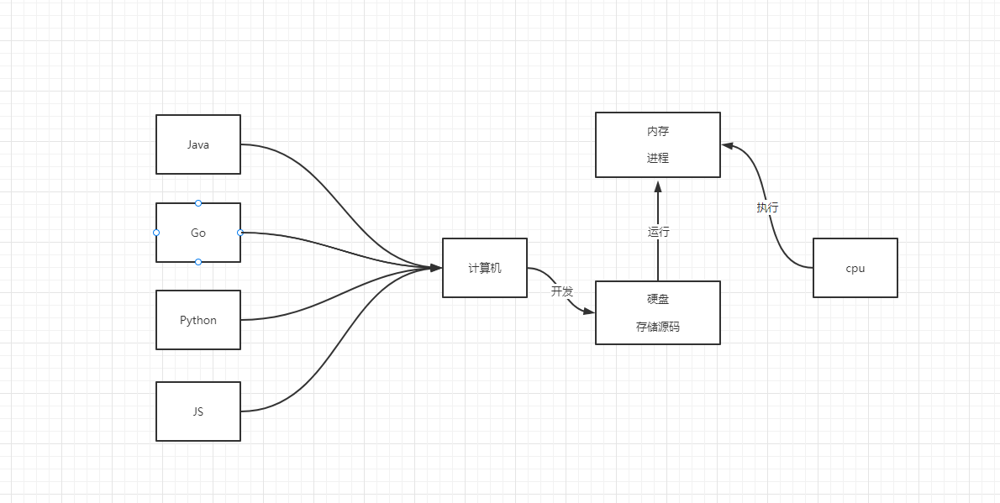
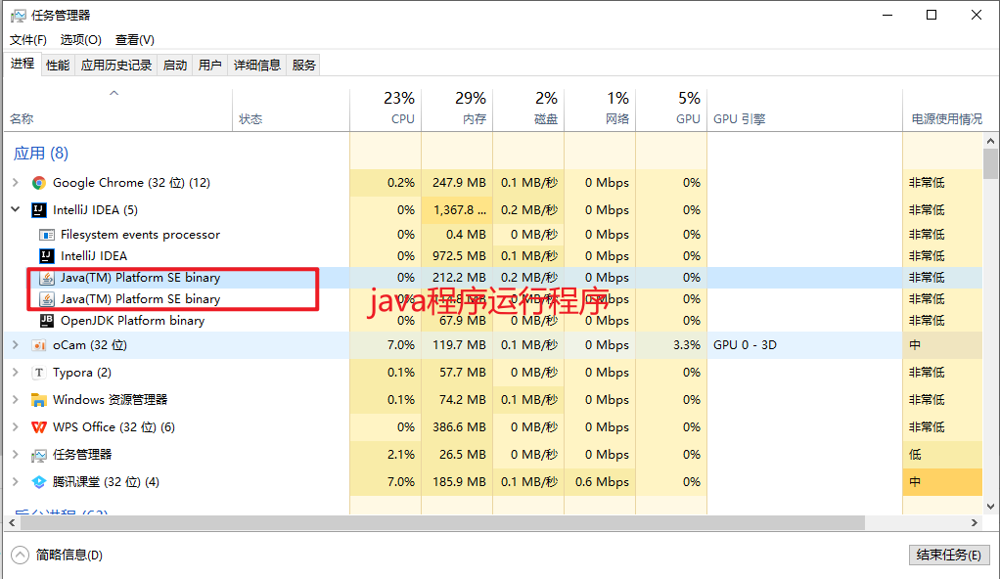
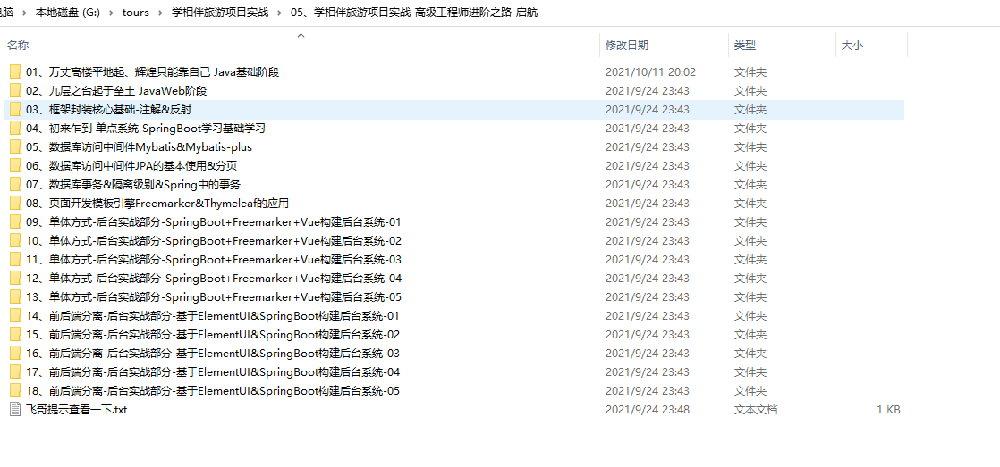

# Java基础


授课老师：学相伴飞哥

编写时间：2021那边10月11日 13:10

幽默句子：把明知不可能的事变为可能，首先要这么想。相信美好的事情即刻发生！！


## 01、课程大纲

01、面向对象的程序设计-Java
02、继承、子类父类关系
03、多态变量、向上造型
04、封装、多态、Object类、DOME的新类型、消除代码复制、可扩展性
05、新特性 Stream（可能延期周二）


## 02、面向对象的程序设计-Java

我每天面对是计算机，从学习java语言开始，开始都jdk开始，配置JDK环境变量，然后Hellworld。然后进行一系列语法的数据，数据类型，循环，判断，运算，类，继承，接口，集合，Map，io。。。。。。。。。

所有的语言的开发流程，运行流程以及执行流程其实都一样，如下：







总结：

- 不同计算语言，虽然有不同语法结构或者语法糖，但是他们开发流程，以及运行流程其实一样的。
- 计算机语言，它是一种人机交互和沟通的一种语言，既然是语言就必须有对应的语法和数据结构，语态等等。
- 就好比，计算语言它是人和机器沟通桥梁。我们底层计算机存储的0|1。计算机语言其实就把现实的一些逻辑转换成计算机可以识别的0|1代码。一句话：java、go 语言等等都在应用程序中的代码转换成0|1和计算机沟通协作。


我们知道，电脑中记事本。记事本比较简单可以记录一句话也可以记录一段文字。但是如果我们想做一个资料库。比如这个资料库去保存我们学习的课程视频、课程笔记、课程的相关文件等。我们会把每一个课程的相关信息的情况放入到这个资料库中。然后把所以的课程资料通过资料库罗列出来。下面如何通过电脑表现出来呢？又如何通过程序表现出来呢？


### 02-01、电脑的表现形式



### 02-02、程序的表现形式

对于资料库中的课程来说，程序的表现应该又如下一些东西：


接下来我们花一点点时间，把这两个类，资料库和课程做出来，如下：

资料库类：DataBase.java

```
package com.kuangstudy;

/**
 * 资料库
 * @author 飞哥
 * @Title: 学相伴出品
 * @Description: 我们有一个学习网站：https://www.kuangstudy.com
 * @date 2021/10/11 13:47
 */
public class DataBase {

}

```

课程类：

```java
package com.kuangstudy;

import java.util.Date;

/**
 * 课程信息
 *
 * @author 飞哥
 * @Title: 学相伴出品
 * @Description: 我们有一个学习网站：https://www.kuangstudy.com
 * @Description: 飞哥B站地址：https://space.bilibili.com/490711252
 * @date 2021/10/11 13:47
 */
public class Course{

    // 课程标题
    private String title;
    // 课程描述
    private String description;
    // 课程大小
    private String coursesize;
    // 课程时长
    private String coursetime;
    // 课程价格
    private Double price;
    // 课程上传时间
    private Date createTime;
    //  课程目录
    private Integer folderId;

    public Course() {

    }

    public void print(){
        System.out.println(this);
    }

    public Course(String title, String description, String coursesize, String coursetime, Double price, Date createTime, Integer folderId) {
        this.title = title;
        this.description = description;
        this.coursesize = coursesize;
        this.coursetime = coursetime;
        this.price = price;
        this.createTime = createTime;
        this.folderId = folderId;
    }

    public String getTitle() {
        return title;
    }

    public void setTitle(String title) {
        this.title = title;
    }

    public String getDescription() {
        return description;
    }

    public void setDescription(String description) {
        this.description = description;
    }

    public String getCoursesize() {
        return coursesize;
    }

    public void setCoursesize(String coursesize) {
        this.coursesize = coursesize;
    }

    public String getCoursetime() {
        return coursetime;
    }

    public void setCoursetime(String coursetime) {
        this.coursetime = coursetime;
    }

    public Double getPrice() {
        return price;
    }

    public void setPrice(Double price) {
        this.price = price;
    }

    public Date getCreateTime() {
        return createTime;
    }

    public void setCreateTime(Date createTime) {
        this.createTime = createTime;
    }

    public Integer getFolderId() {
        return folderId;
    }

    public void setFolderId(Integer folderId) {
        this.folderId = folderId;
    }

    @Override
    public String toString() {
        return "Course{" +
                "title='" + title + '\'' +
                ", description='" + description + '\'' +
                ", coursesize='" + coursesize + '\'' +
                ", coursetime='" + coursetime + '\'' +
                ", price=" + price +
                ", createTime=" + createTime +
                ", folderId=" + folderId +
                '}';
    }
}

```

如何把课程放入到资料库中呢？如下:

```java
package com.kuangstudy;

import java.util.ArrayList;
import java.util.Date;

/**
 * 资料库类
 */
public class Database {


    // 课程资料容器
    private ArrayList<Course> courseTable = new ArrayList<>();


    // 1: 添加资料库
    public void add(Course course) {
        courseTable.add(course);
    }

    // 2：罗列资料库
    public void list() {
        for (Course course : courseTable) {
            course.print();
        }
    }

    // 运行的目的：就是程序加载的jvm中，未来的启动tomcat
    public static void main(String[] args) {
        // 1: 创建一个资料库
        Database database = new Database();

        // 2: 创建文件
        Course course1 = new Course("01、课程标准PPT", "这是一个课件", new Date(), "970kb", 0.1d, 1);
        Course course2 = new Course("newsprint.css", "这是一个样式文件", new Date(), "12kb", 0.01d, 1);

        // 3:把course1 和course2添加到资料库中
        database.add(course1);
        database.add(course2);

        //4: 把资料库的文件罗列处理
        database.list();
    }


}

```

打印结果如下：


如果要进行扩展需要增加：视频资源

```java
package com.kuangstudy;

import java.util.Date;

/**
 * 视频信息
 *
 * @author 飞哥
 * @Title: 学相伴出品
 * @Description: 我们有一个学习网站：https://www.kuangstudy.com
 * @Description: 飞哥B站地址：https://space.bilibili.com/490711252
 * @date 2021/10/11 13:47
 */
public class Video{

    // 视频标题
    private String title;
    // 视频描述
    private String description;
    // 视频大小
    private String coursesize;
    // 视频时长
    private String coursetime;
    // 视频价格
    private Double price;
    // 视频播放地址
    private String playlink;
    // 视频上传时间
    private Date createTime;

    public Video() {

    }

    public Video(String title, String description, String coursesize, String coursetime, Double price, String playlink, Date createTime) {
        this.title = title;
        this.description = description;
        this.coursesize = coursesize;
        this.coursetime = coursetime;
        this.price = price;
        this.playlink = playlink;
        this.createTime = createTime;
    }

    public String getTitle() {
        return title;
    }

    public void setTitle(String title) {
        this.title = title;
    }

    public String getDescription() {
        return description;
    }

    public void setDescription(String description) {
        this.description = description;
    }

    public String getCoursesize() {
        return coursesize;
    }

    public void setCoursesize(String coursesize) {
        this.coursesize = coursesize;
    }

    public String getCoursetime() {
        return coursetime;
    }

    public void setCoursetime(String coursetime) {
        this.coursetime = coursetime;
    }

    public Double getPrice() {
        return price;
    }

    public void setPrice(Double price) {
        this.price = price;
    }

    public String getPlaylink() {
        return playlink;
    }

    public void setPlaylink(String playlink) {
        this.playlink = playlink;
    }

    public Date getCreateTime() {
        return createTime;
    }

    public void setCreateTime(Date createTime) {
        this.createTime = createTime;
    }

    @Override
    public String toString() {
        return "Video{" +
                "title='" + title + '\'' +
                ", description='" + description + '\'' +
                ", coursesize='" + coursesize + '\'' +
                ", coursetime='" + coursetime + '\'' +
                ", price=" + price +
                ", playlink='" + playlink + '\'' +
                ", createTime=" + createTime +
                '}';
    }

    public void print(){
        System.out.println(this);
    }
}

```

资源库

```java
package com.kuangstudy;

import java.util.ArrayList;
import java.util.Date;
import java.util.List;

/**
 * 资料库
 *
 * @author 飞哥
 * @Title: 学相伴出品
 * @Description: 我们有一个学习网站：https://www.kuangstudy.com
 * @date 2021/10/11 13:47
 */
public class DataBase {

    // 1：课程资料容器
    private List<Course> courseTable = new ArrayList<Course>();
    // 2：视频资源容器
    private List<Video> videoTable = new ArrayList<Video>();


    // 2: 添加课程到课程资料容器
    public void add(Course course) {
        courseTable.add(course);
    }

    // 3: 添加视频资源
    public void add(Video video) {
        videoTable.add(video);
    }

    // 4: 罗列出所有的资源库的课程信息
    public void listcourse() {
        courseTable.forEach(res->res.print());
    }

    // 5: 罗列出所有的资源库的视频信息
    public void listvideo() {
        videoTable.forEach(res->res.print());
    }

    // 5: 找个应用程序运行程序
    public static void main(String[] args) {

        // 1: 创建资料库
        DataBase dataBase = new DataBase();

        // 2: 创建课程
        Course course1 = new Course();
        course1.setTitle("学相伴旅游项目实战课程");
        course1.setCoursesize("12M");
        course1.setCoursetime("300小时");
        course1.setCreateTime(new Date());
        course1.setFolderId(1);
        course1.setPrice(1499d);
        course1.setDescription("学相伴旅游项目实战课程java基础");

        Course course2 = new Course();
        course2.setTitle("学相伴秋招课程");
        course2.setCoursesize("122M");
        course2.setCoursetime("300小时");
        course2.setCreateTime(new Date());
        course2.setFolderId(2);
        course2.setPrice(1999d);
        course2.setDescription("学相伴旅游项目实战课程java基础");


        //创建视频资源
        Video video1 = new Video();
        video1.setTitle("学相伴秋招课程视频");
        video1.setCoursesize("122M");
        video1.setCoursetime("300小时");
        video1.setCreateTime(new Date());
        video1.setPlaylink("xxx.mp4");
        video1.setPrice(1999d);
        video1.setDescription("学相伴旅游项目实战课程java基础");

        // 3: 添加课程到资料库
        dataBase.add(course1);
        dataBase.add(course2);
        // 4：添加视频资源到资料库
        dataBase.add(video1);

        // 4:打印罗列课程
        dataBase.listcourse();
        // 4:打印罗列视频
        dataBase.listvideo();
    }

}

```

上面代码存在什么问题？

这个时候会发现，课程和视频资源的差异，课程的视频大部分的属性情况下两者是相同。


我们是否可以把公共的东西进行抽离呢？答案是可以的，实现步骤如下：

1：先抽离放入公共类

2：然后让两者进行实现extends即可。


## 03、继承

通过==继承==我们可以把==父类==中==公开的==和==受保护== ==方法和属性==进行让==子类==进行==共享使用==。从而达到==复用==的目的。

定义父类：Item.java

```java
package com.kuangstudy;

/**
 * @author 飞哥
 * @Title: 学相伴出品
 * @Description: 飞哥B站地址：https://space.bilibili.com/490711252
 * 记得关注和三连哦！
 * @Description: 我们有一个学习网站：https://www.kuangstudy.com
 * @date 2021/10/11 14:41
 */
public class Item {

    public void print(){

    }
}

```

课程类继承

```java
package com.kuangstudy;

import java.util.Date;

/**
 * 课程信息
 *
 * @author 飞哥
 * @Title: 学相伴出品
 * @Description: 我们有一个学习网站：https://www.kuangstudy.com
 * @Description: 飞哥B站地址：https://space.bilibili.com/490711252
 * @date 2021/10/11 13:47
 */
public class Course extends Item{

    // 课程标题
    private String title;
    // 课程描述
    private String description;
    // 课程大小
    private String coursesize;
    // 课程时长
    private String coursetime;
    // 课程价格
    private Double price;
    // 课程上传时间
    private Date createTime;
    //  课程目录
    private Integer folderId;

    public Course() {

    }

    public void print(){
        System.out.println(this);
    }

    public Course(String title, String description, String coursesize, String coursetime, Double price, Date createTime, Integer folderId) {
        this.title = title;
        this.description = description;
        this.coursesize = coursesize;
        this.coursetime = coursetime;
        this.price = price;
        this.createTime = createTime;
        this.folderId = folderId;
    }

    public String getTitle() {
        return title;
    }

    public void setTitle(String title) {
        this.title = title;
    }

    public String getDescription() {
        return description;
    }

    public void setDescription(String description) {
        this.description = description;
    }

    public String getCoursesize() {
        return coursesize;
    }

    public void setCoursesize(String coursesize) {
        this.coursesize = coursesize;
    }

    public String getCoursetime() {
        return coursetime;
    }

    public void setCoursetime(String coursetime) {
        this.coursetime = coursetime;
    }

    public Double getPrice() {
        return price;
    }

    public void setPrice(Double price) {
        this.price = price;
    }

    public Date getCreateTime() {
        return createTime;
    }

    public void setCreateTime(Date createTime) {
        this.createTime = createTime;
    }

    public Integer getFolderId() {
        return folderId;
    }

    public void setFolderId(Integer folderId) {
        this.folderId = folderId;
    }

    @Override
    public String toString() {
        return "Course{" +
                "title='" + title + '\'' +
                ", description='" + description + '\'' +
                ", coursesize='" + coursesize + '\'' +
                ", coursetime='" + coursetime + '\'' +
                ", price=" + price +
                ", createTime=" + createTime +
                ", folderId=" + folderId +
                '}';
    }
}
```

视频类继承item

```java
package com.kuangstudy;

import java.util.Date;

/**
 * 视频信息
 *
 * @author 飞哥
 * @Title: 学相伴出品
 * @Description: 我们有一个学习网站：https://www.kuangstudy.com
 * @Description: 飞哥B站地址：https://space.bilibili.com/490711252
 * @date 2021/10/11 13:47
 */
public class Video extends Item{

    // 视频标题
    private String title;
    // 视频描述
    private String description;
    // 视频大小
    private String coursesize;
    // 视频时长
    private String coursetime;
    // 视频价格
    private Double price;
    // 视频播放地址
    private String playlink;
    // 视频上传时间
    private Date createTime;

    public Video() {

    }

    public Video(String title, String description, String coursesize, String coursetime, Double price, String playlink, Date createTime) {
        this.title = title;
        this.description = description;
        this.coursesize = coursesize;
        this.coursetime = coursetime;
        this.price = price;
        this.playlink = playlink;
        this.createTime = createTime;
    }

    public String getTitle() {
        return title;
    }

    public void setTitle(String title) {
        this.title = title;
    }

    public String getDescription() {
        return description;
    }

    public void setDescription(String description) {
        this.description = description;
    }

    public String getCoursesize() {
        return coursesize;
    }

    public void setCoursesize(String coursesize) {
        this.coursesize = coursesize;
    }

    public String getCoursetime() {
        return coursetime;
    }

    public void setCoursetime(String coursetime) {
        this.coursetime = coursetime;
    }

    public Double getPrice() {
        return price;
    }

    public void setPrice(Double price) {
        this.price = price;
    }

    public String getPlaylink() {
        return playlink;
    }

    public void setPlaylink(String playlink) {
        this.playlink = playlink;
    }

    public Date getCreateTime() {
        return createTime;
    }

    public void setCreateTime(Date createTime) {
        this.createTime = createTime;
    }

    @Override
    public String toString() {
        return "Video{" +
                "title='" + title + '\'' +
                ", description='" + description + '\'' +
                ", coursesize='" + coursesize + '\'' +
                ", coursetime='" + coursetime + '\'' +
                ", price=" + price +
                ", playlink='" + playlink + '\'' +
                ", createTime=" + createTime +
                '}';
    }

    public void print(){
        System.out.println(this);
    }
}

```

资源库类2

```java
package com.kuangstudy;

import java.util.ArrayList;
import java.util.Date;
import java.util.List;

/**
 * 资料库
 *
 * @author 飞哥
 * @Title: 学相伴出品
 * @Description: 我们有一个学习网站：https://www.kuangstudy.com
 * @date 2021/10/11 13:47
 */
public class DataBase2 {

    // 1：课程资料容器
    private List<Item> itemTable = new ArrayList<Item>();


    // 2: 添加课程到课程资料容器
    public void add(Item course) {
        itemTable.add(course);
    }

    // 4: 罗列出所有的资源库的课程信息
    public void list() {
        itemTable.forEach(res -> res.print());
    }

    // 5: 找个应用程序运行程序
    public static void main(String[] args) {

        // 1: 创建资料库
        DataBase2 dataBase = new DataBase2();

        // 2: 创建课程
        Course course1 = new Course();
        course1.setTitle("学相伴旅游项目实战课程");
        course1.setCoursesize("12M");
        course1.setCoursetime("300小时");
        course1.setCreateTime(new Date());
        course1.setFolderId(1);
        course1.setPrice(1499d);
        course1.setDescription("学相伴旅游项目实战课程java基础");

        Course course2 = new Course();
        course2.setTitle("学相伴秋招课程");
        course2.setCoursesize("122M");
        course2.setCoursetime("300小时");
        course2.setCreateTime(new Date());
        course2.setFolderId(2);
        course2.setPrice(1999d);
        course2.setDescription("学相伴旅游项目实战课程java基础");


        //创建视频资源
        Video video1 = new Video();
        video1.setTitle("学相伴秋招课程视频");
        video1.setCoursesize("122M");
        video1.setCoursetime("300小时");
        video1.setCreateTime(new Date());
        video1.setPlaylink("xxx.mp4");
        video1.setPrice(1999d);
        video1.setDescription("学相伴旅游项目实战课程java基础");

        // 3: 添加课程到资料库
        dataBase.add(course1);
        dataBase.add(course2);
        // 4：添加视频资源到资料库
        dataBase.add(video1);

        // 4:打印罗列课程
        dataBase.list();
    }

}
```

整个的继承关系：


### 01、通过继承得到了什么？

那就看父类有什么？父类也是一个类：类里面也就只有属性和方法。得到也就是父类所有的属性和方法，但是如果子类中有和父类相同的方法和签名的时候，就会引发重写（覆盖），如果我们要明确的是覆盖的方法可以通过==@Override==关键词标识出来。

子类是不是可以获取父类所有的方法和属性呢？当然不能因为牵涉到一个问题就是：==访问权限==。子类可以获取父类中的什么样子的属性和方法呢？如下：

- 公开的 public
- ==受保护的 proctecte==d
  - 如果在开发中，一个父类想让子类去获取成员属性和方法的话，尽量定义成protected
  - 如果父类的成员属性和方法私有的，就可以通过公开get方法进行获取私有属性，
  - 如果要给父类的私有属性要初始化或者赋值。你可以通过super方法进行给私有属性赋值，或者公开的set方法
- 缺省的（default） （同包中 ）

```java
package com.kuangstudy;

/**
 * @author 飞哥
 * @Title: 学相伴出品
 * @Description: 飞哥B站地址：https://space.bilibili.com/490711252
 * 记得关注和三连哦！
 * @Description: 我们有一个学习网站：https://www.kuangstudy.com
 * @date 2021/10/11 14:41
 */
public class Item {
    public void print(){

    }
}

```

```java
public class Video extends Item{
    public void print(){
        System.out.println(this);
    }
}


public class Course extends Item{
    public void print(){
        System.out.println(this);
    }
}

```


## 04、访问修饰符

子类是不是可以获取父类所有的方法和属性呢？当然不能因为牵涉到一个问题就是：==访问权限==。

- 子类不能访问父类私有的成员和属性
- 一般父类定义属性的时候，如果要让其子类共享属性，一般设置为proctected，这样更好！
- ==一般父类定义属性的时候，如果要让其子类共享属性，如果设置成private，可以通过super方法进行传递给父类。==
- 子类覆盖父类的方法的时候==访问权限==必须大于==父类方法本身的访问权限==


## 05、super关键词

子类集成父类的时候，每个子类的构造函数都有一个隐式的super调用，可以暴露出来。也可以不暴露出来。而这个super方法默认指向父类的构造函数。

- 每个子类继承父类以后，每个子类的都会有一个默认的隐式super()方法
- 如果一个类没有继承父类，它父类就是Object,这个时候super()方法执行的就是Object的构造功函数
- ==这个super()方法的作用，其实大部分的作用：就给父类的私有成员变量进行赋值使用。==
- 但是如果父类的无参构造函数一旦被定义成有参数的，子类构造函数的super()方法就必须显示的声明。如果不什么编译不通过。


```java
package com.kuangstudy;

import java.util.Date;

/**
 * @author 飞哥
 * @Title: 学相伴出品
 * @Description: 飞哥B站地址：https://space.bilibili.com/490711252
 * 记得关注和三连哦！
 * @Description: 我们有一个学习网站：https://www.kuangstudy.com
 * @date 2021/10/11 14:41
 */
public class Item {
    // 视频标题
    private String title;
    // 视频描述
    private String description;
    // 视频大小
    private String coursesize;
    // 视频时长
    private String coursetime;
    // 视频价格
    private Double price;
    // 视频上传时间
    private Date createTime;

    public Item(String title, String description, String coursesize, String coursetime, Double price, Date createTime) {
        this.title = title;
        this.description = description;
        this.coursesize = coursesize;
        this.coursetime = coursetime;
        this.price = price;
        this.createTime = createTime;
    }

    public void print(){

    }
}

```

视频类

```java
package com.kuangstudy;

import java.util.Date;

/**
 * 视频信息
 *
 * @author 飞哥
 * @Title: 学相伴出品
 * @Description: 我们有一个学习网站：https://www.kuangstudy.com
 * @Description: 飞哥B站地址：https://space.bilibili.com/490711252
 * @date 2021/10/11 13:47
 */
public class Video extends Item{
    // 视频播放地址
    private String playlink;

    public Video(String title, String description, String coursesize, String coursetime, Double price, String playlink, Date createTime) {
        super(title,description,coursesize,coursetime,price,createTime);
        this.playlink = playlink;
    }

    @Override
    public void print(){
        System.out.println(this);
    }
}

```

课程类

```java
package com.kuangstudy;

import java.util.Date;

/**
 * 课程信息
 *
 * @author 飞哥
 * @Title: 学相伴出品
 * @Description: 我们有一个学习网站：https://www.kuangstudy.com
 * @Description: 飞哥B站地址：https://space.bilibili.com/490711252
 * @date 2021/10/11 13:47
 */
public class Course extends Item{

    //  课程目录
    private Integer folderId;


    @Override
    public void print(){
        System.out.println(this);
    }

    public Course(String title, String description, String coursesize, String coursetime, Double price, Date createTime, Integer folderId) {
        super(title,description,coursesize,coursetime,price,createTime);
        this.folderId = folderId;
    }

    public Integer getFolderId() {
        return folderId;
    }

    public void setFolderId(Integer folderId) {
        this.folderId = folderId;
    }
}

```

```java
package com.kuangstudy;

import java.util.ArrayList;
import java.util.Date;
import java.util.List;

/**
 * 资料库
 *
 * @author 飞哥
 * @Title: 学相伴出品
 * @Description: 我们有一个学习网站：https://www.kuangstudy.com
 * @date 2021/10/11 13:47
 */
public class DataBase2 {

    // 1：课程资料容器
    private List<Item> itemTable = new ArrayList<Item>();


    // 2: 添加课程到课程资料容器
    public void add(Item course) {
        itemTable.add(course);
    }

    // 4: 罗列出所有的资源库的课程信息
    public void list() {
        itemTable.forEach(res -> res.print());
    }

    // 5: 找个应用程序运行程序
    public static void main(String[] args) {

        // 1: 创建资料库
        DataBase2 dataBase = new DataBase2();

        // 2: 创建课程
        Item course1 = new Course("学相伴旅游项目实战课程","学相伴旅游项目实战课程java基础","12M","300小时",1499d,new Date(),1);
        Item course2 = new Course("学相伴秋招课程","学相伴秋招课程","12M","300小时",1499d,new Date(),1);
        //创建视频资源
        Video video1 = new Video("学相伴秋招课程","学相伴秋招课程","12M","300小时",1499d,"MP4",new Date());

        // 3: 添加课程到资料库
        dataBase.add(course1);
        dataBase.add(course2);
        // 4：添加视频资源到资料库
        dataBase.add(video1);

        // 4:打印罗列课程
        dataBase.list();
    }

}

```

## 06、如果子类和父类有相同的属性怎么办？

- 相同的属性，相互隔离互不影响

## 07、继承的总结和好处

- 父类除了能够很好的把一些公共的方法和属性进行封装，让其子类继承达到复用以外。
- 继承还有一个很重要的意义：就是分担职责
- 继承可以达到：复用、封装、==职责分担==的作用。


