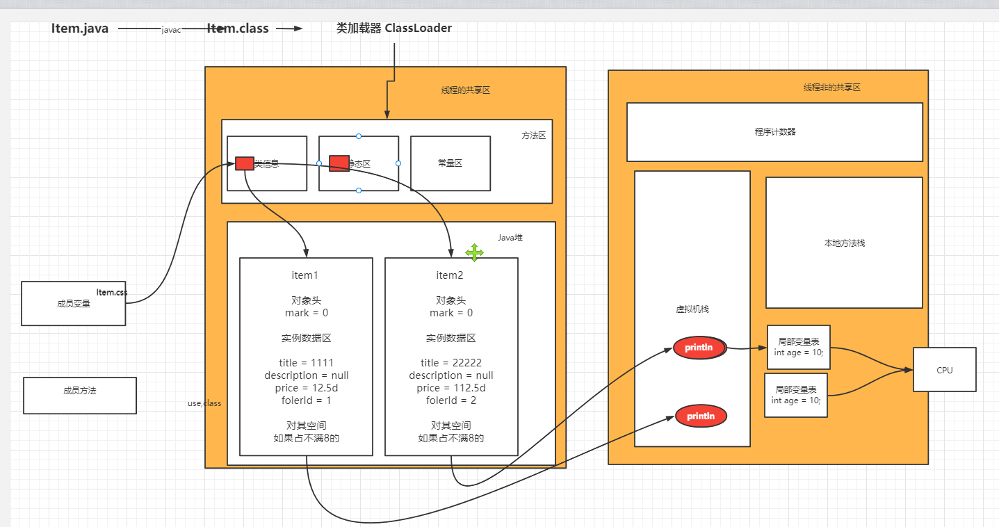

# Java类&抽象类&接口&枚举

授课老师：学相伴飞哥


## 01、课程大纲

01、类
02、抽象类
03、接口
04、枚举
05、总结


## 02、类

- **类**：，它描述一类事物的的行为和状态（特征）的模板。
- **对象**：对象是类的一个实例（**对象不是找个女朋友**），有状态和行为。例如，一条狗是一个对象，它的状态有：颜色、名字、品种；行为有：摇尾巴、叫、吃等。

> 类模板的作用：就为了给的对象的创建提供了一模板

一个类可以包含以下类型变量：

- **局部变量**：在方法、构造方法或者语句块中定义的变量被称为局部变量。变量声明和初始化都是在方法中，方法结束后，变量就会自动销毁。 ==局部变量的生命周期：跟随方法执行结束而死亡==
- **成员变量**：成员变量是定义在类中，方法体之外的变量。这种变量在创建对象的时候实例化。成员变量可以被类中方法、构造方法和特定类的语句块访问。==给对象创建提供了依据模板，成员变量存储在方法区的类信息中。它申请空间的时机，创建对象new User() , 对象死亡就消亡了==
- **类变量**：类变量也声明在类中，方法体之外，但必须声明为 static 类型。==它存储在方法区的静态区中，而且静态成员在编译的时候就存储进去了。==

一个类可以拥有多个方法，在上面的例子中：eat()、run()、sleep() 和 name() 都是 Dog 类的方法。

###  对象管辖的范围

- 成员变量
- 成员方法

### 类管辖的范围

- 静态成员

比如：Item.java

```java
package com.kuangstudy;

import java.util.Date;

/**
 * @author 飞哥
 * @Title: 学相伴出品
 * @Description: 飞哥B站地址：https://space.bilibili.com/490711252
 * 记得关注和三连哦！
 * @Description: 我们有一个学习网站：https://www.kuangstudy.com
 * @date 2021/10/11 14:41
 */
public class Item {
    // 视频标题
    private String title;
    // 视频描述
    private String description;
    // 视频大小
    private String coursesize;
    // 视频时长
    private String coursetime;
    // 视频价格
    private Double price;
    // 视频上传时间
    private Date createTime;

    public Item(){

    }

    public Item(String title, String description, String coursesize, String coursetime, Double price, Date createTime) {
        this.title = title;
        this.description = description;
        this.coursesize = coursesize;
        this.coursetime = coursetime;
        this.price = price;
        this.createTime = createTime;
    }

    public void print(){

    }

    public static void main(String[] args) {
        Item item = new Item();
        item.print();
    }
}

```


#### 证明观点：什么是类的模板，类的信息是如何在内存空间中进行存储的呢？

加载程序到JVM中的时机：

- ==执行main函数==
- 启动tomcat




### 构造方法

每个类都有构造方法。如果没有显式地为类定义构造方法，Java 编译器将会为该类提供一个默认构造方法。
在创建一个对象的时候，至少要调用一个构造方法。构造方法的名称必须与类同名，一个类可以有多个构造方法。

```java
public Item(){

}

public Item(String title, String description, String coursesize, String coursetime, Double price, Date createTime) {
    this.title = title;
    this.description = description;
    this.coursesize = coursesize;
    this.coursetime = coursetime;
    this.price = price;
    this.createTime = createTime;
}
```

### 创建对象

对象是根据类创建的。在Java中，使用关键字 new 来创建一个新的对象。创建对象需要以下三步：

- **声明**：声明一个对象，包括对象名称和对象类型。 (1：准备一个class)
- **实例化**：使用关键字 new 来创建一个对象。(2: new 去标识出来创建对象)
- **初始化**：使用 new 创建对象时，会调用构造方法初始化对象。(3:会调用构造函数去java堆中申请空间)

```java
public static void main(String[] args) {
    Item item = new Item();
    item.print();
}
```


## 03、抽象类

含有abstract修饰符的class即为抽象类，abstract 类不能创建实例对象。含有abstract方法的类必须定义为abstract class，abstract class类中的方法不必是抽象的。abstract class类中定义抽象方法必须在具体(Concrete)子类中实现，所以，不能有抽象构造方法或抽象静态方法。如果子类没有实现抽象父类中的所有抽象方法，那么子类也必须定义为abstract类型。

抽象类：其是比普通类多了一个==抽象方法==， 抽象方法它是子类的一种约束，告诉子类一定要覆盖和重写的方法

### 03-01、为什么会存在抽象类呢？

原因是在实际的业务中，普通的父类很多时候无法起到约束子类的作用，比如：重写的方法。

- 因为能够让子类重写的方法，大部分情况父类是不需要去做事情，也就是必须让子类自身去实现。普通的父类是起不到约束的作用，==也就是说，父类中需要覆盖的方法和普通方法这个时候就难以分辨和区分==。所以就有了抽象方法abstract。==后续的接口更加能体现的淋漓尽致。==
- 我们知道抽象类。可以定义抽象方法和非抽象方法。==那么父类中的非抽象方法的意义是什么呢？==其实还是回归到继承的概念：==职责分担==，大部分父类的非抽象方法就是去分担子类的业务，这样便于后续的维护和升级，这样就不需要去修改每个子类。只需要修改父类的方法，当然前提是方法的访问权限必须是：public或者protected的，如果是缺省的就必须在同包package中。
- ==抽象类，在平时的业务中那些场景下可以用到抽象类呢？==
  - 比如springmvc路由的继承
  - hibernate、jdbctempalte中的通用类的增删改查
  - 还有就是spring框架中存在大量的抽象类，其意义就是：责任分担。

### 03-02、抽象类可以继承抽象类吗？

当然可以，毕竟其实抽象类就是多了一个关键词而已。比如：spring框架源码中很多这样的存在。


```java
public abstract class AbstractXmlApplicationContext extends AbstractRefreshableConfigApplicationContext 
```


### 03-03、疑虑1、抽象类可以new吗？

抽象类，还是class。那么能实例化吗？它是一种多态机制的体现机制。

答案是：不可以的？ 

### 03-04、但是飞哥，抽象类化有构造函数，抽象类存在的构造函数的意义是什么？

- 给子类的构造函数通过super()方法给抽象类的私有赋值使用

### 03-05、抽象类可以继承普通类吗？

可以，但是一般不会这样做，有点本末倒置的味道。

### 03-06、抽象类可以继承抽象类吗？

- 可以，存在于spring框架源码大量的存在。--- 职责分担
- java中继承原则：单一继承，多实现

```
```


### 总结

- 抽象类：其实比普通多了关键词abstract，而这个关键字只类中的方法起到约束作用，同时代表这个类不能实例化
- 抽象类，可以继承普通类，也可以继承抽象类，也实现接口。


## 04、接口

接口（interface）可以说成是抽象类的一种特例，接口中的所有方法都必须是抽象的。

- 接口中的方法定义默认为public abstract类型。
- 接口中的成员变量类型默认为public static final。都是静态常量
- jdk1.8之后允许定义==默认方法==和==静态方法==


### 接口的定义

```
```


### 默认方法

定义默认方法，就是告诉子类你可以不用强制去重写这些方法，可以选择性的覆盖。

```
```


### 静态方法

定义静态方法代表，这个方法可以通过接口类之间去调用，是公用的方法。

```
```


## 05、接口和抽象类的区别

1.抽象类可以有构造方法，接口中不能有构造方法。
2.抽象类中可以有普通成员变量，接口中没有普通成员变量
3.抽象类中可以包含非抽象的普通方法，接口中的所有方法必须都是抽象的，不能有非抽象的普通方法
4.抽象类中的抽象方法的访问类型可以是public，protected和（默认类型,虽然
eclipse下不报错，但应该也不行），但接口中的抽象方法只能是public类型的，并且默认即为public abstract类型。
5.抽象类中可以包含静态方法，接口中不能包含静态方法，==JDK1.8以后允许==
6.抽象类和接口中都可以包含静态成员变量，抽象类中的静态成员变量的访问类型可以任意，但接口中定义的变量只能是public static final类型，并且默认即为public static final类型。
7.一个类可以实现多个接口，但只能继承一个抽象类。 ==单一继承多实现==
8.==Jdk1.8以后新增了默认方法default和static方法，慢慢替代抽象类的的含义，但是不能完全的消除抽象类。==


## 05、枚举

JDK1.5引入了新的类型——枚举。在 Java 中它虽然算个“小”功能，却给我的开发带来了“大”方便。

### 用法一：常量

在JDK1.5 之前，我们定义常量都是： public static final.... 。现在好了，有了枚举，可以把相关的常量分组到一个枚举类型里，而且枚举提供了比常量更多的方法。 

Java代码 

```
public enum Color {  
  RED, GREEN, BLANK, YELLOW  
} 
```

### 用法二：switch

JDK1.6之前的switch语句只支持int,char,enum类型，使用枚举，能让我们的代码可读性更强。 

Java代码 

```java
enum Signal {  
    GREEN, YELLOW, RED  
}  
public class TrafficLight {  
    Signal color = Signal.RED;  
    public void change() {  
        switch (color) {  
        case RED:  
            color = Signal.GREEN;  
            break;  
        case YELLOW:  
            color = Signal.RED;  
            break;  
        case GREEN:  
            color = Signal.YELLOW;  
            break;  
        }  
    }  
}  
```


### 用法三：向枚举中添加新方法

如果打算自定义自己的方法，那么必须在enum实例序列的最后添加一个分号。

而且 Java 要求必须先定义 enum 实例。 

```java
public enum Color {  
    RED("红色", 1), GREEN("绿色", 2), BLANK("白色", 3), YELLO("黄色", 4);  
    // 成员变量  
    private String name;  
    private int index;  
    // 构造方法  
    private Color(String name, int index) {  
        this.name = name;  
        this.index = index;  
    }  
    // 普通方法  
    public static String getName(int index) {  
        for (Color c : Color.values()) {  
            if (c.getIndex() == index) {  
                return c.name;  
            }  
        }  
        return null;  
    }  
    // get set 方法  
    public String getName() {  
        return name;  
    }  
    public void setName(String name) {  
        this.name = name;  
    }  
    public int getIndex() {  
        return index;  
    }  
    public void setIndex(int index) {  
        this.index = index;  
    }  
}  
```

### 用法四：覆盖枚举的方法

```java
public enum Color {  
    RED("红色", 1), GREEN("绿色", 2), BLANK("白色", 3), YELLO("黄色", 4);  
    // 成员变量  
    private String name;  
    private int index;  
    // 构造方法  
    private Color(String name, int index) {  
        this.name = name;  
        this.index = index;  
    }  
    //覆盖方法  
    @Override  
    public String toString() {  
        return this.index+"_"+this.name;  
    }  
}  
```

### 用法五：实现接口

所有的枚举都继承自java.lang.Enum类。由于Java 不支持多继承，所以枚举对象不能再继承其他类。 

```java
public interface Behaviour {  
    void print();  
    String getInfo();  
}  
public enum Color implements Behaviour{  
    RED("红色", 1), GREEN("绿色", 2), BLANK("白色", 3), YELLO("黄色", 4);  
    // 成员变量  
    private String name;  
    private int index;  
    // 构造方法  
    private Color(String name, int index) {  
        this.name = name;  
        this.index = index;  
    }  
//接口方法  
    @Override  
    public String getInfo() {  
        return this.name;  
    }  
    //接口方法  
    @Override  
    public void print() {  
        System.out.println(this.index+":"+this.name);  
    }  
}  
```

### 用法六：使用接口组织枚举

 **Java代码** 

```java
public interface Food {  
    enum Coffee implements Food{  
        BLACK_COFFEE,DECAF_COFFEE,LATTE,CAPPUCCINO  
    }  
    enum Dessert implements Food{  
        FRUIT, CAKE, GELATO  
    }  
}  
```

```java
    /**
     * 测试继承接口的枚举的使用（by 大师兄 or 大湿胸。）
     */
    private static void testImplementsInterface() {
        for (Food.DessertEnum dessertEnum : Food.DessertEnum.values()) {
            System.out.print(dessertEnum + "  ");
        }
        System.out.println();
        //我这地方这么写，是因为我在自己测试的时候，把这个coffee单独到一个文件去实现那个food接口，而不是在那个接口的内部。
        for (CoffeeEnum coffee : CoffeeEnum.values()) {
            System.out.print(coffee + "  ");
        }
        System.out.println();
        //搞个实现接口，来组织枚举，简单讲，就是分类吧。如果大量使用枚举的话，这么干，在写代码的时候，就很方便调用啦。
        //还有就是个“多态”的功能吧，
        Food food = Food.DessertEnum.CAKE;
        System.out.println(food);
        food = CoffeeEnum.BLACK_COFFEE;
        System.out.println(food);
    }
```

### 用法七：关于枚举集合的使用

java.util.EnumSet和java.util.EnumMap是两个枚举集合。EnumSet保证集合中的元素不重复；EnumMap中的 key是enum类型，而value则可以是任意类型。关于这个两个集合的使用就不在这里赘述，可以参考JDK文档。

```java
package com.lxk.enumTest;
 
/**
 * Java枚举用法测试
 * <p>
 * Created by lxk on 2016/12/15
 */
public class EnumTest {
    public static void main(String[] args) {
        forEnum();
        useEnumInJava();
    }
 
    /**
     * 循环枚举,输出ordinal属性；若枚举有内部属性，则也输出。(说的就是我定义的TYPE类型的枚举的typeName属性)
     */
    private static void forEnum() {
        for (SimpleEnum simpleEnum : SimpleEnum.values()) {
            System.out.println(simpleEnum + "  ordinal  " + simpleEnum.ordinal());
        }
        System.out.println("------------------");
        for (TYPE type : TYPE.values()) {
            System.out.println("type = " + type + "    type.name = " + type.name() + "   typeName = " + type.getTypeName() + "   ordinal = " + type.ordinal());
        }
    }
 
    /**
     * 在Java代码使用枚举
     */
    private static void useEnumInJava() {
        String typeName = "f5";
        TYPE type = TYPE.fromTypeName(typeName);
        if (TYPE.BALANCE.equals(type)) {
            System.out.println("根据字符串获得的枚举类型实例跟枚举常量一致");
        } else {
            System.out.println("大师兄代码错误");
        }
 
    }
 
    /**
     * 季节枚举(不带参数的枚举常量)这个是最简单的枚举使用实例
     * Ordinal 属性，对应的就是排列顺序，从0开始。
     */
    private enum SimpleEnum {
        SPRING,
        SUMMER,
        AUTUMN,
        WINTER
    }
 
 
    /**
     * 常用类型(带参数的枚举常量，这个只是在书上不常见，实际使用还是很多的，看懂这个，使用就不是问题啦。)
     */
    private enum TYPE {
        FIREWALL("firewall"),
        SECRET("secretMac"),
        BALANCE("f5");
 
        private String typeName;
 
        TYPE(String typeName) {
            this.typeName = typeName;
        }
 
        /**
         * 根据类型的名称，返回类型的枚举实例。
         *
         * @param typeName 类型名称
         */
        public static TYPE fromTypeName(String typeName) {
            for (TYPE type : TYPE.values()) {
                if (type.getTypeName().equals(typeName)) {
                    return type;
                }
            }
            return null;
        }
 
        public String getTypeName() {
            return this.typeName;
        }
    }
}
```


### 总结

enum这个关键字，可以理解为跟class差不多，这也个单独的类。可以看到，上面的例子里面有属性，有构造方法，有getter，也可以有setter，但是一般都是构造传参数。还有其他自定义方法。

那么在这些东西前面的，***\*以逗号隔开的，最后以分号结尾的，这部分叫做，这个枚举的实例\****。

也可以理解为，***\*class  new 出来的实例对象\****。这下就好理解了。

只是，class，new对象，可以自己随便new，想几个就几个，而这个enum关键字，他就不行，他的实例对象，只能在这个enum里面体现。

也就是说，***\*他对应的实例是有限的。这也就是枚举的好处了，限制了某些东西的范围\****，举个栗子：一年四季，只能有春夏秋冬，你要是字符串表示的话，那就海了去了，但是，要用枚举类型的话，你在enum的大括号里面把所有的选项，全列出来，那么这个季节的属性，对应的值，只能在里面挑。不能有其他的。


## 06、枚举的实际应用场景

```java
//
// Source code recreated from a .class file by IntelliJ IDEA
// (powered by FernFlower decompiler)
//

package org.springframework.http;

import org.springframework.lang.Nullable;

public enum HttpStatus {
    CONTINUE(100, "Continue"),
    SWITCHING_PROTOCOLS(101, "Switching Protocols"),
    PROCESSING(102, "Processing"),
    CHECKPOINT(103, "Checkpoint"),
    OK(200, "OK"),
    CREATED(201, "Created"),
    ACCEPTED(202, "Accepted"),
    NON_AUTHORITATIVE_INFORMATION(203, "Non-Authoritative Information"),
    NO_CONTENT(204, "No Content"),
    RESET_CONTENT(205, "Reset Content"),
    PARTIAL_CONTENT(206, "Partial Content"),
    MULTI_STATUS(207, "Multi-Status"),
    ALREADY_REPORTED(208, "Already Reported"),
    IM_USED(226, "IM Used"),
    MULTIPLE_CHOICES(300, "Multiple Choices"),
    MOVED_PERMANENTLY(301, "Moved Permanently"),
    FOUND(302, "Found"),
    /** @deprecated */
    @Deprecated
    MOVED_TEMPORARILY(302, "Moved Temporarily"),
    SEE_OTHER(303, "See Other"),
    NOT_MODIFIED(304, "Not Modified"),
    /** @deprecated */
    @Deprecated
    USE_PROXY(305, "Use Proxy"),
    TEMPORARY_REDIRECT(307, "Temporary Redirect"),
    PERMANENT_REDIRECT(308, "Permanent Redirect"),
    BAD_REQUEST(400, "Bad Request"),
    UNAUTHORIZED(401, "Unauthorized"),
    PAYMENT_REQUIRED(402, "Payment Required"),
    FORBIDDEN(403, "Forbidden"),
    NOT_FOUND(404, "Not Found"),
    METHOD_NOT_ALLOWED(405, "Method Not Allowed"),
    NOT_ACCEPTABLE(406, "Not Acceptable"),
    PROXY_AUTHENTICATION_REQUIRED(407, "Proxy Authentication Required"),
    REQUEST_TIMEOUT(408, "Request Timeout"),
    CONFLICT(409, "Conflict"),
    GONE(410, "Gone"),
    LENGTH_REQUIRED(411, "Length Required"),
    PRECONDITION_FAILED(412, "Precondition Failed"),
    PAYLOAD_TOO_LARGE(413, "Payload Too Large"),
    /** @deprecated */
    @Deprecated
    REQUEST_ENTITY_TOO_LARGE(413, "Request Entity Too Large"),
    URI_TOO_LONG(414, "URI Too Long"),
    /** @deprecated */
    @Deprecated
    REQUEST_URI_TOO_LONG(414, "Request-URI Too Long"),
    UNSUPPORTED_MEDIA_TYPE(415, "Unsupported Media Type"),
    REQUESTED_RANGE_NOT_SATISFIABLE(416, "Requested range not satisfiable"),
    EXPECTATION_FAILED(417, "Expectation Failed"),
    I_AM_A_TEAPOT(418, "I'm a teapot"),
    /** @deprecated */
    @Deprecated
    INSUFFICIENT_SPACE_ON_RESOURCE(419, "Insufficient Space On Resource"),
    /** @deprecated */
    @Deprecated
    METHOD_FAILURE(420, "Method Failure"),
    /** @deprecated */
    @Deprecated
    DESTINATION_LOCKED(421, "Destination Locked"),
    UNPROCESSABLE_ENTITY(422, "Unprocessable Entity"),
    LOCKED(423, "Locked"),
    FAILED_DEPENDENCY(424, "Failed Dependency"),
    TOO_EARLY(425, "Too Early"),
    UPGRADE_REQUIRED(426, "Upgrade Required"),
    PRECONDITION_REQUIRED(428, "Precondition Required"),
    TOO_MANY_REQUESTS(429, "Too Many Requests"),
    REQUEST_HEADER_FIELDS_TOO_LARGE(431, "Request Header Fields Too Large"),
    UNAVAILABLE_FOR_LEGAL_REASONS(451, "Unavailable For Legal Reasons"),
    INTERNAL_SERVER_ERROR(500, "Internal Server Error"),
    NOT_IMPLEMENTED(501, "Not Implemented"),
    BAD_GATEWAY(502, "Bad Gateway"),
    SERVICE_UNAVAILABLE(503, "Service Unavailable"),
    GATEWAY_TIMEOUT(504, "Gateway Timeout"),
    HTTP_VERSION_NOT_SUPPORTED(505, "HTTP Version not supported"),
    VARIANT_ALSO_NEGOTIATES(506, "Variant Also Negotiates"),
    INSUFFICIENT_STORAGE(507, "Insufficient Storage"),
    LOOP_DETECTED(508, "Loop Detected"),
    BANDWIDTH_LIMIT_EXCEEDED(509, "Bandwidth Limit Exceeded"),
    NOT_EXTENDED(510, "Not Extended"),
    NETWORK_AUTHENTICATION_REQUIRED(511, "Network Authentication Required");

    private final int value;
    private final String reasonPhrase;

    private HttpStatus(int value, String reasonPhrase) {
        this.value = value;
        this.reasonPhrase = reasonPhrase;
    }

    public int value() {
        return this.value;
    }

    public String getReasonPhrase() {
        return this.reasonPhrase;
    }

    public HttpStatus.Series series() {
        return HttpStatus.Series.valueOf(this);
    }

    public boolean is1xxInformational() {
        return this.series() == HttpStatus.Series.INFORMATIONAL;
    }

    public boolean is2xxSuccessful() {
        return this.series() == HttpStatus.Series.SUCCESSFUL;
    }

    public boolean is3xxRedirection() {
        return this.series() == HttpStatus.Series.REDIRECTION;
    }

    public boolean is4xxClientError() {
        return this.series() == HttpStatus.Series.CLIENT_ERROR;
    }

    public boolean is5xxServerError() {
        return this.series() == HttpStatus.Series.SERVER_ERROR;
    }

    public boolean isError() {
        return this.is4xxClientError() || this.is5xxServerError();
    }

    public String toString() {
        return this.value + " " + this.name();
    }

    public static HttpStatus valueOf(int statusCode) {
        HttpStatus status = resolve(statusCode);
        if (status == null) {
            throw new IllegalArgumentException("No matching constant for [" + statusCode + "]");
        } else {
            return status;
        }
    }

    @Nullable
    public static HttpStatus resolve(int statusCode) {
        HttpStatus[] var1 = values();
        int var2 = var1.length;

        for(int var3 = 0; var3 < var2; ++var3) {
            HttpStatus status = var1[var3];
            if (status.value == statusCode) {
                return status;
            }
        }

        return null;
    }

    public static enum Series {
        INFORMATIONAL(1),
        SUCCESSFUL(2),
        REDIRECTION(3),
        CLIENT_ERROR(4),
        SERVER_ERROR(5);

        private final int value;

        private Series(int value) {
            this.value = value;
        }

        public int value() {
            return this.value;
        }

        public static HttpStatus.Series valueOf(HttpStatus status) {
            return valueOf(status.value);
        }

        public static HttpStatus.Series valueOf(int statusCode) {
            HttpStatus.Series series = resolve(statusCode);
            if (series == null) {
                throw new IllegalArgumentException("No matching constant for [" + statusCode + "]");
            } else {
                return series;
            }
        }

        @Nullable
        public static HttpStatus.Series resolve(int statusCode) {
            int seriesCode = statusCode / 100;
            HttpStatus.Series[] var2 = values();
            int var3 = var2.length;

            for(int var4 = 0; var4 < var3; ++var4) {
                HttpStatus.Series series = var2[var4];
                if (series.value == seriesCode) {
                    return series;
                }
            }

            return null;
        }
    }
}

```


