# 01、使用Idea搭建ssm项目过程 -手动方式


##  分析

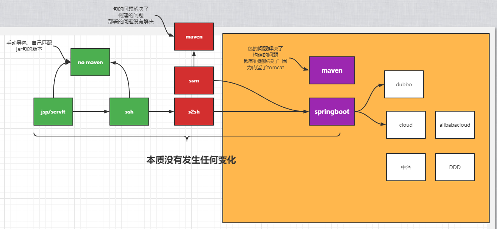

- 传统的开发方式必须全部由开发人员去下载jar包，工程很难复用。（jsp/servlet / ssh）

  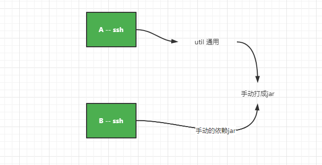

  - 自己手动去增加jar包
  - 包管理和版本都需要自己去匹配
  - 打包和部署的依赖非常麻烦。
  - 配置文件一堆，都是问题

- 后续出现ant 和 maven 把项目构建的问题和打包解决

  - maven作用：构建 和 依赖管理  

- ssm 架构 

  - 构建问题使用maven解决
  - 包依赖的问题也解决了通过maven，但是版本的关系没解决
  - 依赖外部tomcat jetty容器
  - 大量配置xml配置，影响程序的开发。程序员不去关注业务，每天都在为这个烦人的配置绞尽脑汁。

- springboot开发

  - 构建问题使用maven解决
  - 包依赖的问题也解决了通过maven ，通过starter机制解决版本依赖问题
  - 内置了tomcat不需要额外的配置容器
  - 零配置，用starter机制 + @Configuration、@Bean的方式解决xml的问题


## 02、工具的历程

桌面应用程序：c/s client-server  、b/s

Java桌面应用程序：swing - jbuiler 

- jcreator
- jbuiler - swing / ejb
- eclipse
  - spring tool suite 
- myeclipse - 做很多插件
- idea


## 03、使用idea搭建ssm项目

### 03-01、目的

让大家体验springboot的这个技术好处和优点。解决了什么问题

### 03-02、创建一个maven项目

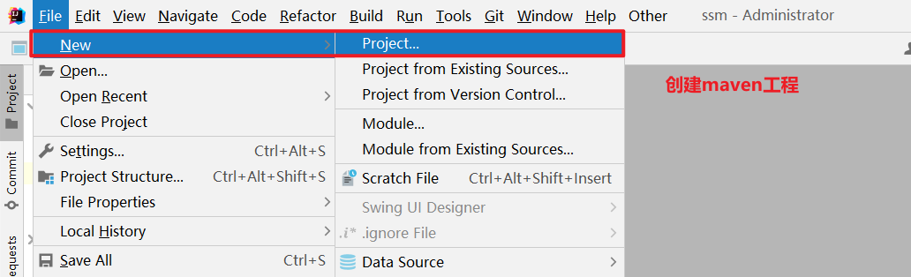

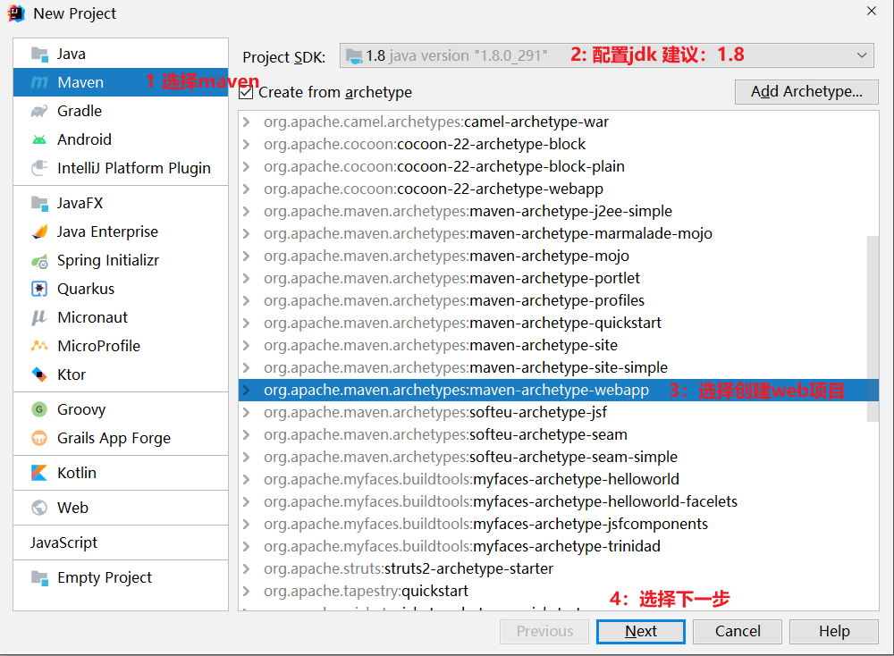

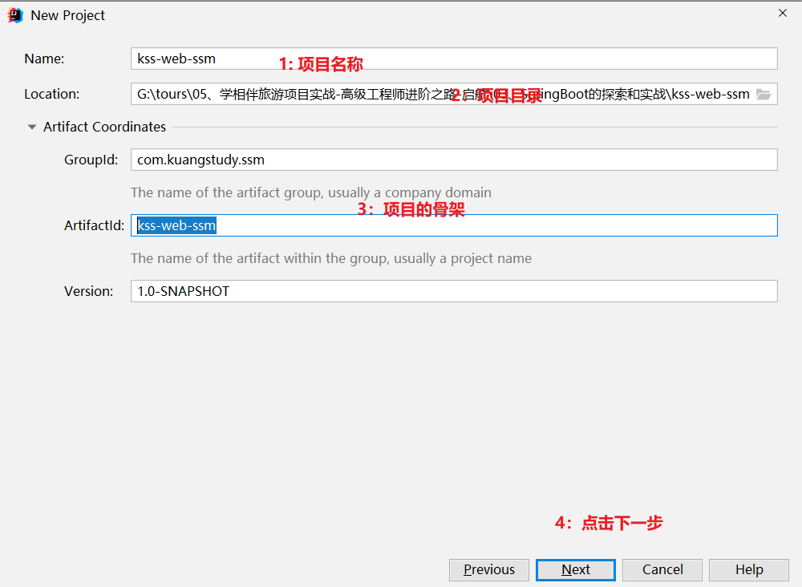

+

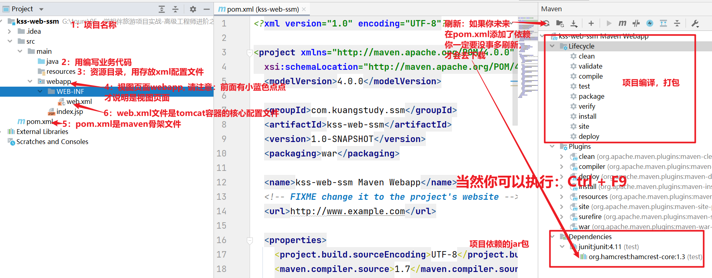

### 03-03、项目整合SSM如下

完整项目骨架如下：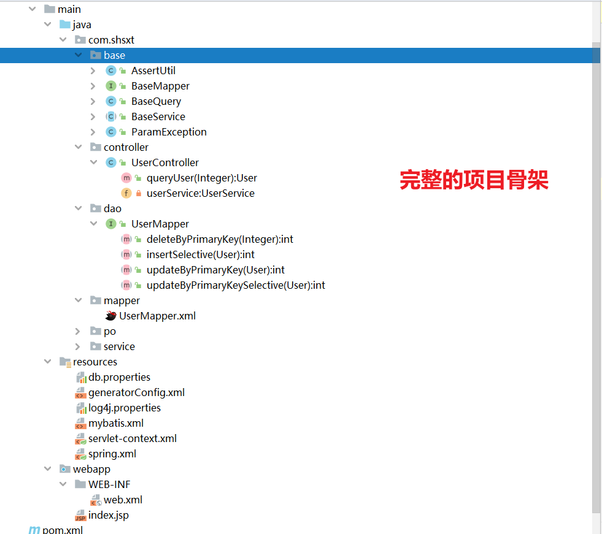


1、在pom.xml文件ssm的相关jar包，如下：

```xml
<?xml version="1.0" encoding="UTF-8"?>
<project xmlns="http://maven.apache.org/POM/4.0.0" xmlns:xsi="http://www.w3.org/2001/XMLSchema-instance"
  xsi:schemaLocation="http://maven.apache.org/POM/4.0.0 http://maven.apache.org/xsd/maven-4.0.0.xsd">
  <modelVersion>4.0.0</modelVersion>
  <groupId>com.kuangstudy.ssm</groupId>
  <artifactId>kss-web-ssm</artifactId>
  <version>1.0-SNAPSHOT</version>
  <packaging>war</packaging>

  <name>kss-web-ssm Maven Webapp</name>
  <!-- FIXME change it to the project's website -->
  <url>http://www.example.com</url>

  <properties>
    <project.build.sourceEncoding>UTF-8</project.build.sourceEncoding>
    <maven.compiler.source>1.8</maven.compiler.source>
    <maven.compiler.target>1.8</maven.compiler.target>
  </properties>

  <dependencies>
    <dependency>
      <groupId>junit</groupId>
      <artifactId>junit</artifactId>
      <version>4.12</version>
      <scope>test</scope>
    </dependency>
    <!-- spring 核心jar -->
    <dependency>
      <groupId>org.springframework</groupId>
      <artifactId>spring-context</artifactId>
      <version>4.3.2.RELEASE</version>
    </dependency>
    <!-- spring 测试jar -->
    <dependency>
      <groupId>org.springframework</groupId>
      <artifactId>spring-test</artifactId>
      <version>4.3.2.RELEASE</version>
    </dependency>
    <!-- spring jdbc -->
    <dependency>
      <groupId>org.springframework</groupId>
      <artifactId>spring-jdbc</artifactId>
      <version>4.3.2.RELEASE</version>
    </dependency>
    <!-- spring事物 -->
    <dependency>
      <groupId>org.springframework</groupId>
      <artifactId>spring-tx</artifactId>
      <version>4.3.2.RELEASE</version>
    </dependency>
    <!-- aspectj切面编程的jar -->
    <dependency>
      <groupId>org.aspectj</groupId>
      <artifactId>aspectjweaver</artifactId>
      <version>1.8.9</version>
    </dependency>
    <!-- c3p0 连接池 -->
    <dependency>
      <groupId>c3p0</groupId>
      <artifactId>c3p0</artifactId>
      <version>0.9.1.2</version>
    </dependency>
    <!-- mybatis -->
    <dependency>
      <groupId>org.mybatis</groupId>
      <artifactId>mybatis</artifactId>
      <version>3.4.1</version>
    </dependency>
    <!-- 添加mybatis与Spring整合的核心包 -->
    <dependency>
      <groupId>org.mybatis</groupId>
      <artifactId>mybatis-spring</artifactId>
      <version>1.3.0</version>
    </dependency>
    <!-- mysql 驱动包 -->
    <dependency>
      <groupId>mysql</groupId>
      <artifactId>mysql-connector-java</artifactId>
      <version>8.0.25</version>
    </dependency>
    <!-- 日志打印相关的jar -->
    <dependency>
      <groupId>org.slf4j</groupId>
      <artifactId>slf4j-log4j12</artifactId>
      <version>1.7.2</version>
    </dependency>
    <dependency>
      <groupId>org.slf4j</groupId>
      <artifactId>slf4j-api</artifactId>
      <version>1.7.2</version>
    </dependency>
    <!-- spring web -->
    <dependency>
      <groupId>org.springframework</groupId>
      <artifactId>spring-web</artifactId>
      <version>4.3.2.RELEASE</version>
    </dependency>
    <!-- spring mvc -->
    <dependency>
      <groupId>org.springframework</groupId>
      <artifactId>spring-webmvc</artifactId>
      <version>4.3.2.RELEASE</version>
    </dependency>
    <!-- web servlet -->
    <dependency>
      <groupId>javax.servlet</groupId>
      <artifactId>javax.servlet-api</artifactId>
      <version>3.0.1</version>
      <scope>provided</scope>
    </dependency>
    <!-- 添加json 依赖jar包 -->
    <dependency>
      <groupId>com.fasterxml.jackson.core</groupId>
      <artifactId>jackson-core</artifactId>
      <version>2.7.0</version>
    </dependency>
    <dependency>
      <groupId>com.fasterxml.jackson.core</groupId>
      <artifactId>jackson-databind</artifactId>
      <version>2.7.0</version>
    </dependency>
    <dependency>
      <groupId>com.fasterxml.jackson.core</groupId>
      <artifactId>jackson-annotations</artifactId>
      <version>2.7.0</version>
    </dependency>
    <!-- 分页插件配置 -->
    <dependency>
      <groupId>com.github.pagehelper</groupId>
      <artifactId>pagehelper</artifactId>
      <version>4.1.0</version>
    </dependency>


    <!-- 文件上传包依赖 -->
    <dependency>
      <groupId>commons-fileupload</groupId>
      <artifactId>commons-fileupload</artifactId>
      <version>1.3.2</version>
    </dependency>
  </dependencies>

  <build>
    <finalName>kss-web-ssm</finalName>
    <pluginManagement><!-- lock down plugins versions to avoid using Maven defaults (may be moved to parent pom) -->
      <plugins>
        <plugin>
          <artifactId>maven-clean-plugin</artifactId>
          <version>3.1.0</version>
        </plugin>
        <!-- see http://maven.apache.org/ref/current/maven-core/default-bindings.html#Plugin_bindings_for_war_packaging -->
        <plugin>
          <artifactId>maven-resources-plugin</artifactId>
          <version>3.0.2</version>
        </plugin>
        <plugin>
          <artifactId>maven-compiler-plugin</artifactId>
          <version>3.8.0</version>
        </plugin>
        <plugin>
          <artifactId>maven-surefire-plugin</artifactId>
          <version>2.22.1</version>
        </plugin>
        <plugin>
          <artifactId>maven-war-plugin</artifactId>
          <version>3.2.2</version>
        </plugin>
        <plugin>
          <artifactId>maven-install-plugin</artifactId>
          <version>2.5.2</version>
        </plugin>
        <plugin>
          <artifactId>maven-deploy-plugin</artifactId>
          <version>2.8.2</version>
        </plugin>
      </plugins>
    </pluginManagement>
  </build>
</project>
```

用springboot来做的话,只需要如下就解决上面所有的依赖问题，如下：

```xml
<!-- 日志打印相关的jar -->
<dependency>
    <groupId>org.springxxxxx</groupId>
    <artifactId>spring-boot-starter-web</artifactId>
</dependency>
```

本质上没变化：因为spring-boot-starter-web 内部会自动的去帮你去管理上面的这些包。进行下载配置。

2、配置spring的配置文件

spring.xml：这个文件的作用其实就去整合mybatis和数据源和事务等。 如下：

```xml
<?xml version="1.0" encoding="UTF-8"?>
<beans xmlns="http://www.springframework.org/schema/beans"
       xmlns:xsi="http://www.w3.org/2001/XMLSchema-instance" xmlns:context="http://www.springframework.org/schema/context"
       xmlns:aop="http://www.springframework.org/schema/aop" xmlns:tx="http://www.springframework.org/schema/tx"
       xsi:schemaLocation="http://www.springframework.org/schema/beans
        http://www.springframework.org/schema/beans/spring-beans.xsd
        http://www.springframework.org/schema/context
        http://www.springframework.org/schema/context/spring-context.xsd
        http://www.springframework.org/schema/aop
        http://www.springframework.org/schema/aop/spring-aop.xsd
        http://www.springframework.org/schema/tx
        http://www.springframework.org/schema/tx/spring-tx-3.0.xsd">

    <!-- 扫描基本包 过滤controller层 -->
    <context:component-scan base-package="com.shsxt" >
        <context:exclude-filter type="annotation" expression="org.springframework.stereotype.Controller" />
    </context:component-scan>

    <!-- 加载properties 配置文件 -->
    <context:property-placeholder location="classpath:db.properties" />

    <aop:aspectj-autoproxy /><!-- aop -->

    <!-- 配置c3p0 数据源 -->
    <bean id="dataSource" class="com.mchange.v2.c3p0.ComboPooledDataSource">
        <property name="driverClass" value="${jdbc.driver}"></property>
        <property name="jdbcUrl" value="${jdbc.url}"></property>
        <property name="user" value="${jdbc.username}"></property>
        <property name="password" value="${jdbc.password}"></property>
    </bean>

    <!-- 配置事务管理器 -->
    <bean id="txManager"
          class="org.springframework.jdbc.datasource.DataSourceTransactionManager">
        <property name="dataSource" ref="dataSource"></property>
    </bean>

    <!-- 设置事物增强 -->
    <tx:advice id="txAdvice" transaction-manager="txManager">
        <tx:attributes>
            <tx:method name="get*" read-only="true" />
            <tx:method name="find*" read-only="true" />
            <tx:method name="query*" read-only="true" />
            <tx:method name="load*" read-only="true" />
            <tx:method name="add*" propagation="REQUIRED" />
            <tx:method name="insert*" propagation="REQUIRED" />
            <tx:method name="update*" propagation="REQUIRED" />
            <tx:method name="delete*" propagation="REQUIRED" />
        </tx:attributes>
    </tx:advice>

    <!-- aop 切面配置 -->
    <aop:config>
        <aop:pointcut id="servicePointcut"
                      expression="execution(* com.shsxt.service..*.*(..))" />
        <aop:advisor advice-ref="txAdvice" pointcut-ref="servicePointcut" />
    </aop:config>

    <!-- 配置 sqlSessionFactory -->
    <bean id="sqlSessionFactory" class="org.mybatis.spring.SqlSessionFactoryBean">
        <property name="dataSource" ref="dataSource"></property>
        <property name="configLocation" value="classpath:mybatis.xml" />
        <property name="mapperLocations" value="classpath:com/shsxt/mapper/*.xml" />
    </bean>
    <!-- 配置扫描器 -->
    <bean id="mapperScanner" class="org.mybatis.spring.mapper.MapperScannerConfigurer">
        <!-- 扫描com.shsxt.dao这个包以及它的子包下的所有映射接口类 -->
        <property name="basePackage" value="com.shsxt.dao" />
        <property name="sqlSessionFactoryBeanName" value="sqlSessionFactory" />
    </bean>
</beans>
```

3、配置springmvc配置文件：

servlet-context.xml：配置sprignmvc,包括：json处理，拦截器，视图转发等如下：

```xml
<?xml version="1.0" encoding="UTF-8"?>
<beans xmlns="http://www.springframework.org/schema/beans"
       xmlns:xsi="http://www.w3.org/2001/XMLSchema-instance"
       xmlns:mvc="http://www.springframework.org/schema/mvc"
       xmlns:context="http://www.springframework.org/schema/context"
       xmlns:aop="http://www.springframework.org/schema/aop"
       xmlns:tx="http://www.springframework.org/schema/tx"
       xsi:schemaLocation="
        http://www.springframework.org/schema/mvc
        http://www.springframework.org/schema/mvc/spring-mvc-3.2.xsd
        http://www.springframework.org/schema/beans
        http://www.springframework.org/schema/beans/spring-beans-3.0.xsd
        http://www.springframework.org/schema/context
        http://www.springframework.org/schema/context/spring-context-3.0.xsd
        http://www.springframework.org/schema/aop
        http://www.springframework.org/schema/aop/spring-aop-2.5.xsd
        http://www.springframework.org/schema/tx
        http://www.springframework.org/schema/tx/spring-tx-2.5.xsd">


    <!-- 扫描com.shsxt.controller 下包 -->
    <context:component-scan base-package="com.shsxt.controller" />
    <!-- mvc 请求映射处理器与适配器 -->
    <mvc:annotation-driven />

    <!--配置视图解析器 默认的视图解析器- -->
    <bean id="defaultViewResolver"
          class="org.springframework.web.servlet.view.InternalResourceViewResolver">
        <property name="viewClass"
                  value="org.springframework.web.servlet.view.JstlView" />
        <property name="contentType" value="text/html" />
        <property name="prefix" value="/WEB-INF/jsp/" />
        <property name="suffix" value=".jsp" />
    </bean>


    <!-- json 支持 -->
    <bean
            class="org.springframework.web.servlet.mvc.method.annotation.RequestMappingHandlerMapping">
    </bean>
    <bean
            class="org.springframework.web.servlet.mvc.method.annotation.RequestMappingHandlerAdapter">
        <property name="messageConverters">
            <list>
                <bean
                        class="org.springframework.http.converter.json.MappingJackson2HttpMessageConverter" />
            </list>
        </property>
    </bean>


    <!-- 文件上传配置 -->
    <bean id="multipartResolver"
          class="org.springframework.web.multipart.commons.CommonsMultipartResolver">
        <property name="maxUploadSize">
            <value>104857600</value>
        </property>
        <property name="maxInMemorySize">
            <value>4096</value>
        </property>
    </bean>

</beans>
```

4、web.xml配置

把spring.xml和springmvc-context.xml配置到web.xml中

```xml
<?xml version="1.0" encoding="UTF-8"?>
<web-app xmlns:xsi="http://www.w3.org/2001/XMLSchema-instance"
         xmlns="http://java.sun.com/xml/ns/javaee"
         xsi:schemaLocation="http://java.sun.com/xml/ns/javaee http://java.sun.com/xml/ns/javaee/web-app_3_0.xsd"
         id="WebApp_ID" version="3.0">
    <context-param>
        <param-name>contextConfigLocation</param-name>
        <param-value>classpath:spring.xml</param-value>
    </context-param>
    <listener>
        <listener-class>org.springframework.web.context.ContextLoaderListener</listener-class>
    </listener>
    <filter>
        <description>char encoding filter</description>
        <filter-name>encodingFilter</filter-name>
        <filter-class>org.springframework.web.filter.CharacterEncodingFilter</filter-class>
        <init-param>
            <param-name>encoding</param-name>
            <param-value>UTF-8</param-value>
        </init-param>
    </filter>
    <filter-mapping>
        <filter-name>encodingFilter</filter-name>
        <url-pattern>/*</url-pattern>
    </filter-mapping>
    <servlet>
        <servlet-name>springMvc</servlet-name>
        <servlet-class>org.springframework.web.servlet.DispatcherServlet</servlet-class>
        <init-param>
            <param-name>contextConfigLocation</param-name>
            <param-value>classpath:servlet-context.xml</param-value>
        </init-param>
        <load-on-startup>1</load-on-startup>
    </servlet>
    <servlet-mapping>
      <servlet-name>springMvc</servlet-name>
      <url-pattern>/</url-pattern>
    </servlet-mapping>
</web-app>
```


5、整合mybatis配置-- 配置数据源属性配置

前提：准备数据库kss-web-db 和一个数据库表：kss_test_user

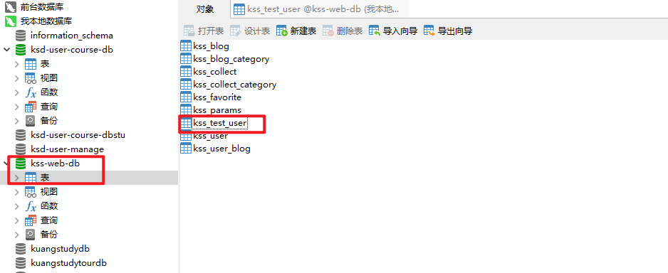

配置文件结构如下：

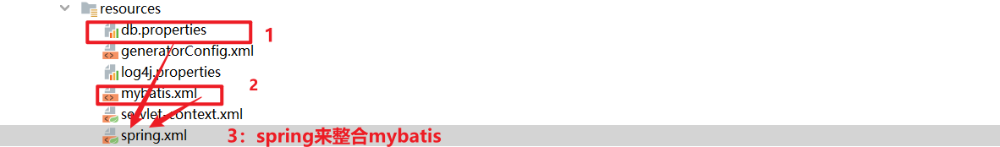

5-1、db.properties 如下：

```properties
jdbc.driver=com.mysql.jdbc.Driver
jdbc.url=jdbc:mysql://localhost:3306/kss-web-db?useUnicode=true&characterEncoding=utf8
jdbc.username=root
jdbc.password=mkxiaoer
```

5-2、mybatis.xml如下：

```xml
<!DOCTYPE configuration
        PUBLIC "-//mybatis.org//DTD Config 3.0//EN"
        "http://mybatis.org/dtd/mybatis-3-config.dtd">

<configuration>
    <!-- po 包扫描 -->
    <typeAliases>
        <package name="com.shsxt.po" />
    </typeAliases>
    <plugins>
        <!-- com.github.pagehelper为PageHelper类所在包名 -->
        <plugin interceptor="com.github.pagehelper.PageHelper">
            <property name="dialect" value="mysql" />
            <!-- 该参数默认为false -->
            <!-- 设置为true时，会将RowBounds第一个参数offset当成pageNum页码使用 -->
            <!-- 和startPage中的pageNum效果一样 -->
            <property name="offsetAsPageNum" value="true" />
            <!-- 该参数默认为false -->
            <!-- 设置为true时，使用RowBounds分页会进行count查询 -->
            <property name="rowBoundsWithCount" value="true" />
            <!-- 设置为true时，如果pageSize=0或者RowBounds.limit = 0就会查询出全部的结果 -->
            <!-- （相当于没有执行分页查询，但是返回结果仍然是Page类型） -->
            <property name="pageSizeZero" value="true" />
            <!-- 3.3.0版本可用 - 分页参数合理化，默认false禁用 -->
            <!-- 启用合理化时，如果pageNum<1会查询第一页，如果pageNum>pages会查询最后一页 -->
            <!-- 禁用合理化时，如果pageNum<1或pageNum>pages会返回空数据 -->
            <property name="reasonable" value="true" />
            <!-- 3.5.0版本可用 - 为了支持startPage(Object params)方法 -->
            <!-- 增加了一个`params`参数来配置参数映射，用于从Map或ServletRequest中取值 -->
            <!-- 可以配置pageNum,pageSize,count,pageSizeZero,reasonable,不配置映射的用默认值 -->
            <property name="params"
                      value="pageNum=start;pageSize=limit;pageSizeZero=zero;reasonable=heli;count=countsql" />
        </plugin>
    </plugins>
</configuration>
```

5-3、新建一个实体bean

比如kss_test_user

```java
package com.shsxt.po;

public class User {
    private Integer id;

    private String userName;

    private String userPwd;

    private String realName;

    private String nation;

    private Integer cardId;

    public Integer getId() {
        return id;
    }

    public void setId(Integer id) {
        this.id = id;
    }

    public String getUserName() {
        return userName;
    }

    public void setUserName(String userName) {
        this.userName = userName == null ? null : userName.trim();
    }

    public String getUserPwd() {
        return userPwd;
    }

    public void setUserPwd(String userPwd) {
        this.userPwd = userPwd == null ? null : userPwd.trim();
    }

    public String getRealName() {
        return realName;
    }

    public void setRealName(String realName) {
        this.realName = realName == null ? null : realName.trim();
    }

    public String getNation() {
        return nation;
    }

    public void setNation(String nation) {
        this.nation = nation == null ? null : nation.trim();
    }

    public Integer getCardId() {
        return cardId;
    }

    public void setCardId(Integer cardId) {
        this.cardId = cardId;
    }
}
```

5-4、mapper和dao新建

UserMapper.java

```java
package com.shsxt.dao;

import com.shsxt.base.BaseMapper;
import com.shsxt.po.User;

public interface UserMapper extends BaseMapper<User> {
    int deleteByPrimaryKey(Integer id);
    int insertSelective(User record);
    int updateByPrimaryKeySelective(User record);
    int updateByPrimaryKey(User record);
}
```

UserMapper.xml

```xml
<?xml version="1.0" encoding="UTF-8" ?>
<!DOCTYPE mapper PUBLIC "-//mybatis.org//DTD Mapper 3.0//EN" "http://mybatis.org/dtd/mybatis-3-mapper.dtd" >
<mapper namespace="com.shsxt.dao.UserMapper" >
  <resultMap id="BaseResultMap" type="com.shsxt.po.User" >
    <id column="id" property="id" jdbcType="INTEGER" />
    <result column="user_name" property="userName" jdbcType="VARCHAR" />
    <result column="user_pwd" property="userPwd" jdbcType="VARCHAR" />
    <result column="real_name" property="realName" jdbcType="VARCHAR" />
    <result column="nation" property="nation" jdbcType="VARCHAR" />
    <result column="card_id" property="cardId" jdbcType="INTEGER" />
  </resultMap>
  <sql id="Base_Column_List" >
    id, user_name, user_pwd, real_name, nation, card_id
  </sql>
  <select id="queryById" resultMap="BaseResultMap" parameterType="java.lang.Integer" >
    select 
    <include refid="Base_Column_List" />
    from kss_test_user
    where id = #{id,jdbcType=INTEGER}
  </select>
  <delete id="deleteByPrimaryKey" parameterType="java.lang.Integer" >
    delete from kss_test_user
    where id = #{id,jdbcType=INTEGER}
  </delete>
  <insert id="insert" parameterType="com.shsxt.po.User" >
    insert into kss_test_user (id, user_name, user_pwd, 
      real_name, nation, card_id
      )
    values (#{id,jdbcType=INTEGER}, #{userName,jdbcType=VARCHAR}, #{userPwd,jdbcType=VARCHAR}, 
      #{realName,jdbcType=VARCHAR}, #{nation,jdbcType=VARCHAR}, #{cardId,jdbcType=INTEGER}
      )
  </insert>
  <insert id="insertSelective" parameterType="com.shsxt.po.User" >
    insert into kss_test_user
    <trim prefix="(" suffix=")" suffixOverrides="," >
      <if test="id != null" >
        id,
      </if>
      <if test="userName != null" >
        user_name,
      </if>
      <if test="userPwd != null" >
        user_pwd,
      </if>
      <if test="realName != null" >
        real_name,
      </if>
      <if test="nation != null" >
        nation,
      </if>
      <if test="cardId != null" >
        card_id,
      </if>
    </trim>
    <trim prefix="values (" suffix=")" suffixOverrides="," >
      <if test="id != null" >
        #{id,jdbcType=INTEGER},
      </if>
      <if test="userName != null" >
        #{userName,jdbcType=VARCHAR},
      </if>
      <if test="userPwd != null" >
        #{userPwd,jdbcType=VARCHAR},
      </if>
      <if test="realName != null" >
        #{realName,jdbcType=VARCHAR},
      </if>
      <if test="nation != null" >
        #{nation,jdbcType=VARCHAR},
      </if>
      <if test="cardId != null" >
        #{cardId,jdbcType=INTEGER},
      </if>
    </trim>
  </insert>
  <update id="updateByPrimaryKeySelective" parameterType="com.shsxt.po.User" >
    update kss_test_user
    <set >
      <if test="userName != null" >
        user_name = #{userName,jdbcType=VARCHAR},
      </if>
      <if test="userPwd != null" >
        user_pwd = #{userPwd,jdbcType=VARCHAR},
      </if>
      <if test="realName != null" >
        real_name = #{realName,jdbcType=VARCHAR},
      </if>
      <if test="nation != null" >
        nation = #{nation,jdbcType=VARCHAR},
      </if>
      <if test="cardId != null" >
        card_id = #{cardId,jdbcType=INTEGER},
      </if>
    </set>
    where id = #{id,jdbcType=INTEGER}
  </update>
  <update id="updateByPrimaryKey" parameterType="com.shsxt.po.User" >
    update kss_test_user
    set user_name = #{userName,jdbcType=VARCHAR},
      user_pwd = #{userPwd,jdbcType=VARCHAR},
      real_name = #{realName,jdbcType=VARCHAR},
      nation = #{nation,jdbcType=VARCHAR},
      card_id = #{cardId,jdbcType=INTEGER}
    where id = #{id,jdbcType=INTEGER}
  </update>
</mapper>
```


5-5、新建一个UserService

```java
package com.shsxt.service;

import com.shsxt.base.BaseService;
import com.shsxt.dao.UserMapper;
import com.shsxt.po.User;
import org.springframework.stereotype.Service;

import javax.annotation.Resource;
@Service
public class UserService extends BaseService<User> {
    @Resource
    private UserMapper userMapper;
}

```


5-6、新建一个UserController

```java
package com.shsxt.controller;

import com.shsxt.po.User;
import com.shsxt.service.UserService;
import org.springframework.stereotype.Controller;
import org.springframework.web.bind.annotation.RequestMapping;
import org.springframework.web.bind.annotation.ResponseBody;

import javax.annotation.Resource;

@Controller
@RequestMapping("user")
public class UserController {
    @Resource
    private UserService userService;


    @RequestMapping("queryUser")
    @ResponseBody
    public User queryUser(Integer id) throws Exception {
        return userService.queryById(id);
    }
}
-
```

5-7、未来每天的工作流程如下：

整体步骤如下：

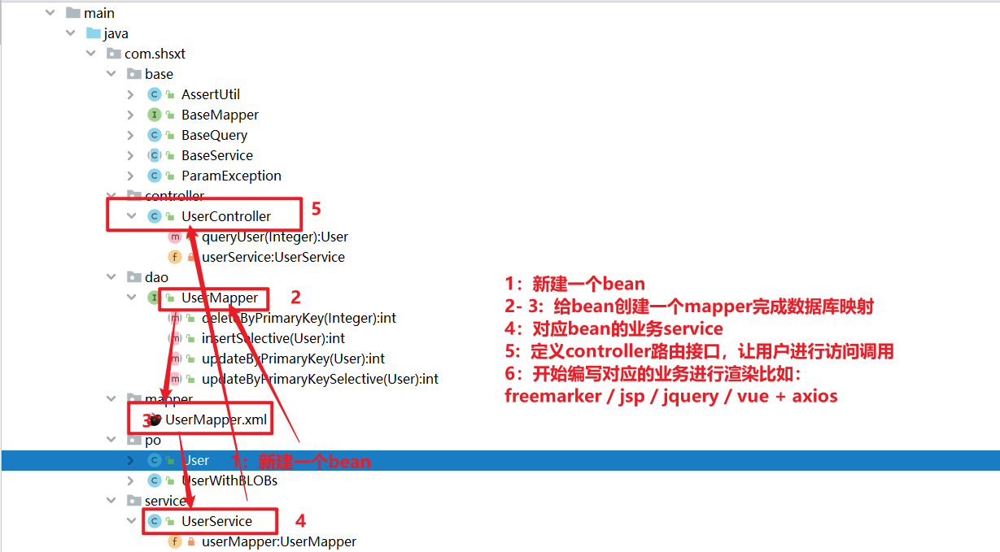

上面的步骤，就是每天都在轮回做这个事情，只不过是更换了一个模块和业务而已。


###  tomcat部署项目

配置外部的tomcat把部署到容器中。

1、配置tomcat

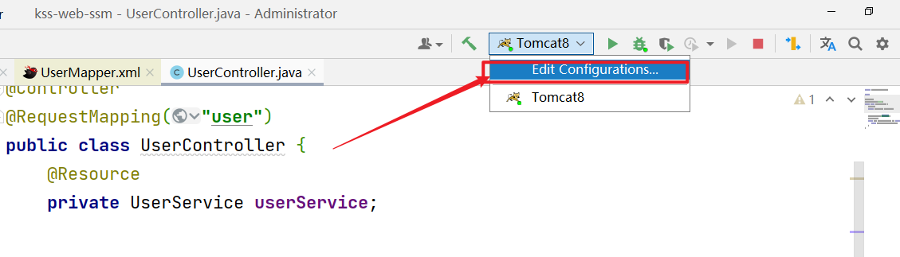

2、选择配置本地的tomcat

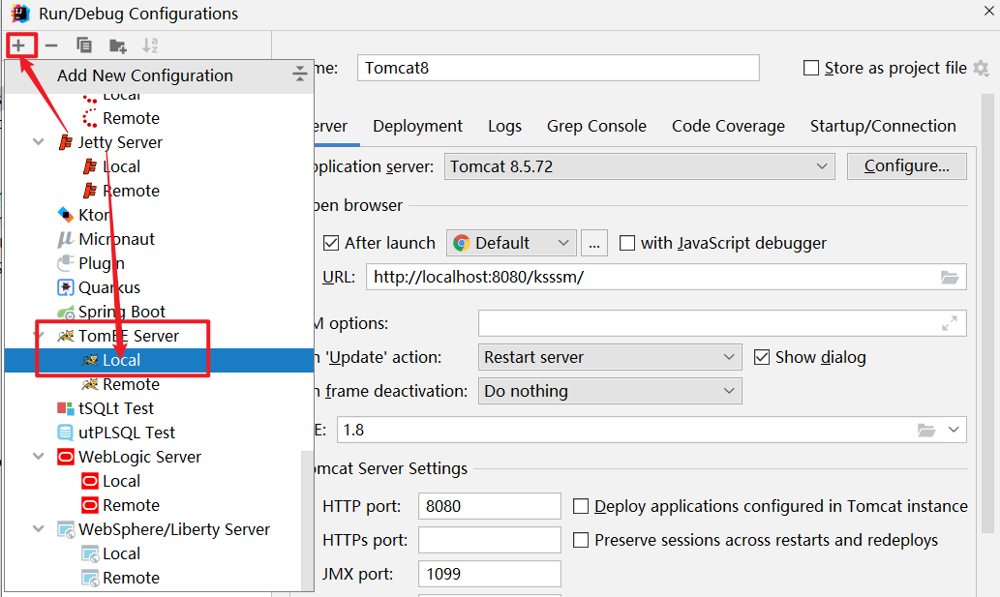

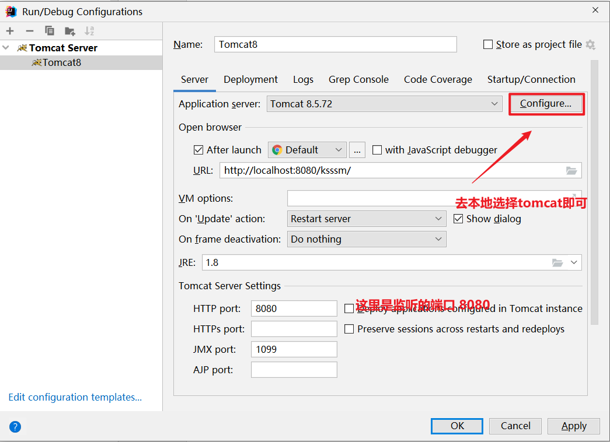

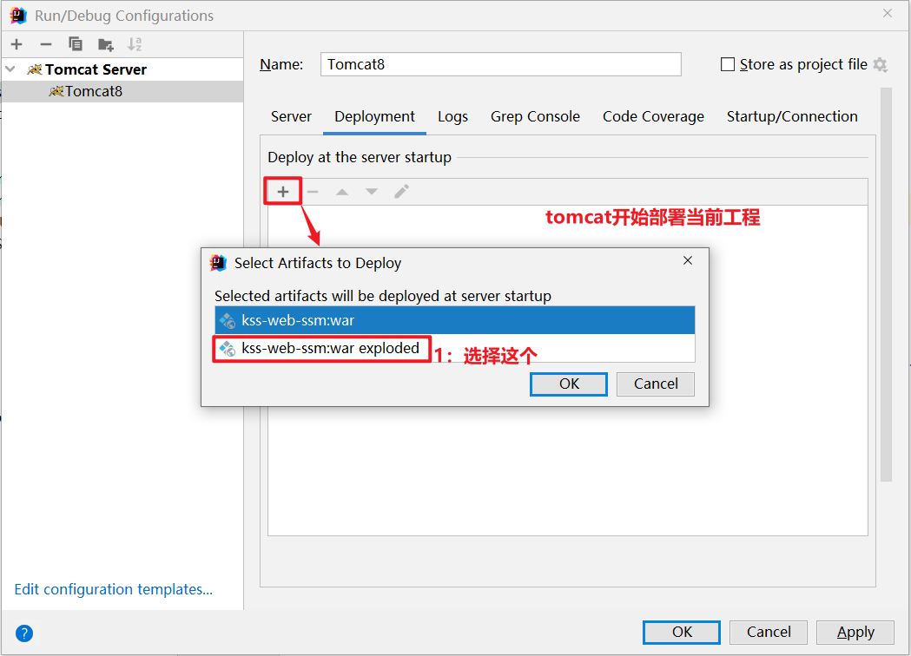

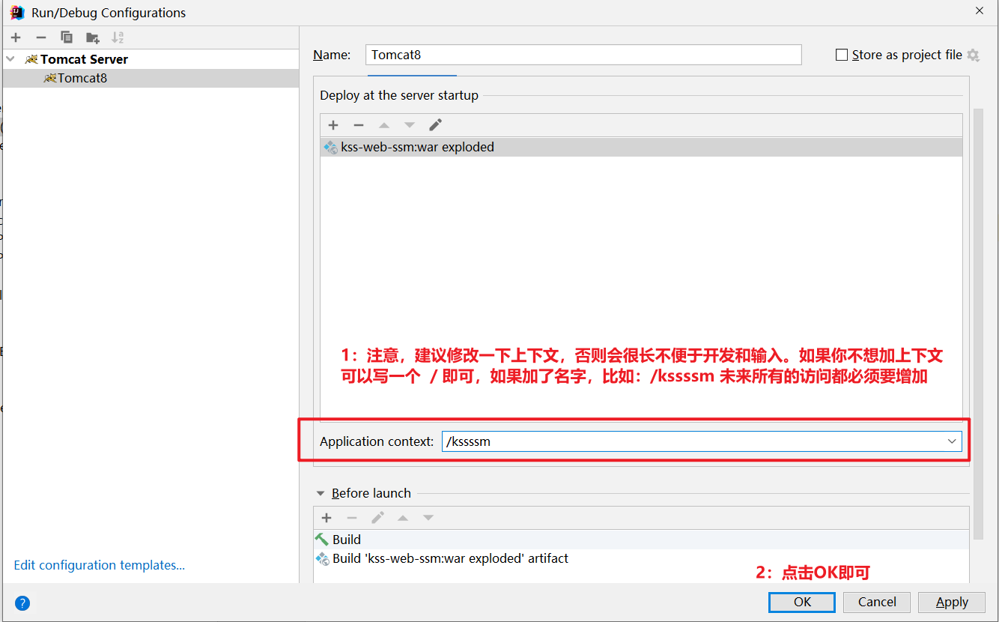

部署项目：

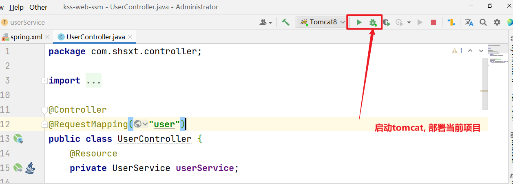

然后在浏览器访问：http://localhost:8080/ksssm/user/queryUser?id=1，如果能够查询出来：整合ssm成功:

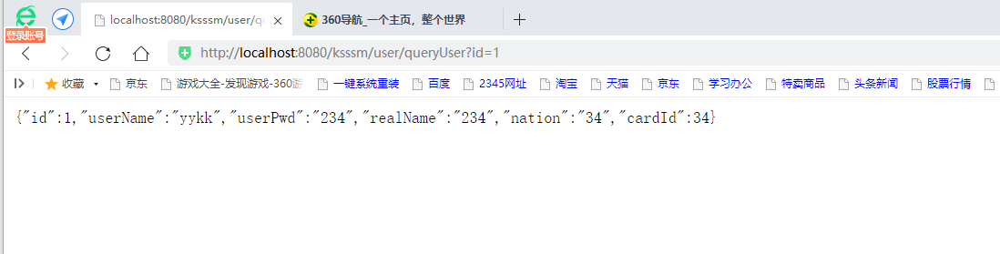


