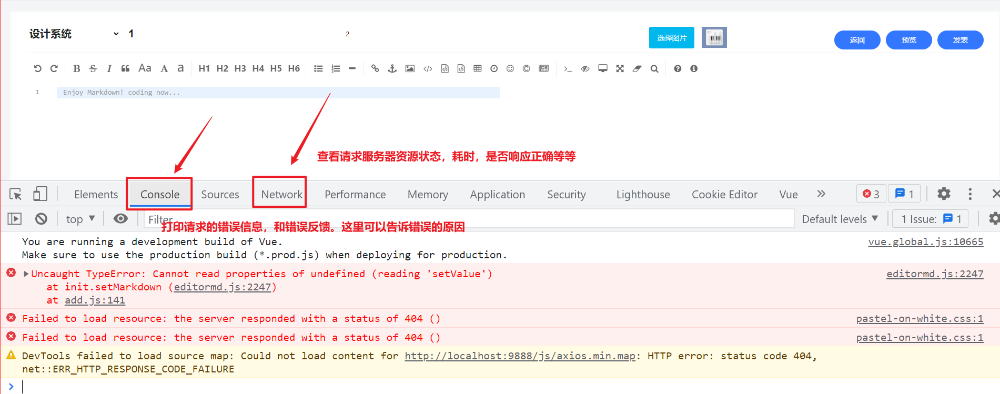
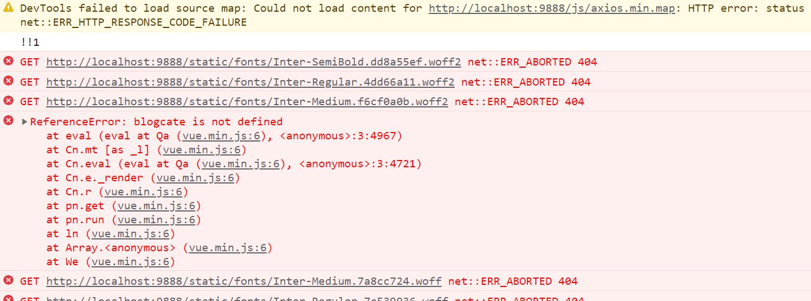
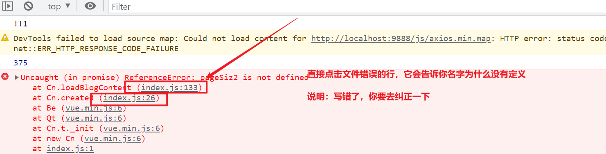

# 如何排错

- 没错错误是很可怕的。

- 其实95%错误都可以通过工具，异常，debug都可以排查出来。

- 不要看到红色就是错误，有些时候在警告。一切已经运行是否成功，和访问成功为主。

## 如果遇到错误我怎么办

- 前台的错误

  以：保存博客为例

  - 保存业务流程
    - 1：保存按钮 -- 绑定事件
    - 2：事件必须定义methods中 - saveBlog
    - 3：在按钮上使用@Click="saveBlog"
    - 4：获取页面参数，开始组装参数对象，
    - 5：使用axios.post提交服务 -------------------------------------------------------错误的界限

- 后台错误

  - 保存博客
    - 6：查询客户端是否如约而至把数据从前端传递过来
    - 7：进行反馈给客户端进行响应
    - 8：结束流程
  - 保存的后续
    - 做校验

### 开发的拍错开始

- 先把工具给打开，先浏览器的工具给打开 F12 如下：

- 前台善于用打印：console.log () 
- 后台用：System.out.println() 专业的开发人员：log.info("")
- 善于使用debug

## 前端工具排查错误

vue.min.js:6 ReferenceError: blogcate is not defined 含义是：没有定义

- 如果是页面中，是不会，就呈现出上面的代码

明确你现在正在开发什么功能，如何报错没有达到预期效果：

解决方案：

- 先把你写的代码删除一下，在执行
- 如果整个页面出现error , 新建一个干净的页面看看是否没问题、

- 如果是在js文件中，会直接定位到js文件的具体行

##  总结

- 遇到问题一定要冷静
- 一定要学会善于用工具
- 要学会用排除法。是前台错误还是后台的错误。一定查看：名字，语法等是否正确。
- 如果值出不来，看看属性名是否写错了，如果报什么没定义，说明你名字写错了。

