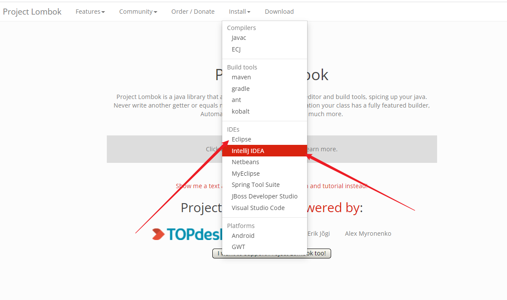
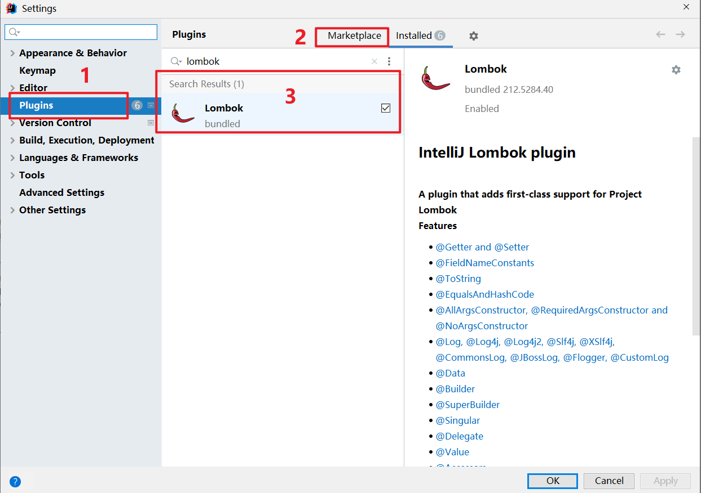

# Lombok 恩恩怨怨


## 关于Lombok的弃用问题

https://zhuanlan.zhihu.com/p/146659383

## 01、官网

https://projectlombok.org/

注解文档：https://projectlombok.org/features/all

## 02、说明

Project Lombok 是一个 Java 库，可自动插入您的编辑器并构建工具，为您的 Java 增添趣味。
永远不要再编写另一个 getter 或 equals 方法，通过一个注释，您的类就有一个功能齐全的构建器，自动化您的日志变量。

- 用了lombok可以节约开发时间和效率，不需要在写setter . setter equals tostring等
- 也提供日志的支持 @Slf4j 和 @Log4j2 


## 03、使用Lombok的注意事项

在你的idea或者eclipse开发工具中，一定要安装Lombok插件, 否则不会生效。



idea的安装方式：

- Go to `File > Settings > Plugins`
- Click on `Browse repositories...`
- Search for `Lombok Plugin`
- Click on `Install plugin`
- Restart IntelliJ IDEA




## 04、使用Lombok

lombok：广泛应用于 mybatis-plus 和 spring开源项目都看到它的身影，已经被spring团队拉入的核心依赖中，所以在springboot项目中已经存在lombok。在后续的依赖中不需要在指定版本号。

在项目的pom.xml中依赖lombok

```xml
<!--lombok-->
<dependency>
    <groupId>org.projectlombok</groupId>
    <artifactId>lombok</artifactId>
    <optional>true</optional>
</dependency>
```

### 04、使用Lombok - 简化bean的定义如下：

@Data注解：它是复合注解包括：

- @ToString
- @EqualsAndHashCode
- @Setter
- @Getter

```java
package com.kuangstudy.bean;

import lombok.Data;

/**
 * Description:
 * Author: yykk Administrator
 * Version: 1.0
 * Create Date Time: 2021/12/14 21:53.
 * Update Date Time:
 *
 * @see
 */
@Data
public class User {
    // 主键
    private Integer id;
    // 用户昵称
    private String nickname;
    // 用户密码
    private String password;
    // 用户收集
    private String telephone;
    // 用户的邮箱
    private String email;
    // 用户的头像
    private String avatar;
}

```

编译以后的代码在target目录下，如下：

```java
//
// Source code recreated from a .class file by IntelliJ IDEA
// (powered by FernFlower decompiler)
//

package com.kuangstudy.bean;

public class User {
    private Integer id;
    private String nickname;
    private String password;
    private String telephone;
    private String email;
    private String avatar;

    public User() {
    }

    public Integer getId() {
        return this.id;
    }

    public String getNickname() {
        return this.nickname;
    }

    public String getPassword() {
        return this.password;
    }

    public String getTelephone() {
        return this.telephone;
    }

    public String getEmail() {
        return this.email;
    }

    public String getAvatar() {
        return this.avatar;
    }

    public void setId(final Integer id) {
        this.id = id;
    }

    public void setNickname(final String nickname) {
        this.nickname = nickname;
    }

    public void setPassword(final String password) {
        this.password = password;
    }

    public void setTelephone(final String telephone) {
        this.telephone = telephone;
    }

    public void setEmail(final String email) {
        this.email = email;
    }

    public void setAvatar(final String avatar) {
        this.avatar = avatar;
    }

    public boolean equals(final Object o) {
        if (o == this) {
            return true;
        } else if (!(o instanceof User)) {
            return false;
        } else {
            User other = (User)o;
            if (!other.canEqual(this)) {
                return false;
            } else {
                Object this$id = this.getId();
                Object other$id = other.getId();
                if (this$id == null) {
                    if (other$id != null) {
                        return false;
                    }
                } else if (!this$id.equals(other$id)) {
                    return false;
                }

                Object this$nickname = this.getNickname();
                Object other$nickname = other.getNickname();
                if (this$nickname == null) {
                    if (other$nickname != null) {
                        return false;
                    }
                } else if (!this$nickname.equals(other$nickname)) {
                    return false;
                }

                Object this$password = this.getPassword();
                Object other$password = other.getPassword();
                if (this$password == null) {
                    if (other$password != null) {
                        return false;
                    }
                } else if (!this$password.equals(other$password)) {
                    return false;
                }

                label62: {
                    Object this$telephone = this.getTelephone();
                    Object other$telephone = other.getTelephone();
                    if (this$telephone == null) {
                        if (other$telephone == null) {
                            break label62;
                        }
                    } else if (this$telephone.equals(other$telephone)) {
                        break label62;
                    }

                    return false;
                }

                label55: {
                    Object this$email = this.getEmail();
                    Object other$email = other.getEmail();
                    if (this$email == null) {
                        if (other$email == null) {
                            break label55;
                        }
                    } else if (this$email.equals(other$email)) {
                        break label55;
                    }

                    return false;
                }

                Object this$avatar = this.getAvatar();
                Object other$avatar = other.getAvatar();
                if (this$avatar == null) {
                    if (other$avatar != null) {
                        return false;
                    }
                } else if (!this$avatar.equals(other$avatar)) {
                    return false;
                }

                return true;
            }
        }
    }

    protected boolean canEqual(final Object other) {
        return other instanceof User;
    }

    public int hashCode() {
        int PRIME = true;
        int result = 1;
        Object $id = this.getId();
        int result = result * 59 + ($id == null ? 43 : $id.hashCode());
        Object $nickname = this.getNickname();
        result = result * 59 + ($nickname == null ? 43 : $nickname.hashCode());
        Object $password = this.getPassword();
        result = result * 59 + ($password == null ? 43 : $password.hashCode());
        Object $telephone = this.getTelephone();
        result = result * 59 + ($telephone == null ? 43 : $telephone.hashCode());
        Object $email = this.getEmail();
        result = result * 59 + ($email == null ? 43 : $email.hashCode());
        Object $avatar = this.getAvatar();
        result = result * 59 + ($avatar == null ? 43 : $avatar.hashCode());
        return result;
    }

    public String toString() {
        return "User(id=" + this.getId() + ", nickname=" + this.getNickname() + ", password=" + this.getPassword() + ", telephone=" + this.getTelephone() + ", email=" + this.getEmail() + ", avatar=" + this.getAvatar() + ")";
    }
}

```

下面代码会怎么样：

```java

@Data
@AllArgsConstructor
public class User {}
```

- 上面定义@AllArgsConstructor 生成有参构造函数，无参构造函数就被覆盖。

- 特别在：mybatis-plus , mybatis ,jpa 框中，orm 对象关系映射。因为bean一般是用来和数据库打交道的。存储数据使用，而这些框架的底层都通过反射实例化bean对象，调用bean调用的它的无参构造方法。所以上面代码会报错哦。

- 一句话如果在spring的框架中的任何类上增加了：@AllArgsConstructor 这个注解一定要把无参的也显示的定义出来，否则就引发框架的底层通过反射实例化的时候调不到无参构造函数的问题。

  ```java
  package com.kuangstudy.bean;
  
  import lombok.AllArgsConstructor;
  import lombok.Data;
  import lombok.NoArgsConstructor;
  
  /**
   * Description:
   * Author: yykk Administrator
   * Version: 1.0
   * Create Date Time: 2021/12/14 21:53.
   * Update Date Time:
   *
   * @see
   */
  
  @Data
  @AllArgsConstructor
  @NoArgsConstructor
  public class User {
      // 主键
      private Integer id;
      // 用户昵称
      private String nickname;
      // 用户密码
      private String password;
      // 用户收集
      private String telephone;
      // 用户的邮箱
      private String email;
      // 用户的头像
      private String avatar;
  }
  
  ```

  


### 04、使用Lombok - @Builder

```java
package com.kuangstudy.bean;

import lombok.AllArgsConstructor;
import lombok.Builder;
import lombok.Data;
import lombok.NoArgsConstructor;

/**
 * Description:
 * Author: yykk Administrator
 * Version: 1.0
 * Create Date Time: 2021/12/14 21:53.
 * Update Date Time:
 *
 * @see
 */

@Data
@AllArgsConstructor
@NoArgsConstructor
@Builder
public class User {
    // 主键
    private Integer id;
    // 用户昵称
    private String nickname;
    // 用户密码
    private String password;
    // 用户收集
    private String telephone;
    // 用户的邮箱
    private String email;
    // 用户的头像
    private String avatar;
}

```

使用

```java
User user2 = User.builder()
.id(1)
.avatar("aaa.jpg").build();
```


### 04-03、Lombok的日志的定义

支持：@Slf4j （logback） 和  @Log4j2 (log4j2) 

推荐使用：@Slf4j

#### springboot的日志支持

```xml
<!--springboot的web的starter-->
<dependency>
    <groupId>org.springframework.boot</groupId>
    <artifactId>spring-boot-starter-web</artifactId>
</dependency>

```

我们依赖的web中已经包含了日志logging如下：

```xml
<dependency>
    <groupId>org.springframework.boot</groupId>
    <artifactId>spring-boot-starter-logging</artifactId>
    <version>2.5.7</version>
    <scope>compile</scope>
</dependency>
```

默认情况：springboot默认日志是：logback 


#### 传统的定义日志

在每个类中定义日志

```java
private final static Logger log = LoggerFactory.getLogger(AlipayController.class);
private final static Logger log = LoggerFactory.getLogger(LoggerController.class);
```

使用

```properties
 log.info("-----info--------");
```


### Lombok的定义日志

```java
package com.kuangstudy.web.log;

import lombok.AllArgsConstructor;
import lombok.Synchronized;
import lombok.extern.slf4j.Slf4j;
import org.slf4j.Logger;
import org.slf4j.LoggerFactory;
import org.springframework.web.bind.annotation.GetMapping;
import org.springframework.web.bind.annotation.RestController;

/**
 * Description:
 * Author: yykk Administrator
 * Version: 1.0
 * Create Date Time: 2021/12/14 15:31.
 * Update Date Time:
 *
 * @see
 */
@RestController
@Slf4j
public class LoggerController {
//    private final static Logger log = LoggerFactory.getLogger(LoggerController.class);
    @GetMapping("/log1")
    public String log1() {
        log.info("-----info--------");
        return "log1";
    }
}

```

- 在每个需要增加日志的类上增加注解：@Log4j2 或者  @Slf4j 
- 然后在需要打印日志的方法上，通过log对象就去输入日志。


### 04-04、解决注入springioc注入的对象

在idea中@Autowired注解会出现警告。但是不响应使用，警告idea工具没有读取到实现类。典型的是mybatis的Mapper。所以用@Autowired去注入Mapper出现此警告。解决方案：

- setter方法注入

  ```java
  private AlipayProperties alipayProperties;
  public void setAlipayProperties(AlipayProperties alipayProperties) {
     this.alipayProperties = alipayProperties;
  }
  ```

- 构造函数注入

  ```java
  private AlipayProperties alipayProperties;
  
  public AlipayController2(){
  }
  public AlipayController2(AlipayProperties alipayProperties ){
  	this.alipayProperties = alipayProperties;
  }
  ```

- @Resource

  ```java
  @Resource
  private AlipayProperties alipayProperties;
  ```

- Lombok的@RequiredArgsConstructor

  ```java
   */
  @RestController
  @Slf4j
  @RequiredArgsConstructor
  public class AlipayController2 {
      private final AlipayProperties alipayProperties;
  }
  ```

  编译以后其实可以发现：

  ```java
  //
  // Source code recreated from a .class file by IntelliJ IDEA
  // (powered by FernFlower decompiler)
  //
  
  package com.kuangstudy.web.properties;
  
  import com.kuangstudy.web.properties.config.AlipayProperties;
  import org.slf4j.Logger;
  import org.slf4j.LoggerFactory;
  import org.springframework.web.bind.annotation.GetMapping;
  import org.springframework.web.bind.annotation.RestController;
  
  @RestController
  public class AlipayController2 {
      private static final Logger log = LoggerFactory.getLogger(AlipayController2.class);
      private final AlipayProperties alipayProperties;
  
      @GetMapping({"/alipay2"})
      public String alipay2() {
          log.info("你支付是的:{}", this.alipayProperties);
          return "success";
      }
  
      public AlipayController2(final AlipayProperties alipayProperties) {
          this.alipayProperties = alipayProperties;
      }
  }
  
  ```

  其实就是一个构造函数注入而已

  


##### Lombok的@RequiredArgsConstructor

Lombok的@RequiredArgsConstructor的原理是：构造函数注入


