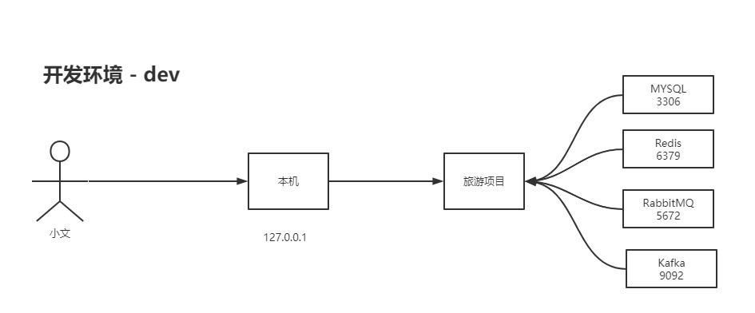
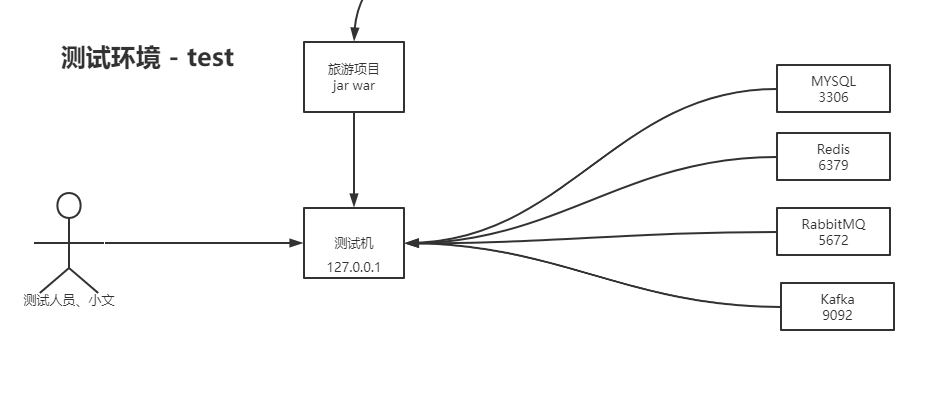
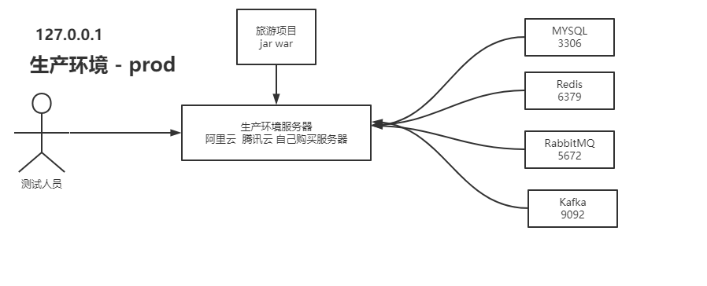

# SpringBoot中的环境隔离-Profiles


## 01、概述

在企业开发中，一般我项目分别如下几种环境：

- 开发环境

  

- 测试环境

  

- 生产环境




分析：在开发中，环境很多，而且每种环境的账号和密码。以及IP地址等都不一样。所以对我们程序开发来说就会存在非常麻烦的事情。如何去做环境隔离。


## 02、sprignboot的环境隔离

profiles 进行环境隔离和激活，具体步骤如下：

### 第一步：在resources目录下

新建两个环境文件 `applicaiton-dev.yml` 和 `applicaiton-prod.yml`

applicaiton-dev.yml

```yaml
# 属性配置类的
server:
  port: 8083
```

applicaiton-prod.yml

```yaml
# 属性配置类的
server:
  port: 8084
```

### 第二步：在applicaiton.yml进行激活

```yaml
spring:
  profiles:
    # 比如激活开发环境
    active: dev
```

### 第三步：如何证明成功呢？

比如：激活的dev

```properties
[CONSOLE][main]2021-12-15 20:37:45.928 INFO  com.kuangstudy.SpringbootApplication Line:674 - The following profiles are active: dev
```

```properties
[CONSOLE][main]2021-12-15 20:37:47.675 INFO  org.apache.coyote.http11.Http11NioProtocol Line:173 - Starting ProtocolHandler ["http-nio-8083"]
```

比如：激活的是prod

```properties
[CONSOLE][main]2021-12-15 20:38:50.987 INFO  com.kuangstudy.SpringbootApplication Line:674 - The following profiles are active: prod
```

```properties
[CONSOLE][main]2021-12-15 20:38:52.525 INFO  org.apache.coyote.http11.Http11NioProtocol Line:173 - Starting ProtocolHandler ["http-nio-8084"]
```


## 03、使用场景

解决不同环境，不同配置的问题：

- 隔离redis

- 隔离mysql

  开发环境dev，在application-dev.yml定义如下：

  ```java
  spring:
    datasource:
      type: com.zaxxer.hikari.HikariDataSource
      driver-class-name: com.mysql.cj.jdbc.Driver
      url: jdbc:mysql://127.0.0.1:3306/kss-web-db?serverTimezone=GMT%2b8&useUnicode=true&characterEncoding=utf-8&useSSL=false
      username: root
      password: mkxiaoer
      hikari:
        connection-timeout: 60000
        validation-timeout: 3000
        idle-timeout: 60000
        login-timeout: 5
        max-lifetime: 60000
        maximum-pool-size: 30
        minimum-idle: 10
        read-only: false
            
  logging:
    level:
      root: debug
            
  ```

  生成环境prod，在application-prod.yml定义如下：

  ```yaml
  spring:
    datasource:
      type: com.zaxxer.hikari.HikariDataSource
      driver-class-name: com.mysql.cj.jdbc.Driver
      url: jdbc:mysql://127.0.0.1:3306/kss-web-db?serverTimezone=GMT%2b8&useUnicode=true&characterEncoding=utf-8&useSSL=false
      username: root
      password: mkxiaoer1986.
      hikari:
        connection-timeout: 60000
        validation-timeout: 3000
        idle-timeout: 60000
        login-timeout: 5
        max-lifetime: 60000
        maximum-pool-size: 30
        minimum-idle: 10
        read-only: false
  
  logging:
    level:
      # 全局日志只输出error级别
      root: error
      # 可能有一些特殊业务，下单，支付，注册等就明细 info > warn > error
      com.kuangstudy.order: info
      com.kuangstudy.reg: info
      com.kuangstudy.pay: info
  ```

  

- 隔离kafka

- 等等


