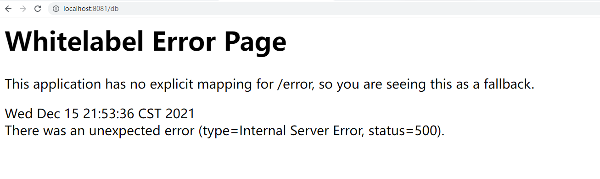
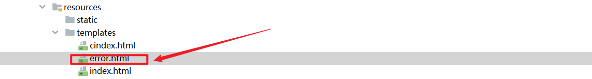
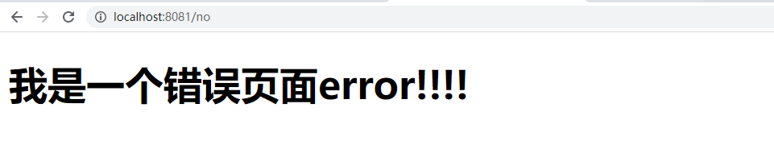

# Springboot关于错误页面处理和统一异常处理


## 01、概述

在项目访问的时候我们经常会发生错误或者页面找不到，比如：资源找不到404，服务器500错误，==默认情况下springboot的处理机制都是去跳转内部的错误地址：/error  和与之对应的一个错误页面==

## 02、项目错误页面的呈现

### 01、导入依赖 freemakrer

```xml
<dependency>
    <groupId>org.springframework.boot</groupId>
    <artifactId>spring-boot-starter-freemarker</artifactId>
</dependency>
```

### 02、在application.yml配置

```yaml
spring:
  freemarker:
    suffix: .html
    cache: false
```

### 03、定义错误处理controller

```java
package com.kuangstudy.web.error;

import com.kuangstudy.web.error.config.MyException;
import org.springframework.stereotype.Controller;
import org.springframework.web.bind.annotation.GetMapping;

import java.sql.SQLException;

/**
 * Description:
 * Author: yykk Administrator
 * Version: 1.0
 * Create Date Time: 2021/12/15 21:47.
 * Update Date Time:
 *
 * @see
 */
@Controller
public class TestErrorHandlerController {

    @GetMapping("/index")
    public String index() {
        return "/index";
    }


    // 数据库错误
    @GetMapping("/db")
    public String db() throws SQLException {
        if (true) {
            throw new SQLException("数据库出错了!!!");
        }
        return "/db";
    }

    // 自定义异常处理
    @GetMapping("/my")
    public String my() {
        if (true) {
            throw new MyException("自定义异常!!!");
        }
        return "/db";
    }


    // 未知异常 -- 程序出现问题
    @GetMapping("/no")
    public String no() throws Exception {
        if (true) {
            throw new Exception("未知错误!!!");
        }
        return "/db";
    }

}

```

### 04、定义页面index.html

```html
<!doctype html>
<html lang="en">
<head>
    <meta charset="UTF-8">
    <meta name="viewport"
          content="width=device-width, user-scalable=no, initial-scale=1.0, maximum-scale=1.0, minimum-scale=1.0">
    <meta http-equiv="X-UA-Compatible" content="ie=edge">
    <title>我是首页</title>
</head>
<body>
<h1>我是首页</h1>
<div>
    <a href="/db">处理数据库异常</a>
    <a href="/my">处理自定义异常</a>
    <a href="/no">处理未知错误</a>
</div>
</body>
</html>
```

访问：http://localhost:8081/index

### 05、证明观点

> 默认情况下springboot的出现异常的处理机制都是去跳转内部的错误地址：/error  和与之对应的一个错误页面

会跳转到默认/error对应的默认页面




# 02、Sprignboot如何自定义错误页面

## 第一种方案：新建error.html

在/src/resources/templates新建一个error.html页面即可



访问任何一个地址，都会进入到指定的错误页面：




## 第二种方案：定义错误配置类

让你针对性的错误状态的错误页面，如果你没有去捕捉的异常状态，就进行全局/error

一句话：有具体的进行具体，没有具体进全局

### 第一步定义个错误页面的注册类，

实现接口：ErrorPageRegistrar 如下：

```java
package com.kuangstudy.web.error.config;

import org.springframework.boot.web.server.ErrorPage;
import org.springframework.boot.web.server.ErrorPageRegistrar;
import org.springframework.boot.web.server.ErrorPageRegistry;
import org.springframework.http.HttpStatus;

/**
 * Description: 不推荐
 * Author: yykk Administrator
 * Version: 1.0
 * Create Date Time: 2021/12/15 21:59.
 * Update Date Time:
 *
 * @see
 */
public class MyErrorPageRegister implements ErrorPageRegistrar {

    @Override
    public void registerErrorPages(ErrorPageRegistry registry) {
        // 根据不同的错误状态，返回指定的错误页面
        ErrorPage errorPage400 = new ErrorPage(HttpStatus.BAD_REQUEST, "/error_400");
        ErrorPage errorPage404 = new ErrorPage(HttpStatus.NOT_FOUND, "/error_404");
        ErrorPage errorPage500 = new ErrorPage(HttpStatus.INTERNAL_SERVER_ERROR, "/error_500");
        // 注册
        registry.addErrorPages(errorPage400, errorPage404, errorPage500);
    }
}

```

### 第二步定义个错误配置类，把springboot内部的错误配置类机制覆盖成自己的

```java
package com.kuangstudy.web.error.config;

import org.springframework.boot.SpringBootConfiguration;
import org.springframework.boot.web.server.ErrorPage;
import org.springframework.boot.web.server.ErrorPageRegistrar;
import org.springframework.boot.web.server.ErrorPageRegistry;
import org.springframework.context.annotation.Bean;
import org.springframework.http.HttpStatus;

/**
 * Description: 不推荐
 * Author: yykk Administrator
 * Version: 1.0
 * Create Date Time: 2021/12/15 21:59.
 * Update Date Time:
 *
 * @see
 */
@SpringBootConfiguration
public class ErrorPageRegisterConfigration  {

    @Bean
    public ErrorPageRegistrar errorPageRegistrar(){
        return new MyErrorPageRegister();
    }
}

```


### 第三步：定义每个错误页面跳转的地址

```java
package com.kuangstudy.web.error.config;

import org.springframework.stereotype.Controller;
import org.springframework.web.bind.annotation.GetMapping;

/**
 * Description:
 * Author: yykk Administrator
 * Version: 1.0
 * Create Date Time: 2021/12/15 22:04.
 * Update Date Time:
 *
 * @see
 */
@Controller
public class ErrorController {

    @GetMapping("/error_400")
    public String errorpage1() {
        return "400";
    }

    @GetMapping("/error_404")
    public String errorpage2() {
        return "404";
    }

    @GetMapping("/error_500")
    public String errorpage3() {
        return "500";
    }
}
```

简化如下：

```java
package com.kuangstudy.web.error.config;

import org.springframework.stereotype.Controller;
import org.springframework.web.bind.annotation.GetMapping;
import org.springframework.web.bind.annotation.PathVariable;

/**

 * Description:
 * Author: yykk Administrator
 * Version: 1.0
 * Create Date Time: 2021/12/15 22:04.
 * Update Date Time:
 * @see
   */
@Controller
public class ErrorController {

    @GetMapping("/error_{status}")
    public String errorpage1(@PathVariable("status") String status) {
        return status;
    }
}
```

### 第四步：访问错误地址：

http://localhost:8081/db----500 --- 几乎全部进行500错误

http://localhost:8081/indexxxx ---404----404错误页面

http://localhost:8081/db ----403----定义是post---访问是get ------出现/error

### 总结：

其实在开发中，其实没必要这么明细，越明细越好，但是会增大你的工作量。有时候直接给用户一个统一的错误就可以了。


## 第三种方式：自定义错误页面的名字

```java
package com.kuangstudy.web.error;

import org.springframework.boot.web.servlet.error.ErrorController;
import org.springframework.stereotype.Controller;
import org.springframework.web.bind.annotation.GetMapping;

/**
 * Description:
 * Author: yykk Administrator
 * Version: 1.0
 * Create Date Time: 2021/12/15 22:16.
 * Update Date Time:
 *
 * @see
 */
@Controller
public class MyErrorPageController implements ErrorController {

    @GetMapping("/error")
    public String errorindex() {
        return "/errorpage";
    }
}

```

- 这种方式其实是对错误页面的自定义方式，仅此而已。如果你对默认规则是明白的话。这种其实意义不大。
- 好处：我可以去控制，错误页面的目录，方便隔离和控制
- 上面第一种坏处就是：error.html必须放在templates下方


