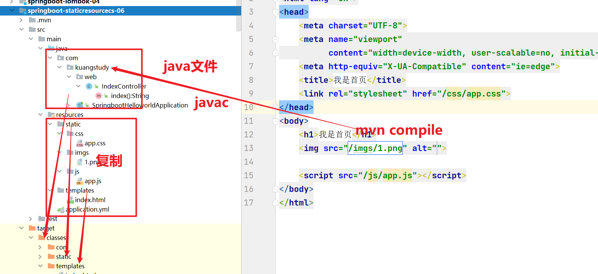

# 静态资源处理&全路径的问题


## 01、概述

在单体的Web架构项目中，如果你使用freemarker和 thymeleaf的话肯定就处理静态资源和路径的问题。静态和路径的处理，在SpringBoot是如何处理的。

对于一个WEB开发项目来是哦，如果不是采用前后端分离的模式。而是将imgs,js和css等一些静态资源打包的jar 包中，那么springboot是如何把它们放入到项目中呢？


## 02、springboot实现静态资源映射

### 第一步：在pom.xml中引入web和freemarker

```xml
<dependency>
    <groupId>org.springframework.boot</groupId>
    <artifactId>spring-boot-starter-web</artifactId>
</dependency>
<dependency>
    <groupId>org.springframework.boot</groupId>
    <artifactId>spring-boot-starter-freemarker</artifactId>
</dependency>
```

### 第二步：在application.yml文件配置freemarker

```yaml
server:
  port: 8086

spring:
  freemarker:
    # freemarker页面不需要缓存
    cache: false
    suffix: .html
```

### 第三步：在application.yml文件配置静态资源映射路径

#### 映射模板路径

是交由freemarker和thymeleaf做，也就配置templates路径，如下：

```yaml
spring:
  freemarker:
    # freemarker页面不需要缓存
    cache: false
    suffix: .html
    # 配置freemarker页面存储的路径，
    template-loader-path: classpath:/templates/
```

- 放在templates下面的动态页面，是不能直接在浏览器访问，你应该把这个路径当成以前：WEB-INF。放在这里的页面是安全的，只能通过springmvc去跳转。然后让freemarker和thymeleaf渲染以后，然后用Response对象输出给浏览器。浏览器然后解析呈现。

#### 映射资源路径

```yaml
spring:
  freemarker:
    # freemarker页面不需要缓存
    cache: false
    suffix: .html
    # 配置freemarker页面存储的路径，
    template-loader-path: classpath:/templates/
  web:
    resources:
      # 静态资源路径的配置
      static-locations: classpath:/META-INF/resources/,classpath:/resources/,classpath:/static/,classpath:/public/
```

- 

### 第四步：定义IndexController.java跳转index.html

```java
package com.kuangstudy.web;

import org.springframework.stereotype.Controller;
import org.springframework.web.bind.annotation.GetMapping;

/**
 * Description:
 * Author: yykk Administrator
 * Version: 1.0
 * Create Date Time: 2021/12/11 21:25.
 * Update Date Time:
 *
 * @see
 */
@Controller
public class IndexController {

    @GetMapping("/index")
    public String index() {
        return "index";
    }
}

```

index.html

```html
<!doctype html>
<html lang="en">
<head>
    <meta charset="UTF-8">
    <meta name="viewport"
          content="width=device-width, user-scalable=no, initial-scale=1.0, maximum-scale=1.0, minimum-scale=1.0">
    <meta http-equiv="X-UA-Compatible" content="ie=edge">
    <title>我是首页</title>
    <link rel="stylesheet" href="/css/app.css">
</head>
<body>
<h1>我是首页</h1>

<script src="/js/app.js"></script>
</body>
</html>
```


### 第五步：在index.html引入css,img，js查看效果

访问：http://localhost:8086/index




### 解答问题1：在开发中我们需要不需要配置这个路径:

```yaml
spring:
  freemarker:
    # freemarker页面不需要缓存
    cache: false
    suffix: .html
    # 配置freemarker页面存储的路径，
    template-loader-path: classpath:/templates/
```

- 不需要，因为默认就是： classpath:/templates/
- 为什么飞哥您还要去指定一下：告诉你一个道理。你可以去修改。但是不建议。

### 解答问题2：为什么在引入的css js 和图片时候不加/static

```yaml
spring:
  web:
    resources:
      # 静态资源路径的配置
      static-locations: classpath:/META-INF/resources/,classpath:/resources/,classpath:/static/,classpath:/public/
```

- springboot默认的静态资源处理。内部自动增加/static，上面`classpath:/static/` 也就说你页面上编写，底层自动增加上去，如果你在引入过程还增加，路径变成：`classpath:/static/static/css/app.css` 就是错误的。
- 为什么在引入的时候，每个css img 和 js前面增加 / 。原因：springboot做了处理自动资源路径推到静态配置路径 。这样就不会受到相对路径的问题。
- ==如果未来页面中访问的静态资源是404，不是加static，而是去查看target目录下的static目录有生成，里面有没有你想要的静态文件。如果没有有还不能访问。那就说明你文件名写错了、或者没有增加/。==


## 03、相对路径问题?

访问页面的时候，页面中的css , js 和图片，如果你不是使用绝对路径，那么默认情况：浏览器内部的静态资源都是根据访问路径来生成和访问：规则如下：

比如：访问路径分别是：

http://localhost:8086/index ----- css/app.css----http://localhost:8086/css/app.css

http://localhost:8086/a/b ----- css/app.css-----http://localhost:8086/a/css/app.css

http://localhost:8086/a/b/c ----- css/app.css----http://localhost:8086/a/b/css/app.css

### 解决方案1 ：

给每个静态资源增加 / 即可。springboot做了默认处理

### 解决方案2：

绝对路径


## 04、绝对路径

http://开头定义的css .js 和图片，就直接去下载和渲染比如：

```html
<!doctype html>
<html lang="en">
<head>
    <meta charset="UTF-8">
    <meta name="viewport"
          content="width=device-width, user-scalable=no, initial-scale=1.0, maximum-scale=1.0, minimum-scale=1.0">
    <meta http-equiv="X-UA-Compatible" content="ie=edge">
    <title>我是首页</title>
    <link rel="stylesheet" href="http://localhost:8086/css/app.css">
</head>
<body>
    <h1>我是首页</h1>
    
    <script src="http://localhost:8086/js/app.js"></script>
</body>
</html>
```

这种路径不会收到你访问路径的影响。很多企业其实也会采用绝对路径。

- 上面会存在一个问题，绝对路径是写死的，在开发环境是没问题
- 如果团队开发是多人，每个用户端口是不一样，可能造成冲突
- 但是在生产环境，就出现问题映射不上

结论：

http://localhost:8086 这部分肯定不能写死，一定动态的。


## 05、拦截器做统一路由处理

### 定义拦截器

```java
package com.kuangstudy.intercetor.path;

import org.springframework.web.servlet.HandlerInterceptor;
import org.springframework.web.servlet.ModelAndView;

import javax.servlet.http.HttpServletRequest;
import javax.servlet.http.HttpServletResponse;

/**
 * Description:
 * Author: yykk Administrator
 * Version: 1.0
 * Create Date Time: 2021/12/16 23:30.
 * Update Date Time:
 *
 * @see
 */
public class RootPathInterceptor implements HandlerInterceptor {
    @Override
    public boolean preHandle(HttpServletRequest request, HttpServletResponse response, Object handler) throws Exception {
        request.setAttribute("ctx", getRootPath(request));
        return true;
    }

    private String getRootPath(HttpServletRequest request) {
        String scheme = request.getScheme();
        String serverName = request.getServerName();
        int port = request.getServerPort();
        String path = request.getContextPath();
        String homeUrl = null;
        if (port == 80 || port == 443) {
            homeUrl = scheme + "://" + serverName + path;
        } else {
            homeUrl = scheme + "://" + serverName + ":" + port + path;
        }
        return homeUrl;
    }

    @Override
    public void postHandle(HttpServletRequest request, HttpServletResponse response, Object handler, ModelAndView modelAndView) throws Exception {
    }

    @Override
    public void afterCompletion(HttpServletRequest request, HttpServletResponse response, Object handler, Exception ex) throws Exception {
    }
}

```

### 注册拦截器

```java
package com.kuangstudy.config;

import com.kuangstudy.intercetor.path.RootPathInterceptor;
import org.springframework.boot.SpringBootConfiguration;
import org.springframework.context.annotation.Bean;
import org.springframework.context.annotation.Configuration;
import org.springframework.web.servlet.config.annotation.InterceptorRegistry;
import org.springframework.web.servlet.config.annotation.WebMvcConfigurer;

/**
 * Description:
 * Author: yykk Administrator
 * Version: 1.0
 * Create Date Time: 2021/12/16 23:33.
 * Update Date Time:
 *
 * @see
 */
@SpringBootConfiguration
public class WebmvcConfiguration implements WebMvcConfigurer {

    @Bean
    public RootPathInterceptor getRootPathInterceptor() {
        return new RootPathInterceptor();
    }

    @Override
    public void addInterceptors(InterceptorRegistry registry) {
        registry.addInterceptor(getRootPathInterceptor()).addPathPatterns("/**");
    }
}

```

### 页面使用

```html
<!doctype html>
<html lang="en">
<head>
    <meta charset="UTF-8">
    <meta name="viewport"
          content="width=device-width, user-scalable=no, initial-scale=1.0, maximum-scale=1.0, minimum-scale=1.0">
    <meta http-equiv="X-UA-Compatible" content="ie=edge">
    <title>我是首页</title>
    <link rel="stylesheet" href="${ctx}/css/app.css">
</head>
<body>
<h1>我是首页</h1>

<script src="${ctx}/js/app.js"></script>
</body>
</html>
```


