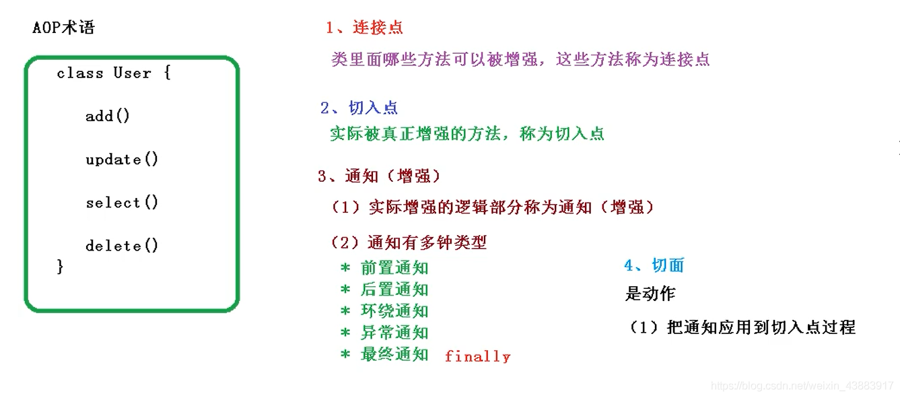

# AOP


## 01、概述

Spring框架的两大核心特性：IOC和AOP。

IOC是基础是核心之核心，AOP（Aspect Oriented Programming） 面向切面编程。底层实现的原理是：动态代理。

Aop必须构建在IOC基础之上。

- Aop原理是：动态代理。

- 动态代理的核心：把目标对象（ioc）转换成代理对象


## 02、动态代理的作用

动态代理的机制是：在原来业务实现的不改变的情况，新增一些功能。


## 03、动态代理的思想＆ 场景

### 场景

从横向结构看，将业务系统中行为相似的（如：权限校验，日志记录、鉴权、缓存）操作封装到一个可重用的模块中，通过定义一个切面来处理。

### 好处

采用这种方式可以大大地减少重复代码，降低代码的耦合度

### 分析：

基于AOP的思想：帮助我们实现了从一个开始的使用硬编码，到使用静态代理，到最后通过JDK动态代理或者CGLIB代码来实现，而SpringAop就是通过这两种代理机制实现的。

Aop -- 是思想，一个蓝图，吹牛逼。

- JDK动态代理（sun/oracle本身就支持）
  - 面向接口的代理方式
- CGLIB代理
  - 面向类的代理方式

SpringAop 集成了两者，都做了兼顾了。为什么呢？


### 接口

- 约束规范，定义标准
- 进行版本升级，方便后续的扩展
- 服务于后续设计模式开发
- Java开源框架团队比较推崇面向接口编程。
- 比如Spring，而且spring（ssm / ssh）默认代理就是：JDK动态代理，只不过springboot变更默认的代理方式：CGLIB


## 04、动态代理实现的方式

- JDK动态代理实现的原理是基于InvocationHandler接口，利用反射生成一个代理接口的匿名类，然后调用invoke方法。
- CGLIB (Code Generation Library)动态代理的实现是基于ASM开源包，==加载被代理类的字节码文件，通过修改字节码生成一个子类，覆盖并增强其中的方法。== 
  - Aspectj，可以简化静态代理的赋值操作。实现了静态织入，通过aspectj编译器可以在编译期间（weaving），编译后(post-compile)或者运行时(run-time)进行织入。


##  05、为什么要引入AOP？

上面是定义，引入AOP的原因肯定是可以解决目前开发中存在的某些痛点：

（1）目前的开发当中，相互之间都是模块化开发，使用AOP可以有效的实现模块化的思路。

（2）将辅助逻辑（日志、安全、监控等）从业务主体逻辑中进行剥离，同步进行开发。

==AOP是一种思想，这种思想是把一些业务逻辑剥离开，然后按照主业务逻辑进行组合，最后达到想要的功能逻辑。==


## 06、Spring框架中的动态代理

spring框架默认是用：JDK动态代理实现的。而在springBoot以后更改成了CGLIB


## 07、SpringAop的核心概念

AOP有自己的一套术语，我们必须了解一下这些行话，才能更好地理解AOP。为了方便大家理解，下面将用课代表收作业作为例子。

- Aspect：切面是切点和通知的聚合，定义了在哪一个切点做什么通知。（==程序员关注==）
- 通知（advice） 定义了在收作业前后需要做的事。常见的通知类型有：before、after、after-returning、around、after-throwing等。（==程序员关注==）
- 连接点（joinpoint）连接点指程序运行时允许插入切面的一个点，可以是一个函数、一个包路径、一个类、或者抛出的异常。有点类似于可以收作业的时间点。(执行的具体的目标对象的函数)（==程序员关注==）
- 切点（pointcut）用于定义切面的位置，也就是捕获哪些连接点的调用然后执行"通知"的操作（什么地点）。（==程序员关注==）


- 引入（introduction） 引入允许我们向现有的类添加新方法或属性。（==spring框架做的事情==）
- 织入（weave）是把切面应用到切点对应的连接点的过程。切面在指定连接点被织入到目标对象中。（==spring框架做的事情==）
- 目标对象 ：指被切面织入的对象。就是springioc管理的对象。（==spring框架做的事情==）


### 图解1


### 图解2


### 图解3




- 连接点就是：类中定义的定义的方法。每个方法都可以被认为连接点。
- 如果连接点和切点（切点表达式）产生了联系和关联就会转换成代理对象。
- 代理对象执行方法，就进入切面，根据切点条件然后找到具体的通知。


## 08、通知类型

### 通知说明

- @Before：该注解标注的方法在业务模块代码执行之前执行，其不能阻止业务模块的执行，除非抛出异常；
- @AfterReturning：该注解标注的方法在业务模块代码执行之后执行；
- @AfterThrowing：该注解标注的方法在业务模块抛出指定异常后执行；
- @After：该注解标注的方法在所有的Advice执行完成后执行，无论业务模块是否抛出异常，类似于finally的作用；
- @Around：该注解功能最为强大，其所标注的方法用于编写包裹业务模块执行的代码，其可以传入一个ProceedingJoinPoint用于调用业务模块的代码，无论是调用前逻辑还是调用后逻辑，都可以在该方法中编写，甚至其可以根据一定的条件而阻断业务模块的调用；


### 切面定义

- @DeclareParents：其是一种Introduction类型的模型，在属性声明上使用，主要用于为指定的业务模块添加新的接口和相应的实现。
- @Aspect：严格来说，其不属于一种Advice，该注解主要用在类声明上，指明当前类是一个组织了切面逻辑的类，并且该注解中可以指定当前类是何种实例化方式，主要有三种：singleton、perthis和pertarget，具体的使用方式后面会进行讲解。

### 执行注意    

这里需要说明的是，@Before是业务逻辑执行前执行，与其对应的是@AfterReturning，而不是@After，@After是所有的切面逻辑执行完之后才会执行，无论是否抛出异常。

### 执行顺序

上面执行的顺序是：Around--Before-->-AfterReturing--->After--Around

异常情况执行顺序是：Around--Before-->AfterThrowing - After--->终止了

如果定义多个Aspect的切面，那么它们的执行顺序是不可预知的，如果要定义顺序可以通过@Order注解来实现控制它们执行的顺序。


## 09、切入点表达式

前面定义切点表达式时使用了execution表达式，其实execution就是一个切入点指示符。Spring AOP仅支持部分AspectJ的切入点指示,但基本已经满足我们大部分的需求了,同时Spring AOP还额外支持一个bean切入点指示符。

切面表达式主要由：designators(指示器，匹配java方法)，wildcards(通配符)，operators(操作运算符)三部分组成

| 指示器            | 描述                                                         |
| ----------------- | ------------------------------------------------------------ |
| ==execution()==   | 用于匹配方法执行的连接点                                     |
| within()          | 用于匹配指定的类及其子类中的所有方法                         |
| this()            | 匹配可以向上转型为this指定的类型的代理对象中的所有方法       |
| target()          | 匹配可以向上转型为target指定的类型的目标对象中的所有方法     |
| args()            | 用于匹配运行时传入的参数列表的类型为指定的参数列表类型的方法 |
| @within()         | 用于匹配持有指定注解的类的所有方法                           |
| ==@target()==     | 用于匹配的持有指定注解目标对象的所有方法                     |
| ==@args()==       | 用于匹配运行时 传入的参数列表的类型持有 注解列表对应的注解的方法 |
| ==@annotation()== | 用于匹配持有指定注解的方法                                   |
| bean              | bean(Bean的id或名字通配符)匹配特定名称的Bean对象             |

### 三种通配符


| 通配符 | 说明                                                         |
| ------ | ------------------------------------------------------------ |
| *      | 匹配任何数量字符                                             |
| ..     | 匹配任何数量字符的重复，如在类型模式中匹配任何数量子包；而在方法参数模式中匹配任何数量参数 |
| +      | 匹配指定类型的子类型；仅能作为后缀放在类型模式后边           |

### 操作运算符

AspectJ使用 且（&&）、或（||）、非（！）来组合切入点表达式,由于在xml风格下，由于在XML中使用“&&”需要使用转义字符“&&”来代替之，所以很不方便，因此Spring ASP 提供了and、or、not来代替&&、||、！


| 操作符         | 说明     |
| -------------- | -------- |
| `&&`或者 `and` | 与操作符 |
| `||` 或者 `or` | 或操作符 |
| `!` 或者 `not` | 非操作符 |

xml文件中

```xml
<aop:config>
    <aop:aspect id="myLogAspect" ref="logAspect">
        <aop:pointcut id="logPointCut" expression="execution(* com.alimama.controller.*.*(..)) and execution(* com.alimama.service.IInstanceService.get*(..))"/>
        <aop:before method="logStart" pointcut-ref="logPointCut"/>
        <aop:after method="logEnd" pointcut-ref="logPointCut"/>
    </aop:aspect>
</aop:config>
```

在类中

```java
@Before("execution(* test(*)) && args(param)", argNames="param") 
publicvoid before1(String param) { 
    System.out.println("===param:" + param); 
} 
```


### execution

切面类

```java
import org.aspectj.lang.annotation.Aspect;
import org.aspectj.lang.annotation.Before;
import org.aspectj.lang.annotation.Pointcut;
import org.springframework.stereotype.Component;

@Component
@Aspect
public class ExecutionAspect {
    @Pointcut("execution(public * com.wener.example.aop.execution.ExecutionService.test())")
    public void execuPoint() {

    }
    @Before("execution(public * com.wener.example.aop.execution.ExecutionService.add(..))")
    public void execuBefore() {
        System.out.println("核心方法之前!!!");
    }

    @Before("execution(public * com.wener.example.aop.execution.ExecutionService.test(..))")
    public void execuAfter() {
        System.out.println("核心方法之前!!!");
    }
}
```

目标类

```java
import org.springframework.stereotype.Service;
public interface ExecutionService {
    public void test();

    public int add(String name);
}
@Service("service")
public class ExecutionServiceImpl implements ExecutionService {
    @Override
    public void test() {
        System.out.println("测试方法核心代码!!!");
    }
    @Override
    public int add(String name) {
        System.out.println("添加的方法核心代码!!!");
        return 0;
    }
}
```

测试代码

```java
  public static void main(String[] args) {
        ApplicationContext context = new ClassPathXmlApplicationContext("spring-aspect.xml");
        ExecutionService service = context.getBean("service", ExecutionService.class);
        service.add("1111");
        service.test();
    }
```


### 4、常见表达式

****

#### 4.1、方法签名定义切入点 无修饰符，不考虑方法参数

1. 匹配所有目标类的public方法，第一个*为返回类型，第二个*为方法名

   ```java
   execution(public * * (..))
   execution(* save* (..))
   ```

2. 匹配所有目标类以xxx开头的方法，第一个*代表返回任意类型

   ```java
   execution(* xxx* (..))
   ```

3. 匹配目标类所有以xxx结尾的方法，并且其方法的参数表第一个参数可为任意类型，第二个参数必须为String

   ```java
   execution(**xxx(*,String))
   ```
   
4. 匹配任意方法(在开发过程中用不到，永远都不会用)

   ```java
   execution(* *(..)) 
   ```

   

#### 4.2、类定义切入点

1. 匹配Service接口及其实现子类中的所有方法

   ```java
   execution(* com.xxx.Service.*(..))
   ```

#### 4.3、通过包定义切入点

1. 匹配service包下的所有类的所有方法，**但不包括子包**

   ```java
   execution(* com.xxx.service.*(..))
   ```

2. 匹配aop_part包下的所有类的所有方法，包括子包。

   ```java
   # 注意 （当".."出现再类名中时，后面必须跟" * ",表示包、子孙包下的所有类**）
   execution(* com.xxx.service..*(..))
   ```

3. 匹配xxx包及其子包下的所有后缀名为service的类中，所有方法名必须以select为前缀的方法

   ```java
   execution(* com.xxx..*.*service.select*(..))
   ```

#### 4.4、方法形参定义切入点

1. 匹配所有方法名为add，且有两个参数，其中，第一个的类型为int  第二个参数是String

   ```java
   execution(* add(int, String))
   ```

2. 匹配所有方法名为add，且至少含有一个参数，并且第一个参数为int的方法

   ```java
   execution(* add(int, ..))
   ```

3. 匹配名称后缀是ByPage的方法，一个参数是String

   ```java
   execution(* *ByPage(String)) 
   ```
   
4. 如果想匹配com.test.Controller包以及子包中类的方法：

   ```java
   execution(* com.test.Controller..*.*ByPage(String)) 
   ```

5. 如果想匹配com.test.Controller包下类的方法：

   ```java
   execution(* com.test.Controller.*.*ByPage(String)) 
   ```

6. 加上类包限制，只匹配com.test.Controller.TestController下的后缀为ByPage，参数为String的方法：

   ```java
   execution(* com.test.Controller.TestController.*ByPage(String)) 
   ```

7. 匹配名称后缀是ByPage的方法，一个参数是String

   ```java
   execution(* *ByPage(String)) 
   ```

   


## 10、SpringBoot的Aop实现机制

01、引入aop依赖即可

```xml
<dependency>
    <groupId>org.springframework.boot</groupId>
    <artifactId>spring-boot-starter-aop</artifactId>
</dependency>
```

02、从源码来分析

```java
// 设置默认的代理模式是：jdk的动态方式
@Configuration(proxyBeanMethods = false)
// 仅在属性spring.aop.auto缺失或者指定为true的生效。
@ConditionalOnProperty(prefix = "spring.aop", name = "auto", havingValue = "true", matchIfMissing = true)
public class AopAutoConfiguration {

	@Configuration(proxyBeanMethods = false)
	@ConditionalOnClass(Advice.class)
	static class AspectJAutoProxyingConfiguration {

		@Configuration(proxyBeanMethods = false)
		@EnableAspectJAutoProxy(proxyTargetClass = false)
		@ConditionalOnProperty(prefix = "spring.aop", name = "proxy-target-class", havingValue = "false")
		static class JdkDynamicAutoProxyConfiguration {

		}

		@Configuration(proxyBeanMethods = false)
		@EnableAspectJAutoProxy(proxyTargetClass = true)
		@ConditionalOnProperty(prefix = "spring.aop", name = "proxy-target-class", havingValue = "true",
				matchIfMissing = true)
		static class CglibAutoProxyConfiguration {

		}

	}

	@Configuration(proxyBeanMethods = false)
	@ConditionalOnMissingClass("org.aspectj.weaver.Advice")
	@ConditionalOnProperty(prefix = "spring.aop", name = "proxy-target-class", havingValue = "true",
			matchIfMissing = true)
	static class ClassProxyingConfiguration {

		@Bean
		static BeanFactoryPostProcessor forceAutoProxyCreatorToUseClassProxying() {
			return (beanFactory) -> {
				if (beanFactory instanceof BeanDefinitionRegistry) {
					BeanDefinitionRegistry registry = (BeanDefinitionRegistry) beanFactory;
					AopConfigUtils.registerAutoProxyCreatorIfNecessary(registry);
					AopConfigUtils.forceAutoProxyCreatorToUseClassProxying(registry);
				}
			};
		}

	}

}

```

- 这个自动配置类AOP类，主要职责是根据配置参数，利用@EnableAspectJAutoProxy开关来启动是否使用JDK代理还是cglib代理。在全局配置文件中YML或者Properties文件中配置项，spring.aop.proxy-target-class如果未被添加。
- 则将spring.aop.proxy-target-class的值视为true
- 因此注解	@EnableAspectJAutoProxy(proxyTargetClass = true) 的时候默认是使用：CGLIB代理。


## 11、**谈谈你对AOP思想的看法**

任何新技术的出现都是为了解决目前开发中存在的某些痛点。对于aop来说，其主要是把一些功能代码进行抽象封装，和主业务逻辑代码进行剥离。在需要的地方进行织入即可。

我的看法是

（1）在平时开发代码的时候，完全可以把一些常见的，常用的功能代码进行封装，尽量做到动态配置。不同的功能模块只需要进行织入即可。

（2）定义业务逻辑的模板，比如说如果要解决某一个业务功能，如果页面类似，可以按照基本的框架进行组合，然后使用配置平台进行可控化配置即可。


参考文献：

https://blog.csdn.net/m0_37125796/article/details/86484701
